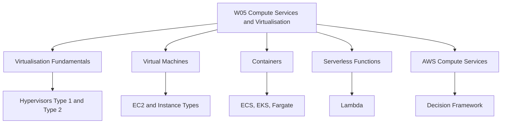
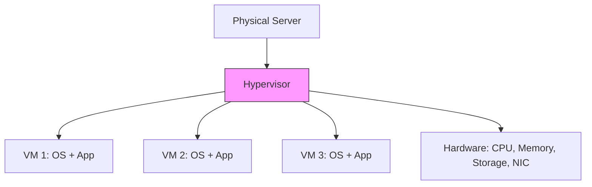
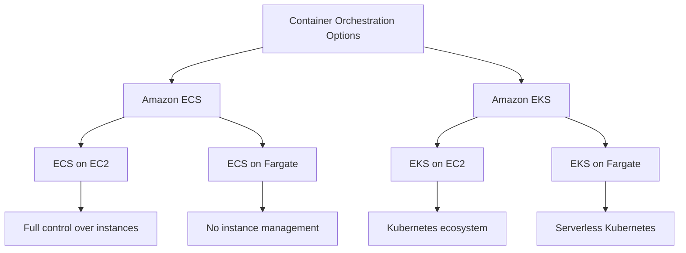

# Migration in progress
# W05: Compute Services + Virtualisation

This module covers the foundational technologies behind cloud compute: virtualization, virtual machines, containers, and serverless functions. It then maps these concepts to AWS compute services, including EC2, Lambda, ECS, EKS, and Fargate. The goal is to understand how each compute model works, when to use it, and how to choose between them.

## Virtualisation Fundamentals

*Definition*: Virtualisation is the process of creating a software-based (virtual) representation of something, such as compute, storage, or network resources. It allows multiple operating systems and applications to run on a single physical machine.

### What Is a Hypervisor

*Definition*: A hypervisor, also called a virtual machine monitor (VMM), is software that creates and runs virtual machines. It abstracts the underlying physical hardware and allocates resources to each VM.

- The hypervisor sits between the physical hardware and the virtual machines.
- It manages CPU, memory, storage, and network allocation.
- It provides isolation between VMs so one VM cannot interfere with another.
- It enables multiple operating systems to run concurrently on the same physical host.

> [!Important]
> **One physical server can run many virtual machines**: This increases efficiency, reduces cost, and improves resource utilization. The hypervisor is the key technology that makes this possible.

### Type 1 vs Type 2 Hypervisors

There are two main types of hypervisors, distinguished by where they sit in the software stack.

| Feature | Type 1 (Bare-Metal) | Type 2 (Hosted) |
|---|---|---|
| Runs on | Physical hardware directly | Host operating system |
| Performance | High | Medium to low |
| Security | Strong isolation | Moderate isolation |
| Use Case | Enterprise data centers, cloud providers | Personal use, testing, development |
| Examples | VMware ESXi, Microsoft Hyper-V, KVM, Xen | VirtualBox, VMware Workstation, Parallels Desktop |

- **Type 1 hypervisors** run directly on the physical hardware. They are also called bare-metal hypervisors. They provide direct hardware access and support advanced VM management tools.
- **Type 2 hypervisors** run as applications on top of an existing operating system. They rely on the host OS for hardware access.
- Cloud providers rely on Type 1 hypervisors because they are faster, cleaner, and more secure.
- Type 2 hypervisors are easier to install and are good for development, training, and small workloads, but they have lower performance and are less secure than Type 1.

> [!Tip]
> **Cloud providers use Type 1 hypervisors**: AWS, Azure, and GCP all use Type 1 hypervisors (KVM, Xen, or custom) because they run directly on hardware and provide better performance and isolation for multi-tenant cloud environments.

### Virtual Machine Lifecycle

*Definition*: Virtual machine lifecycle management refers to the complete process of creating, operating, maintaining, and retiring virtual machines.

| Stage | Description | Key Activities |
|---|---|---|
| Creation / Provisioning | Set up the VM | Configure CPU, RAM, storage; install OS and software |
| Deployment | Make the VM active | Connect to network and storage; make available to users |
| Monitoring | Track performance | Monitor CPU, memory, disk; detect issues and optimize |
| Maintenance | Keep the VM healthy | Apply updates and patches; scale resources; backup and snapshot |
| Retirement | Decommission the VM | Remove from service; reclaim resources |

- Proper lifecycle management ensures VMs are secure, performant, and cost-effective.
- Snapshots and backups are essential for disaster recovery.
- Monitoring helps identify when to scale up or scale down resources.

> [!Important]
> **VM lifecycle is continuous**: Monitoring and maintenance are not one-time tasks. They require ongoing attention to ensure VMs remain healthy and cost-efficient.

## Virtual Machines (EC2)

*Definition*: Amazon Elastic Compute Cloud (EC2) provides secure, resizable compute capacity in the cloud as virtual servers. You can launch virtual machines, called instances, with a variety of operating systems, instance types, and configurations.

### What EC2 Provides

- Virtual servers with full OS-level control.
- A wide range of instance families and sizes.
- Options for SSD, GPU, and specialized hardware.
- Instance types determine the hardware of the host.
- EC2 instances are the most flexible compute option in AWS.

### EC2 Instance Families

EC2 instances are grouped into families based on their compute, memory, and storage characteristics.

| Family | Optimized For | Use Cases | Example Types |
|---|---|---|---|
| General Purpose | Balanced compute, memory, and networking | Web servers, application servers, small databases | M5, M6i, M7g, T3, T4g |
| Compute Optimized | High-performance processors | Batch processing, gaming, HPC, video encoding | C5, C6i, C7g |
| Memory Optimized | Large memory-to-vCPU ratio | In-memory databases, real-time big data analytics | R5, R6i, R7g, X1 |
| Storage Optimized | High sequential read/write and IOPS | Data warehousing, distributed file systems | D2, H1, I3 |
| Accelerated Computing | GPU or FPGA accelerators | Machine learning, graphics rendering, scientific simulation | P4, G5, Inf2, Trn1 |

- General purpose instances like M7g offer the best price-performance for general workloads.
- Compute optimized instances like C7g offer the best price-performance for compute-intensive workloads.
- Memory optimized instances like R7g are ideal for memory-intensive workloads such as open-source databases and in-memory caches.
- Accelerated computing instances like Inf2 are designed for deep learning inference.

> [!Tip]
> **Choose instance family by workload profile**: Match the instance family to the dominant resource requirement. If the workload is CPU-bound, choose compute optimized. If it is memory-bound, choose memory optimized.

### EC2 Pricing Models

| Model | Description | Best For | Discount |
|---|---|---|---|
| On-Demand | Pay per hour or second, no commitment | Unpredictable workloads, short-term needs | None |
| Reserved Instances | Commit to 1 or 3 years | Steady-state, predictable workloads | Up to 72% |
| Savings Plans | Commit to a consistent amount of compute usage | Flexible workloads across instance families | Up to 72% |
| Spot Instances | Bid on unused EC2 capacity | Fault-tolerant, flexible workloads | Up to 90% |

- Reserved instances offer a significant discount compared to On-Demand pricing.
- Spot instances are recommended for applications with flexible start and end times, or those that are only feasible at very low compute prices.
- Savings Plans offer low prices for EC2 and Fargate usage in exchange for a commitment to a consistent amount of compute usage.

> [!Important]
> **Pricing model affects cost significantly**: A steady-state production workload can save up to 72% with Reserved Instances compared to On-Demand. Choose the pricing model that matches the workload's predictability.

## Containers

*Definition*: Containers virtualize the operating system, allowing multiple instances of an OS user space to share a single OS kernel. They package an application and its dependencies into a single, portable unit.

### Containers vs Virtual Machines

| Dimension | Virtual Machines | Containers |
|---|---|---|
| Virtualization Level | Hardware-level | OS-level |
| Guest OS | Each VM has its own OS | Containers share the host OS kernel |
| Startup Time | Minutes | Seconds |
| Resource Usage | Higher (each VM runs a full OS) | Lower (lightweight) |
| Portability | Limited by OS dependencies | Highly portable across environments |
| Isolation | Strong (hardware-level) | Process-level isolation |

- Containers address the limitations of VMs, such as reduced portability and inadequate resources.
- Containers run a layer above and separate application software from VMs.
- Containers break up software into small components that can be easily mixed and matched, which speeds up development.
- Containers are dynamic and may run for a few minutes or even seconds, which makes monitoring more difficult than VMs.

> [!Tip]
> **Containers are ideal for microservices**: Their lightweight nature, fast startup, and portability make them well-suited for microservices architectures and continuous delivery.

### AWS Container Services

AWS offers multiple container orchestration options, each with different levels of abstraction and control.

| Service | Type | Key Features | Best For |
|---|---|---|---|
| Amazon ECS | Fully managed container orchestration | Simplifies deployment, management, and scaling of containerized apps | Teams wanting simplicity and deep AWS integration |
| Amazon EKS | Managed Kubernetes | Full Kubernetes API compatibility; portable across clouds | Teams needing Kubernetes ecosystem and portability |
| AWS Fargate | Serverless compute engine for containers | Run containers without managing EC2 instances | Teams wanting to avoid infrastructure management |
| Amazon ECR | Container registry | Store, manage, and deploy container images | All container workloads |

- Amazon ECS is a fully managed container orchestration service that simplifies the deployment, management, and scaling of containerized applications.
- Amazon EKS is a managed Kubernetes service that provides the full Kubernetes API and ecosystem.
- AWS Fargate is a serverless compute engine for containers. It removes the need to provision and manage EC2 instances. You can use Fargate with both ECS and EKS.
- ECS may be cheaper than EKS and offers cost savings for applications tightly integrated with AWS. EKS pricing includes charges for the managed Kubernetes control plane in addition to compute and storage resources.

> [!Important]
> **Fargate eliminates node management**: With Fargate, you define the vCPU and memory your container needs, and AWS