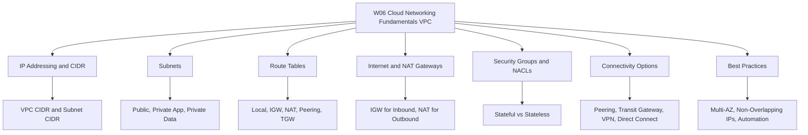

# Migration in progress
# W06: Cloud Networking Fundamentals (VPC) - Lesson 0: Module Introduction

This module introduces Amazon Virtual Private Cloud (VPC), the networking foundation of AWS. It covers IP addressing, subnets, route tables, gateways, security controls, and connectivity options. The goal is to understand how to design, secure, and operate a VPC that supports reliable and scalable cloud workloads.



## Module Purpose

- Introduce VPC as the isolated network boundary for AWS resources.
- Explain how CIDR blocks define VPC and subnet IP ranges.
- Describe how route tables direct traffic between subnets, gateways, and external networks.
- Compare internet gateways and NAT gateways for inbound and outbound connectivity.
- Differentiate security groups and network ACLs as layered access controls.
- Map connectivity options: VPC peering, Transit Gateway, VPN, and Direct Connect.
- Prepare for hands-on labs and scenario-based assessment.

## Learning Objectives

- Define a VPC and explain its role in AWS networking.
- Plan non-overlapping CIDR blocks for VPCs and subnets.
- Design public, private application, and private data subnets across multiple Availability Zones.
- Configure route tables for local, internet, NAT, peering, and hybrid traffic.
- Compare security groups and network ACLs across state, rule type, and scope.
- Select the right connectivity option for multi-VPC and hybrid architectures.
- Apply VPC best practices for security, availability, and automation.

> [!Tip]
> **Start with the IP plan**: A VPC design is only as good as its IP addressing. Reserve enough space for growth, avoid overlaps with on-premises networks, and document the plan before creating subnets.

## Module Structure

| Lesson | Topic | Focus |
|---|---|---|
| Lesson 0 | Module Introduction | Scope and objectives |
| Lesson 1 | VPC Fundamentals | CIDR, subnets, route tables |
| Lesson 2 | Gateways and Connectivity | IGW, NAT, peering, Transit Gateway |
| Lesson 3 | VPC Security | Security groups, NACLs, VPC endpoints |
| Lesson 4 | Hybrid Networking | VPN and Direct Connect |
| Lesson 5 | Summary and Assessment | Review and scenarios |

## Core Concepts Preview

### VPC and CIDR

*Definition*: A VPC is a logically isolated virtual network dedicated to your AWS account. A CIDR block defines its IP address range.

- VPC CIDR blocks range from /16 to /28.
- AWS reserves five IP addresses in each subnet.
- CIDR blocks must not overlap with other VPCs or on-premises networks you plan to connect.

### Subnets

*Definition*: A subnet is a range of IP addresses in your VPC. Each subnet resides entirely within one Availability Zone.

| Subnet Type | Internet Access | Typical Resources |
|---|---|---|
| Public | Inbound and outbound via IGW | Load balancers, NAT gateways, bastion hosts |
| Private App | Outbound only via NAT | EC2, containers, Lambda |
| Private Data | None | RDS, Aurora, ElastiCache |

### Route Tables

- Each subnet is associated with one route table.
- Local route handles internal VPC traffic.
- Default route 0.0.0.0/0 targets an internet gateway or NAT gateway.
- Additional routes target peering connections, Transit Gateway, or VPN.

### Gateways

| Gateway | Direction | Purpose |
|---|---|---|
| Internet Gateway | Inbound and outbound | Connect public subnets to the internet |
| NAT Gateway | Outbound only | Allow private subnets to reach the internet |
| Transit Gateway | Hub | Connect many VPCs and on-premises networks |

### Security Controls

| Dimension | Security Group | Network ACL |
|---|---|---|
| Level | Instance | Subnet |
| State | Stateful | Stateless |
| Rule Types | Allow only | Allow and deny |
| Return Traffic | Automatically allowed | Must be explicitly allowed |

### Connectivity Options

- VPC peering connects two VPCs directly. It is not transitive.
- Transit Gateway acts as a central hub for many VPCs and hybrid connections.
- Site-to-Site VPN uses the public internet for hybrid connectivity.
- Direct Connect provides a dedicated private connection.

```mermaid
flowchart TD
    VPC[VPC 10.0.0.0/16] --> AZ1[AZ A]
    VPC --> AZ2[AZ B]
    AZ1 --> PUB1[Public Subnet]
    AZ1 --> PRIV1[Private App Subnet]
    AZ1 --> DATA1[Private Data Subnet]
    AZ2 --> PUB2[Public 