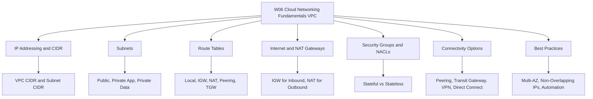
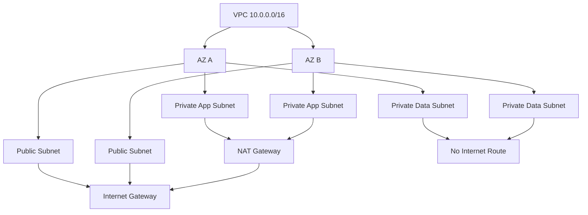
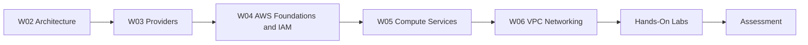

# W06: Cloud Networking Fundamentals (VPC) - Lesson 0: Module Introduction

This module introduces Amazon Virtual Private Cloud (VPC), the networking foundation of AWS. It covers IP addressing, subnets, route tables, gateways, security controls, and connectivity options. The goal is to understand how to design, secure, and operate a VPC that supports reliable and scalable cloud workloads.

## Module Purpose

- Introduce VPC as the isolated network boundary for AWS resources.
- Explain how CIDR blocks define VPC and subnet IP ranges.
- Describe how route tables direct traffic between subnets, gateways, and external networks.
- Compare internet gateways and NAT gateways for inbound and outbound connectivity.
- Differentiate security groups and network ACLs as layered access controls.
- Map connectivity options: VPC peering, Transit Gateway, VPN, and Direct Connect.
- Prepare for hands-on labs and scenario-based assessment.

## Learning Objectives

- Define a VPC and explain its role in AWS networking.
- Plan non-overlapping CIDR blocks for VPCs and subnets.
- Design public, private application, and private data subnets across multiple Availability Zones.
- Configure route tables for local, internet, NAT, peering, and hybrid traffic.
- Compare security groups and network ACLs across state, rule type, and scope.
- Select the right connectivity option for multi-VPC and hybrid architectures.
- Apply VPC best practices for security, availability, and automation.

> [!Tip]
> **Start with the IP plan**: A VPC design is only as good as its IP addressing. Reserve enough space for growth, avoid overlaps with on-premises networks, and document the plan before creating subnets.

## Module Structure

| Lesson | Topic | Focus |
|---|---|---|
| Lesson 0 | Module Introduction | Scope and objectives |
| Lesson 1 | VPC Fundamentals | CIDR, subnets, route tables |
| Lesson 2 | Gateways and Connectivity | IGW, NAT, peering, Transit Gateway |
| Lesson 3 | VPC Security | Security groups, NACLs, VPC endpoints |
| Lesson 4 | Hybrid Networking | VPN and Direct Connect |
| Lesson 5 | Summary and Assessment | Review and scenarios |

## Core Concepts Preview

### VPC and CIDR

*Definition*: A VPC is a logically isolated virtual network dedicated to your AWS account. A CIDR block defines its IP address range.

- VPC CIDR blocks range from /16 to /28.
- AWS reserves five IP addresses in each subnet.
- CIDR blocks must not overlap with other VPCs or on-premises networks you plan to connect.

### Subnets

*Definition*: A subnet is a range of IP addresses in your VPC. Each subnet resides entirely within one Availability Zone.

| Subnet Type | Internet Access | Typical Resources |
|---|---|---|
| Public | Inbound and outbound via IGW | Load balancers, NAT gateways, bastion hosts |
| Private App | Outbound only via NAT | EC2, containers, Lambda |
| Private Data | None | RDS, Aurora, ElastiCache |

### Route Tables

- Each subnet is associated with one route table.
- Local route handles internal VPC traffic.
- Default route 0.0.0.0/0 targets an internet gateway or NAT gateway.
- Additional routes target peering connections, Transit Gateway, or VPN.

### Gateways

| Gateway | Direction | Purpose |
|---|---|---|
| Internet Gateway | Inbound and outbound | Connect public subnets to the internet |
| NAT Gateway | Outbound only | Allow private subnets to reach the internet |
| Transit Gateway | Hub | Connect many VPCs and on-premises networks |

### Security Controls

| Dimension | Security Group | Network ACL |
|---|---|---|
| Level | Instance | Subnet |
| State | Stateful | Stateless |
| Rule Types | Allow only | Allow and deny |
| Return Traffic | Automatically allowed | Must be explicitly allowed |

### Connectivity Options

- VPC peering connects two VPCs directly. It is not transitive.
- Transit Gateway acts as a central hub for many VPCs and hybrid connections.
- Site-to-Site VPN uses the public internet for hybrid connectivity.
- Direct Connect provides a dedicated private connection.

> [!Important]
> **Public vs private is determined by routing, not naming**: A subnet is public only if its route table has a route to an internet gateway. Always verify route tables before assuming a subnet is isolated.

## How This Module Connects to Previous Modules

- W02 covered reliability, performance, and the AWS Well-Architected Framework.
- W03 compared AWS, Azure, and GCP across services and selection factors.
- W04 covered AWS global infrastructure, IAM, and account security.
- W05 covered compute services and virtualisation, including EC2, EBS, and high availability.
- W06 adds the network layer that connects compute, storage, and databases.
- VPC design directly affects the reliability, security, and cost of every workload.

## Assessment Preparation

### Practice Questions

1. Define a VPC and explain why it is the networking foundation of AWS.
2. Describe how CIDR blocks define VPC and subnet IP ranges.
3. Explain the difference between a public subnet and a private subnet.
4. Describe how route tables control traffic flow in a VPC.
5. Compare internet gateways and NAT gateways.
6. Compare security groups and network ACLs across at least five dimensions.
7. Explain the purpose of VPC peering, Transit Gateway, VPN, and Direct Connect.
8. List five VPC design best practices.

### Scenario Questions

**Scenario 1: Three-Tier Web Application**
A company is deploying a three-tier web application with high availability requirements. Design the VPC.

- Create a VPC with a /16 CIDR block.
- Deploy public subnets in two AZs for load balancers and NAT gateways.
- Deploy private app subnets in two AZs for application servers.
- Deploy private data subnets in two AZs for databases.
- Use security groups to control traffic between tiers.
- Deploy NAT gateways in each public subnet for outbound access.

**Scenario 2: Multi-VPC Connectivity**
A company has five VPCs across two AWS accounts and needs to connect them all. What connectivity option should they use?

- Use AWS Transit Gateway as a central hub.
- Attach all VPCs to the Transit Gateway.
- Use multiple route tables for network segmentation.
- Connect on-premises networks via VPN or Direct Connect to the same Transit Gateway.

**Scenario 3: Securing a Database Tier**
A database cluster must not be accessible from the internet. How should it be secured?

- Place the database in a private data subnet with no route to an internet gateway.
- Use a security group that allows traffic only from the application tier security group.
- Do not assign public IP addresses.
- Use network ACLs as a secondary guardrail.
- Enable VPC Flow Logs for monitoring.

## Key Takeaways

- A VPC is a logically isolated virtual network in AWS. You control IP addressing, subnets, routing, and security.
- VPCs do not span Regions. Resources in different Regions need peering or VPN.
- CIDR blocks define the IP address range of your VPC. Plan for growth and avoid overlaps.
- Subnets are AZ-specific IP ranges. Public subnets have a route to an internet gateway. Private subnets use NAT gateways for outbound access.
- Route tables control traffic flow. Each subnet is associated with one route table.
- An internet gateway connects a VPC to the internet. A NAT gateway enables outbound-only access for private subnets.
- Security groups are stateful, instance-level firewalls. Network ACLs are stateless, subnet-level firewalls.
- VPC peering connects two VPCs directly. Transit Gateway connects many VPCs and on-premises networks.
- VPN uses the public internet for hybrid connectivity. Direct Connect provides a dedicated private connection.
- Best practices include non-overlapping IP plans, multi-AZ subnet design, security groups as primary controls, VPC endpoints, and automation.
- This module builds on W02 architecture, W03 provider comparison, W04 AWS foundations, and W05 compute services.
- Assessment focuses on practical VPC design, security, and connectivity scenarios.

> [!Important]
> **Design your VPC before you deploy workloads**: The VPC is the foundation of your network security and availability. A poorly designed VPC is difficult and expensive to change later. Plan your IP space, subnet layout, routing, and security controls before launching production resources. Automate VPC deployment with infrastructure as code for consistency and auditability.
