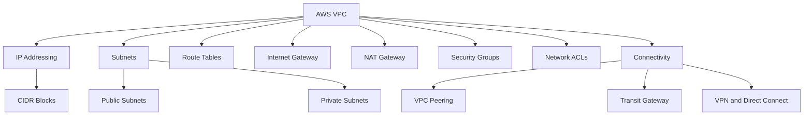
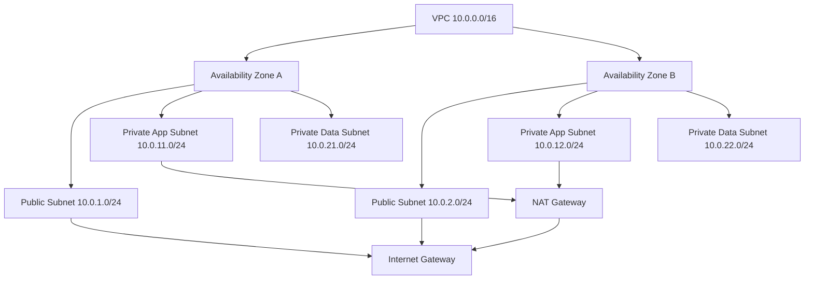
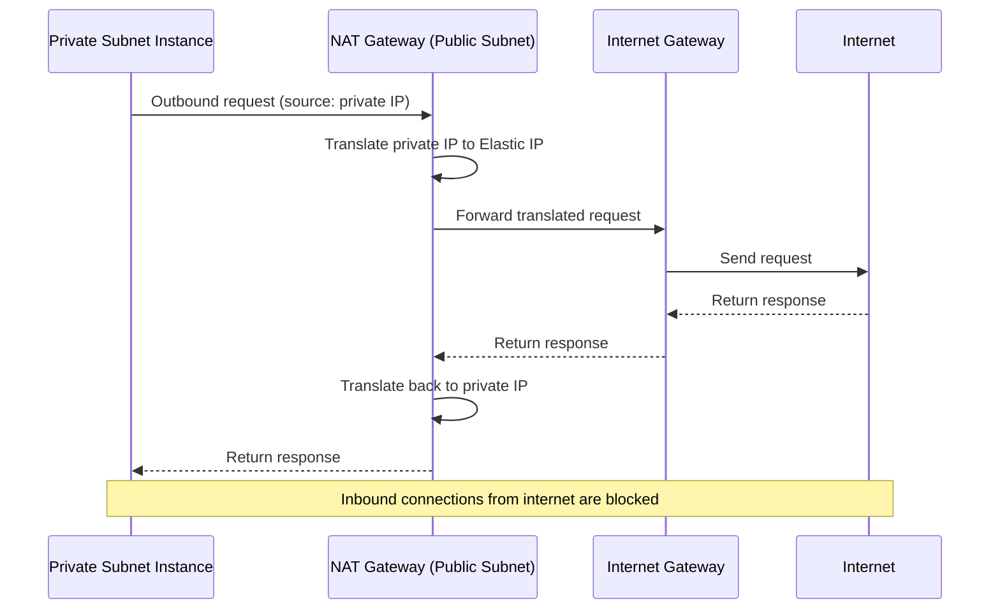

# Migration in progress
# Lesson 1: VPC and Cloud Networking

Amazon Virtual Private Cloud (VPC) is the networking foundation of AWS. It provides a logically isolated section of the AWS Cloud where you define your own IP address ranges, create subnets, configure route tables, and control inbound and outbound traffic. Every EC2 instance, load balancer, database, and Lambda function that needs network access runs inside a VPC. Understanding VPC is essential for building secure, scalable, and highly available cloud architectures.

## What Is a VPC

*Definition*: A VPC is a virtual network dedicated to your AWS account. It is logically isolated from other virtual networks in AWS. You have full control over your virtual networking environment, including selecting your own IP address range, creating subnets, and configuring route tables and network gateways.

- VPCs do not span Regions. Resources in one Region cannot communicate with resources in another Region without a peer connection or VPN.
- A default VPC is created in each AWS Region. It is preconfigured so you can launch EC2 instances immediately.
- You can create additional VPCs with your own desired subnets, IP addresses, gateways, and routing.
- VPCs are free to use. However, some components such as NAT gateways, IP Address Manager, traffic mirroring, and Reachability Analyzer incur charges.

> [!Important]
> **VPC is the boundary of your network security**: Every resource you launch in AWS either lives in a VPC or connects to one. A misconfigured VPC exposes resources to the internet. Design your VPC carefully before deploying workloads.

## CIDR Blocks and IP Addressing

*Definition*: A CIDR block is a range of IP addresses written in Classless Inter-Domain Routing notation, such as `10.0.0.0/16`. It defines the size of your VPC and its subnets.

- You must specify an IPv4 CIDR block for your VPC. The allowed block size is between /16 (65,536 addresses) and /28 (16 addresses).
- You can optionally associate an IPv6 CIDR block with your VPC.
- CIDR blocks must not overlap with other VPCs or on-premises networks you plan to connect to.
- AWS reserves five IP addresses in each subnet for internal use: network address, VPC router, DNS, future use, and broadcast address.
- A /16 VPC provides 65,536 addresses. A /24 subnet provides 256 addresses (251 usable).

| CIDR Block | Total Addresses | Usable Addresses (per subnet) | Typical Use |
|---|---|---|---|
| /16 | 65,536 | N/A (VPC level) | Large VPC |
| /20 | 4,096 | N/A (VPC level) | Medium VPC |
| /24 | 256 | 251 | Standard subnet |
| /28 | 16 | 11 | Small subnet |

> [!Tip]
> **Plan your IP space for growth**: Start with a /16 VPC CIDR block unless you have a specific reason to use something smaller. Reserve additional ranges for future VPC peering or on-premises extensions to avoid overlaps with corporate or partner networks.

## Subnets

*Definition*: A subnet is a range of IP addresses in your VPC. Each subnet must reside entirely within one Availability Zone.

- Subnets segment your VPC into smaller networks for isolation, security, and routing.
- You can launch AWS resources, such as EC2 instances, into specific subnets.
- By launching instances in at least two Availability Zones, you protect applications from single-AZ failures.
- A public subnet has a direct route to an internet gateway. Resources in a public subnet can access the public internet.
- A private subnet does not have a direct route to an internet gateway. Resources in a private subnet require a NAT device to access the internet.

### Subnet Design Pattern

| Subnet Type | Purpose | Internet Access | Typical Resources |
|---|---|---|---|
| Public | Resources that must be directly reachable from the internet | Yes (via IGW) | Load balancers, NAT gateways, bastion hosts |
| Private App | Application servers that initiate outbound traffic | Outbound only (via NAT) | EC2 instances, containers, Lambda |
| Private Data | Databases and stateful components | None | RDS, Aurora, ElastiCache |

> [!Important]
> **Public vs private is determined by routing, not naming**: A subnet is public only if its route table has a route to an internet gateway. Naming a subnet "public" does not make it public. Always verify route tables.

## Route Tables

*Definition*: A route table contains a set of rules, called routes, that determine where network traffic from your subnet or gateway is directed.

- Each subnet must be associated with a route table. A subnet can only be associated with one route table at a time.
- The main route table is created automatically with the VPC. It contains a local route for internal VPC traffic.
- A route with destination `0.0.0.0/0` and target `igw-xxxx` makes a subnet public.
- A route with destination `0.0.0.0/0` and target `nat-xxxx` allows private subnet outbound traffic.
- Routes can target internet gateways, NAT gateways, VPC peering connections, transit gateways, and virtual private gateways.

| Destination | Target | Purpose |
|---|---|---|
| 10.0.0.0/16 | local | Internal VPC traffic |
| 0.0.0.0/0 | igw-xxxx | Public subnet internet access |
| 0.0.0.0/0 | nat-xxxx | Private subnet outbound access |
| 10.1.0.0/16 | pcx-xxxx | VPC peering connection |
| 192.168.0.0/16 | vgw-xxxx | On-premises via VPN |

> [!Tip]
> **Use separate route tables for public and private subnets**: Never associate a public subnet and a private subnet with the same route table. The public subnet needs a route to the internet gateway. The private subnet needs a route to the NAT gateway.

## Internet Gateway

*Definition*: An internet gateway (IGW) is a horizontally scaled, redundant, and highly available VPC component that allows communication between your VPC and the internet.

- An IGW serves two purposes: provide a target in route tables for internet-routable traffic, and perform network address translation (NAT) for instances with public IPv4 addresses.
- To enable internet access for a subnet: create and attach an IGW to the VPC, add a route to the route table with destination `0.0.0.0/0` and target the IGW, and assign public or Elastic IPs to instances.
- An IGW is not a firewall. Security groups and network ACLs control traffic.
- Only one IGW can be attached to a VPC at a time.

> [!Important]
> **IGW alone does not provide internet access**: You must also configure route tables and assign public IP addresses. An unattached or unrouted IGW does nothing.

## NAT Gateway

*Definition*: A NAT gateway enables instances in a private subnet to initiate outbound traffic to the internet, but prevents resources on the internet from connecting to the instances.

- A NAT gateway must be launched in a public subnet. It needs an Elastic IP address.
- Private subnet route tables must have a route with destination `0.0.0.0/0` and target the NAT gateway.
- NAT gateways are managed by AWS. They are highly available within a single Availability Zone.
- For production, deploy a NAT gateway in each active Availability Zone to avoid cross-AZ dependencies and single points of failure.
- NAT gateways incur an hourly charge and data processing fees. Consider a NAT instance for low-throughput scenarios.

> [!Important]
> **NAT gateways are AZ-specific**: A NAT gateway in AZ A cannot serve instances in AZ B without cross-AZ traffic, which incurs data transfer costs. Deploy one NAT gateway per AZ for production workloads.

## Security Groups and Network ACLs

VPC security uses two layers of defense: security groups and network ACLs.

### Security Groups

*Definition*: A security group acts as a virtual firewall for your instance to control inbound and outbound traffic. It operates at the instance level and is the first layer of defense.

- Security groups are stateful. Return traffic is automatically allowed, regardless of rules.
- Rules are allow-only. You cannot create deny rules.
- All rules are evaluated before a decision is made to allow traffic.
- You can reference other security groups as sources or destinations.
- Security groups