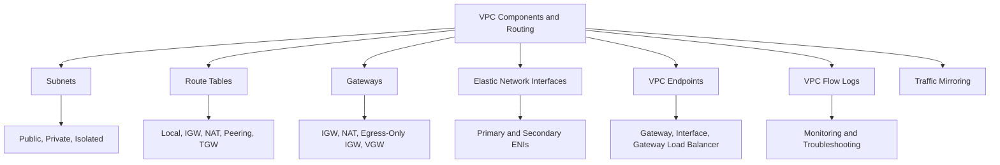
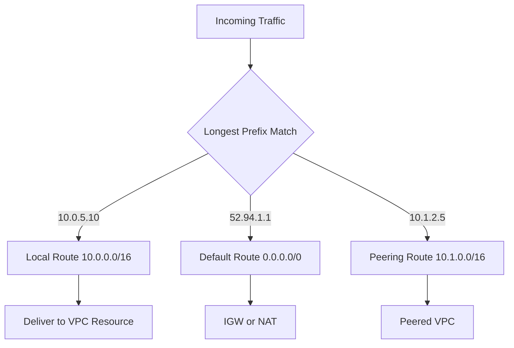

# Migration in progress
# Lesson 2: VPC Components and Routing

This lesson goes deeper into the individual components that make up a VPC and how routing connects them. It covers subnets, route tables, gateways, elastic network interfaces, VPC endpoints, and flow logs. The goal is to understand how traffic moves through a VPC, how to control it, and how to troubleshoot connectivity issues.

## Subnets in Detail

*Definition*: A subnet is a range of IP addresses in your VPC that resides entirely within one Availability Zone. Subnets are the primary unit of network segmentation in a VPC.

### Subnet Types

| Subnet Type | Route Table | Internet Access | Typical Use |
|---|---|---|---|
| Public | Route to IGW | Inbound and outbound | Load balancers, NAT gateways, bastion hosts |
| Private | Route to NAT only | Outbound only | Application servers, containers, Lambda |
| Isolated | No route to internet | None | Databases, sensitive data stores |

- Public subnets have a route to an internet gateway. Resources need public or Elastic IPs for inbound access.
- Private subnets route outbound traffic through a NAT gateway. They have no inbound route from the internet.
- Isolated subnets have no route to the internet at all. They are used for the most sensitive resources.
- Each subnet reserves five IP addresses for AWS internal use.
- AWS recommends a minimum /24 subnet to avoid IP exhaustion in production workloads.

### Subnet Sizing Considerations

- A /24 subnet provides 251 usable IP addresses.
- A /20 subnet provides 4,091 usable IP addresses.
- Kubernetes clusters (EKS) consume large numbers of IPs per node. Plan for /22 or larger subnets for EKS.
- Lambda functions with VPC configuration consume IPs from the subnet. Use a dedicated subnet for Lambda.
- Load balancers consume one IP per subnet per AZ.

> [!Tip]
> **Size subnets for peak, not average**: Running out of IP addresses in a subnet requires creating new subnets and redeploying resources. Plan for 2-3x your expected peak usage.

## Route Tables in Detail

*Definition*: A route table contains a set of rules that determine where network traffic from your subnet or gateway is directed. Every subnet must be associated with exactly one route table.

### Route Table Structure

| Column | Description | Example |
|---|---|---|
| Destination | The CIDR block or prefix list that traffic is destined for | 0.0.0.0/0 |
| Target | The gateway, connection, or ENI that handles traffic | igw-0abc123 |
| Status | Whether the route is active | Active |
| Propagated | Whether the route was learned automatically | No |

### Route Priority

- AWS evaluates routes using longest prefix match. A more specific route wins over a less specific route.
- Example: a route to `10.1.0.0/16` wins over `10.0.0.0/8` for traffic to `10.1.5.10`.
- The local route for the VPC CIDR is automatically added and cannot be removed.
- If no route matches, traffic is dropped.

### Common Route Patterns

| Destination | Target | Subnet Type | Purpose |
|---|---|---|---|
| 10.0.0.0/16 | local | All | Internal VPC traffic |
| 0.0.0.0/0 | igw-xxxx | Public | Internet access |
| 0.0.0.0/0 | nat-xxxx | Private | Outbound internet access |
| 10.1.0.0/16 | pcx-xxxx | Peered | VPC peering traffic |
| 10.2.0.0/16 | tgw-xxxx | Attached | Transit Gateway traffic |
| 192.168.0.0/16 | vgw-xxxx | VPN | On-premises traffic |
| pl-xxxxx (S3) | vpce-xxxx | Endpoint | S3 gateway endpoint |

> [!Important]
> **Longest prefix match wins**: AWS does not use route priority numbers like traditional routers. The most specific matching route is always used. This makes route table design predictable but requires careful CIDR planning.

## Gateways

### Internet Gateway

- Horizontally scaled, redundant, and highly available.
- Attaches to one VPC at a time.
- Performs NAT for instances with public IPv4 addresses.
- Used as a target for routes with destination 0.0.0.0/0.
- Does not have bandwidth constraints or availability risks.

### NAT Gateway

- Managed NAT service for outbound-only internet access.
- Must be deployed in a public subnet with an Elastic IP.
- AZ-specific. Deploy one per AZ for production.
- Supports up to 100 Gbps of bandwidth.
- Charges hourly plus data processing fees.

### Egress-Only Internet Gateway

- Provides outbound-only IPv6 internet access.
- Attached to a VPC, used as a target for IPv6 routes.
- Equivalent to NAT gateway for IPv6 traffic.
- Used when you want IPv6 connectivity without inbound access.

### Virtual Private Gateway

- The VPN concentrator on the AWS side of a Site-to-Site VPN.
- Attached to a VPC.
- Used as a target for routes to on-premises networks.
- Supports BGP for dynamic route propagation.

### Transit Gateway

- Central hub for connecting VPCs and on-premises networks.
- Supports transitive routing.
- Can have multiple route tables for segmentation.
- Attachments include VPCs, VPNs, and Direct Connect gateways.

| Gateway | Direction | Scope | Use Case |
|---|---|---|---|
| Internet Gateway | Inbound and outbound | VPC | Public subnet internet access |
| NAT Gateway | Outbound only | AZ | Private subnet outbound access |
| Egress-Only IGW | Outbound only | VPC | IPv6 outbound access |
| Virtual Private Gateway | Bidirectional | VPC | Site-to-Site VPN |
| Transit Gateway | Bidirectional | Regional | Multi-VPC and hybrid hub |

> [!Tip]
> **Egress-only IGW is the IPv6 equivalent of NAT**: If you assign IPv6 addresses to instances in private subnets, use an egress-only internet gateway to allow outbound IPv6 traffic without allowing inbound connections.

## Elastic Network Interfaces

*Definition*: An Elastic Network Interface (ENI) is a logical networking component in a VPC that represents a virtual network card. It can include a primary private IPv4 address, one or more secondary private IPv4 addresses, an Elastic IP address, and one or more IPv6 addresses.

- Every EC2 instance has at least one ENI (the primary ENI).
- You can create additional ENIs and attach them to instances for multi-homed configurations.
- ENIs are AZ-specific and cannot be moved across AZs.
- ENIs can be detached from one instance and attached to another in the same AZ, preserving IP addresses.
- ENIs have attributes: MAC address, source/destination check, security groups, and description.
- ENIs are used by many AWS services, including Lambda, RDS, and NAT gateways.

### ENI Use Cases

| Use Case | Description |
|---|---|
| Dual-homed instances | Attach ENIs in different subnets for separate management and data traffic |
| Failover | Move ENI between instances to preserve IP and MAC address |
| Security appliance | Use multiple ENIs for firewall or IDS/IPS appliances |
| Static IP | Assign a secondary private IP that stays with the ENI |

> [!Important]
> **ENIs preserve identity during failover**: Moving an ENI from one instance to another in the same AZ preserves the private IP, Elastic IP, and MAC address. This makes ENIs useful for high availability scenarios where applications are bound to specific network identities.

## VPC Endpoints

*Definition*: A VPC endpoint enables private connections between your VPC and supported AWS services without requiring an internet gateway, NAT device, VPN, or Direct Connect connection.

### Endpoint Types

| Type | Description | Supported Services | Cost |
|---|---|---|---|
| Gateway Endpoint | Route table target for S3 and DynamoDB | S3, DynamoDB | Free |
| Interface Endpoint | ENI with private IP in your subnet | Most AWS services | Hourly plus data processing |
| Gateway Load Balancer Endpoint | Endpoint for third-party virtual appliances | Custom appliances | Hourly plus data processing |

- Gateway endpoints are