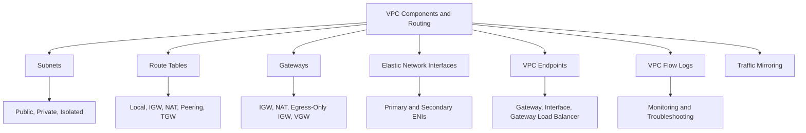
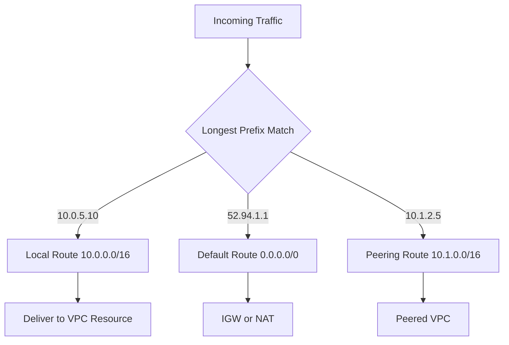
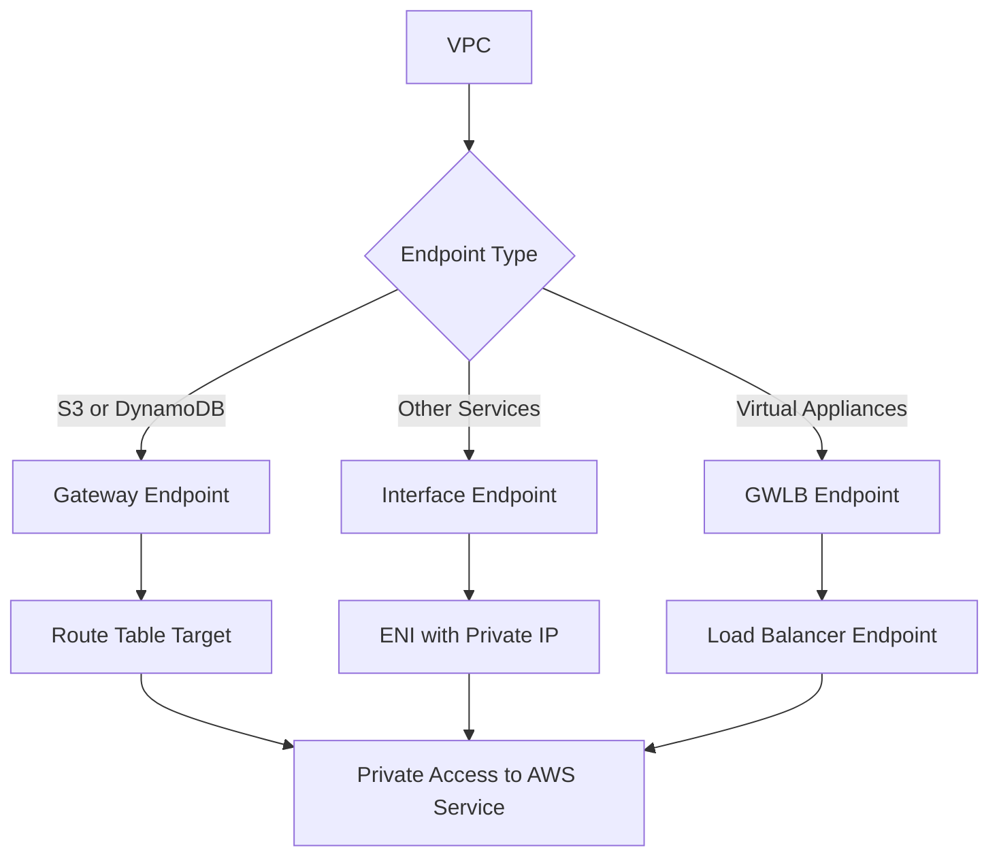
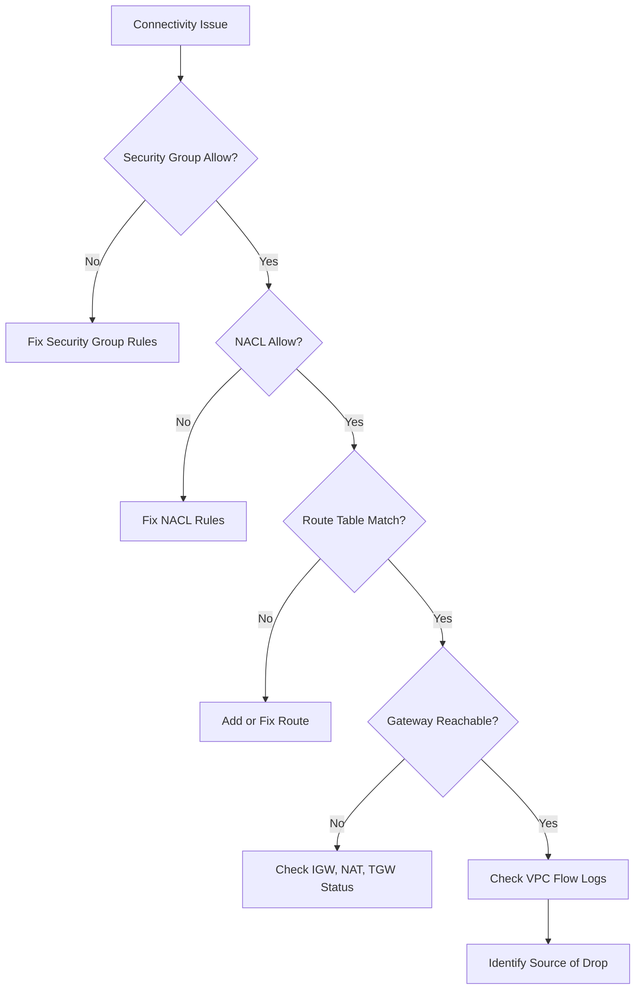

# Lesson 2: VPC Components and Routing

This lesson goes deeper into the individual components that make up a VPC and how routing connects them. It covers subnets, route tables, gateways, elastic network interfaces, VPC endpoints, and flow logs. The goal is to understand how traffic moves through a VPC, how to control it, and how to troubleshoot connectivity issues.

## Subnets in Detail

*Definition*: A subnet is a range of IP addresses in your VPC that resides entirely within one Availability Zone. Subnets are the primary unit of network segmentation in a VPC.

### Subnet Types

| Subnet Type | Route Table | Internet Access | Typical Use |
|---|---|---|---|
| Public | Route to IGW | Inbound and outbound | Load balancers, NAT gateways, bastion hosts |
| Private | Route to NAT only | Outbound only | Application servers, containers, Lambda |
| Isolated | No route to internet | None | Databases, sensitive data stores |

- Public subnets have a route to an internet gateway. Resources need public or Elastic IPs for inbound access.
- Private subnets route outbound traffic through a NAT gateway. They have no inbound route from the internet.
- Isolated subnets have no route to the internet at all. They are used for the most sensitive resources.
- Each subnet reserves five IP addresses for AWS internal use.
- AWS recommends a minimum /24 subnet to avoid IP exhaustion in production workloads.

### Subnet Sizing Considerations

- A /24 subnet provides 251 usable IP addresses.
- A /20 subnet provides 4,091 usable IP addresses.
- Kubernetes clusters (EKS) consume large numbers of IPs per node. Plan for /22 or larger subnets for EKS.
- Lambda functions with VPC configuration consume IPs from the subnet. Use a dedicated subnet for Lambda.
- Load balancers consume one IP per subnet per AZ.

> [!Tip]
> **Size subnets for peak, not average**: Running out of IP addresses in a subnet requires creating new subnets and redeploying resources. Plan for 2-3x your expected peak usage.

## Route Tables in Detail

*Definition*: A route table contains a set of rules that determine where network traffic from your subnet or gateway is directed. Every subnet must be associated with exactly one route table.

### Route Table Structure

| Column | Description | Example |
|---|---|---|
| Destination | The CIDR block or prefix list that traffic is destined for | 0.0.0.0/0 |
| Target | The gateway, connection, or ENI that handles traffic | igw-0abc123 |
| Status | Whether the route is active | Active |
| Propagated | Whether the route was learned automatically | No |

### Route Priority

- AWS evaluates routes using longest prefix match. A more specific route wins over a less specific route.
- Example: a route to `10.1.0.0/16` wins over `10.0.0.0/8` for traffic to `10.1.5.10`.
- The local route for the VPC CIDR is automatically added and cannot be removed.
- If no route matches, traffic is dropped.

### Common Route Patterns

| Destination | Target | Subnet Type | Purpose |
|---|---|---|---|
| 10.0.0.0/16 | local | All | Internal VPC traffic |
| 0.0.0.0/0 | igw-xxxx | Public | Internet access |
| 0.0.0.0/0 | nat-xxxx | Private | Outbound internet access |
| 10.1.0.0/16 | pcx-xxxx | Peered | VPC peering traffic |
| 10.2.0.0/16 | tgw-xxxx | Attached | Transit Gateway traffic |
| 192.168.0.0/16 | vgw-xxxx | VPN | On-premises traffic |
| pl-xxxxx (S3) | vpce-xxxx | Endpoint | S3 gateway endpoint |

> [!Important]
> **Longest prefix match wins**: AWS does not use route priority numbers like traditional routers. The most specific matching route is always used. This makes route table design predictable but requires careful CIDR planning.

## Gateways

### Internet Gateway

- Horizontally scaled, redundant, and highly available.
- Attaches to one VPC at a time.
- Performs NAT for instances with public IPv4 addresses.
- Used as a target for routes with destination 0.0.0.0/0.
- Does not have bandwidth constraints or availability risks.

### NAT Gateway

- Managed NAT service for outbound-only internet access.
- Must be deployed in a public subnet with an Elastic IP.
- AZ-specific. Deploy one per AZ for production.
- Supports up to 100 Gbps of bandwidth.
- Charges hourly plus data processing fees.

### Egress-Only Internet Gateway

- Provides outbound-only IPv6 internet access.
- Attached to a VPC, used as a target for IPv6 routes.
- Equivalent to NAT gateway for IPv6 traffic.
- Used when you want IPv6 connectivity without inbound access.

### Virtual Private Gateway

- The VPN concentrator on the AWS side of a Site-to-Site VPN.
- Attached to a VPC.
- Used as a target for routes to on-premises networks.
- Supports BGP for dynamic route propagation.

### Transit Gateway

- Central hub for connecting VPCs and on-premises networks.
- Supports transitive routing.
- Can have multiple route tables for segmentation.
- Attachments include VPCs, VPNs, and Direct Connect gateways.

| Gateway | Direction | Scope | Use Case |
|---|---|---|---|
| Internet Gateway | Inbound and outbound | VPC | Public subnet internet access |
| NAT Gateway | Outbound only | AZ | Private subnet outbound access |
| Egress-Only IGW | Outbound only | VPC | IPv6 outbound access |
| Virtual Private Gateway | Bidirectional | VPC | Site-to-Site VPN |
| Transit Gateway | Bidirectional | Regional | Multi-VPC and hybrid hub |

> [!Tip]
> **Egress-only IGW is the IPv6 equivalent of NAT**: If you assign IPv6 addresses to instances in private subnets, use an egress-only internet gateway to allow outbound IPv6 traffic without allowing inbound connections.

## Elastic Network Interfaces

*Definition*: An Elastic Network Interface (ENI) is a logical networking component in a VPC that represents a virtual network card. It can include a primary private IPv4 address, one or more secondary private IPv4 addresses, an Elastic IP address, and one or more IPv6 addresses.

- Every EC2 instance has at least one ENI (the primary ENI).
- You can create additional ENIs and attach them to instances for multi-homed configurations.
- ENIs are AZ-specific and cannot be moved across AZs.
- ENIs can be detached from one instance and attached to another in the same AZ, preserving IP addresses.
- ENIs have attributes: MAC address, source/destination check, security groups, and description.
- ENIs are used by many AWS services, including Lambda, RDS, and NAT gateways.

### ENI Use Cases

| Use Case | Description |
|---|---|
| Dual-homed instances | Attach ENIs in different subnets for separate management and data traffic |
| Failover | Move ENI between instances to preserve IP and MAC address |
| Security appliance | Use multiple ENIs for firewall or IDS/IPS appliances |
| Static IP | Assign a secondary private IP that stays with the ENI |

> [!Important]
> **ENIs preserve identity during failover**: Moving an ENI from one instance to another in the same AZ preserves the private IP, Elastic IP, and MAC address. This makes ENIs useful for high availability scenarios where applications are bound to specific network identities.

## VPC Endpoints

*Definition*: A VPC endpoint enables private connections between your VPC and supported AWS services without requiring an internet gateway, NAT device, VPN, or Direct Connect connection.

### Endpoint Types

| Type | Description | Supported Services | Cost |
|---|---|---|---|
| Gateway Endpoint | Route table target for S3 and DynamoDB | S3, DynamoDB | Free |
| Interface Endpoint | ENI with private IP in your subnet | Most AWS services | Hourly plus data processing |
| Gateway Load Balancer Endpoint | Endpoint for third-party virtual appliances | Custom appliances | Hourly plus data processing |

- Gateway endpoints are only available for S3 and DynamoDB. They are free and are added as route table targets.
- Interface endpoints use PrivateLink to create an ENI in your subnet with a private IP address.
- Gateway Load Balancer endpoints route traffic through virtual appliances for inspection.

> [!Tip]
> **Use gateway endpoints for S3 and DynamoDB**: Gateway endpoints are free and eliminate NAT gateway data processing charges for traffic to those services. For high-volume S3 access from private subnets, this can save significant cost.

## VPC Flow Logs

*Definition*: VPC Flow Logs capture information about the IP traffic going to and from network interfaces in your VPC. Flow log data is published to CloudWatch Logs, S3, or Kinesis Data Firehose.

### Flow Log Levels

| Level | Scope | Use Case |
|---|---|---|
| VPC | All ENIs in the VPC | Broad monitoring |
| Subnet | All ENIs in the subnet | Subnet-level analysis |
| ENI | Specific network interface | Targeted troubleshooting |

### Flow Log Fields

- Source and destination IP addresses.
- Source and destination ports.
- Protocol number.
- Packets and bytes transferred.
- Start and end time.
- Action (ACCEPT or REJECT).
- Log status.

### Common Use Cases

- Troubleshoot security group and NACL rules.
- Detect anomalous traffic patterns.
- Monitor traffic to and from specific instances.
- Verify that traffic is being accepted or rejected as expected.
- Feed flow logs into SIEM tools for security analysis.

> [!Important]
> **Flow logs do not capture all traffic**: They do not capture traffic to and from the instance metadata service (169.254.169.254), DHCP traffic, DNS traffic to the VPC resolver, or traffic to and from Windows license activation servers. Use them alongside other monitoring tools.

## Traffic Mirroring

*Definition*: Traffic mirroring copies network traffic from ENIs and sends it to out-of-band security and monitoring appliances for analysis.

- Traffic mirroring captures packet-level data, not just flow metadata.
- Used for deep packet inspection, intrusion detection, and content analysis.
- Sources are ENIs. Targets are network load balancers or ENIs.
- Filters control which traffic is mirrored based on protocol, CIDR, and port.
- Traffic mirroring incurs charges based on the volume of mirrored traffic.

| Feature | VPC Flow Logs | Traffic Mirroring |
|---|---|---|
| Data Captured | Flow metadata | Full packet content |
| Use Case | Monitoring, troubleshooting | Deep inspection, security analysis |
| Cost | Lower | Higher |
| Complexity | Low | Medium to high |

> [!Tip]
> **Use traffic mirroring for security forensics**: Flow logs tell you what happened. Traffic mirroring lets you see the actual content. Use mirroring when you need to inspect payloads for threats or compliance.

## Routing Troubleshooting

### Common Issues and Resolutions

| Issue | Possible Cause | Resolution |
|---|---|---|
| Cannot reach internet from public subnet | Missing IGW route, no public IP | Add 0.0.0.0/0 route to IGW, assign Elastic IP |
| Cannot reach internet from private subnet | Missing NAT route, NAT in wrong AZ | Add route to NAT gateway, verify NAT is in same AZ |
| Cannot reach peered VPC | Missing route, overlapping CIDR | Add route to peering connection on both sides, verify no overlap |
| Cannot reach on-premises | Missing VPN route, BGP down | Add route to VGW or TGW, verify VPN tunnel status |
| Cannot reach AWS service | No endpoint, NAT route missing | Create VPC endpoint or verify NAT gateway route |
| Intermittent connectivity | NACL blocking return traffic | Verify NACL allows ephemeral ports 1024-65535 |

### Troubleshooting Workflow

> [!Important]
> **Check security groups and NACLs first**: Most connectivity issues are caused by security group or NACL rules. Verify that both allow the traffic before investigating routes or gateways.

## Assessment Preparation

### Practice Questions

1. Compare public, private, and isolated subnets.
2. Explain how AWS route tables use longest prefix match.
3. Describe the purpose of internet gateways, NAT gateways, and egress-only internet gateways.
4. Explain what an ENI is and list three use cases.
5. Compare gateway endpoints and interface endpoints.
6. Describe the three levels of VPC Flow Logs.
7. Compare VPC Flow Logs and traffic mirroring.
8. List common VPC routing issues and their resolutions.

### Scenario Questions

**Scenario 1: Private S3 Access**
A private subnet needs to access S3 without going through a NAT gateway. How do you configure this?

- Create a gateway endpoint for S3.
- Add the endpoint as a target in the private subnet route table.
- Gateway endpoints are free and eliminate NAT data processing charges.
- Verify that the S3 bucket policy allows access from the VPC endpoint.

**Scenario 2: Multi-AZ NAT Gateway**
A production VPC has private subnets in three AZs. How should NAT gateways be deployed?

- Deploy one NAT gateway per AZ in the corresponding public subnet.
- Add a route in each private subnet route table pointing to the NAT gateway in the same AZ.
- This avoids cross-AZ traffic costs and eliminates single points of failure.
- Accept the higher hourly cost for resilience.

**Scenario 3: Troubleshooting Intermittent Connectivity**
Instances in a private subnet can sometimes reach the internet but sometimes fail. What should you check?

- Verify the NAT gateway is in the same AZ as the private subnet.
- Check the NAT gateway CloudWatch metrics for errors or bandwidth limits.
- Review NACL rules for ephemeral port ranges.
- Check VPC Flow Logs for REJECT entries.

**Scenario 4: Security Forensics**
A security team needs to inspect packet payloads for a suspected intrusion. What should they use?

- Use traffic mirroring to copy traffic from the suspect ENI.
- Send mirrored traffic to an intrusion detection appliance.
- Use VPC Flow Logs for metadata-level analysis.
- Combine both tools for complete visibility.

## Key Takeaways

- Subnets are the primary unit of network segmentation. Public subnets route to an IGW, private subnets route to a NAT, and isolated subnets have no internet route.
- Route tables use longest prefix match to determine where traffic is directed. The local route for the VPC CIDR cannot be removed.
- Internet gateways provide bidirectional internet access. NAT gateways provide outbound-only access. Egress-only internet gateways provide outbound-only IPv6 access.
- Virtual private gateways connect VPCs to on-premises networks via VPN. Transit Gateway is a central hub for multi-VPC and hybrid connectivity.
- Elastic Network Interfaces represent virtual network cards. They are AZ-specific and can be moved between instances for failover.
- VPC endpoints provide private access to AWS services without internet exposure. Gateway endpoints are free for S3 and DynamoDB. Interface endpoints use PrivateLink.
- VPC Flow Logs capture IP traffic metadata at VPC, subnet, or ENI level. They are the primary troubleshooting tool.
- Traffic mirroring captures full packet content for deep inspection and security forensics.
- Most connectivity issues are caused by security group or NACL rules. Check those first before investigating routes or gateways.
- Longest prefix match makes route behavior predictable but requires careful CIDR planning to avoid overlaps.

> [!Important]
> **Route tables and security groups are the two most common sources of networking issues**: When traffic does not flow as expected, verify the route table first, then the security group, then the NACL. Use VPC Flow Logs and Reachability Analyzer to confirm connectivity without generating traffic. Design route tables and security groups with clear intent and document the traffic flows they support.
