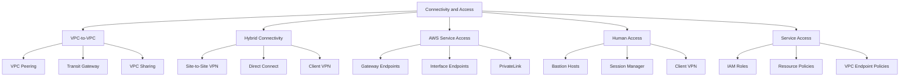
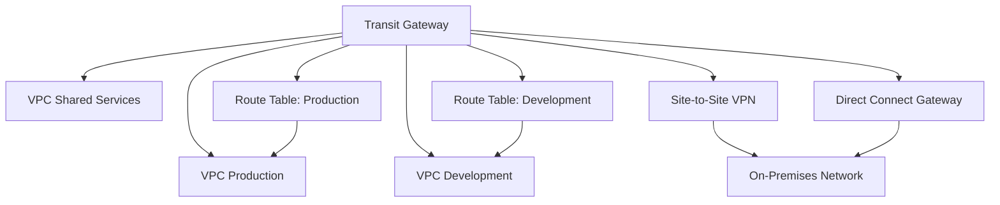
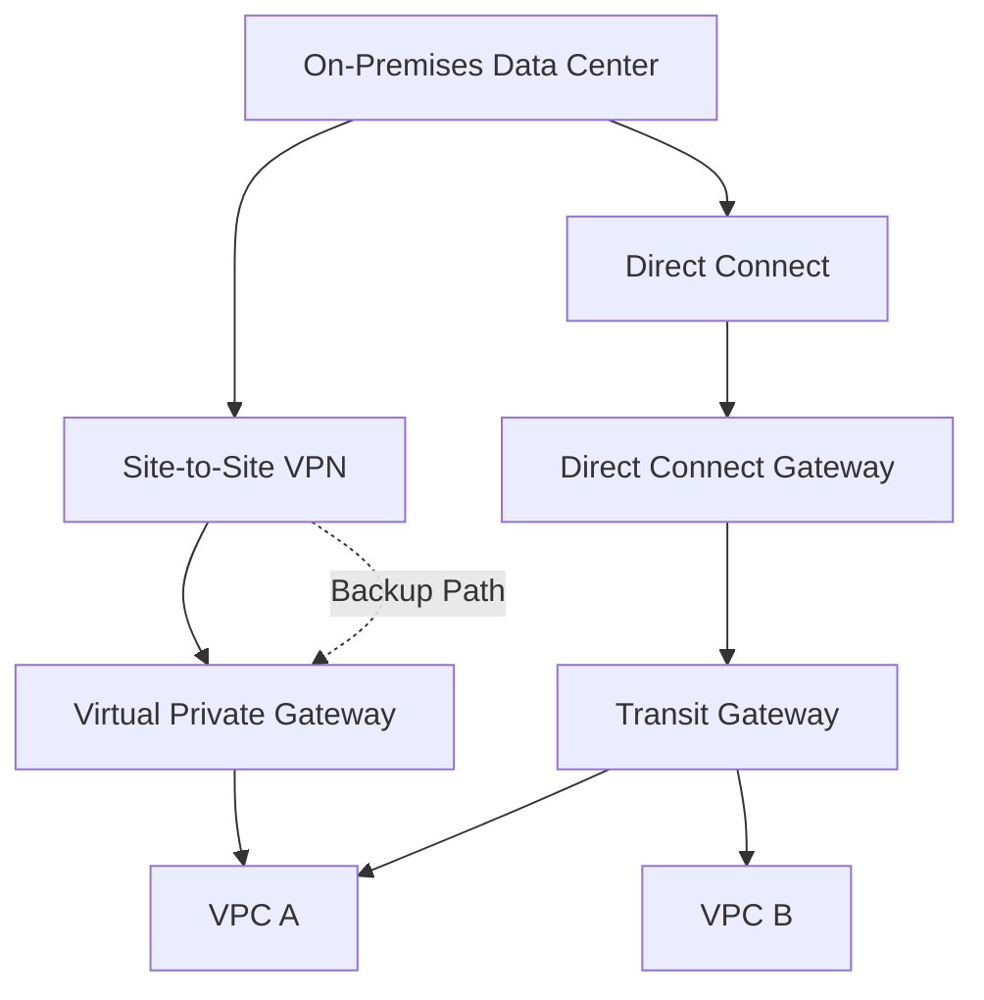
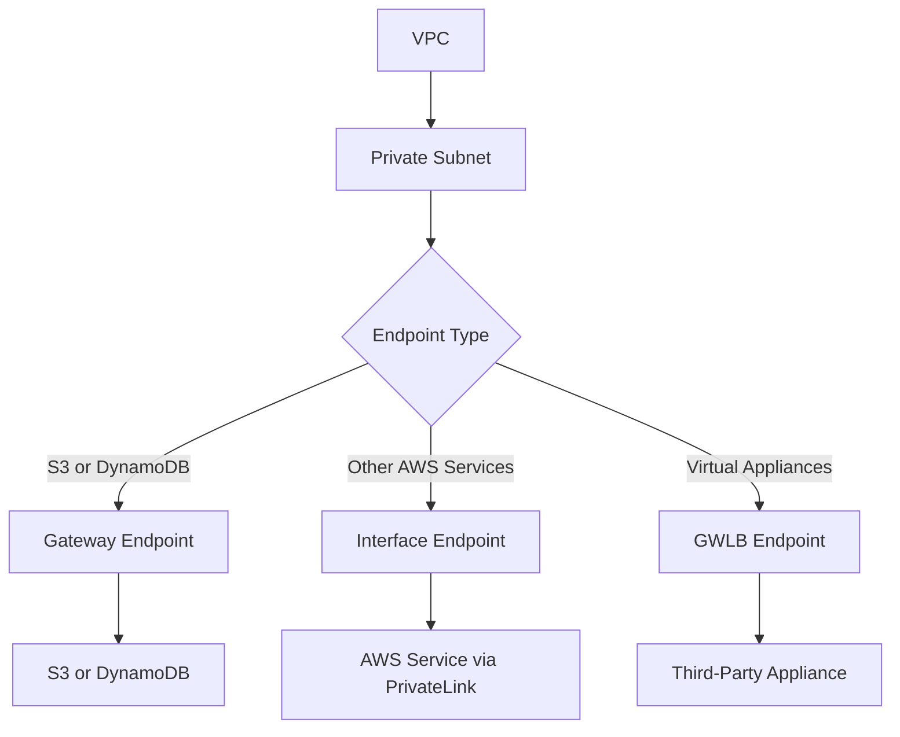
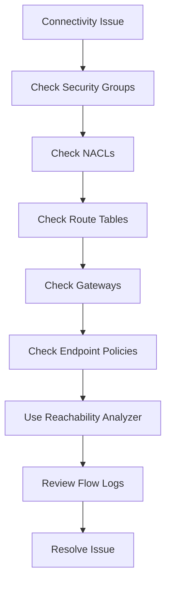
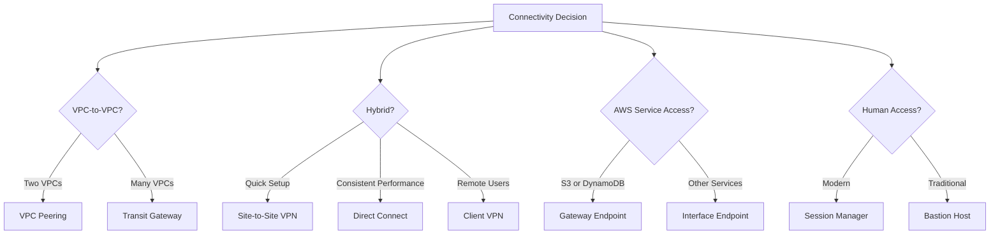

# Lesson 3: Connectivity and Access

The lesson content was not supplied, so these notes synthesize the expected topics for this lesson: VPC connectivity options, hybrid access, VPC endpoints, and methods for accessing resources securely. The focus is on how traffic moves between VPCs, to on-premises networks, and to AWS services, plus how human and service access is controlled.

## VPC-to-VPC Connectivity

VPCs are isolated by default. Connecting them requires an explicit mechanism. The choice depends on the number of VPCs, whether transitive routing is needed, and whether cross-account or cross-Region connectivity is required.

### VPC Peering

*Definition*: A VPC peering connection is a networking connection between two VPCs that enables you to route traffic between them using private IPv4 or IPv6 addresses.

- Peering connections can be created between VPCs in the same account, different accounts, or different Regions.
- Traffic stays on the AWS backbone and does not traverse the public internet.
- Peering is not transitive. If VPC A is peered with VPC B, and VPC B is peered with VPC C, VPC A cannot reach VPC C through VPC B.
- CIDR blocks must not overlap.
- Each VPC must add a route to the peering connection in its route tables.
- Security groups can reference peered VPC CIDRs or security groups from the peered VPC if the peering connection is in the same Region.

| Dimension | Same-Region Peering | Cross-Region Peering |
|---|---|---|
| Latency | Low | Higher (inter-Region) |
| Data Transfer Cost | Low | Inter-Region rates |
| Security Group Reference | Yes | No |
| DNS Resolution | Optional | Optional |
| Use Case | Simple two-VPC connectivity | Cross-Region workloads |

> [!Important]
> **Peering does not scale for many VPCs**: Each new VPC requires a peering connection to every other VPC it needs to reach. This mesh topology becomes unmanageable beyond a few VPCs. Use Transit Gateway for hub-and-spoke connectivity.

### AWS Transit Gateway

*Definition*: AWS Transit Gateway is a central hub that connects VPCs, VPN connections, and AWS Direct Connect connections. It supports transitive routing between all attached networks.

- Transit Gateway replaces complex mesh peering with a hub-and-spoke model.
- Any attached VPC can reach any other attached VPC through the hub.
- It supports multiple route tables for network segmentation and isolation.
- It can connect to on-premises networks via Site-to-Site VPN or Direct Connect.
- It supports cross-account sharing using AWS Resource Access Manager (RAM).
- It scales to thousands of VPCs and on-premises connections.

### Transit Gateway Route Tables

- Transit Gateway route tables control which attachments can reach which destinations.
- You can create separate route tables for production, development, and shared services.
- Associations determine which attachments use a route table for outbound traffic.
- Propagations determine which attachments advertise routes into a route table.
- This allows fine-grained segmentation without complex peering meshes.

> [!Tip]
> **Use separate Transit Gateway route tables for segmentation**: A single Transit Gateway with multiple route tables can isolate production, development, and shared services traffic without deploying multiple Transit Gateways.

### VPC Sharing

*Definition*: VPC sharing allows an owner account to share subnets with other accounts in the same AWS Organization. Participants can create resources in the shared subnets but cannot modify the VPC or subnets.

- The VPC owner retains control of the network configuration.
- Participant accounts can launch resources in the shared subnets.
- Security groups and network ACLs are managed by the owner.
- This reduces the number of VPCs and simplifies connectivity.
- VPC sharing is built on AWS Resource Access Manager (RAM).

> [!Important]
> **VPC sharing centralizes network management**: It is ideal for organizations that want central network control while allowing teams to deploy resources independently. It avoids the need for peering between many small VPCs.

## Hybrid Connectivity

Hybrid connectivity connects AWS VPCs to on-premises networks. The two primary options are Site-to-Site VPN and Direct Connect. They differ in speed, latency consistency, cost, and setup time.

### Site-to-Site VPN

*Definition*: AWS Site-to-Site VPN creates a secure connection between your on-premises network and your VPC using IPsec tunnels over the public internet.

- Uses two tunnels for redundancy by default.
- Supports static routing or dynamic routing with BGP.
- Can connect to a Virtual Private Gateway (VGW) or a Transit Gateway.
- Setup takes minutes to hours.
- Bandwidth per tunnel is up to 1.25 Gbps.
- Latency varies because traffic traverses the public internet.

### AWS Direct Connect

*Definition*: AWS Direct Connect is a dedicated private network connection from your on-premises data center to AWS. It bypasses the public internet and provides consistent network performance.

- Available in 1 Gbps, 10 Gbps, and 100 Gbps port speeds.
- Can be provisioned through AWS Direct Connect locations or partners.
- Supports private VIFs, public VIFs, and transit VIFs.
- Connects to a Virtual Private Gateway or a Direct Connect Gateway.
- Setup takes weeks to months.
- Provides consistent latency and lower data transfer costs than VPN.

### VPN vs Direct Connect

| Dimension | Site-to-Site VPN | Direct Connect |
|---|---|---|
| Connection | Public internet | Dedicated private line |
| Latency | Variable | Consistent |
| Bandwidth | Up to 1.25 Gbps per tunnel | 1 Gbps to 100 Gbps |
| Setup Time | Minutes to hours | Weeks to months |
| Cost | Lower upfront | Higher upfront and monthly |
| Encryption | IPsec | Optional (MACsec or VPN over DX) |
| Use Case | Quick hybrid, backup path | Consistent performance, large data transfer |
| Redundancy | Two tunnels by default | Requires redundant connections |

### Combining VPN and Direct Connect

- Use Direct Connect as the primary connection.
- Use Site-to-Site VPN as a backup path over the public internet.
- Encrypt traffic over Direct Connect with a VPN overlay if required.
- Use BGP to automate failover between the two paths.

> [!Important]
> **Direct Connect does not encrypt traffic by default**: Direct Connect is a private connection, but it is not encrypted. Use MACsec or a VPN overlay if encryption is required. For compliance, verify whether encryption in transit is mandated for your workload.

### AWS Client VPN

*Definition*: AWS Client VPN is a managed, elastic VPN service that enables remote users to securely access AWS resources and on-premises networks.

- Supports OpenVPN-based clients.
- Integrates with Active Directory, SAML, and certificate-based authentication.
- Scales automatically based on demand.
- Provides access to VPC resources and peered networks.
- Can be used as an alternative to bastion hosts for remote access.

> [!Tip]
> **Use Client VPN for remote workforce access**: It eliminates the need for bastion hosts, provides centralized authentication, and scales automatically. Combine with security groups to restrict access to specific resources.

## AWS Service Access

Private access to AWS services avoids the public internet and reduces exposure. VPC endpoints are the primary mechanism.

### Gateway Endpoints

- Used for Amazon S3 and DynamoDB only.
- Added as a target in route tables.
- Free to use.
- Eliminates NAT gateway data processing charges for S3 and DynamoDB traffic.
- Controlled by endpoint policies and bucket policies.

### Interface Endpoints

- Used for most AWS services.
- Creates an Elastic Network Interface in your subnet with a private IP address.
- Powered by AWS PrivateLink.
- Charged hourly plus data processing.
- Controlled by endpoint policies and security groups.

### Gateway Load Balancer Endpoints

- Used to route traffic through third-party virtual appliances.
- Supports firewalls, intrusion detection, and deep packet inspection.
- Uses a Gateway Load Balancer to distribute traffic to appliances.

| Endpoint Type | Services | Cost | Route Table Target | Security Group |
|---|---|---|---|---|
| Gateway | S3, DynamoDB | Free | Yes | Not applicable |
| Interface | Most AWS services | Hourly + data | No (uses ENI) | Yes |
| GWLB Endpoint | Third-party appliances | Hourly + data | No (uses GWLB) | Yes |

> [!Important]
> **Gateway endpoints are free and save money**: For high-volume S3 access from private subnets, gateway endpoints eliminate NAT gateway data processing charges. Always use gateway endpoints for S3 and DynamoDB when resources are in private subnets.

## Human Access to Resources

Accessing EC2 instances and other resources requires secure methods. Bastion hosts are traditional but have drawbacks. Session Manager is the modern alternative.

### Bastion Hosts

- A bastion host is an EC2 instance in a public subnet that acts as a jump server.
- Users SSH or RDP to the bastion, then connect to private instances.
- Requires managing SSH keys, security groups, and patching.
- Can be a single point of failure unless deployed in multiple AZs.
- Should be restricted to specific IP ranges and monitored.

### AWS Systems Manager Session Manager

- Provides browser-based or CLI shell access to EC2 instances without opening inbound ports.
- No bastion host, key pair, or public IP required.
- Integrates with IAM for access control and CloudTrail for auditing.
- Logs sessions to S3 or CloudWatch Logs.
- Works for instances in private subnets with the SSM agent installed.
- Supports port forwarding and SSH tunneling.

### Comparison

| Method | Ports Required | Key Management | Auditing | Bastion Host | Use Case |
|---|---|---|---|---|---|
| SSH/RDP | 22 or 3389 | Yes | Manual | Optional | Traditional access |
| Bastion Host | 22 or 3389 | Yes | Manual | Yes | Jump server |
| Session Manager | None | No | Automatic | No | Modern secure access |
| Client VPN | 443 | Certificate or AD | Automatic | No | Remote workforce |

> [!Tip]
> **Use Session Manager instead of bastion hosts**: It eliminates open inbound ports, removes key management overhead, and provides automatic auditing. It is the recommended method for accessing EC2 instances in private subnets.

## Service Access and IAM

Services and applications need access to AWS resources. This is controlled through IAM roles and resource policies.

### IAM Roles for Services

- EC2 instances, Lambda functions, ECS tasks, and EKS pods assume IAM roles to obtain temporary credentials.
- Roles eliminate the need for long-term access keys.
- Permissions are defined in policies attached to the role.
- Credentials rotate automatically.

### Resource Policies

- Resource-based policies are attached to resources such as S3 buckets, KMS keys, and SQS queues.
- They define who can access the resource and what actions they can perform.
- They are commonly used for cross-account access.
- They work alongside identity-based policies.

### VPC Endpoint Policies

- Endpoint policies restrict which resources can be accessed through a VPC endpoint.
- They are attached to gateway endpoints and interface endpoints.
- They can restrict access to specific S3 buckets, DynamoDB tables, or other services.
- They are evaluated alongside IAM policies.

> [!Important]
> **Combine endpoint policies with IAM policies**: Endpoint policies define what can be accessed through the endpoint. IAM policies define what the principal can do. Both must allow the action for access to succeed.

## Troubleshooting Connectivity

### Common Issues

| Issue | Possible Cause | Resolution |
|---|---|---|
| Cannot reach peered VPC | Missing route, overlapping CIDR, NACL block | Add route to peering connection on both sides |
| Cannot reach on-premises | VPN tunnel down, BGP issue, missing route | Check VPN status, BGP routes, route tables |
| Cannot reach AWS service privately | Endpoint missing, endpoint policy denies | Create endpoint, verify endpoint policy |
| Cannot connect to instance | Security group, NACL, route, no public IP | Check security group, NACL, route, use Session Manager |
| Intermittent connectivity | NAT gateway overload, ephemeral port block | Check NAT metrics, NACL rules |

### Troubleshooting Tools

- VPC Reachability Analyzer: tests connectivity between resources without sending traffic.
- VPC Flow Logs: captures IP traffic metadata for analysis.
- AWS CloudTrail: records API calls for auditing.
- Amazon CloudWatch: monitors metrics and logs.
- AWS Trusted Advisor: provides recommendations for network configuration.

> [!Tip]
> **Use Reachability Analyzer before opening a support ticket**: It identifies the blocking component in a connectivity path without generating traffic. It is faster and more precise than manual troubleshooting.

## Assessment Preparation

### Practice Questions

1. Compare VPC peering and Transit Gateway for VPC-to-VPC connectivity.
2. Explain why VPC peering is not transitive.
3. Compare Site-to-Site VPN and Direct Connect across latency, bandwidth, and setup time.
4. Describe when to use Client VPN.
5. Compare gateway endpoints and interface endpoints.
6. Explain the purpose of endpoint policies.
7. Compare bastion hosts and Session Manager for human access.
8. Describe how IAM roles provide service access to AWS resources.
9. List common connectivity issues and their resolutions.
10. Explain how Transit Gateway route tables provide network segmentation.

### Scenario Questions

**Scenario 1: Many VPCs Across Accounts**
A company has 20 VPCs across multiple AWS accounts and needs full connectivity with segmentation between production and development. What should they use?

- Use AWS Transit Gateway as a central hub.
- Attach all VPCs to the Transit Gateway.
- Create separate route tables for production and development.
- Use AWS RAM to share the Transit Gateway across accounts.
- Connect on-premises networks via VPN or Direct Connect.

**Scenario 2: Private S3 Access**
A private subnet needs to access S3 without going through a NAT gateway. How do you configure this?

- Create a gateway endpoint for S3.
- Add the endpoint as a target in the private subnet route table.
- Gateway endpoints are free and eliminate NAT data processing charges.
- Verify that the S3 bucket policy allows access from the VPC endpoint.

**Scenario 3: Remote Workforce Access**
A company needs to provide remote employees with secure access to AWS resources. What should they use?

- Use AWS Client VPN with SAML authentication.
- Integrate with the corporate identity provider.
- Use security groups to restrict access to specific resources.
- Avoid bastion hosts and public SSH access.

**Scenario 4: Consistent Hybrid Connectivity**
A company needs consistent low-latency connectivity between its data center and AWS for large data transfers. What should they use?

- Use AWS Direct Connect for dedicated private connectivity.
- Combine with Site-to-Site VPN for backup and encryption.
- Use Transit Gateway to connect multiple VPCs to the on-premises network.
- Deploy redundant Direct Connect connections for high availability.

## Key Takeaways

- VPC peering connects two VPCs directly. It is not transitive and does not scale for many VPCs.
- AWS Transit Gateway is a central hub that connects many VPCs, VPNs, and Direct Connect connections with transitive routing and segmentation.
- VPC sharing allows an owner account to share subnets with other accounts in the same organization.
- Site-to-Site VPN uses the public internet and is quick to set up. Direct Connect provides a dedicated private connection with consistent performance.
- Direct Connect does not encrypt traffic by default. Use MACsec or a VPN overlay if encryption is required.
- AWS Client VPN provides managed remote access for users with SAML or certificate authentication.
- Gateway endpoints provide free private access to S3 and DynamoDB. Interface endpoints use PrivateLink for other AWS services.
- Endpoint policies restrict what can be accessed through a VPC endpoint. Combine them with IAM policies.
- Session Manager provides secure, auditable access to EC2 instances without open inbound ports or bastion hosts.
- IAM roles provide temporary credentials for services and applications. Resource policies control access to specific resources.
- Use Reachability Analyzer and VPC Flow Logs to troubleshoot connectivity issues.
- Design connectivity for scale, security, and cost. Choose the simplest option that meets requirements.

> [!Important]
> **Connectivity and access are security boundaries**: Every connection between VPCs, to on-premises networks, or to AWS services is a potential attack path. Use private connectivity where possible, apply least privilege to endpoint policies and IAM roles, and audit access with CloudTrail and VPC Flow Logs. The goal is to enable required traffic while denying everything else by default.
