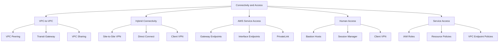
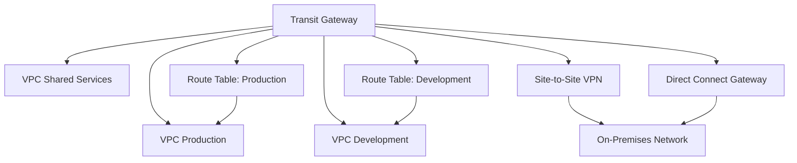
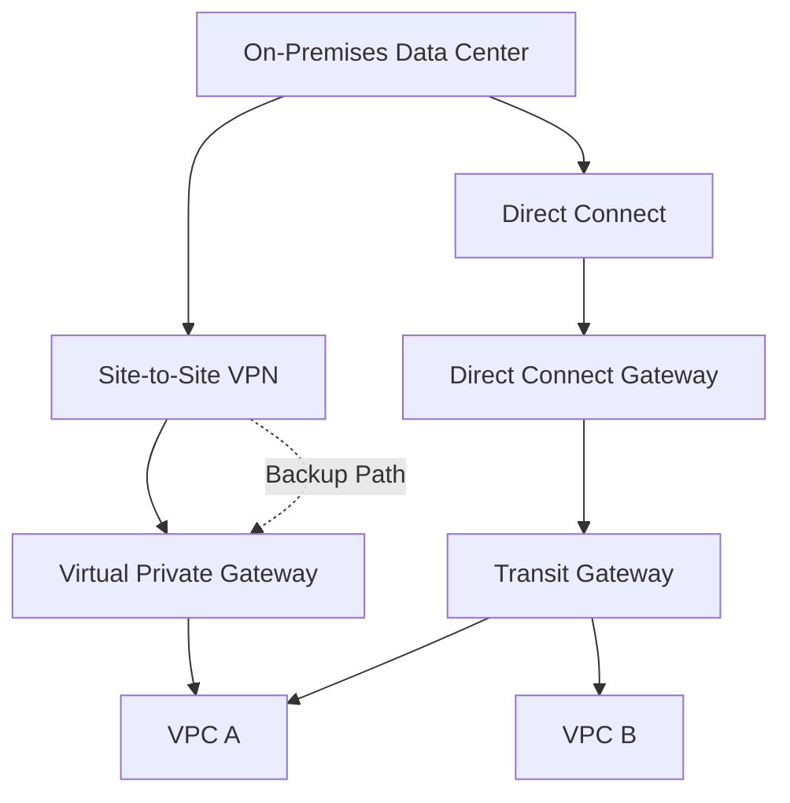

# Migration in progress
# Lesson 3: Connectivity and Access

The lesson content was not supplied, so these notes synthesize the expected topics for this lesson: VPC connectivity options, hybrid access, VPC endpoints, and methods for accessing resources securely. The focus is on how traffic moves between VPCs, to on-premises networks, and to AWS services, plus how human and service access is controlled.

## VPC-to-VPC Connectivity

VPCs are isolated by default. Connecting them requires an explicit mechanism. The choice depends on the number of VPCs, whether transitive routing is needed, and whether cross-account or cross-Region connectivity is required.

### VPC Peering

*Definition*: A VPC peering connection is a networking connection between two VPCs that enables you to route traffic between them using private IPv4 or IPv6 addresses.

- Peering connections can be created between VPCs in the same account, different accounts, or different Regions.
- Traffic stays on the AWS backbone and does not traverse the public internet.
- Peering is not transitive. If VPC A is peered with VPC B, and VPC B is peered with VPC C, VPC A cannot reach VPC C through VPC B.
- CIDR blocks must not overlap.
- Each VPC must add a route to the peering connection in its route tables.
- Security groups can reference peered VPC CIDRs or security groups from the peered VPC if the peering connection is in the same Region.

| Dimension | Same-Region Peering | Cross-Region Peering |
|---|---|---|
| Latency | Low | Higher (inter-Region) |
| Data Transfer Cost | Low | Inter-Region rates |
| Security Group Reference | Yes | No |
| DNS Resolution | Optional | Optional |
| Use Case | Simple two-VPC connectivity | Cross-Region workloads |

> [!Important]
> **Peering does not scale for many VPCs**: Each new VPC requires a peering connection to every other VPC it needs to reach. This mesh topology becomes unmanageable beyond a few VPCs. Use Transit Gateway for hub-and-spoke connectivity.

### AWS Transit Gateway

*Definition*: AWS Transit Gateway is a central hub that connects VPCs, VPN connections, and AWS Direct Connect connections. It supports transitive routing between all attached networks.

- Transit Gateway replaces complex mesh peering with a hub-and-spoke model.
- Any attached VPC can reach any other attached VPC through the hub.
- It supports multiple route tables for network segmentation and isolation.
- It can connect to on-premises networks via Site-to-Site VPN or Direct Connect.
- It supports cross-account sharing using AWS Resource Access Manager (RAM).
- It scales to thousands of VPCs and on-premises connections.

### Transit Gateway Route Tables

- Transit Gateway route tables control which attachments can reach which destinations.
- You can create separate route tables for production, development, and shared services.
- Associations determine which attachments use a route table for outbound traffic.
- Propagations determine which attachments advertise routes into a route table.
- This allows fine-grained segmentation without complex peering meshes.

> [!Tip]
> **Use separate Transit Gateway route tables for segmentation**: A single Transit Gateway with multiple route tables can isolate production, development, and shared services traffic without deploying multiple Transit Gateways.

### VPC Sharing

*Definition*: VPC sharing allows an owner account to share subnets with other accounts in the same AWS Organization. Participants can create resources in the shared subnets but cannot modify the VPC or subnets.

- The VPC owner retains control of the network configuration.
- Participant accounts can launch resources in the shared subnets.
- Security groups and network ACLs are managed by the owner.
- This reduces the number of VPCs and simplifies connectivity.
- VPC sharing is built on AWS Resource Access Manager (RAM).

> [!Important]
> **VPC sharing centralizes network management**: It is ideal for organizations that want central network control while allowing teams to deploy resources independently. It avoids the need for peering between many small VPCs.

## Hybrid Connectivity

Hybrid connectivity connects AWS VPCs to on-premises networks. The two primary options are Site-to-Site VPN and Direct Connect. They differ in speed, latency consistency, cost, and setup time.

### Site-to-Site VPN

*Definition*: AWS Site-to-Site VPN creates a secure connection between your on-premises network and your VPC using IPsec tunnels over the public internet.

- Uses two tunnels for redundancy by default.
- Supports static routing or dynamic routing with BGP.
- Can connect to a Virtual Private Gateway (VGW) or a Transit Gateway.
- Setup takes minutes to hours.
- Bandwidth per tunnel is up to 1.25 Gbps.
- Latency varies because traffic traverses the public internet.

### AWS Direct Connect

*Definition*: AWS Direct Connect is a dedicated private network connection from your on-premises data center to AWS. It bypasses the public internet and provides consistent network performance.

- Available in 1 Gbps, 10 Gbps, and 100 Gbps port speeds.
- Can be provisioned through AWS Direct Connect locations or partners.
- Supports private VIFs, public VIFs, and transit VIFs.
- Connects to a Virtual Private Gateway or a Direct Connect Gateway.
- Setup takes weeks to months.
- Provides consistent latency and lower data transfer costs than VPN.

### VPN vs Direct Connect

| Dimension | Site-to-Site VPN | Direct Connect |
|---|---|---|
| Connection | Public internet | Dedicated private line |
| Latency | Variable | Consistent |
| Bandwidth | Up to 1.25 Gbps per tunnel | 1 Gbps to 100 Gbps |
| Setup Time | Minutes to hours | Weeks to months |
| Cost | Lower upfront | Higher upfront and monthly |
| Encryption | IPsec | Optional (MACsec or VPN over DX) |
| Use Case | Quick hybrid, backup path | Consistent performance, large data transfer |
| Redundancy | Two tunnels by default | Requires redundant connections |

### Combining VPN and Direct Connect

- Use Direct Connect as the primary connection.
- Use Site-to-Site VPN as a backup path over the public internet.
- Encrypt traffic over Direct Connect with a VPN overlay if required.
- Use BGP to automate failover between the two paths.

> [!Important]
> **Direct Connect does not encrypt traffic by default**: Direct Connect is a private connection, but it is not encrypted. Use MACsec or a VPN overlay if encryption is required. For compliance, verify whether encryption in transit is mandated for your workload.

### AWS Client VPN

*Definition*: AWS Client VPN is a managed, elastic VPN service that enables remote users to securely access AWS resources and on-premises networks.

- Supports OpenVPN-based clients.
- Integrates with Active Directory, SAML, and certificate-based authentication.
- Scales automatically based on demand.
- Provides access to VPC resources and peered networks.
- Can be used as an alternative to bastion hosts for remote access.

> [!Tip]
> **Use Client VPN for remote workforce access**: It eliminates the need for bastion hosts, provides centralized authentication, and scales automatically. Combine with security groups to restrict access to specific resources.

## AWS Service Access

Private access to AWS services avoids the public internet and reduces exposure. VPC endpoints are the primary mechanism.

### Gateway Endpoints

- Used for Amazon S3 and DynamoDB only.
- Added as a target in route tables.
- Free to use.
- Eliminates NAT gateway data processing charges for S3 and DynamoDB traffic.
- Controlled by endpoint policies and bucket policies.

### Interface Endpoints

- Used for most AWS services.
- Creates an Elastic Network Interface in your subnet with a private IP address.
- Powered by AWS PrivateLink.
- Charged hourly plus data processing.
- Controlled by endpoint policies and security groups.

### Gateway Load Balancer Endpoints

- Used to route traffic through third-party virtual appliances.
- Supports firewalls, intrusion detection, and deep packet inspection.
- Uses a Gateway Load Balancer to distribute traffic to appliances.

| Endpoint Type | Services | Cost | Route Table Target | Security Group |
|---|---|---|---|---|
| Gateway | S3, DynamoDB | Free | Yes | Not applicable |
| Interface | Most AWS services | Hourly + data | No (uses ENI) | Yes |
| GWLB Endpoint | Third-party appliances | Hourly + data | No (uses GWLB) | Ye