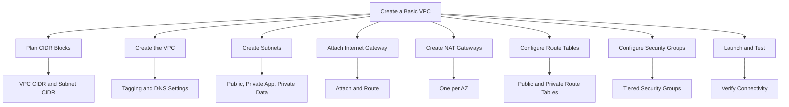
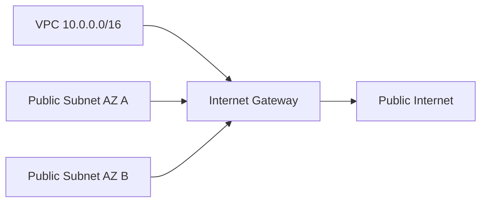

# Migration in progress
# Lesson 4: Creating a Basic VPC Design

This lesson walks through the practical steps of designing and creating a VPC from scratch. It covers CIDR planning, subnet layout, route table configuration, gateway deployment, and security group setup. The goal is to build a working VPC that supports a multi-tier application across multiple Availability Zones.



## Step 1: Plan CIDR Blocks

Before creating anything, plan the IP address space. Poor planning leads to overlapping CIDRs that prevent peering and hybrid connectivity later.

### Planning Checklist

- Choose a VPC CIDR block that does not overlap with on-premises networks or other VPCs.
- Reserve additional ranges for future VPC peering or Transit Gateway attachments.
- Allocate subnets across at least two Availability Zones for high availability.
- Use three subnets per AZ: public, private app, and private data.
- Leave room for growth. Size subnets for 2-3x expected peak usage.

### Example CIDR Plan

| Resource | CIDR Block | Usable IPs | Purpose |
|---|---|---|---|
| VPC | 10.0.0.0/16 | 65,536 | Entire VPC address space |
| Public Subnet AZ A | 10.0.1.0/24 | 251 | Load balancers, NAT gateway |
| Public Subnet AZ B | 10.0.2.0/24 | 251 | Load balancers, NAT gateway |
| Private App Subnet AZ A | 10.0.11.0/24 | 251 | Application servers |
| Private App Subnet AZ B | 10.0.12.0/24 | 251 | Application servers |
| Private Data Subnet AZ A | 10.0.21.0/24 | 251 | Databases, caches |
| Private Data Subnet AZ B | 10.0.22.0/24 | 251 | Databases, caches |

- The /16 VPC CIDR provides 65,536 addresses, leaving ample room for additional subnets.
- Subnets are spaced by 10 in the third octet to leave room for future subnets between tiers.
- Each /24 subnet provides 251 usable addresses after AWS reserves five.

> [!Important]
> **Never use overlapping CIDR blocks**: Overlapping CIDRs prevent VPC peering, Transit Gateway attachments, and VPN connections. Plan the entire IP space before creating any VPC. Retrofitting a non-overlapping plan after deployment is expensive and disruptive.

## Step 2: Create the VPC

Create the VPC with the planned CIDR block and configure DNS settings.

### Console Steps

1. Open the VPC console and choose **Create VPC**.
2. Select **VPC only** (not VPC and more) for full control.
3. Enter a name tag such as `production-vpc`.
4. Enter the IPv4 CIDR block, for example `10.0.0.0/16`.
5. Leave IPv6 disabled unless required.
6. Set tenancy to **Default** unless dedicated hardware is required.
7. Choose **Create VPC**.

### CLI Equivalent

```bash
aws ec2 create-vpc \
  --cidr-block 10.0.0.0/16 \
  --tag-specifications 'ResourceType=vpc,Tags=[{Key=Name,Value=production-vpc}]'
```

### DNS Settings

- Enable DNS hostnames so instances receive public DNS names.
- Enable DNS resolution so the VPC resolver can resolve DNS queries.
- Both settings are required for many AWS services and for private hosted zones.

| Setting | Default VPC | Custom VPC | Recommendation |
|---|---|---|---|
| DNS Resolution | Enabled | Disabled | Enable |
| DNS Hostnames | Enabled | Disabled | Enable if using public DNS names |

> [!Tip]
> **Enable DNS resolution and hostnames from the start**: Disabling them initially and enabling later can cause issues with existing resources. Enable both when you create the VPC.

## Step 3: Create Subnets

Create subnets in each Availability Zone for each tier of the application.

### Subnet Creation Pattern

```bash
# Public subnet in AZ A
aws ec2 create-subnet \
  --vpc-id vpc-0abc123 \
  --cidr-block 10.0.1.0/24 \
  --availability-zone us-east-1a \
  --tag-specifications 'ResourceType=subnet,Tags=[{Key=Name,Value=public-1a}]'

# Private app subnet in AZ A
aws ec2 create-subnet \
  --vpc-id vpc-0abc123 \
  --cidr-block 10.0.11.0/24 \
  --availability-zone us-east-1a \
  --tag-specifications 'ResourceType=subnet,Tags=[{Key=Name,Value=private-app-1a}]'

# Private data subnet in AZ A
aws ec2 create-subnet \
  --vpc-id vpc-0abc123 \
  --cidr-block 10.0.21.0/24 \
  --availability-zone us-east-1a \
  --tag-specifications 'ResourceType=subnet,Tags=[{Key=Name,Value=private-data-1a}]'
```

- Repeat for AZ B with the corresponding CIDR blocks.
- Tag each subnet with its tier and Availability Zone.
- Do not enable auto-assign public IP on private subnets.

### Subnet Configuration

| Setting | Public Subnet | Private Subnet |
|---|---|---|
| Auto-assign Public IP | Enabled (optional) | Disabled |
| Route Table | Public route table | Private route table |
| Network ACL | Default or custom | Default or custom |
| Resources | Load balancers, NAT | App servers, databases |

> [!Tip]
> **Do not auto-assign public IPs on private subnets**: Auto-assigning public IPs on private subnets defeats the purpose of isolation and increases attack surface. Assign public IPs only to resources in public subnets.

## Step 4: Attach an Internet Gateway

Create and attach an internet gateway to the VPC.

```bash
# Create internet gateway
aws ec2 create-internet-gateway \
  --tag-specifications 'ResourceType=internet-gateway,Tags=[{Key=Name,Value=production-igw}]'

# Attach to VPC
aws ec2 attach-internet-gateway \
  --vpc-id vpc-0abc123 \
  --internet-gateway-id igw-0def456
```

- The internet gateway is required for public subnets to reach the internet.
- Only one internet gateway can be attached to a VPC at a time.
- The internet gateway itself is highly available and redundant.



> [!Important]
> **Attaching an IGW does not make subnets public**: You must also add a route to the internet gateway in the subnet route table. Without the route, the subnet remains private even with an attached IGW.

## Step 5: Create NAT Gateways

Create a NAT gateway in each public subnet for outbound access from private subnets.

### NAT Gateway Placement

```bash
# Allocate Elastic IP for NAT gateway in AZ A
aws ec2 allocate-address --domain vpc

# Create NAT gateway in public subnet AZ A
aws ec2 create-nat-gateway \
  --subnet-id subnet-0aaa111 \
  --allocation-id eipalloc-0bbb222 \
  --tag-specifications 'ResourceType=natgateway,Tags=[{Key=Name,Value=nat-1a}]'
```

- Deploy one NAT gateway per Availability Zone for production workloads.
- Each NAT gateway requires an Elastic IP address.
- NAT gateways are AZ-specific. A NAT gateway in AZ A cannot serve AZ B without cross-AZ traffic.
- A single NAT gateway is a single point of failure and incurs cross-AZ data transfer costs.

### NAT Gateway Decision

| Scenario | NAT Gateways | Reason |
|---|---|---|
| Development | One | Cost savings acceptable for non-production |
| Production | One per AZ | Avoid single point of failure and cross-AZ costs |
| Multi-Region | One per AZ per Region | Independent failure domains |

> [!Tip]
> **Deploy one NAT gateway per AZ in production**: Cross-AZ traffic incurs data transfer charges and creates a dependency on another Availability Zone. For production, the cost of additional NAT gateways is justified by resilience and lower data transfer costs.

## Step 6: Configure Route Tables

Create separate route tables for public and private subnets and associate them with the correct subnets.

### Public Route Table

```bash
# Create public route table
aws ec2 create-route-table --vpc-id vpc-0abc123

# Add route to internet gateway
aws ec2 create-route \
  --route-table-id rtb-0aaa111 \
  --destination-cidr-block 0.0.0.0/0 \
  --gateway-id igw-0def456

# Associate public subnets
aws ec2 associate-route-table \
  --route-table-id rtb-0aaa111 \
  --subnet-id subnet-0aaa111
```

### Private Route Table

```bash
# Create private route table for AZ A
aws ec2 create-route-table --vpc-id vpc-0abc123

# Add route to NAT gateway in AZ A
aws ec2 create-route \
  --route-table-id rtb-0bbb222 \
  --destination-cidr-block 0.0.0.0/0 \
  --nat-gateway-id nat-0ccc333

# Associate private subnets in AZ A
aws ec2 associate-route-table \
  --route-table-id rtb-0bbb222 \
  --subnet-id subnet-0bbb222
```

### Route Table Summary

| Route Table | Destination | Target | Associated Subnets |
|---|---|---|---|
| Public | 10.0.0.0/16 | local | Public subnets |
| Public | 0.0.0.0/0 | igw-xxxx | Public subnets |
| Private AZ A | 10.0.0.0/16 | local | Private app and data subnets in AZ A |
| Private AZ A | 0.0.0.0/0 | nat-1a | Private app subnets 