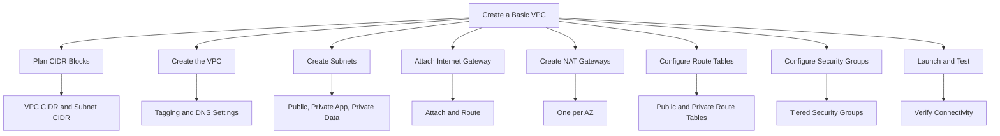
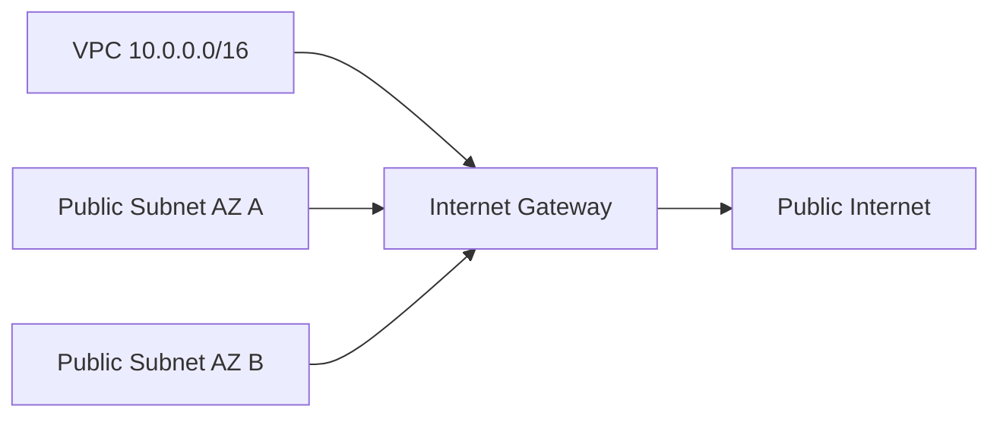
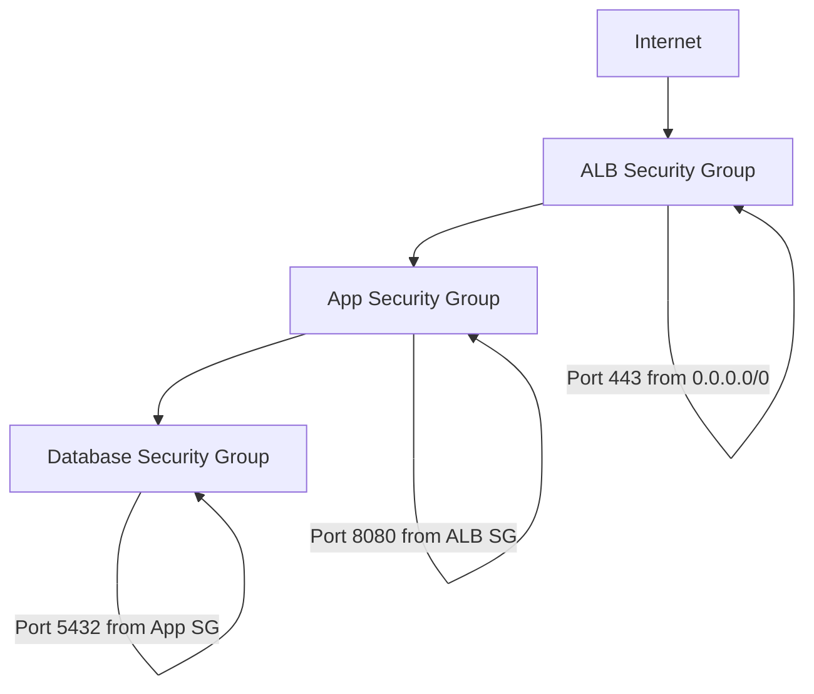
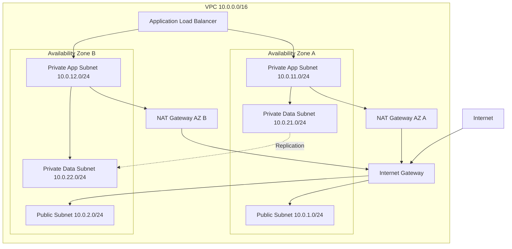

# Lesson 4: Creating a Basic VPC Design

This lesson walks through the practical steps of designing and creating a VPC from scratch. It covers CIDR planning, subnet layout, route table configuration, gateway deployment, and security group setup. The goal is to build a working VPC that supports a multi-tier application across multiple Availability Zones.



## Step 1: Plan CIDR Blocks

Before creating anything, plan the IP address space. Poor planning leads to overlapping CIDRs that prevent peering and hybrid connectivity later.

### Planning Checklist

- Choose a VPC CIDR block that does not overlap with on-premises networks or other VPCs.
- Reserve additional ranges for future VPC peering or Transit Gateway attachments.
- Allocate subnets across at least two Availability Zones for high availability.
- Use three subnets per AZ: public, private app, and private data.
- Leave room for growth. Size subnets for 2-3x expected peak usage.

### Example CIDR Plan

| Resource | CIDR Block | Usable IPs | Purpose |
|---|---|---|---|
| VPC | 10.0.0.0/16 | 65,536 | Entire VPC address space |
| Public Subnet AZ A | 10.0.1.0/24 | 251 | Load balancers, NAT gateway |
| Public Subnet AZ B | 10.0.2.0/24 | 251 | Load balancers, NAT gateway |
| Private App Subnet AZ A | 10.0.11.0/24 | 251 | Application servers |
| Private App Subnet AZ B | 10.0.12.0/24 | 251 | Application servers |
| Private Data Subnet AZ A | 10.0.21.0/24 | 251 | Databases, caches |
| Private Data Subnet AZ B | 10.0.22.0/24 | 251 | Databases, caches |

- The /16 VPC CIDR provides 65,536 addresses, leaving ample room for additional subnets.
- Subnets are spaced by 10 in the third octet to leave room for future subnets between tiers.
- Each /24 subnet provides 251 usable addresses after AWS reserves five.

> [!Important]
> **Never use overlapping CIDR blocks**: Overlapping CIDRs prevent VPC peering, Transit Gateway attachments, and VPN connections. Plan the entire IP space before creating any VPC. Retrofitting a non-overlapping plan after deployment is expensive and disruptive.

## Step 2: Create the VPC

Create the VPC with the planned CIDR block and configure DNS settings.

### Console Steps

1. Open the VPC console and choose **Create VPC**.
2. Select **VPC only** (not VPC and more) for full control.
3. Enter a name tag such as `production-vpc`.
4. Enter the IPv4 CIDR block, for example `10.0.0.0/16`.
5. Leave IPv6 disabled unless required.
6. Set tenancy to **Default** unless dedicated hardware is required.
7. Choose **Create VPC**.

### CLI Equivalent

```bash
aws ec2 create-vpc \
  --cidr-block 10.0.0.0/16 \
  --tag-specifications 'ResourceType=vpc,Tags=[{Key=Name,Value=production-vpc}]'
```

### DNS Settings

- Enable DNS hostnames so instances receive public DNS names.
- Enable DNS resolution so the VPC resolver can resolve DNS queries.
- Both settings are required for many AWS services and for private hosted zones.

| Setting | Default VPC | Custom VPC | Recommendation |
|---|---|---|---|
| DNS Resolution | Enabled | Disabled | Enable |
| DNS Hostnames | Enabled | Disabled | Enable if using public DNS names |

> [!Tip]
> **Enable DNS resolution and hostnames from the start**: Disabling them initially and enabling later can cause issues with existing resources. Enable both when you create the VPC.

## Step 3: Create Subnets

Create subnets in each Availability Zone for each tier of the application.

### Subnet Creation Pattern

```bash
# Public subnet in AZ A
aws ec2 create-subnet \
  --vpc-id vpc-0abc123 \
  --cidr-block 10.0.1.0/24 \
  --availability-zone us-east-1a \
  --tag-specifications 'ResourceType=subnet,Tags=[{Key=Name,Value=public-1a}]'

# Private app subnet in AZ A
aws ec2 create-subnet \
  --vpc-id vpc-0abc123 \
  --cidr-block 10.0.11.0/24 \
  --availability-zone us-east-1a \
  --tag-specifications 'ResourceType=subnet,Tags=[{Key=Name,Value=private-app-1a}]'

# Private data subnet in AZ A
aws ec2 create-subnet \
  --vpc-id vpc-0abc123 \
  --cidr-block 10.0.21.0/24 \
  --availability-zone us-east-1a \
  --tag-specifications 'ResourceType=subnet,Tags=[{Key=Name,Value=private-data-1a}]'
```

- Repeat for AZ B with the corresponding CIDR blocks.
- Tag each subnet with its tier and Availability Zone.
- Do not enable auto-assign public IP on private subnets.

### Subnet Configuration

| Setting | Public Subnet | Private Subnet |
|---|---|---|
| Auto-assign Public IP | Enabled (optional) | Disabled |
| Route Table | Public route table | Private route table |
| Network ACL | Default or custom | Default or custom |
| Resources | Load balancers, NAT | App servers, databases |

> [!Tip]
> **Do not auto-assign public IPs on private subnets**: Auto-assigning public IPs on private subnets defeats the purpose of isolation and increases attack surface. Assign public IPs only to resources in public subnets.

## Step 4: Attach an Internet Gateway

Create and attach an internet gateway to the VPC.

```bash
# Create internet gateway
aws ec2 create-internet-gateway \
  --tag-specifications 'ResourceType=internet-gateway,Tags=[{Key=Name,Value=production-igw}]'

# Attach to VPC
aws ec2 attach-internet-gateway \
  --vpc-id vpc-0abc123 \
  --internet-gateway-id igw-0def456
```

- The internet gateway is required for public subnets to reach the internet.
- Only one internet gateway can be attached to a VPC at a time.
- The internet gateway itself is highly available and redundant.



> [!Important]
> **Attaching an IGW does not make subnets public**: You must also add a route to the internet gateway in the subnet route table. Without the route, the subnet remains private even with an attached IGW.

## Step 5: Create NAT Gateways

Create a NAT gateway in each public subnet for outbound access from private subnets.

### NAT Gateway Placement

```bash
# Allocate Elastic IP for NAT gateway in AZ A
aws ec2 allocate-address --domain vpc

# Create NAT gateway in public subnet AZ A
aws ec2 create-nat-gateway \
  --subnet-id subnet-0aaa111 \
  --allocation-id eipalloc-0bbb222 \
  --tag-specifications 'ResourceType=natgateway,Tags=[{Key=Name,Value=nat-1a}]'
```

- Deploy one NAT gateway per Availability Zone for production workloads.
- Each NAT gateway requires an Elastic IP address.
- NAT gateways are AZ-specific. A NAT gateway in AZ A cannot serve AZ B without cross-AZ traffic.
- A single NAT gateway is a single point of failure and incurs cross-AZ data transfer costs.

### NAT Gateway Decision

| Scenario | NAT Gateways | Reason |
|---|---|---|
| Development | One | Cost savings acceptable for non-production |
| Production | One per AZ | Avoid single point of failure and cross-AZ costs |
| Multi-Region | One per AZ per Region | Independent failure domains |

> [!Tip]
> **Deploy one NAT gateway per AZ in production**: Cross-AZ traffic incurs data transfer charges and creates a dependency on another Availability Zone. For production, the cost of additional NAT gateways is justified by resilience and lower data transfer costs.

## Step 6: Configure Route Tables

Create separate route tables for public and private subnets and associate them with the correct subnets.

### Public Route Table

```bash
# Create public route table
aws ec2 create-route-table --vpc-id vpc-0abc123

# Add route to internet gateway
aws ec2 create-route \
  --route-table-id rtb-0aaa111 \
  --destination-cidr-block 0.0.0.0/0 \
  --gateway-id igw-0def456

# Associate public subnets
aws ec2 associate-route-table \
  --route-table-id rtb-0aaa111 \
  --subnet-id subnet-0aaa111
```

### Private Route Table

```bash
# Create private route table for AZ A
aws ec2 create-route-table --vpc-id vpc-0abc123

# Add route to NAT gateway in AZ A
aws ec2 create-route \
  --route-table-id rtb-0bbb222 \
  --destination-cidr-block 0.0.0.0/0 \
  --nat-gateway-id nat-0ccc333

# Associate private subnets in AZ A
aws ec2 associate-route-table \
  --route-table-id rtb-0bbb222 \
  --subnet-id subnet-0bbb222
```

### Route Table Summary

| Route Table | Destination | Target | Associated Subnets |
|---|---|---|---|
| Public | 10.0.0.0/16 | local | Public subnets |
| Public | 0.0.0.0/0 | igw-xxxx | Public subnets |
| Private AZ A | 10.0.0.0/16 | local | Private app and data subnets in AZ A |
| Private AZ A | 0.0.0.0/0 | nat-1a | Private app subnets in AZ A |
| Private AZ B | 10.0.0.0/16 | local | Private app and data subnets in AZ B |
| Private AZ B | 0.0.0.0/0 | nat-1b | Private app subnets in AZ B |
| Private Data | 10.0.0.0/16 | local | Private data subnets (no internet route) |

> [!Important]
> **Private data subnets should have no default route**: Databases and other sensitive resources do not need outbound internet access. Omitting the default route eliminates a potential exfiltration path.

## Step 7: Configure Security Groups

Create security groups for each tier of the application. Reference other security groups instead of CIDR blocks where possible.

### Security Group Design

| Security Group | Inbound Rules | Outbound Rules |
|---|---|---|
| ALB SG | HTTPS 443 from 0.0.0.0/0 | App SG on application port |
| App SG | Application port from ALB SG | Database SG on database port |
| Database SG | Database port from App SG | None (or restricted) |
| Bastion SG | SSH 22 from corporate CIDR | App SG on SSH port |

### Example: Application Security Group

```bash
# Create application security group
aws ec2 create-security-group \
  --group-name app-sg \
  --description "Application tier security group" \
  --vpc-id vpc-0abc123

# Allow inbound from ALB security group
aws ec2 authorize-security-group-ingress \
  --group-id sg-0app123 \
  --protocol tcp \
  --port 8080 \
  --source-group sg-0alb456
```

- Reference security groups instead of CIDR blocks to automatically adjust when instances scale.
- Use separate security groups for each tier to enforce least privilege.
- Avoid using the default security group for production resources.



> [!Tip]
> **Reference security groups by ID, not CIDR**: Security group references automatically adapt as instances are added or removed. This reduces maintenance and prevents accidental exposure.

## Step 8: Launch and Test

After creating the VPC, subnets, gateways, route tables, and security groups, launch resources and verify connectivity.

### Test Checklist

| Test | Expected Result | Verification Method |
|---|---|---|
| Public subnet internet access | Instance reaches internet | Ping or curl from instance |
| Private subnet outbound access | Instance reaches internet via NAT | Curl from instance |
| Private subnet inbound blocked | No inbound connection from internet | Attempt connection from external host |
| Inter-tier communication | App reaches database | Application connection test |
| Route table correctness | Traffic takes expected path | VPC Reachability Analyzer |
| Security group enforcement | Blocked ports are denied | Test from unauthorized source |

### Verification Tools

- VPC Reachability Analyzer: tests connectivity between resources without generating traffic.
- VPC Flow Logs: captures IP traffic metadata for analysis.
- EC2 Instance Connect or Session Manager: provides shell access for testing.
- CloudWatch: monitors metrics and logs.

> [!Important]
> **Test before deploying production workloads**: Verify that each tier can reach only what it needs and nothing more. Use Reachability Analyzer to confirm expected paths and Flow Logs to detect unexpected traffic.

## Complete VPC Architecture



## Common Design Mistakes

| Mistake | Consequence | Prevention |
|---|---|---|
| Overlapping CIDR blocks | Cannot peer or connect to on-premises | Plan IP space before creating VPCs |
| Single NAT gateway | Single point of failure and cross-AZ costs | Deploy one NAT gateway per AZ |
| Public IPs on private instances | Increased attack surface | Disable auto-assign public IP on private subnets |
| Default security group in use | Overly permissive rules | Create purpose-built security groups |
| No Flow Logs | No visibility into traffic | Enable Flow Logs from the start |
| Hardcoded IPs in security groups | Fragile and hard to maintain | Reference security groups by ID |
| No tagging strategy | Difficult cost allocation and auditing | Tag every resource with environment, owner, purpose |
| Manual VPC creation | Inconsistent and error-prone | Automate with Terraform or CloudFormation |

> [!Tip]
> **Automate VPC creation with infrastructure as code**: Terraform and CloudFormation ensure consistency, enable version control, and support repeatable deployments. Manual VPC configuration is error-prone and difficult to audit.

## Assessment Preparation

### Practice Questions

1. Describe the steps to create a VPC from scratch.
2. Explain why CIDR planning must happen before creating any resources.
3. Describe the subnet layout for a three-tier application across two AZs.
4. Explain how to configure route tables for public and private subnets.
5. Describe why private data subnets should have no default route.
6. Explain how to design security groups for a three-tier application.
7. List five common VPC design mistakes and their prevention.
8. Describe how to test VPC connectivity after creation.

### Scenario Questions

**Scenario 1: Three-Tier Web Application**
A company is deploying a three-tier web application with high availability requirements. Design the VPC.

- Create a VPC with a /16 CIDR block such as 10.0.0.0/16.
- Deploy public subnets in two AZs for load balancers and NAT gateways.
- Deploy private app subnets in two AZs for application servers.
- Deploy private data subnets in two AZs for databases with no internet route.
- Use security groups that reference each other rather than CIDR blocks.
- Deploy one NAT gateway per AZ for outbound access from private app subnets.

**Scenario 2: Cost-Optimized Development VPC**
A startup needs a development VPC with minimal cost. How should they design it?

- Use a /16 VPC CIDR block.
- Deploy public subnets in two AZs.
- Deploy private subnets in two AZs.
- Use a single NAT gateway instead of one per AZ to save cost.
- Accept the single point of failure for non-production workloads.
- Tag resources for cost tracking.

**Scenario 3: Regulated Workload with Strict Isolation**
A financial services firm needs strict network isolation for a database tier. How should they design it?

- Place databases in isolated subnets with no route to an internet gateway or NAT gateway.
- Use security groups that allow traffic only from the application tier security group.
- Use VPC endpoints for access to AWS services such as S3 and KMS.
- Enable VPC Flow Logs and traffic mirroring for monitoring.
- Document the traffic flows and audit regularly.

## Key Takeaways

- Plan CIDR blocks before creating any VPC. Avoid overlaps with on-premises networks and other VPCs.
- Create a VPC with a /16 CIDR block for ample address space.
- Deploy subnets across at least two Availability Zones for high availability.
- Use three subnets per AZ: public, private app, and private data.
- Attach an internet gateway for public subnet internet access.
- Deploy one NAT gateway per AZ in production for outbound access from private subnets.
- Create separate route tables for public and private subnets. Private data subnets have no default route.
- Design security groups per tier. Reference other security groups instead of CIDR blocks.
- Test connectivity with Reachability Analyzer and VPC Flow Logs before deploying production workloads.
- Avoid common mistakes: overlapping CIDRs, single NAT gateways, public IPs on private instances, and manual configuration.
- Automate VPC creation with Terraform or CloudFormation for consistency and auditability.
- Tag every resource with environment, owner, and purpose.

> [!Important]
> **Design the VPC as a foundation, not an afterthought**: The VPC is the network foundation for every workload. A well-designed VPC supports security, availability, and cost optimization. A poorly designed VPC is difficult to change and creates technical debt. Plan IP space, subnet layout, routing, and security controls before launching production resources. Automate deployment with infrastructure as code and validate connectivity with testing tools.
