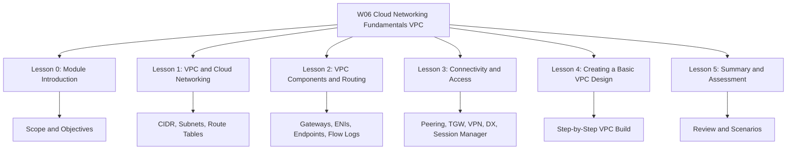
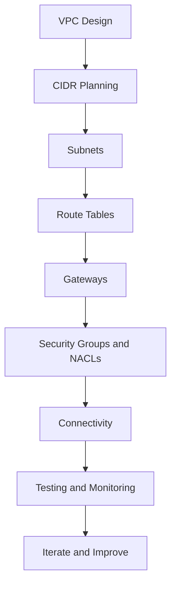
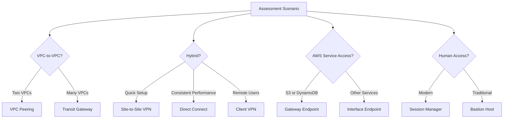

# W06: Cloud Networking Fundamentals (VPC) - Lesson 5: Summary and Assessment

This module covers Amazon Virtual Private Cloud (VPC), the networking foundation of AWS. It spans IP addressing, subnets, route tables, gateways, security controls, connectivity options, and practical VPC design. The goal is to understand how to build secure, scalable, and highly available networks for cloud workloads.

## Lesson 0: Module Introduction Summary

- VPC is the isolated network boundary for AWS resources.
- The module covers IP addressing, subnets, routing, gateways, security, and connectivity.
- Learning objectives include CIDR planning, subnet design, route table configuration, security group vs NACL comparison, and connectivity selection.
- The module builds on W02 architecture, W03 provider comparison, W04 AWS foundations, and W05 compute services.

> [!Important]
> **Design the VPC before deploying workloads**: A poorly designed VPC is difficult and expensive to change. Plan IP space, subnet layout, routing, and security controls first.

## Lesson 1: VPC and Cloud Networking Summary

*Definition*: A VPC is a logically isolated virtual network dedicated to your AWS account. You control IP addressing, subnets, routing, and security.

### Key Concepts

| Concept | Description |
|---|---|
| CIDR Block | IP address range for the VPC (e.g., 10.0.0.0/16) |
| Subnet | AZ-specific IP range within the VPC |
| Public Subnet | Route to an internet gateway |
| Private Subnet | Route to a NAT gateway for outbound only |
| Isolated Subnet | No route to the internet |
| Route Table | Rules that direct traffic from subnets |
| Internet Gateway | Connects public subnets to the internet |
| NAT Gateway | Enables outbound-only access for private subnets |
| Security Group | Stateful, instance-level firewall |
| Network ACL | Stateless, subnet-level firewall |

- VPCs do not span Regions. Cross-Region connectivity requires peering or VPN.
- AWS reserves five IP addresses per subnet.
- Route tables use longest prefix match. The local route for the VPC CIDR cannot be removed.
- Security groups are allow-only and stateful. NACLs support allow and deny and are stateless.

> [!Tip]
> **Plan your IP space for growth**: Start with a /16 VPC CIDR block and reserve ranges for future peering or hybrid connections.

## Lesson 2: VPC Components and Routing Summary

This lesson dives deeper into the components that make up a VPC and how traffic flows.

### Subnet Types

| Subnet Type | Internet Access | Typical Resources |
|---|---|---|
| Public | Inbound and outbound via IGW | Load balancers, NAT gateways, bastion hosts |
| Private App | Outbound only via NAT | EC2, containers, Lambda |
| Private Data | None | RDS, Aurora, ElastiCache |
| Isolated | None | Highly sensitive databases |

### Gateways

| Gateway | Direction | Scope | Use Case |
|---|---|---|---|
| Internet Gateway | Bidirectional | VPC | Public subnet internet access |
| NAT Gateway | Outbound only | AZ | Private subnet outbound access |
| Egress-Only IGW | Outbound only | VPC | IPv6 outbound access |
| Virtual Private Gateway | Bidirectional | VPC | Site-to-Site VPN |
| Transit Gateway | Bidirectional | Regional | Multi-VPC and hybrid hub |

### Elastic Network Interfaces (ENIs)

- ENIs are virtual network cards. Every EC2 instance has at least one.
- ENIs are AZ-specific and can be moved between instances in the same AZ for failover.
- ENIs preserve private IP, Elastic IP, and MAC address during failover.

### VPC Endpoints

| Endpoint Type | Services | Cost | Route Table Target |
|---|---|---|---|
| Gateway Endpoint | S3, DynamoDB | Free | Yes |
| Interface Endpoint | Most AWS services | Hourly + data | No (uses ENI) |
| GWLB Endpoint | Third-party appliances | Hourly + data | No (uses GWLB) |

### VPC Flow Logs and Traffic Mirroring

| Feature | VPC Flow Logs | Traffic Mirroring |
|---|---|---|
| Data Captured | Flow metadata | Full packet content |
| Use Case | Monitoring, troubleshooting | Deep inspection, security forensics |
| Cost | Lower | Higher |

> [!Important]
> **Most connectivity issues are caused by security groups or NACLs**: Check those first before investigating routes or gateways.

## Lesson 3: Connectivity and Access Summary

This lesson covers how VPCs connect to each other, to on-premises networks, and to AWS services, plus how humans and services access resources.

### VPC-to-VPC Connectivity

| Option | Transitive | Scale | Use Case |
|---|---|---|---|
| VPC Peering | No | Two VPCs | Simple direct connectivity |
| Transit Gateway | Yes | Thousands of VPCs | Hub-and-spoke, multi-account |
| VPC Sharing | N/A | Same Organization | Central network management |

### Hybrid Connectivity

| Option | Connection | Latency | Bandwidth | Setup Time |
|---|---|---|---|---|
| Site-to-Site VPN | Public internet | Variable | Up to 1.25 Gbps | Minutes to hours |
| Direct Connect | Dedicated private | Consistent | 1 Gbps to 100 Gbps | Weeks to months |
| Client VPN | Public internet | Variable | Scales automatically | Minutes |

- Direct Connect does not encrypt traffic by default. Use MACsec or a VPN overlay if encryption is required.
- Use Direct Connect as primary and VPN as backup for resilient hybrid connectivity.

### AWS Service Access

- Gateway endpoints for S3 and DynamoDB are free and eliminate NAT data processing charges.
- Interface endpoints use PrivateLink for most other AWS services.
- Endpoint policies restrict what can be accessed through an endpoint. Combine with IAM policies.

### Human Access

| Method | Ports Required | Key Management | Auditing |
|---|---|---|---|
| SSH/RDP | 22 or 3389 | Yes | Manual |
| Bastion Host | 22 or 3389 | Yes | Manual |
| Session Manager | None | No | Automatic |
| Client VPN | 443 | Certificate or AD | Automatic |

> [!Tip]
> **Use Session Manager instead of bastion hosts**: It eliminates open inbound ports, removes key management, and provides automatic auditing.

## Lesson 4: Creating a Basic VPC Design Summary

This lesson walks through the practical steps of building a VPC from scratch.

### Step-by-Step Process

1. Plan CIDR blocks. Avoid overlaps. Reserve space for growth.
2. Create the VPC with a /16 CIDR block. Enable DNS resolution and hostnames.
3. Create subnets across at least two AZs: public, private app, private data.
4. Attach an internet gateway to the VPC.
5. Create NAT gateways in each public subnet for outbound access.
6. Configure route tables: public routes to IGW, private routes to NAT, data subnets have no default route.
7. Configure security groups per tier. Reference other security groups by ID.
8. Launch and test. Use Reachability Analyzer and VPC Flow Logs.

### Example CIDR Plan

| Resource | CIDR Block | Purpose |
|---|---|---|
| VPC | 10.0.0.0/16 | Entire VPC |
| Public Subnet AZ A | 10.0.1.0/24 | Load balancers, NAT |
| Public Subnet AZ B | 10.0.2.0/24 | Load balancers, NAT |
| Private App Subnet AZ A | 10.0.11.0/24 | Application servers |
| Private App Subnet AZ B | 10.0.12.0/24 | Application servers |
| Private Data Subnet AZ A | 10.0.21.0/24 | Databases |
| Private Data Subnet AZ B | 10.0.22.0/24 | Databases |

### Common Mistakes

| Mistake | Consequence | Prevention |
|---|---|---|
| Overlapping CIDRs | Cannot peer or connect on-premises | Plan IP space first |
| Single NAT gateway | Single point of failure, cross-AZ costs | One NAT per AZ |
| Public IPs on private instances | Increased attack surface | Disable auto-assign on private subnets |
| Default security group | Overly permissive | Create purpose-built groups |
| No Flow Logs | No visibility | Enable from the start |
| Manual creation | Inconsistent, error-prone | Automate with IaC |

> [!Important]
> **Automate VPC deployment with infrastructure as code**: Terraform or CloudFormation ensures consistency, version control, and repeatable deployments.

## Integrated View

- VPC design starts with IP planning and ends with testing and monitoring.
- Each layer builds on the previous one.
- Security and connectivity are intertwined.
- Automation and documentation are essential.

## Assessment Preparation

### Practice Questions

1. Define a VPC and explain why it is the networking foundation of AWS.
2. Describe how CIDR blocks define VPC and subnet IP ranges.
3. Explain the difference between a public subnet and a private subnet.
4. Describe how route tables control traffic flow in a VPC.
5. Compare internet gateways and NAT gateways.
6. Compare security groups and network ACLs across at least five dimensions.
7. Explain the purpose of VPC peering, Transit Gateway, VPN, and Direct Connect.
8. List five VPC design best practices.
9. Explain why NAT gateways should be deployed in each Availability Zone.
10. Describe the difference between inbound and outbound security group rules.
11. Compare gateway endpoints and interface endpoints.
12. Explain the purpose of endpoint policies.
13. Compare bastion hosts and Session Manager for human access.
14. Describe the steps to create a VPC from scratch.
15. List five common VPC design mistakes and their prevention.

### Scenario Questions

**Scenario 1: Three-Tier Web Application**
A company is deploying a three-tier web application (web, app, database) with high availability requirements. Design the VPC.

- Create a VPC with a /16 CIDR block.
- Deploy public subnets in two AZs for load balancers and NAT gateways.
- Deploy private app subnets in two AZs for application servers.
- Deploy private data subnets in two AZs for databases with no internet route.
- Use security groups that reference each other.
- Deploy one NAT gateway per AZ.

**Scenario 2: Multi-VPC Connectivity**
A company has five VPCs across two AWS accounts and needs to connect them all with segmentation between production and development.

- Use AWS Transit Gateway as a central hub.
- Attach all VPCs to the Transit Gateway.
- Create separate route tables for production and development.
- Use AWS RAM to share the Transit Gateway across accounts.
- Connect on-premises networks via VPN or Direct Connect.

**Scenario 3: Hybrid Cloud with On-Premises**
A company needs consistent low-latency connectivity between its data center and AWS for large data transfers.

- Use AWS Direct Connect for dedicated private connectivity.
- Combine with Site-to-Site VPN for backup and encryption.
- Use Transit Gateway to connect multiple VPCs to the on-premises network.
- Deploy redundant Direct Connect connections for high availability.

**Scenario 4: Private S3 Access**
A private subnet needs to access S3 without going through a NAT gateway.

- Create a gateway endpoint for S3.
- Add the endpoint as a target in the private subnet route table.
- Gateway endpoints are free and eliminate NAT data processing charges.
- Verify that the S3 bucket policy allows access from the VPC endpoint.

**Scenario 5: Securing a Database Tier**
A database cluster must not be accessible from the internet.

- Place the database in a private data subnet with no route to an internet gateway.
- Use a security group that allows traffic only from the application tier security group.
- Do not assign public IP addresses.
- Use network ACLs as a secondary guardrail.
- Enable VPC Flow Logs for monitoring.

## Key Takeaways

- A VPC is a logically isolated virtual network in AWS. You control IP addressing, subnets, routing, and security.
- VPCs do not span Regions. Resources in different Regions need peering or VPN.
- CIDR blocks define the IP address range of your VPC. Plan for growth and avoid overlaps.
- Subnets are AZ-specific IP ranges. Public subnets have a route to an internet gateway. Private subnets use NAT gateways for outbound access.
- Route tables control traffic flow. Each subnet is associated with one route table. Longest prefix match determines routing.
- An internet gateway connects a VPC to the internet. A NAT gateway enables outbound-only access for private subnets. Deploy one NAT gateway per AZ in production.
- Security groups are stateful, instance-level firewalls with allow-only rules. Network ACLs are stateless, subnet-level firewalls with allow and deny rules.
- VPC peering connects two VPCs directly. Transit Gateway connects many VPCs and on-premises networks through a central hub.
- VPN uses the public internet for hybrid connectivity. Direct Connect provides a dedicated private connection. Use both for resilient hybrid connectivity.
- Gateway endpoints provide free private access to S3 and DynamoDB. Interface endpoints use PrivateLink for other AWS services.
- Session Manager provides secure, auditable access to EC2 instances without open inbound ports or bastion hosts.
- Best practices include non-overlapping IP plans, multi-AZ subnet design, security groups as primary controls, VPC endpoints, and automation.
- Design the VPC before deploying workloads. Automate deployment with infrastructure as code.
- Test connectivity with Reachability Analyzer and VPC Flow Logs before production.
- Common mistakes include overlapping CIDRs, single NAT gateways, public IPs on private instances, and manual configuration.

> [!Important]
> **Design your VPC as a foundation, not an afterthought**: The VPC is the network foundation for every workload. A well-designed VPC supports security, availability, and cost optimization. A poorly designed VPC is difficult to change and creates technical debt. Plan IP space, subnet layout, routing, and security controls before launching production resources. Automate deployment with infrastructure as code and validate connectivity with testing tools.
