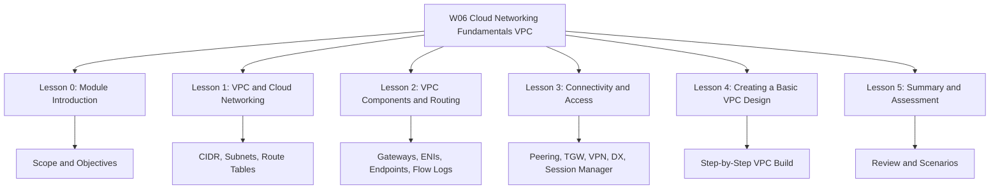

# Migration in progress
# W06: Cloud Networking Fundamentals (VPC) - Lesson 5: Summary and Assessment

This module covers Amazon Virtual Private Cloud (VPC), the networking foundation of AWS. It spans IP addressing, subnets, route tables, gateways, security controls, connectivity options, and practical VPC design. The goal is to understand how to build secure, scalable, and highly available networks for cloud workloads.

## Lesson 0: Module Introduction Summary

- VPC is the isolated network boundary for AWS resources.
- The module covers IP addressing, subnets, routing, gateways, security, and connectivity.
- Learning objectives include CIDR planning, subnet design, route table configuration, security group vs NACL comparison, and connectivity selection.
- The module builds on W02 architecture, W03 provider comparison, W04 AWS foundations, and W05 compute services.

> [!Important]
> **Design the VPC before deploying workloads**: A poorly designed VPC is difficult and expensive to change. Plan IP space, subnet layout, routing, and security controls first.

## Lesson 1: VPC and Cloud Networking Summary

*Definition*: A VPC is a logically isolated virtual network dedicated to your AWS account. You control IP addressing, subnets, routing, and security.

### Key Concepts

| Concept | Description |
|---|---|
| CIDR Block | IP address range for the VPC (e.g., 10.0.0.0/16) |
| Subnet | AZ-specific IP range within the VPC |
| Public Subnet | Route to an internet gateway |
| Private Subnet | Route to a NAT gateway for outbound only |
| Isolated Subnet | No route to the internet |
| Route Table | Rules that direct traffic from subnets |
| Internet Gateway | Connects public subnets to the internet |
| NAT Gateway | Enables outbound-only access for private subnets |
| Security Group | Stateful, instance-level firewall |
| Network ACL | Stateless, subnet-level firewall |

- VPCs do not span Regions. Cross-Region connectivity requires peering or VPN.
- AWS reserves five IP addresses per subnet.
- Route tables use longest prefix match. The local route for the VPC CIDR cannot be removed.
- Security groups are allow-only and stateful. NACLs support allow and deny and are stateless.

> [!Tip]
> **Plan your IP space for growth**: Start with a /16 VPC CIDR block and reserve ranges for future peering or hybrid connections.

## Lesson 2: VPC Components and Routing Summary

This lesson dives deeper into the components that make up a VPC and how traffic flows.

### Subnet Types

| Subnet Type | Internet Access | Typical Resources |
|---|---|---|
| Public | Inbound and outbound via IGW | Load balancers, NAT gateways, bastion hosts |
| Private App | Outbound only via NAT | EC2, containers, Lambda |
| Private Data | None | RDS, Aurora, ElastiCache |
| Isolated | None | Highly sensitive databases |

### Gateways

| Gateway | Direction | Scope | Use Case |
|---|---|---|---|
| Internet Gateway | Bidirectional | VPC | Public subnet internet access |
| NAT Gateway | Outbound only | AZ | Private subnet outbound access |
| Egress-Only IGW | Outbound only | VPC | IPv6 outbound access |
| Virtual Private Gateway | Bidirectional | VPC | Site-to-Site VPN |
| Transit Gateway | Bidirectional | Regional | Multi-VPC and hybrid hub |

### Elastic Network Interfaces (ENIs)

- ENIs are virtual network cards. Every EC2 instance has at least one.
- ENIs are AZ-specific and can be moved between instances in the same AZ for failover.
- ENIs preserve private IP, Elastic IP, and MAC address during failover.

### VPC Endpoints

| Endpoint Type | Services | Cost | Route Table Target |
|---|---|---|---|
| Gateway Endpoint | S3, DynamoDB | Free | Yes |
| Interface Endpoint | Most AWS services | Hourly + data | No (uses ENI) |
| GWLB Endpoint | Third-party appliances | Hourly + data | No (uses GWLB) |

### VPC Flow Logs and Traffic Mirroring

| Feature | VPC Flow Logs | Traffic Mirroring |
|---|---|---|
| Data Captured | Flow metadata | Full packet content |
| Use Case | Monitoring, troubleshooting | Deep inspection, security forensics |
| Cost | Lower | Higher |

> [!Important]
> **Most connectivity issues are caused by security groups or NACLs**: Check those first before investigating routes or gateways.

## Lesson 3: Connectivity and Access Summary

This lesson covers how VPCs connect to each other, to on-premises networks, and to AWS services, plus how humans and services access resources.

### VPC-to-VPC Connectivity

| Option | Transitive | Scale | Use Case |
|---|---|---|---|
| VPC Peering | No | Two VPCs | Simple direct connectivity |
| Transit Gateway | Yes | Thousands of VPCs | Hub-and-spoke, multi-account |
| VPC Sharing | N/A | Same Organization | Central network management |

### Hybrid Connectivity

| Option | Connection | Latency | Bandwidth | Setup Time |
|---|---|---|---|---|
| Site-to-Site VPN | Public internet | Variable | Up to 1.25 Gbps | Minutes to hours |
| Direct Connect | Dedicated private | Consistent | 1 Gbps to 100 Gbps | Weeks to months |
| Client VPN | Public internet | Variable | Scales automatically | Minutes |

- Direct Connect does not encrypt traffic by default. Use MACsec or a VPN overlay if encryption is required.
- Use Direct Connect as primary and VPN as backup for resilient hybrid connectivity.

### AWS Service Access

- Gateway endpoints for S3 and DynamoDB are free and eliminate NAT data processing charges.
- Interface endpoints use PrivateLink for most other AWS services.
- Endpoint policies restrict what can be accessed through an endpoint. Combine with IAM policies.

### Human Access

| Method | Ports Required | Key Management | Auditing |
|---|---|---|---|
| SSH/RDP | 22 or 3389 | Yes | Manual |
| Bastion Host | 22 or 3389 | Yes | Manual |
| Session Manager | None | No | Automatic |
| Client VPN | 443 | Certificate or AD | Automatic |

> [!Tip]
> **Use Session Manager instead of bastion hosts**: It eliminates open inbound ports, removes key management, and provides automatic auditing.

## Lesson 4: Creating a Basic VPC Design Summary

This lesson walks through the practical steps of building a VPC from scratch.

### Step-by-Step Process

1. Plan CIDR blocks. Avoid overlaps. Reserve space for growth.
2. Create the VPC with a /16 CIDR block. Enable DNS resolution and hostnames.
3. Create subnets across at least two AZs: public, private app, private data.
4. Attach an internet gateway to the VPC.
5. Create NAT gateways in each public subnet for outbound access.
6. Configure route tables: public routes to IGW, private routes to NAT, data subnets have no default route.
7. Configure security groups per tier. Reference other security groups by ID.
8. Launch and test. Use Reachability Analyzer and VPC Flow Logs.

### Example CIDR Plan

| Resource | CIDR Block | Purpose |
|---|---|---|
| VPC | 10.0.0.0/16 | Entire VPC |
| Public Subnet AZ A | 10.0.1.0/24 | Load balancers, NAT |
| Public Sub