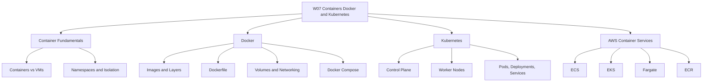

# Migration in progress
## W07: Containers - Docker and Kubernetes

### Lesson 0: Module Introduction

Initial directory setup.

## Overview

This module introduces containerization, Docker, Kubernetes, and the AWS container services that run them. It covers how containers differ from virtual machines, how Docker packages applications, how Kubernetes orchestrates containers at scale, and how to choose between Amazon ECS, Amazon EKS, and AWS Fargate.

The goal is to build the knowledge needed to deploy and manage containerized workloads on AWS.

## Module Purpose

- Explain the fundamentals of containerization and how containers differ from virtual machines.
- Describe how Docker builds, packages, and runs containerized applications.
- Introduce Kubernetes as a container orchestration platform.
- Map container concepts to AWS services: ECS, EKS, Fargate, and ECR.
- Provide a decision framework for choosing the right container platform.
- Prepare for hands-on labs and scenario-based assessment.

## Learning Objectives

- Define containerization and explain how it differs from virtualization.
- Describe the components of Docker's client-server architecture.
- Explain how Docker images, layers, and volumes work.
- Describe the components of a Kubernetes cluster.
- Explain the relationship between Pods, Deployments, and Services.
- Compare Amazon ECS, Amazon EKS, and AWS Fargate.
- Select the appropriate container service for a given workload.
- Apply container best practices for image optimization, security, and operations.

## Module Structure

| Lesson | Topic | Focus |
|---|---|---|
| Lesson 0 | Module Introduction | Scope and objectives |
| Lesson 1 | Container Fundamentals | Containers vs VMs, isolation, namespaces |
| Lesson 2 | Docker | Images, Dockerfile, volumes, networking |
| Lesson 3 | Kubernetes | Control plane, worker nodes, Pods, Services |
| Lesson 4 | AWS Container Services | ECS, EKS, Fargate, ECR |
| Lesson 5 | Summary and Assessment | Review and scenarios |

## Core Concepts Preview

### Containerization

- Containers package an application and its dependencies into an isolated runtime environment.
- They share the host OS kernel and are lightweight compared to virtual machines.
- They start in seconds and use fewer resources.
- Containers provide process-level isolation, not hardware-level isolation.
- They are ideal for microservices, CI/CD, and portable application delivery.

| Dimension | Virtual Machines | Containers |
|---|---|---|
| Virtualization Level | Hardware-level | OS-level |
| Guest OS | Each VM has its own OS kernel | Containers share the host OS kernel |
| Startup Time | Minutes | Seconds |
| Resource Usage | Higher | Lower |
| Isolation | Strong | Process-level |
| Portability | Limited by OS dependencies | Highly portable |

### Docker

- Docker is a containerization platform with a client-server architecture.
- The Docker client communicates with the Docker daemon via the Docker API.
- Docker images are built in layers. Each Dockerfile instruction creates a layer.
- Docker volumes provide persistent storage outside the container's writable layer.
- Docker Compose defines and manages multi-container applications for local development.

### Kubernetes

- Kubernetes is an open-source container orchestration platform.
- A cluster consists of a control plane and worker nodes.
- The control plane includes kube-apiserver, etcd, kube-scheduler, and kube-controller-manager.
- Worker nodes run kubelet, kube-proxy, and a container runtime.
- Pods are the smallest deployable unit. Deployments manage replicas. Services provide stable networking.

### AWS Container Services

| Service | Type | Control Plane Fee | Best For |
|---|---|---|---|
| Amazon ECS | AWS-proprietary orchestrator | None | Simplicity and deep AWS integration |
| Amazon EKS | Managed Kubernetes | $0.10 per cluster-hour | Kubernetes portability and ecosystem |
| AWS Fargate | Serverless compute for containers | None (pay for resources) | Eliminating node management |
| Amazon ECR | Container registry | None (pay for storage) | Storing and scanning container images |

---

## How This Module Connects to Previous Modules

- W02 covered reliability, performance, and the AWS Well-Architected Framework.
- W03 compared AWS, Azure, and GCP across services and selection factors.
- W04 covered AWS global infrastru