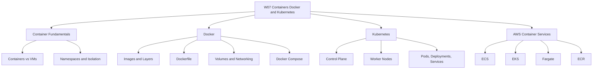
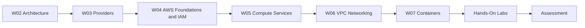

## W07: Containers - Docker and Kubernetes

### Lesson 0: Module Introduction

Initial directory setup.

## Overview

This module introduces containerization, Docker, Kubernetes, and the AWS container services that run them. It covers how containers differ from virtual machines, how Docker packages applications, how Kubernetes orchestrates containers at scale, and how to choose between Amazon ECS, Amazon EKS, and AWS Fargate.

The goal is to build the knowledge needed to deploy and manage containerized workloads on AWS.

## Module Purpose

- Explain the fundamentals of containerization and how containers differ from virtual machines.
- Describe how Docker builds, packages, and runs containerized applications.
- Introduce Kubernetes as a container orchestration platform.
- Map container concepts to AWS services: ECS, EKS, Fargate, and ECR.
- Provide a decision framework for choosing the right container platform.
- Prepare for hands-on labs and scenario-based assessment.

## Learning Objectives

- Define containerization and explain how it differs from virtualization.
- Describe the components of Docker's client-server architecture.
- Explain how Docker images, layers, and volumes work.
- Describe the components of a Kubernetes cluster.
- Explain the relationship between Pods, Deployments, and Services.
- Compare Amazon ECS, Amazon EKS, and AWS Fargate.
- Select the appropriate container service for a given workload.
- Apply container best practices for image optimization, security, and operations.

## Module Structure

| Lesson | Topic | Focus |
|---|---|---|
| Lesson 0 | Module Introduction | Scope and objectives |
| Lesson 1 | Container Fundamentals | Containers vs VMs, isolation, namespaces |
| Lesson 2 | Docker | Images, Dockerfile, volumes, networking |
| Lesson 3 | Kubernetes | Control plane, worker nodes, Pods, Services |
| Lesson 4 | AWS Container Services | ECS, EKS, Fargate, ECR |
| Lesson 5 | Summary and Assessment | Review and scenarios |

## Core Concepts Preview

### Containerization

- Containers package an application and its dependencies into an isolated runtime environment.
- They share the host OS kernel and are lightweight compared to virtual machines.
- They start in seconds and use fewer resources.
- Containers provide process-level isolation, not hardware-level isolation.
- They are ideal for microservices, CI/CD, and portable application delivery.

| Dimension | Virtual Machines | Containers |
|---|---|---|
| Virtualization Level | Hardware-level | OS-level |
| Guest OS | Each VM has its own OS kernel | Containers share the host OS kernel |
| Startup Time | Minutes | Seconds |
| Resource Usage | Higher | Lower |
| Isolation | Strong | Process-level |
| Portability | Limited by OS dependencies | Highly portable |

### Docker

- Docker is a containerization platform with a client-server architecture.
- The Docker client communicates with the Docker daemon via the Docker API.
- Docker images are built in layers. Each Dockerfile instruction creates a layer.
- Docker volumes provide persistent storage outside the container's writable layer.
- Docker Compose defines and manages multi-container applications for local development.

### Kubernetes

- Kubernetes is an open-source container orchestration platform.
- A cluster consists of a control plane and worker nodes.
- The control plane includes kube-apiserver, etcd, kube-scheduler, and kube-controller-manager.
- Worker nodes run kubelet, kube-proxy, and a container runtime.
- Pods are the smallest deployable unit. Deployments manage replicas. Services provide stable networking.

### AWS Container Services

| Service | Type | Control Plane Fee | Best For |
|---|---|---|---|
| Amazon ECS | AWS-proprietary orchestrator | None | Simplicity and deep AWS integration |
| Amazon EKS | Managed Kubernetes | $0.10 per cluster-hour | Kubernetes portability and ecosystem |
| AWS Fargate | Serverless compute for containers | None (pay for resources) | Eliminating node management |
| Amazon ECR | Container registry | None (pay for storage) | Storing and scanning container images |

---

## How This Module Connects to Previous Modules

- W02 covered reliability, performance, and the AWS Well-Architected Framework.
- W03 compared AWS, Azure, and GCP across services and selection factors.
- W04 covered AWS global infrastructure, IAM, and account security.
- W05 covered compute services and virtualisation, including EC2 and EBS.
- W06 covered VPC networking fundamentals.
- W07 adds the container layer: how to package, deploy, and orchestrate applications using Docker and Kubernetes on AWS.
- The container choices you make affect reliability, cost, performance, and security.

## Assessment Preparation

### Practice Questions

1. Define containerization and explain how it differs from virtualization.
2. Describe the components of Docker's client-server architecture.
3. Explain how Docker images and layers work.
4. Describe the purpose of a Dockerfile and list common instructions.
5. Compare Docker bridge, host, and overlay networks.
6. Explain the role of Docker volumes.
7. Describe the components of a Kubernetes cluster.
8. Explain the relationship between Pods, Deployments, and Services.
9. Compare Amazon ECS and Amazon EKS across at least five dimensions.
10. Explain the purpose of AWS Fargate and how it differs from Lambda.
11. Describe container best practices for image optimization and security.

### Scenario Questions

**Scenario 1: Simple Microservices Platform**

A team is building a microservices platform and wants to minimize operational overhead. They have no existing Kubernetes expertise. What should they use?

- Use Amazon ECS with AWS Fargate.
- ECS provides deep AWS integration and a low learning curve.
- Fargate eliminates node management.
- No control plane fee.
- Use ECR for image storage and scanning.

**Scenario 2: Multi-Cloud Kubernetes Platform**

A company needs to run Kubernetes across AWS, GCP, and on-premises. What should they use?

- Use Amazon EKS for Kubernetes compatibility and portability.
- Use Fargate or EC2-backed nodes depending on control requirements.
- Leverage the CNCF ecosystem: ArgoCD, Prometheus, Istio.
- Accept the control plane fee and higher operational overhead.

**Scenario 3: Event-Driven Image Processing**

An application needs to process images uploaded to S3 and generate thumbnails. Which compute service should they use?

- Use AWS Lambda triggered by S3 upload events.
- Lambda is ideal for short-lived, event-driven tasks.
- No container management required.
- Pay only for compute time used.

**Scenario 4: Long-Running Batch Processing**

A company needs to run batch processing jobs that take 2-4 hours each. Which service should they use?

- Use AWS Fargate or ECS on EC2.
- Fargate supports long-running containerized workloads with fine-grained resource control.
- Use Spot capacity for cost savings where possible.
- Lambda is not suitable due to the 15-minute timeout.

## Key Takeaways

- Containers package an application with its dependencies into a portable, isolated unit. They share the host OS kernel and are lightweight compared to VMs.
- Docker is the leading containerization platform. It uses a client-server architecture with images, containers, and registries.
- Docker images are built in layers. Multi-stage builds and minimal base images reduce size and attack surface.
- Docker volumes provide persistent storage outside the container's writable layer.
- Kubernetes is an open-source orchestration platform with a control plane and worker nodes.
- Pods are the smallest deployable unit. Deployments manage replicas. Services provide stable networking.
- Amazon ECS is a fully managed container orchestrator with deep AWS integration and no control plane fee.
- Amazon EKS is managed Kubernetes with portability and access to the CNCF ecosystem. It has a control plane fee.
- AWS Fargate is a serverless compute engine for containers that works with both ECS and EKS.
- Choose ECS for simplicity, EKS for Kubernetes portability, and Fargate to eliminate node management.
- Container best practices include minimal images, non-root execution, health checks, resource limits, and image scanning.
- Containers are not a security boundary. Use additional controls to harden workloads.
- This module builds on W02 architecture, W03 provider comparison, W04 AWS foundations, W05 compute services, and W06 VPC networking.
- Assessment focuses on practical container platform selection and scenario-based decision making.

> [!Important]
> **Choose the simplest container platform that meets your needs**: ECS with Fargate handles most containerized workloads with minimal operational overhead. Choose EKS only when you need the Kubernetes ecosystem or multi-cloud portability. Choose EC2-backed nodes only when you need full control over the underlying instances. The right choice depends on team skills, portability requirements, and operational maturity.
