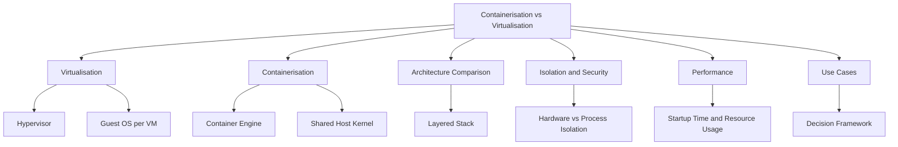
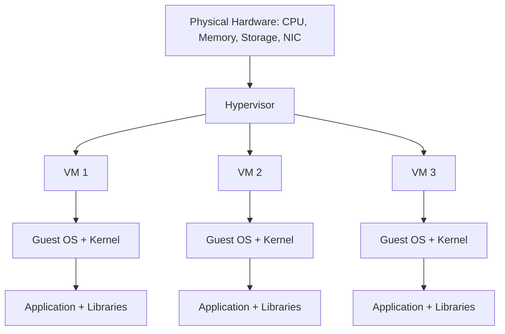
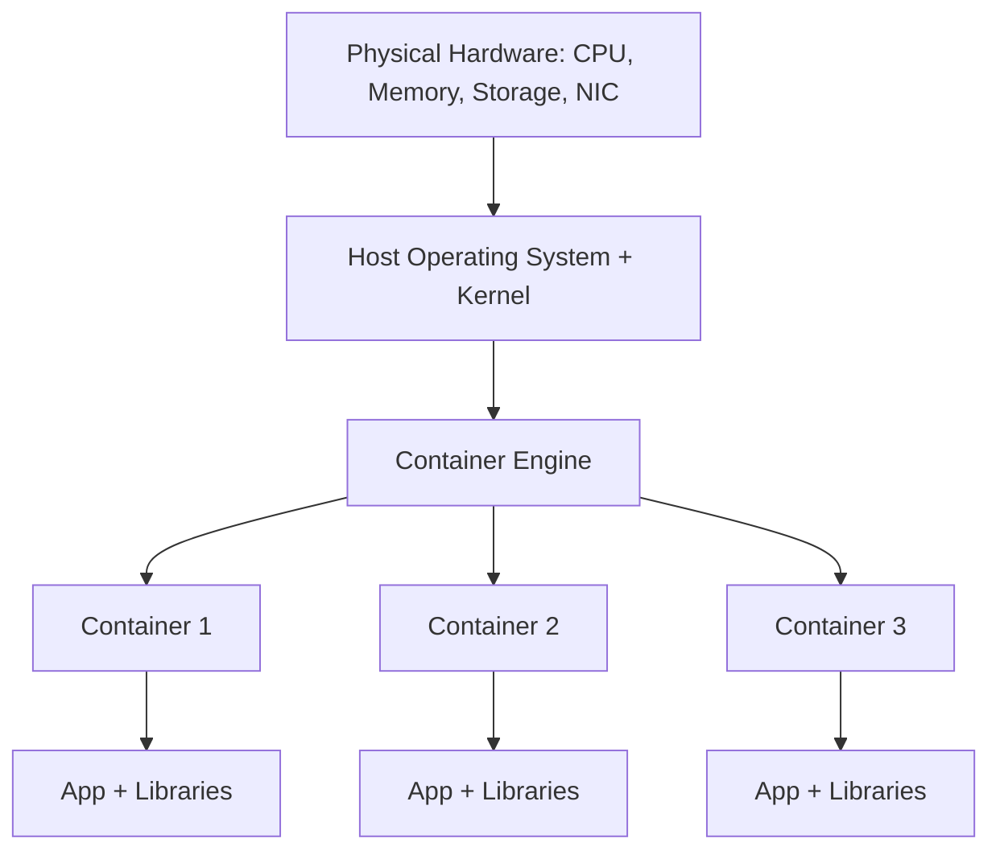
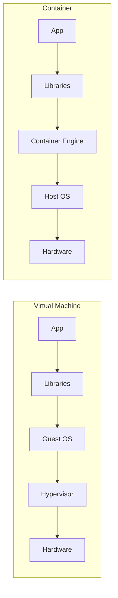

# Migration in progress
# Lesson 1: Containerisation vs Virtualisation

This lesson compares containerisation and virtualisation as two approaches to running workloads on shared infrastructure. It explains how each technology works at the operating system level, how they differ in isolation, performance, and portability, and when to choose one over the other. The goal is to understand the trade-offs so you can select the right model for a given workload.

## What Is Virtualisation

*Definition*: Virtualisation is the process of creating a software-based representation of physical compute resources. A hypervisor abstracts the underlying hardware and allows multiple operating systems to run concurrently on a single physical machine.

- Each virtual machine runs its own complete operating system, including its own kernel.
- The hypervisor allocates CPU, memory, storage, and network resources to each VM.
- VMs are isolated at the hardware level. A failure in one VM does not affect others.
- Virtualisation is the foundation of cloud computing. AWS EC2 instances are virtual machines.

### Virtualisation Stack

- The hypervisor sits between the hardware and the guest operating systems.
- Each VM includes a full guest OS, which consumes CPU, memory, and storage.
- The guest OS provides isolation and security boundaries between VMs.
- Booting a VM takes minutes because the guest OS must start.

> [!Important]
> **Each VM carries a full operating system**: This is what makes VMs strongly isolated but also resource-heavy. A VM running a single small application still consumes the resources of an entire OS.

## What Is Containerisation

*Definition*: Containerisation packages an application and its dependencies into an isolated runtime environment that shares the host operating system kernel. A container engine manages the lifecycle of containers on a host.

- Containers do not include a guest OS. They share the host kernel.
- Each container has its own filesystem, process space, and network namespace.
- Containers are isolated at the process level, not the hardware level.
- Docker is the most widely used container engine. containerd and CRI-O are common alternatives.

### Containerisation Stack

- All containers share the same host kernel.
- Containers include only the application and its user-space dependencies.
- Starting a container is fast because there is no OS to boot.
- Containers are portable across environments that support the same kernel.

> [!Tip]
> **Containers are not lightweight VMs**: They are isolated processes with their own filesystem view. Understanding this distinction is essential for designing secure and reliable container platforms.

## Architecture Comparison

The two models differ in how they layer the stack from hardware to application.

| Layer | Virtualisation | Containerisation |
|---|---|---|
| Hardware | Physical server | Physical server |
| Virtualisation | Hypervisor | Container engine |
| Kernel | One kernel per guest OS | Shared host kernel |
| Operating System | Full guest OS per VM | Host OS only |
| Runtime | Included in guest OS | Included in container image |
| Application | Runs on guest OS | Runs in container |
| Startup Time | Minutes | Seconds |
| Image Size | Gigabytes | Megabytes |

- Virtualisation duplicates the OS for each workload. Containerisation shares one OS across many workloads.
- The shared kernel is what makes containers faster to start and lighter to run.
- The dedicated kernel is what makes VMs more strongly isolated.

> [!Important]
> **The kernel is the key difference**: VMs have their own kernel. Containers share the host kernel. This single design choice explains almost every other difference between the two models, including startup time, resource usage, isolation strength, and portability.

## Isolation and Security

Isolation determines how strongly one workload is separated from another. It affects security, fault containment, and multi-tenancy.

### Virtual Machine Isolation

- Hardware-level isolation provided by the hypervisor.
- Each VM has its own kernel, so kernel exploits affect only that VM.
- Strong boundaries suitable for multi-tenant environments.
- A compromised VM cannot directly access another VM's memory or processes.

### Container Isolation

- Process-level isolation provided by Linux namespaces and cgroups.
- Containers share the host kernel, so a kernel exploit can affect all containers on the host.
- Weaker boundaries. Additional controls are needed for multi-tenant environments.
- A compromised container can potentially escape to the host if the kernel is vulnerable.

| Dimension | Virtual Machines | Containers |
|---|---|---|
| Isolation Level | Hardware | Process |
| Kernel | Dedicated per VM | Shared with host and other containers |
| Attack Surface | Guest OS and hypervisor | Host kernel and container runtime |
| Multi-Tenancy | Strong | Requires additional hardening |
| Escape Risk | Low | Higher if kernel is compromised |
| Recommended Controls | Hypervisor isolation | seccomp, AppArmor, SELinux, user namespaces, network policies |

> [!Important]
> **Containers are not a security boundary by default**: Treat containers as a packaging and deployment mechanism, not as a security isolation mechanism. Use additional controls such as seccomp, AppArmor, SELinux, rootless containers, and network policies to harden container workloads. For strong multi-tenancy, use VMs or dedicated hosts.

### Hardening Containers

- Run containers as non-root users.
- Use read-only root filesystems where possible.
- Apply seccomp profiles to restrict system calls.
- Use AppArmor or SELinux to enforce mandatory access controls.
- Limit container capabilities with `--cap-drop`.
- Use network policies to restrict pod-to-pod communication.
- Scan images for vulnerabilities before deployment.
- Use minimal base images to reduce attack surface.

> [!Tip]
> **Defense in depth for containers**: No single control is sufficient. Combine user namespaces, seccomp, AppArmor or SELinux, capability dropping, and network policies to reduce the risk of container escape.

## Performance and Resource Efficiency

Performance and resource efficiency determine how many workloads you can run on a given host and how quickly they respond.

### Startup Time

- VMs take minutes to boot because the guest OS must initialise.
- Containers start in seconds or milliseconds because there is no OS to boot.
- Fast startup makes containers ideal for autoscaling and ephemeral workloads.

### Resource Usage

- Each VM consumes CPU, memory, and storage for its guest OS.
- Containers share the host kernel and only consume resources for the application and its dependencies.
- A host can run many more containers than VMs with the same hardware.

### Density and Cost

| Metric | Virtual Machines | Containers |
|---|---|---|
| Workloads per Host | Fewer | Many more |
| Memory Overhead per Workload | High (OS + App) | Low (App + Libraries) |
| Storage Overhead per Workload | Gigabytes (OS image) | Megabytes (App image) |
| Startup Time | Minutes | Seconds |
| Scaling Granularity | Coarse | Fine |
| Cost Efficiency | Lower density | Higher density |

> [!Important]
> **Density drives cost efficiency**: Because containers share the host kernel, you can run significantly more workloads per host than with VMs. This higher density translates directly into lower compute cost per workload, which is one of the main reasons containers dominate modern application 