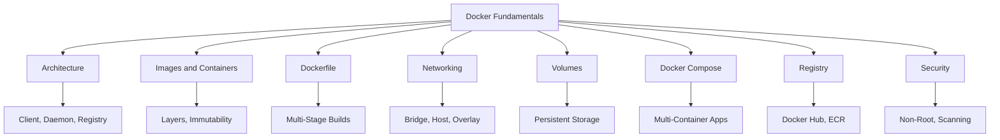
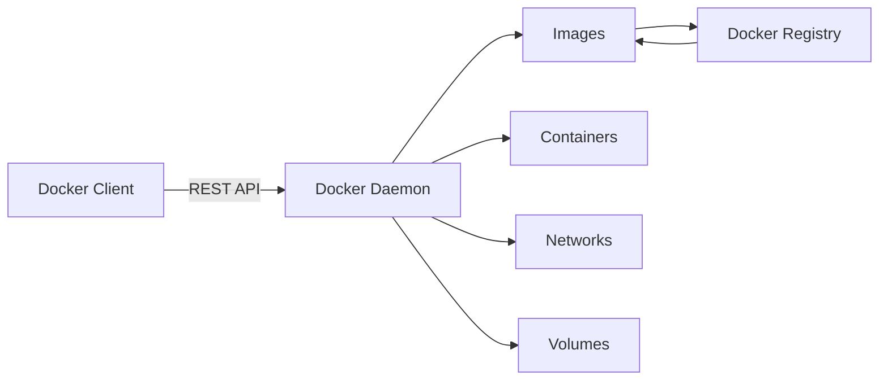
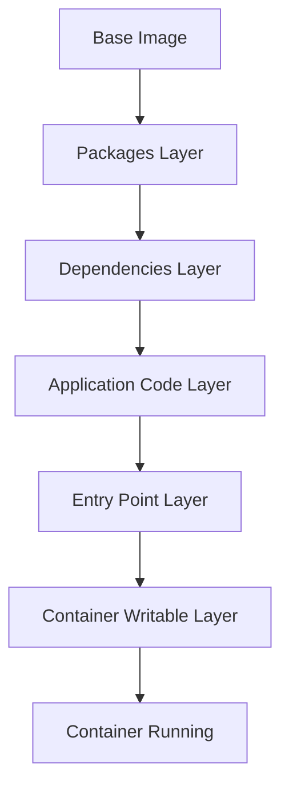
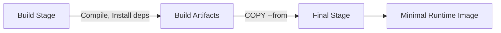
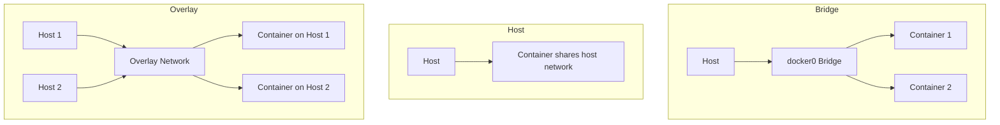
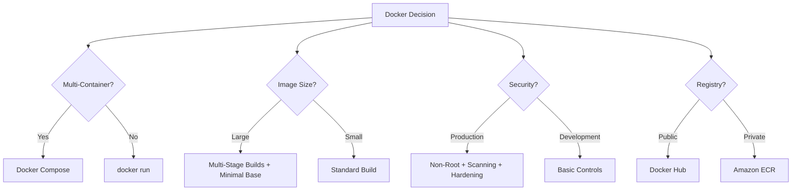

# Lesson 2: Docker Fundamentals

Docker is a containerization platform that packages an application together with its dependencies into a standardized unit called a container. It provides a consistent application runtime across development, testing, CI/CD, and production environments. This lesson covers Docker architecture, images, containers, Dockerfiles, networking, volumes, Docker Compose, and registry integration.



## What Is Docker

*Definition*: Docker is a containerization platform that packages an application together with its dependencies into a standardized unit called a container. It enables separation of applications from infrastructure and treats infrastructure as a managed application.

- Docker provides a consistent application runtime across development, testing, CI/CD, and production environments.
- It combines kernel containerization features with workflows and tooling to manage and deploy applications.
- The lightweight nature of containers, which run without the extra load of a hypervisor, means you can get more out of your hardware.
- Docker is widely used in CI/CD pipelines, with a typical workflow of: source code, build, test, Docker image, security scan, container registry, deployment.

> [!Important]
> **Docker is not a virtualization technology in the traditional sense**: Containers share the host operating system kernel, which makes them lightweight and fast to start. This is fundamentally different from virtual machines, where each VM requires its own guest operating system.

## Docker Architecture

Docker follows a client-server architecture. The main components are the Docker Client, Docker Daemon, Docker Images, Docker Containers, and Docker Registry.



| Component | Description |
|---|---|
| Docker Client | Command-line interface that users interact with. Talks to the Docker daemon via REST API. |
| Docker Daemon | Long-running server process (dockerd) that manages Docker objects: images, containers, networks, and volumes. |
| Docker Images | Read-only templates used to create containers. Built from Dockerfiles. |
| Docker Containers | Running instances of Docker images. Isolated processes with their own filesystem view. |
| Docker Registry | Centralized repository for storing and distributing Docker images. |

- The Docker client and daemon can run on the same system, or the client can connect to a remote daemon.
- The daemon does the heavy lifting of building, running, and distributing containers.
- A Docker registry stores and distributes container images. Docker Hub is one commonly used public registry.

> [!Tip]
> **The Docker client talks to the daemon, not directly to containers**: When you run a Docker command, the client sends a request to the daemon, which performs the actual work. This separation allows remote management of Docker hosts.

## Docker Images and Containers

*Definition*: A Docker image is an immutable package containing the application code, runtime, libraries, dependencies, and configuration required to create a container. A container is a running instance of an image.

- Images are built in layers. Each instruction in a Dockerfile creates a new layer containing only the changes relative to the previous one.
- Layers are cached and reused. If a layer has not changed, Docker reuses the cached version, making builds faster.
- The relationship can be represented as: Docker Image → Container. One image can be used to create multiple containers.
- Containers are designed to be replaceable and their writable filesystem should not normally be treated as permanent storage.
- Docker's copy-on-write mechanism ensures that modifications to files originally part of the image are first copied to the writable layer before any changes are applied.

### Image Layer Structure

| Layer | Description | Example |
|---|---|---|
| Base Layer | The underlying OS image | Ubuntu, Alpine, node:18-alpine |
| Packages Layer | OS-level packages installed via package manager | apt-get, yum, apk |
| Dependencies Layer | Application dependencies | pip install, npm install |
| Application Code Layer | Your application source code | COPY . /app |
| Entry Point Layer | The command configuration for running the container | CMD, ENTRYPOINT |



- Layers are immutable and shared between images. If two images use the same base layer, Docker stores it only once.
- The writable layer is created when a container starts and is deleted when the container is removed.
- Data in the writable layer is lost when the container is deleted. Use volumes for persistent data.

> [!Important]
> **Image layers are immutable and cached**: This is why Docker builds are fast. Only layers that change need to be rebuilt. Place instructions that change frequently (like copying application code) near the end of the Dockerfile to maximize cache reuse.

## Dockerfile

*Definition*: A Dockerfile defines how a Docker image is built. It describes the base image, application dependencies, environment configuration, files to include, and the application startup command.

- Dockerfiles are commonly stored with application source code so that container images can be built consistently through CI/CD pipelines.
- Common instructions include FROM, RUN, COPY, WORKDIR, ENV, EXPOSE, and CMD.
- The order of instructions affects layer caching. Put instructions that change less frequently earlier in the Dockerfile.

### Common Dockerfile Instructions

| Instruction | Purpose | Example |
|---|---|---|
| FROM | Sets the base image | FROM node:18-alpine |
| WORKDIR | Sets the working directory | WORKDIR /app |
| COPY | Copies files from host to image | COPY package*.json ./ |
| RUN | Executes commands during build | RUN npm install |
| EXPOSE | Documents the port the container listens on | EXPOSE 3000 |
| CMD | Sets the default command | CMD ["npm", "start"] |
| ENV | Sets environment variables | ENV NODE_ENV=production |
| USER | Sets the user for subsequent instructions | USER node |

### Multi-Stage Builds

*Definition*: Multi-stage builds introduce multiple stages in a Dockerfile, each with a specific purpose. By separating the build environment from the final runtime environment, you can significantly reduce the image size and attack surface.

- Multi-stage builds are recommended for all types of applications.
- For interpreted languages like JavaScript, Ruby, or Python, you can build and minify code in one stage and copy the production-ready files to a smaller runtime image.
- For compiled languages like C, Go, or Rust, multi-stage builds let you compile in one stage and copy the compiled binaries into a final runtime image.
- Multi-stage builds can reduce image size from 800 MB to 15-30 MB.



- Example structure: Stage 1 (build environment) installs build tools, copies source code, and runs build commands. Stage 2 (runtime environment) uses a smaller base image and copies only the compiled artifacts from the build stage.
- Use minimal base images like Alpine or distroless for the final stage.
- Name stages with AS for clarity: `FROM builder-image AS build-stage`.

> [!Tip]
> **Multi-stage builds are the single most effective way to reduce image size**: They eliminate build tools, package managers, and intermediate artifacts from the final image. This reduces both storage costs and attack surface.

## Docker Networking

Docker provides networking capabilities that allow containers to communicate with each other and with external systems. Each network mode makes a different trade-off between isolation, performance, and network flexibility.

### Network Drivers

| Driver | Use Case | Isolation | Performance |
|---|---|---|---|
| bridge | Default, single-host container communication | High | Good |
| host | Share host's network stack | None | Best |
| overlay | Multi-host container networking (Swarm) | High | Good |
| macvlan | Container on physical LAN directly | High | Excellent |
| none | No networking | Complete | N/A |

- Bridge is the default mode. Docker creates a virtual bridge (`docker0`) and assigns each container a virtual NIC on that bridge.
- Custom bridges enable DNS-based container-to-container communication. Containers on the same custom bridge can reach each other by name.
- Host networking removes network isolation between the container and the Docker host. The container shares the host's network stack entirely.
- Overlay networks connect containers across multiple Docker hosts. They are essential for Docker Swarm deployments and multi-host container orchestration.
- Port publishing maps container ports to host ports for external access.



> [!Important]
> **Use custom bridge networks for container-to-container communication**: The default bridge network does not support DNS-based service discovery. Custom bridge networks enable containers to reach each other by name, which is essential for multi-container applications.

## Docker Volumes

*Definition*: Docker volumes provide persistent storage outside the container's writable layer. They are used when containers need to retain data across container recreation.

- Containers are designed to be replaceable. Their writable filesystem should not be treated as permanent storage.
- Volumes are stored on the host filesystem and managed by Docker.
- Volumes can be shared between multiple containers.
- Bind mounts map a host directory directly into a container. They are useful for sharing source code or configuration files during development.

### Volumes vs Bind Mounts

| Dimension | Volumes | Bind Mounts |
|---|---|---|
| Management | Managed by Docker | Managed by the host OS |
| Storage Location | /var/lib/docker/volumes/ | Any host path |
| Portability | High | Host-dependent |
| Use Case | Persistent data, databases | Development, source code sharing |
| Backup | Docker commands | Host file system tools |

- Named volumes are created with `docker volume create` and can be referenced by name.
- Bind mounts create a direct link between a host path and a container path.
- Use volumes for production data. Use bind mounts for development workflows where you want to edit code on the host and see changes immediately in the container.

> [!Tip]
> **Never store important data in a container's writable layer**: The writable layer is temporary and is deleted when the container is removed. Always use volumes or external storage services for persistent data.

## Docker Compose

*Definition*: Docker Compose defines and manages multi-container applications. It uses a single YAML file called `compose.yml` to specify configurations for all containers, their dependencies, environment variables, volumes, and networks.

- Docker Compose is used to define and manage multi-container applications.
- A Compose configuration can describe services such as the application, database, Redis, message broker, and reverse proxy.
- The architecture and configuration of a multi-container application are defined declaratively.
- Docker Compose is primarily used for local development and testing environments.
- For production orchestration at scale, Kubernetes or AWS ECS/EKS is used instead.

### Why Use Docker Compose

- Running multiple `docker run` commands with different configurations is error-prone and time-consuming.
- Applications often rely on each other. Manually starting containers in a specific order and managing network connections becomes difficult as the stack expands.
- Each application needs its own `docker run` command, making it difficult to scale individual services.
- Persisting data for each application requires separate volume mounts or configurations within each `docker run` command.
- Setting environment variables for each application through separate `docker run` commands is tedious and error-prone.

```yaml
# Example compose.yml
services:
  web:
    build: .
    ports:
      - "3000:3000"
  db:
    image: postgres:14
    environment:
      POSTGRES_PASSWORD: secret
    volumes:
      - db-data:/var/lib/postgresql/data
  cache:
    image: redis:7
volumes:
  db-data:
```

- With Docker Compose, you define your entire multi-container application in a single YAML file.
- You can run containers in a specific order and manage network connections easily.
- You can scale individual services up or down within the multi-container setup.
- You can implement persistent volumes with ease.
- It is easy to set environment variables once in the Docker Compose file.

> [!Important]
> **Docker Compose is for local development, not production orchestration**: Use it to define and test multi-container applications on a single host. For production, migrate to Amazon ECS, Amazon EKS, or another orchestrator that supports clustering, high availability, and horizontal scaling.

## Docker Registry

*Definition*: A Docker registry is the storage-and-distribution layer for container images. Docker Hub is the public default, but production environments typically run a self-hosted registry or a cloud provider's registry to keep proprietary images off the internet and under access control.

- Docker Hub is a public registry that anyone can use.
- Amazon Elastic Container Registry (ECR) is a fully managed private registry for storing, managing, and deploying container images.
- Private registries like ECR cater to enterprise applications and provide access control, encryption, and image scanning.
- Images are stored in registries and pulled by Docker hosts when running containers.

### Popular Registries

| Registry | Type | Use Case |
|---|---|---|
| Docker Hub | Public | Open-source images, public projects |
| Amazon ECR | Private | AWS production workloads |
| Google Artifact Registry | Private | GCP workloads |
| Azure Container Registry | Private | Azure workloads |
| Harbor | Self-hosted | On-premises, air-gapped environments |

- Docker images are composed of layers, which are intermediate build stages of the image. Each line in a Dockerfile results in the creation of a new layer.
- Use smaller base images to reduce the size of the final image and speed up push and pull operations.
- Enable image scanning in the registry to detect vulnerabilities before deployment.

> [!Tip]
> **Use Amazon ECR for AWS container workloads**: ECR integrates natively with ECS, EKS, and Fargate. It supports image scanning, cross-Region replication, and lifecycle policies to manage image retention.

## Docker Security Best Practices

Security for Docker containers comes down to shrinking what you ship, dropping privileges you do not need, and scanning every image before it runs. A container is not a security boundary by default. It shares the host kernel and, unless configured otherwise, runs as root.

### Key Security Controls

| Control | Description | Implementation |
|---|---|---|
| Minimal Base Image | Reduce attack surface by removing unnecessary packages | Use Alpine, distroless, or slim variants |
| Non-Root User | Prevent container processes from running as root | Add USER instruction in Dockerfile |
| Image Scanning | Detect known CVEs before deployment | Integrate Trivy, Clair, or ECR scanning in CI/CD |
| Secrets Management | Keep secrets out of image layers | Use BuildKit secret mounts, environment variables, or secrets manager |
| Read-Only Filesystem | Prevent writes to the container filesystem | Mount root filesystem as read-only |
| Capability Dropping | Remove unnecessary Linux capabilities | Use --cap-drop in Docker run or Kubernetes security context |
| seccomp Profiles | Restrict system calls available to the container | Apply seccomp profiles |
| AppArmor/SELinux | Enforce mandatory access controls | Enable AppArmor or SELinux profiles |

- Never run containers as root. By default, a container process runs as UID 0. If an attacker achieves code execution and exploits a kernel flaw to escape, they land on the host as root.
- Keep secrets out of image layers. Every COPY and RUN creates a layer, and layers are immutable and inspectable. Use BuildKit secret mounts for build-time credentials and inject runtime secrets through environment variables or a secrets manager.
- Scan images for vulnerabilities. You cannot fix what you cannot see. Scan every image for known CVEs in its OS packages and application dependencies, and do it in CI so a vulnerable image never reaches a registry.
- Use a .dockerignore file to exclude .git, .env, and local credential files so they never enter the build context.

### Container Hardening Checklist

- Use minimal base images (Alpine, distroless, slim variants).
- Create and switch to an unprivileged user in the Dockerfile.
- Run containers with a read-only root filesystem where possible.
- Drop unnecessary Linux capabilities.
- Apply seccomp profiles to restrict system calls.
- Use AppArmor or SELinux for mandatory access controls.
- Keep secrets out of image layers.
- Scan images for vulnerabilities in CI/CD.
- Use a .dockerignore file to exclude sensitive files from the build context.
- Sign and verify images with Docker Content Trust.

> [!Important]
> **Treat container isolation as one layer among several**: Non-root users, dropped capabilities, seccomp profiles, and read-only filesystems work together to reduce risk. No single control is sufficient. For strong multi-tenancy, use VMs or dedicated hosts.

## Docker in CI/CD

Docker is widely used in CI/CD pipelines. Container images can be built during CI, scanned for vulnerabilities, pushed to a registry, and deployed to production.


- Source code is committed to a repository.
- The CI pipeline builds the Docker image from the Dockerfile.
- Tests run against the built image.
- The image is scanned for vulnerabilities.
- The scanned image is pushed to a container registry.
- The image is deployed to the target environment (ECS, EKS, Fargate).

> [!Tip]
> **Fail the pipeline on high-severity vulnerabilities**: Integrate image scanning with a quality gate. Use `trivy image --severity HIGH,CRITICAL --exit-code 1` to fail the pipeline when high or critical issues appear. This turns the scan into a gate rather than a report nobody reads.

## Assessment Preparation

### Practice Questions

1. Define Docker and explain its role in containerization.
2. Describe the components of Docker's client-server architecture.
3. Explain how Docker images and layers work.
4. Describe the purpose of a Dockerfile and list common instructions.
5. Explain how multi-stage builds reduce image size.
6. Compare Docker bridge, host, and overlay networks.
7. Explain the role of Docker volumes and how they differ from bind mounts.
8. Describe the purpose of Docker Compose.
9. Compare Docker Hub and Amazon ECR.
10. List five Docker security best practices.
11. Describe how Docker fits into a CI/CD pipeline.
12. Explain why containers are not a security boundary by default.

### Scenario Questions

**Scenario 1: Building a Multi-Container Application**
A development team needs to run a web application with a database and a Redis cache on a single host for local development. How should they manage these containers?

- Use Docker Compose with a `compose.yml` file.
- Define services for the web app, database, and cache.
- Use a custom bridge network so containers can communicate by name.
- Use volumes for database persistence.
- Use environment variables for configuration.

**Scenario 2: Reducing Image Size**
A Docker image for a Java application is 1.2 GB. How can the team reduce it?

- Use multi-stage builds: compile in one stage, copy the JAR to a minimal runtime image.
- Use a smaller base image such as `eclipse-temurin:21-jre-alpine` or distroless.
- Exclude build tools and source code from the final image.
- Use a `.dockerignore` file to exclude unnecessary files from the build context.

**Scenario 3: Securing a Container Deployment**
A security team requires containers to run with least privilege. What controls should be applied?

- Run containers as a non-root user with the USER instruction.
- Drop unnecessary Linux capabilities.
- Apply seccomp profiles to restrict system calls.
- Mount the root filesystem as read-only where possible.
- Scan images for vulnerabilities before deployment.
- Keep secrets out of image layers using BuildKit secret mounts.

**Scenario 4: Container Registry for Production**
A company needs a private registry for production container images with scanning and access control. What should they use?

- Use Amazon ECR for integration with ECS, EKS, and Fargate.
- Enable image scanning on push.
- Use IAM policies for access control.
- Configure lifecycle policies to manage image retention.
- Use cross-Region replication for disaster recovery.



## Key Takeaways

- Docker is a containerization platform that packages applications with their dependencies into standardized containers.
- Docker uses a client-server architecture with a client, daemon, and registry.
- Docker images are immutable packages built in layers. Containers are running instances of images.
- Dockerfiles define how images are built. Multi-stage builds reduce image size and attack surface.
- Docker networking includes bridge (default, single-host), host (share host network), and overlay (multi-host).
- Docker volumes provide persistent storage outside the container's writable layer. Bind mounts map host directories into containers.
- Docker Compose defines and manages multi-container applications in a single YAML file for local development.
- Docker Hub is the public default registry. Amazon ECR is a fully managed private registry for AWS workloads.
- Docker security best practices include minimal base images, non-root users, image scanning, secret management, and capability dropping.
- Containers are not a security boundary by default. Use additional controls to harden workloads.
- Docker is widely used in CI/CD pipelines for building, testing, scanning, and deploying containerized applications.
- Choose the simplest approach that meets your needs: Docker Compose for local development, ECS/EKS for production orchestration.

> [!Important]
> **Docker is the foundation, not the destination**: Docker teaches you how containers work, but production orchestration requires Kubernetes or Amazon ECS/EKS. Master Docker fundamentals first, then apply them to managed container services. The Dockerfile, image, and container concepts transfer directly to every container platform.
