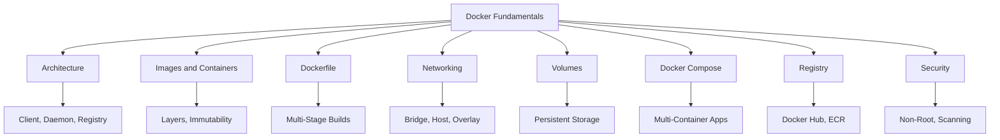
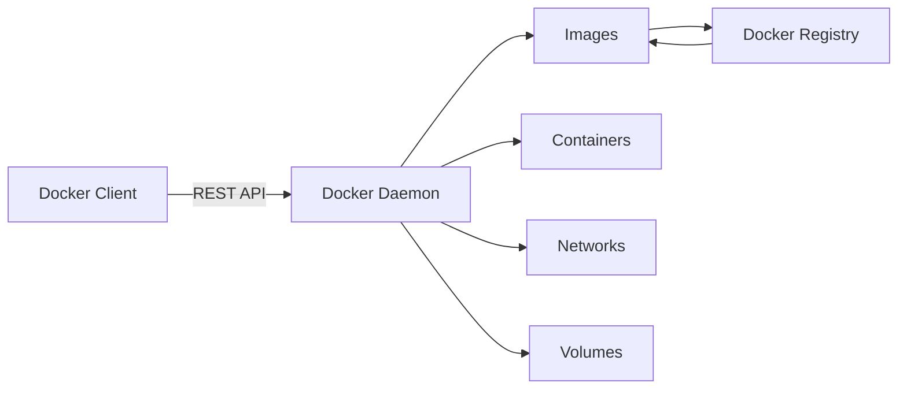
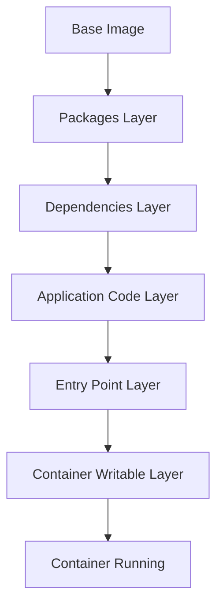
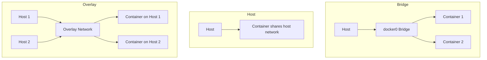

# Migration in progress
# Lesson 2: Docker Fundamentals

Docker is a containerization platform that packages an application together with its dependencies into a standardized unit called a container. It provides a consistent application runtime across development, testing, CI/CD, and production environments. This lesson covers Docker architecture, images, containers, Dockerfiles, networking, volumes, Docker Compose, and registry integration.

## What Is Docker

*Definition*: Docker is a containerization platform that packages an application together with its dependencies into a standardized unit called a container. It enables separation of applications from infrastructure and treats infrastructure as a managed application.

- Docker provides a consistent application runtime across development, testing, CI/CD, and production environments.
- It combines kernel containerization features with workflows and tooling to manage and deploy applications.
- The lightweight nature of containers, which run without the extra load of a hypervisor, means you can get more out of your hardware.
- Docker is widely used in CI/CD pipelines, with a typical workflow of: source code, build, test, Docker image, security scan, container registry, deployment.

> [!Important]
> **Docker is not a virtualization technology in the traditional sense**: Containers share the host operating system kernel, which makes them lightweight and fast to start. This is fundamentally different from virtual machines, where each VM requires its own guest operating system.

## Docker Architecture

Docker follows a client-server architecture. The main components are the Docker Client, Docker Daemon, Docker Images, Docker Containers, and Docker Registry.

| Component | Description |
|---|---|
| Docker Client | Command-line interface that users interact with. Talks to the Docker daemon via REST API. |
| Docker Daemon | Long-running server process (dockerd) that manages Docker objects: images, containers, networks, and volumes. |
| Docker Images | Read-only templates used to create containers. Built from Dockerfiles. |
| Docker Containers | Running instances of Docker images. Isolated processes with their own filesystem view. |
| Docker Registry | Centralized repository for storing and distributing Docker images. |

- The Docker client and daemon can run on the same system, or the client can connect to a remote daemon.
- The daemon does the heavy lifting of building, running, and distributing containers.
- A Docker registry stores and distributes container images. Docker Hub is one commonly used public registry.

> [!Tip]
> **The Docker client talks to the daemon, not directly to containers**: When you run a Docker command, the client sends a request to the daemon, which performs the actual work. This separation allows remote management of Docker hosts.

## Docker Images and Containers

*Definition*: A Docker image is an immutable package containing the application code, runtime, libraries, dependencies, and configuration required to create a container. A container is a running instance of an image.

- Images are built in layers. Each instruction in a Dockerfile creates a new layer containing only the changes relative to the previous one.
- Layers are cached and reused. If a layer has not changed, Docker reuses the cached version, making builds faster.
- The relationship can be represented as: Docker Image → Container. One image can be used to create multiple containers.
- Containers are designed to be replaceable and their writable filesystem should not normally be treated as permanent storage.
- Docker's copy-on-write mechanism ensures that modifications to files originally part of the image are first copied to the writable layer before any changes are applied.

### Image Layer Structure

| Layer | Description | Example |
|---|---|---|
| Base Layer | The underlying OS image | Ubuntu, Alpine, node:18-alpine |
| Packages Layer | OS-level packages installed via package manager | apt-get, yum, apk |
| Dependencies Layer | Application dependencies | pip install, npm install |
| Application Code Layer | Your application source code | COPY . /app |
| Entry Point Layer | The command configuration for running the container | CMD, ENTRYPOINT |

- Layers are immutable and shared between images. If two images use the same base layer, Docker stores it only once.
- The writable layer is created when a container starts and is deleted when the container is removed.
- Data in the writable layer is lost when the container is deleted. Use volumes for persistent data.

> [!Important]
> **Image layers are immutable and cached**: This is why Docker builds are fast. Only layers that change need to be rebuilt. Place instructions that change frequently (like copying application code) near the end of the Dockerfile to maximize cache reuse.

## Dockerfile

*Definition*: A Dockerfile defines how a Docker image is built. It describes the base image, application dependencies, environment configuration, files to include, and the application startup command.

- Dockerfiles are commonly stored with application source code so that container images can be built consistently through CI/CD pipelines.
- Common instructions include FROM, RUN, COPY, WORKDIR, ENV, EXPOSE, and CMD.
- The order of instructions affects layer caching. Put instructions that change less frequently earlier in the Dockerfile.

### Common Dockerfile Instructions

| Instruction | Purpose | Example |
|---|---|---|
| FROM | Sets the base image | FROM node:18-alpine |
| WORKDIR | Sets the working directory | WORKDIR /app |
| COPY | Copies files from host to image | COPY package*.json ./ |
| RUN | Executes commands during build | RUN npm install |
| EXPOSE | Documents the port the container listens on | EXPOSE 3000 |
| CMD | Sets the default command | CMD ["npm", "start"] |
| ENV | Sets environment variables | ENV NODE_ENV=production |
| USER | Sets the user for subsequent instructions | USER node |

### Multi-Stage Builds

*Definition*: Multi-stage builds introduce multiple stages in a Dockerfile, each with a specific purpose. By separating the build environment from the final runtime environment, you can significantly reduce the image size and attack surface.

- Multi-stage builds are recommended for all types of applications.
- For interpreted languages like JavaScript, Ruby, or Python, you can build and minify code in one stage and copy the production-ready files to a smaller runtime image.
- For compiled languages like C, Go, or Rust, multi-stage builds let you compile in one stage and copy the compiled binaries into a final runtime image.
- Multi-stage builds can reduce image size from 800 MB to 15-30 MB.

- Example structure: Stage 1 (build environment) installs build tools, copies source code, and runs build commands. Stage 2 (runtime environment) uses a smaller base image and copies only the compiled artifacts from the build stage.
- Use minimal base images like Alpine or distroless for the final stage.
- Name stages with AS for clarity: `FROM builder-image AS build-stage`.

> [!Tip]
> **Multi-stage builds are the single most effective way to reduce image size**: They eliminate build tools, package managers, and intermediate artifacts from the final image. This reduces both storage costs and attack surface.

## Docker Networking

Docker provides networking capabilities that allow containers to communicate with each other and with external systems. Each network mode makes a different trade-off between isolation, performance, and network flexibility.

### Network Drivers

| Driver | Use Case | Isolation | Performance |
|---|---|---|---|
| bridge | Default, single-host container communication | High | Good |
| host | Share host's network stack | None | Best |
| overlay | Multi-host container networking (Swarm) | High | Good |
| macvlan | Container on physical LAN directly | High | Excellent |
| none | No networking | Complete | N/A |

- Bridge is the default mode. Docker creates a virtual bridge (`docker0`) and assigns each container a virtual NIC on that bridge.
- Custom bridges enable DNS-based container-to-container communication. Containers on the same custom bridge can reach each other by name.
- Host networking removes network isolation between the container and the Docker host. The container shares the host's network stack entirely.
- Overlay networks connect containers across multiple Docker hosts. They are essential for Docker Swarm deployments and multi-host container orchestration.
- Port publishing maps container ports to host ports for external access.

> [!Important]
> **Use custom bridge networks for container-to-container communication**: The default bridge network does not support DNS-based service discovery. Custom bridge networks enable containers to reach each other by name, which is essential for multi-container applications.

## Docker Volumes

*Definition*: Docker volumes provide persistent storage outside the container's writable layer. They are used when containers need to retain data across container recreation.

- Containers are designed to be replaceable. Their writable filesystem should not be treated as permanent storage.
- Volumes are stored on the host filesystem and managed by Docker.
- Volumes can be shared between multiple containers.
- Bind mounts map a host directory directly into a container. They are useful for sharing source code or configuration files during development.

### Volumes vs Bind Mounts

| Dimension | Volumes | Bind Mounts |
|---|---|---|
| Management | Managed by Docker | Managed by the host OS |
| Storage Location | /var/lib/docker/volumes/ | Any host path |
| Portability | High | Host-dependent |
| Use Case | Persistent data, databases | Development, source code sharing |
| Backup | Docker commands | Host file system tools |

- Named volumes are created with `docker volume create` and can be referenced by name.
- Bind mounts create a direct link between a host path and a container path.
- Use volumes for production data. Use bind mounts for development workflows where you want to edit code on the host and see changes immediately in the container.

> [!Tip]
> **Never store important data in a container's writable layer**: The writable layer is temporary and is deleted when the container is removed. Always use volumes or external storage services for persistent data.

## Docker Compose

*Definition*: Docker Compose defines and manages multi-container applications. It uses a single YAML file called `compose.yml` to specify configurations for all containers, their dependencies, environment variables, volumes, and networks.

- Docker Compose is used to define and manage multi-container applications.
- 