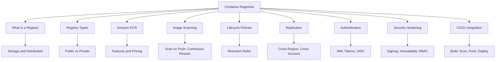
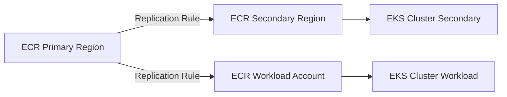

# Migration in progress
# Lesson 3: Container Registries

A container registry is a centralized storage and distribution system for container images. It is the source of truth for what runs in your clusters. Every deployment pipeline pushes images to a registry and every runtime pulls from one. A registry compromise or misconfiguration has blast radius across every workload that pulls from it. This lesson covers registry types, Amazon ECR features, image scanning, lifecycle policies, authentication, security hardening, and how registries fit into CI/CD pipelines.



## What Is a Container Registry

*Definition*: A container registry is a centralized repository for storing and distributing container images. It stores image layers, manages versions through tags and digests, and provides access control for push and pull operations.

- Registries are the distribution mechanism for container images.
- They store images as layers, sharing common layers between images to save space.
- They expose an API that container runtimes use to pull images.
- They enforce access control so only authorized identities can push or pull.
- The Open Container Initiative (OCI) Distribution Specification defines the industry standard for registry APIs.

> [!Important]
> **The registry is a supply chain control point**: Every image that runs in production came from a registry. If an attacker can push a malicious image or overwrite a tag, every workload that pulls that image is compromised. Treat the registry with the same security rigor as your production clusters.

## Registry Types

Registries fall into two broad categories: public and private. The choice depends on whether images contain proprietary code and what access control you need.

### Public Registries

- Docker Hub is the original and most widely used public registry.
- Public registries are suitable for open-source projects and personal experimentation.
- They often impose rate limits on pulls, which can disrupt production pipelines.
- Docker Hub's free tier limits pull rates for unauthenticated users.

### Private Registries

- Private registries keep proprietary images off the public internet and under access control.
- They provide authentication, authorization, encryption, and auditing.
- Cloud providers offer managed private registries: Amazon ECR, Azure Container Registry (ACR), and Google Artifact Registry (GAR).
- Self-hosted options include Harbor and JFrog Artifactory.
- Private registries reduce the risk of supply chain attacks through controlled access and image scanning.

| Registry | Type | Managed By | Key Feature |
|---|---|---|---|
| Docker Hub | Public | Docker | Largest public image library |
| Amazon ECR | Private | AWS | Deep integration with ECS, EKS, Fargate |
| Azure Container Registry | Private | Microsoft | Geo-replication, ACR Tasks |
| Google Artifact Registry | Private | Google | Multi-format artifact support |
| GitHub Container Registry | Private | GitHub | Integrated with GitHub Actions |
| Harbor | Self-hosted | Open source | Enterprise features, air-gapped environments |

> [!Tip]
> **Use private registries for anything proprietary**: Public registries are fine for open-source base images. For application images that contain your code, configuration, or intellectual property, use a private registry with access control, encryption, and scanning.

## Amazon ECR

*Definition*: Amazon Elastic Container Registry (ECR) is an AWS managed container image registry service that is secure, scalable, and reliable. It supports private repositories with resource-based permissions using AWS IAM, and also supports public repositories through Amazon ECR Public.

- Amazon ECR supports Docker images, Open Container Initiative (OCI) images, and OCI-compatible artifacts.
- It has service endpoints in each supported AWS Region.
- It integrates natively with Amazon ECS, Amazon EKS, and AWS Fargate.
- It supports cross-Region and cross-account replication.
- It supports pull-through cache rules to cache images from upstream registries in your private ECR registry.
- It supports managed signing, which automatically generates cryptographic signatures when images are pushed.
- It supports repository creation templates for controlling settings on automatically created repositories.

### ECR Features Overview

| Feature | Description |
|---|---|
| Lifecycle Policies | Automate cleanup of unused images based on age or count |
| Image Scanning | Scan on push and continuous rescanning for vulnerabilities |
| Cross-Region Replication | Replicate images to multiple Regions for latency and DR |
| Cross-Account Replication | Share images across AWS accounts |
| Pull-Through Cache | Cache images from Docker Hub, GHCR, and other upstream registries |
| Managed Signing | Automatic cryptographic signing of images on push |
| Repository Templates | Control settings for auto-created repositories |
| Tag Immutability | Prevent tag overwrites to protect supply chain integrity |
| Encryption | Encrypt images at rest using AWS KMS |

### ECR Pricing Model

- You pay for storage of images in your repositories.
- You pay for data transfer out of ECR to other Regions or the internet.
- Image scanning has separate pricing depending on the scan type (basic or enhanced).
- There is a free tier: 500 MB of storage per month for 12 months.

> [!Important]
> **ECR is not just storage**: ECR is a security control point. It provides image scanning, lifecycle policies, tag immutability, and managed signing. These features are what turn a registry from a simple storage bucket into a supply chain security tool.

## Image Scanning

*Definition*: Image scanning identifies software vulnerabilities in container images. ECR scans images for known CVEs in OS packages and application dependencies.

### Scan Modes

| Scan Type | Description | When It Runs | Cost |
|---|---|---|---|
| Basic Scanning | Uses Clair open-source scanner | On push or on demand | Free |
| Enhanced Scanning | Uses Amazon Inspector, includes OS and language package CVEs | Continuous, on push, and on demand | Additional cost |

- Basic scanning is triggered when you push an image and can also be run on demand.
- Enhanced scanning runs continuously and re-scans images when new CVEs are published.
- Scan results are available through the ECR console, API, and CLI.
- You can configure repositories to scan on push, ensuring every new image is scanned automatically.

### Continuous Rescanning

- Scan-on-push catches CVEs that exist at the time of push.
- It does nothing about CVEs disclosed after the push.
- The pattern that works is continuous re-scanning of registry contents on a daily cadence.
- Policy enforcement at promotion time between registries or repositories ensures that only images that pass the current policy bar reach production.
- A development registry contains everything. A production registry contains only images that have passed the current policy bar, and promotion is gated on a fresh scan rather than a stale one.

> [!Tip]
> **Scan on push is not enough**: New vulnerabilities are disclosed every day. An image that was clean yesterday may have a critical CVE today. Use continuous rescanning or re-scan at pull time with admission control checking the freshness of the scan result.

## Lifecycle Policies

*Definition*: Lifecycle policies automate the cleanup of unused images in ECR repositories. Without lifecycle policies, images accumulate indefinitely, increasing storage costs and cluttering the registry.

### How Lifecycle Policies Work

- You define rules that specify which images to expire or archive.
- Rules can be based on:
    - Days since image creation.
    - Days since last pull.
    - Days since image was archived.
    - Image count.
    - Tag patterns (with wildcard support).
- Rules have priority. A rule with priority 1 takes precedence over priority 2.
- Once a lifecycle policy is applied, images expire or are archived within 24 hours after meeting the criteria.
- You can test rules before applying them to your repository.

### Example Lifecycle Policy

```json
{
  "rules": [
    {
      "rulePriority": 1,
      "description": "Expire images older than 90 days",
      "selection": {
        "tagStatus": "any",
        "countType": "sinceImagePushed",
        "countUnit": "days",
        "countNumber": 90
      },
      "action": {
        "type": "expire"
      }
    }
  ]
}
```

- This policy expires all images older than 90 days regardless of tag.
- You can create more complex policies that retain a certain number of tagged images and expire untagged images after a shorter period.

| Rule Type | Example | Use Case |
|---|---|---|
| Age-based | Expire images older than 90 days | General cleanup |
| Count-based | Keep only the last 10 images | Feature branches |
| Tag-pattern | Expire `feature-*` after 7 days | Ephemeral branches |
| Untagged | Expire untagged images after 1 day | Build artifacts |

> [!Important]
> **Lifecycle policies are cost control and hygiene**: Every image in a registry costs storage. Without lifecycle policies, repositories grow indefinitely. Use them to manage storage costs and keep the registry clean. Test rules before applying them to avoid accidentally deleting images you need.

## Cross-Region and Cross-Account Replication

*Definition*: ECR replication copies images across Regions and accounts. It is configured as a registry setting and operates on a per-Region basis.

### Replication Use Cases

- Disaster recovery: images available in a secondary Region if the primary Region fails.
- Latency reduction: images closer to the compute that pulls them.
- Multi-account: shared services accounts distribute images to workload accounts.
- Compliance: images resident in specific geographies.

### Replication Configuration

- Configure replication rules at the registry level.
- Rules specify the destination Region and optionally the destination account.
- You can filter which repositories to replicate.
- Replication is automatic for new images that match the filter.
- Existing images can be replicated on demand.



> [!Tip]
> **Use replication for multi-Region and multi-account architectures**: If you run workloads in multiple Regions or accounts, replicate images to each target location. This reduces pull latency, improves disaster recovery, and avoids cross-Region data transfer costs for every pull.

## Authentication and Access Control

ECR uses AWS IAM for authentication and authorization. The Docker CLI does not natively support IAM authentication, so ECR provides an authorization token mechanism.

### Authentication Methods

| Method | Description | Use Case |
|---|---|---|
| Authorization Token | Valid for 12 hours, used to authenticate Docker to ECR | Local development, CI/CD |
| ECR Credential Helper | Automatically obtains and refreshes tokens | Docker CLI on EC2, local machines |
| IAM Roles for Tasks | ECS tasks and EKS pods assume IAM roles for access | Production workloads |
| OIDC Federation | CI/CD systems assume roles via OIDC without long-lived tokens | GitHub Actions, GitLab CI |

- An authorization token is used to access any Amazon ECR registry to which the IAM principal has access and is valid for 12 hours.
- IAM policies control who can push and pull images from specific repositories.
- Repository policies provide resource-based access control 