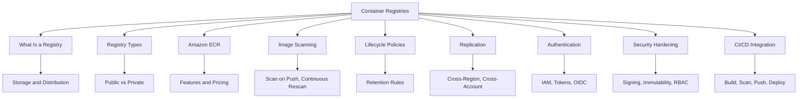
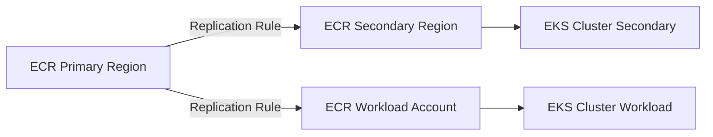
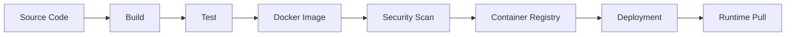
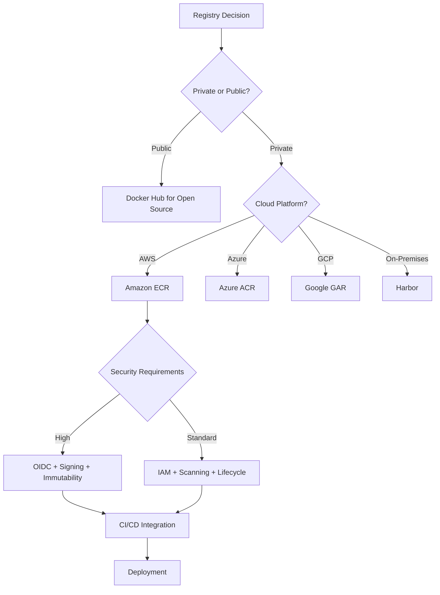

# Lesson 3: Container Registries

A container registry is a centralized storage and distribution system for container images. It is the source of truth for what runs in your clusters. Every deployment pipeline pushes images to a registry and every runtime pulls from one. A registry compromise or misconfiguration has blast radius across every workload that pulls from it. This lesson covers registry types, Amazon ECR features, image scanning, lifecycle policies, authentication, security hardening, and how registries fit into CI/CD pipelines.



## What Is a Container Registry

*Definition*: A container registry is a centralized repository for storing and distributing container images. It stores image layers, manages versions through tags and digests, and provides access control for push and pull operations.

- Registries are the distribution mechanism for container images.
- They store images as layers, sharing common layers between images to save space.
- They expose an API that container runtimes use to pull images.
- They enforce access control so only authorized identities can push or pull.
- The Open Container Initiative (OCI) Distribution Specification defines the industry standard for registry APIs.

> [!Important]
> **The registry is a supply chain control point**: Every image that runs in production came from a registry. If an attacker can push a malicious image or overwrite a tag, every workload that pulls that image is compromised. Treat the registry with the same security rigor as your production clusters.

## Registry Types

Registries fall into two broad categories: public and private. The choice depends on whether images contain proprietary code and what access control you need.

### Public Registries

- Docker Hub is the original and most widely used public registry.
- Public registries are suitable for open-source projects and personal experimentation.
- They often impose rate limits on pulls, which can disrupt production pipelines.
- Docker Hub's free tier limits pull rates for unauthenticated users.

### Private Registries

- Private registries keep proprietary images off the public internet and under access control.
- They provide authentication, authorization, encryption, and auditing.
- Cloud providers offer managed private registries: Amazon ECR, Azure Container Registry (ACR), and Google Artifact Registry (GAR).
- Self-hosted options include Harbor and JFrog Artifactory.
- Private registries reduce the risk of supply chain attacks through controlled access and image scanning.

| Registry | Type | Managed By | Key Feature |
|---|---|---|---|
| Docker Hub | Public | Docker | Largest public image library |
| Amazon ECR | Private | AWS | Deep integration with ECS, EKS, Fargate |
| Azure Container Registry | Private | Microsoft | Geo-replication, ACR Tasks |
| Google Artifact Registry | Private | Google | Multi-format artifact support |
| GitHub Container Registry | Private | GitHub | Integrated with GitHub Actions |
| Harbor | Self-hosted | Open source | Enterprise features, air-gapped environments |

> [!Tip]
> **Use private registries for anything proprietary**: Public registries are fine for open-source base images. For application images that contain your code, configuration, or intellectual property, use a private registry with access control, encryption, and scanning.

## Amazon ECR

*Definition*: Amazon Elastic Container Registry (ECR) is an AWS managed container image registry service that is secure, scalable, and reliable. It supports private repositories with resource-based permissions using AWS IAM, and also supports public repositories through Amazon ECR Public.

- Amazon ECR supports Docker images, Open Container Initiative (OCI) images, and OCI-compatible artifacts.
- It has service endpoints in each supported AWS Region.
- It integrates natively with Amazon ECS, Amazon EKS, and AWS Fargate.
- It supports cross-Region and cross-account replication.
- It supports pull-through cache rules to cache images from upstream registries in your private ECR registry.
- It supports managed signing, which automatically generates cryptographic signatures when images are pushed.
- It supports repository creation templates for controlling settings on automatically created repositories.

### ECR Features Overview

| Feature | Description |
|---|---|
| Lifecycle Policies | Automate cleanup of unused images based on age or count |
| Image Scanning | Scan on push and continuous rescanning for vulnerabilities |
| Cross-Region Replication | Replicate images to multiple Regions for latency and DR |
| Cross-Account Replication | Share images across AWS accounts |
| Pull-Through Cache | Cache images from Docker Hub, GHCR, and other upstream registries |
| Managed Signing | Automatic cryptographic signing of images on push |
| Repository Templates | Control settings for auto-created repositories |
| Tag Immutability | Prevent tag overwrites to protect supply chain integrity |
| Encryption | Encrypt images at rest using AWS KMS |

### ECR Pricing Model

- You pay for storage of images in your repositories.
- You pay for data transfer out of ECR to other Regions or the internet.
- Image scanning has separate pricing depending on the scan type (basic or enhanced).
- There is a free tier: 500 MB of storage per month for 12 months.

> [!Important]
> **ECR is not just storage**: ECR is a security control point. It provides image scanning, lifecycle policies, tag immutability, and managed signing. These features are what turn a registry from a simple storage bucket into a supply chain security tool.

## Image Scanning

*Definition*: Image scanning identifies software vulnerabilities in container images. ECR scans images for known CVEs in OS packages and application dependencies.

### Scan Modes

| Scan Type | Description | When It Runs | Cost |
|---|---|---|---|
| Basic Scanning | Uses Clair open-source scanner | On push or on demand | Free |
| Enhanced Scanning | Uses Amazon Inspector, includes OS and language package CVEs | Continuous, on push, and on demand | Additional cost |

- Basic scanning is triggered when you push an image and can also be run on demand.
- Enhanced scanning runs continuously and re-scans images when new CVEs are published.
- Scan results are available through the ECR console, API, and CLI.
- You can configure repositories to scan on push, ensuring every new image is scanned automatically.

### Continuous Rescanning

- Scan-on-push catches CVEs that exist at the time of push.
- It does nothing about CVEs disclosed after the push.
- The pattern that works is continuous re-scanning of registry contents on a daily cadence.
- Policy enforcement at promotion time between registries or repositories ensures that only images that pass the current policy bar reach production.
- A development registry contains everything. A production registry contains only images that have passed the current policy bar, and promotion is gated on a fresh scan rather than a stale one.

> [!Tip]
> **Scan on push is not enough**: New vulnerabilities are disclosed every day. An image that was clean yesterday may have a critical CVE today. Use continuous rescanning or re-scan at pull time with admission control checking the freshness of the scan result.

## Lifecycle Policies

*Definition*: Lifecycle policies automate the cleanup of unused images in ECR repositories. Without lifecycle policies, images accumulate indefinitely, increasing storage costs and cluttering the registry.

### How Lifecycle Policies Work

- You define rules that specify which images to expire or archive.
- Rules can be based on:
    - Days since image creation.
    - Days since last pull.
    - Days since image was archived.
    - Image count.
    - Tag patterns (with wildcard support).
- Rules have priority. A rule with priority 1 takes precedence over priority 2.
- Once a lifecycle policy is applied, images expire or are archived within 24 hours after meeting the criteria.
- You can test rules before applying them to your repository.

### Example Lifecycle Policy

```json
{
  "rules": [
    {
      "rulePriority": 1,
      "description": "Expire images older than 90 days",
      "selection": {
        "tagStatus": "any",
        "countType": "sinceImagePushed",
        "countUnit": "days",
        "countNumber": 90
      },
      "action": {
        "type": "expire"
      }
    }
  ]
}
```

- This policy expires all images older than 90 days regardless of tag.
- You can create more complex policies that retain a certain number of tagged images and expire untagged images after a shorter period.

| Rule Type | Example | Use Case |
|---|---|---|
| Age-based | Expire images older than 90 days | General cleanup |
| Count-based | Keep only the last 10 images | Feature branches |
| Tag-pattern | Expire `feature-*` after 7 days | Ephemeral branches |
| Untagged | Expire untagged images after 1 day | Build artifacts |

> [!Important]
> **Lifecycle policies are cost control and hygiene**: Every image in a registry costs storage. Without lifecycle policies, repositories grow indefinitely. Use them to manage storage costs and keep the registry clean. Test rules before applying them to avoid accidentally deleting images you need.

## Cross-Region and Cross-Account Replication

*Definition*: ECR replication copies images across Regions and accounts. It is configured as a registry setting and operates on a per-Region basis.

### Replication Use Cases

- Disaster recovery: images available in a secondary Region if the primary Region fails.
- Latency reduction: images closer to the compute that pulls them.
- Multi-account: shared services accounts distribute images to workload accounts.
- Compliance: images resident in specific geographies.

### Replication Configuration

- Configure replication rules at the registry level.
- Rules specify the destination Region and optionally the destination account.
- You can filter which repositories to replicate.
- Replication is automatic for new images that match the filter.
- Existing images can be replicated on demand.



> [!Tip]
> **Use replication for multi-Region and multi-account architectures**: If you run workloads in multiple Regions or accounts, replicate images to each target location. This reduces pull latency, improves disaster recovery, and avoids cross-Region data transfer costs for every pull.

## Authentication and Access Control

ECR uses AWS IAM for authentication and authorization. The Docker CLI does not natively support IAM authentication, so ECR provides an authorization token mechanism.

### Authentication Methods

| Method | Description | Use Case |
|---|---|---|
| Authorization Token | Valid for 12 hours, used to authenticate Docker to ECR | Local development, CI/CD |
| ECR Credential Helper | Automatically obtains and refreshes tokens | Docker CLI on EC2, local machines |
| IAM Roles for Tasks | ECS tasks and EKS pods assume IAM roles for access | Production workloads |
| OIDC Federation | CI/CD systems assume roles via OIDC without long-lived tokens | GitHub Actions, GitLab CI |

- An authorization token is used to access any Amazon ECR registry to which the IAM principal has access and is valid for 12 hours.
- IAM policies control who can push and pull images from specific repositories.
- Repository policies provide resource-based access control for cross-account access.
- Registry policies apply at the registry level across all repositories.

### IAM Policy Example

```json
{
  "Version": "2012-10-17",
  "Statement": [
    {
      "Effect": "Allow",
      "Action": [
        "ecr:GetDownloadUrlForLayer",
        "ecr:BatchGetImage",
        "ecr:BatchCheckLayerAvailability"
      ],
      "Resource": "arn:aws:ecr:us-east-1:123456789012:repository/my-app"
    }
  ]
}
```

- This policy allows pulling images from a specific repository.
- Push permissions should be restricted to CI/CD identities.

> [!Important]
> **Use OIDC federation instead of long-lived tokens**: Static credentials remain the dominant source of registry incidents. A leaked CI runner token can allow an attacker to push a malicious tag before detection. Use short-lived credentials via OIDC, supported by ECR, GAR, GHCR, and most modern registries, with no long-lived tokens issued for push access.

## Security Hardening

The container registry is the most overlooked supply chain control point in most organizations. A registry compromise or misconfiguration has blast radius across every workload that pulls from it.

### Authentication Hardening

- Eliminate long-lived tokens for push access. Use OIDC federation.
- If long-lived tokens cannot be eliminated, scope them aggressively: one token per repository per pipeline, with push permissions only where push is genuinely required.
- Use read-only tokens for production pull paths.
- Isolate push capability to CI identities that cannot be assumed from outside the build environment.
- Rotate credentials on a schedule shorter than the window an attacker would need to exploit a leak.

### Image Signing and Verification

- Cosign signing has become the practical default for container images.
- The question is not whether to sign images but whether verification is enforced at the pull side.
- A signed image with optional verification provides essentially no protection. The attacker who controls the registry can push unsigned malicious tags that pull successfully.
- The enforceable pattern is Kyverno or OPA Gatekeeper policies in Kubernetes that require valid Cosign signatures on every image pulled, with the signing key or Fulcio identity allowlist pinned at the cluster level.
- ECR supports managed signing, which automatically generates cryptographic signatures when images are pushed.

### Tag Immutability

- Tag mutability is the silent enabler of supply chain attacks.
- A registry that allows overwriting a tag means that the image you ran in CI yesterday is not necessarily the image that is pulled today, even by the same tag.
- ECR, GAR, and GHCR all support tag immutability.
- Enable tag immutability for production repositories.
- Pin images by digest, not by tag, in deployment manifests.

### Access Control

- Use IAM policies to enforce least privilege.
- Give developers pull-only access by default.
- Restrict push access to CI/CD pipelines.
- Use repository policies for cross-account access.
- Audit access with CloudTrail.

### Registry Hardening Checklist

| Control | Description |
|---|---|
| OIDC Federation | Short-lived credentials for CI/CD |
| Tag Immutability | Prevent tag overwrites |
| Image Signing | Cosign or ECR managed signing |
| Pull-Side Verification | Kyverno or OPA policies require signatures |
| Continuous Scanning | Daily rescanning for new CVEs |
| Least Privilege IAM | Pull-only for developers, push-only for CI |
| Encryption | KMS encryption at rest |
| Audit Logging | CloudTrail for all registry API calls |
| Lifecycle Policies | Automated cleanup of unused images |
| Repository Templates | Consistent settings for new repositories |

> [!Important]
> **Sign and verify is the control. Sign and hope is theater**: A signed image with optional verification provides no protection. The attacker who controls the registry can push unsigned malicious tags that pull successfully. Enforce verification at the pull side with admission control policies in Kubernetes.

## Registry Comparison

| Dimension | Amazon ECR | Docker Hub | Azure ACR | Google GAR | Harbor |
|---|---|---|---|---|---|
| Type | Private | Public | Private | Private | Self-hosted |
| Free Tier | 500 MB / 12 months | 1 private repo | No free tier | 500 MB / month | N/A |
| Image Scanning | Basic and enhanced | Limited | Microsoft Defender | Built-in | Trivy, Clair |
| Cross-Region Replication | Yes | No | Yes | Yes | Manual |
| Tag Immutability | Yes | No | Yes | Yes | Yes |
| Image Signing | Managed signing | No | Yes | Yes | Cosign |
| Pull-Through Cache | Yes | N/A | Yes | Yes | Yes |
| IAM Integration | Native AWS IAM | Docker accounts | Azure AD / RBAC | Google IAM | LDAP, OIDC |

- Amazon ECR offers the deepest integration with AWS services and IAM.
- Azure ACR offers geo-replication and ACR Tasks for build automation.
- Google Artifact Registry supports multiple artifact formats beyond containers.
- Harbor is suitable for on-premises and air-gapped environments.
- Docker Hub is suitable for public open-source images but has rate limits for production pulls.

> [!Tip]
> **Use the registry that integrates with your platform**: If you run on AWS, ECR gives you native IAM, ECS/EKS integration, and managed signing. If you are multi-cloud, a self-hosted registry like Harbor or a vendor-neutral registry may be preferable.

## CI/CD Integration

Container registries are a core component of CI/CD pipelines. The typical flow is: source code, build, test, Docker image, security scan, registry push, deployment.



- The CI pipeline builds the Docker image from the Dockerfile.
- Tests run against the built image.
- The image is scanned for vulnerabilities. Fail the pipeline on high-severity CVEs.
- The scanned image is pushed to the registry.
- The deployment pulls the image from the registry.
- Use OIDC federation so no long-lived registry credentials live in CI secrets.

### Pipeline Quality Gates

- Fail the build on HIGH or CRITICAL vulnerabilities.
- Require image signing before promotion to production repositories.
- Enforce tag immutability on production repositories.
- Scan before promotion, not just on push.
- Pin base image digests in Dockerfiles.

> [!Tip]
> **Turn the scan into a gate, not a report**: Use `trivy image --severity HIGH,CRITICAL --exit-code 1` to fail the pipeline when high or critical issues appear. A scan that does not block deployment is a scan that nobody reads.

## Assessment Preparation

### Practice Questions

1. Define a container registry and explain its role in the container supply chain.
2. Compare public and private registries and their use cases.
3. Describe the features of Amazon ECR.
4. Explain the difference between basic and enhanced image scanning.
5. Describe how lifecycle policies work and why they matter.
6. Explain how cross-Region and cross-account replication works in ECR.
7. Compare the authentication methods for ECR.
8. Explain why OIDC federation is preferred over long-lived tokens.
9. Describe the role of image signing and pull-side verification.
10. Explain tag immutability and why it matters for supply chain security.
11. Compare Amazon ECR, Docker Hub, Azure ACR, Google GAR, and Harbor.
12. Describe how registries fit into CI/CD pipelines.

### Scenario Questions

**Scenario 1: Production Image Registry**
A company runs production workloads on Amazon EKS and needs a private registry with scanning, replication, and IAM integration. What should they use?

- Use Amazon ECR.
- Enable enhanced scanning for continuous vulnerability detection.
- Configure cross-Region replication for disaster recovery.
- Use IAM roles for EKS pods to pull images without long-lived credentials.
- Enable tag immutability for production repositories.
- Use lifecycle policies to manage storage costs.

**Scenario 2: Secure CI/CD Pipeline**
A security team requires that no long-lived credentials exist in CI and that only signed images reach production. How should they configure this?

- Use OIDC federation between GitHub Actions (or GitLab CI) and AWS IAM.
- No long-lived registry tokens are stored in CI secrets.
- Sign images with Cosign or ECR managed signing.
- Enforce pull-side verification with Kyverno or OPA Gatekeeper.
- Use a separate production registry that only contains images that passed the policy bar.

**Scenario 3: Multi-Region Deployment**
A company deploys workloads in three AWS Regions and needs images available in each Region with low pull latency. How should they configure ECR?

- Configure cross-Region replication rules for each target Region.
- Replication is automatic for new images matching the filter.
- EKS clusters in each Region pull from the local ECR replica.
- This reduces pull latency and avoids cross-Region data transfer costs.

**Scenario 4: Cost-Optimised Registry**
A development team has hundreds of feature-branch images accumulating in ECR, driving up storage costs. How should they manage this?

- Create lifecycle policies that expire untagged images after 1 day.
- Create lifecycle policies that expire `feature-*` tagged images after 7 days.
- Retain only the last 10 tagged images for each repository.
- Test rules before applying to avoid accidental deletion.
- Review lifecycle policy effectiveness monthly.



## Key Takeaways

- A container registry is a centralized storage and distribution system for container images. It is a supply chain control point.
- Public registries like Docker Hub are suitable for open-source images. Private registries like ECR, ACR, and GAR are required for proprietary images.
- Amazon ECR is a managed private registry with deep AWS integration. It supports lifecycle policies, image scanning, cross-Region replication, pull-through cache, and managed signing.
- Image scanning identifies CVEs in container images. Scan-on-push catches existing vulnerabilities, but continuous rescanning is needed to catch newly disclosed CVEs.
- Lifecycle policies automate cleanup of unused images based on age, count, or tag patterns. They reduce storage costs and keep the registry clean.
- Cross-Region and cross-account replication places images where they are needed for latency, disaster recovery, and multi-account architectures.
- ECR authentication uses IAM. The Docker CLI does not natively support IAM, so ECR provides authorization tokens and credential helpers.
- OIDC federation is preferred over long-lived tokens for CI/CD. It eliminates static credentials that can be leaked.
- Image signing with Cosign or ECR managed signing provides tamper evidence. Pull-side verification with Kyverno or OPA Gatekeeper enforces it.
- Tag immutability prevents tag overwrites and protects against supply chain attacks. Enable it for production repositories.
- Use the registry that integrates with your platform. ECR for AWS, ACR for Azure, GAR for GCP, and Harbor for on-premises.
- Registries are a core component of CI/CD pipelines. Build, test, scan, push, and deploy.
- Turn image scanning into a quality gate, not a report. Fail the pipeline on high-severity vulnerabilities.

> [!Important]
> **Treat the registry as a production system**: The registry is the source of truth for what runs in your clusters. A registry compromise has blast radius across every workload. Use OIDC federation instead of static tokens. Sign images and verify signatures at the pull side. Enable tag immutability. Scan continuously, not just on push. Automate cleanup with lifecycle policies. The registry is not a storage bucket. It is a security control point.
