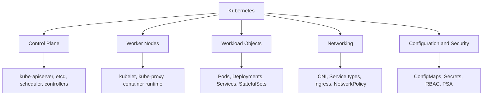
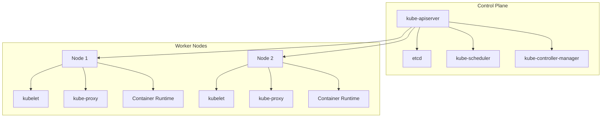
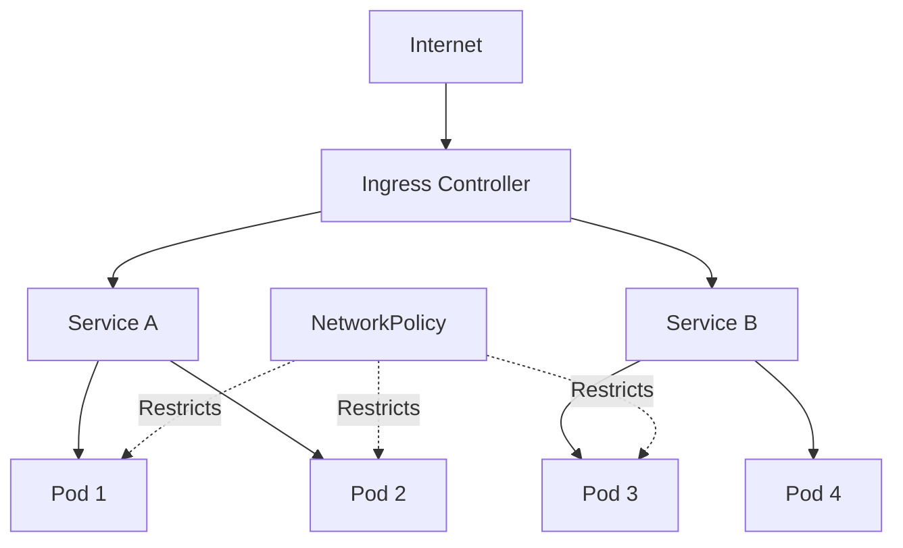

# Migration in progress
# Lesson 4: Introduction to Kubernetes

Kubernetes is an open-source container orchestration platform that automates the deployment, scaling, and management of containerized applications. It abstracts individual machines into a pool of compute so you think in terms of pods and services, not which VM runs which process. A cluster consists of a control plane and worker nodes that together maintain the desired state of your workloads.

## What Is Kubernetes

*Definition*: Kubernetes is an open-source container orchestration platform that automates the deployment, scaling, and operations of containerized applications. You declare desired state in YAML, and controllers continuously reconcile actual state toward that target.

- Kubernetes solves the problems of manual container management: scheduling, self-healing, scaling, and service discovery.
- It abstracts the underlying infrastructure. You work with pods and services, not individual servers.
- Managed clusters like Amazon EKS, Google GKE, and Azure AKS hide the control plane, but you still debug the same workload objects with `kubectl`.

> [!Important]
> **Kubernetes is declarative, not imperative**: You describe what you want, not how to do it. Controllers compare actual state to desired state and take action to close the gap. This is the fundamental mental model for everything in Kubernetes.

## Cluster Architecture

A Kubernetes cluster consists of a control plane and one or more worker nodes. The control plane manages the cluster, and worker nodes run the containerized applications.

### Control Plane Components

The control plane makes global decisions about the cluster, detects and responds to cluster events, and maintains the desired state.

| Component | Description |
|---|---|
| kube-apiserver | Exposes the Kubernetes HTTP API. All `kubectl` commands go here. |
| etcd | Consistent and highly-available key-value store for all API server data. |
| kube-scheduler | Watches for newly created Pods and assigns them to suitable nodes. |
| kube-controller-manager | Runs controllers that implement Kubernetes API behavior (Deployments, ReplicaSets, etc.). |
| cloud-controller-manager | Integrates with the underlying cloud provider (optional). |

- The control plane is usually distributed across multiple nodes for fault tolerance.
- In managed clusters (EKS, GKE, AKS), the control plane is managed by the cloud provider.
- All cluster data is stored in etcd. Backing up etcd is critical for disaster recovery.

> [!Important]
> **The API server is the front door to the cluster**: Every request, whether from `kubectl`, a controller, or a kubelet, goes through the kube-apiserver. It authenticates, authorizes, validates, and persists objects to etcd. If the API server is down, the cluster cannot make changes.

### Worker Node Components

Worker nodes run the containerized workloads. Every node runs three key components.

| Component | Description |
|---|---|
| kubelet | Agent that runs on every node. Ensures Pods and their containers are running. |
| kube-proxy | Maintains network rules on nodes to implement Services (ClusterIP, NodePort, LoadBalancer). |
| Container Runtime | Software responsible for running containers (containerd, CRI-O, or Docker via shim). |

- The kubelet receives Pod specs from the API server and ensures the containers described in those specs are running.
- kube-proxy programs iptables or IPVS rules so Service virtual IPs route to healthy Pod endpoints.
- The container runtime pulls images and runs containers via the Container Runtime Interface (CRI).
- On Windows, the CRI integrates with Host Compute Service (HCS) and Host Networking Service (HNS).

> [!Tip]
> **Managed clusters hide the control plane, not the concepts**: EKS, GKE, and AKS manage the control plane for you, but understanding kube-apiserver, etcd, and the scheduler is still essential for debugging and designing resilient workloads.

## Core Workload Objects

Kubernetes uses a layered set of resource types to deploy and manage applications. Each layer adds capabilities like networking, self-healing, and zero-downtime upgrades on top of the one below it.

### Pods

*Definition*: A Pod is the smallest deployable unit in Kubernetes. It represents a single instance of a running process in the cluster and can contain one or more containers that share a network namespace, IP address, and storage.

- A Pod is not a container. A Pod can hold multiple containers that share a single IP address, localhost, IPC space, network ports, and volumes.
- Containers within a Pod communicate via localhost. Pod-to-Pod communication is done via Services.
- Pods are ephemeral. If a Pod fails, it cannot restart itself. This is why you use higher-level controllers.
- Pods are assigned a unique cluster-private IP address.

> [!Important]
> **Pods are ephemeral, Services are stable**: Pod IPs change when Pods are recreated. Applications should always connect to Services, not Pod IPs directly. This is the fundamental networking pattern in Kubernetes.

### Deployments

*Definition*: A Deployment manages a set of replicas of a Pod. It provides declarative updates, self-healing, and zero-downtime rollouts.

- Deployments sit above ReplicaSets and perform rolling upgrades one Pod at a time.
- Built-in rollback if something goes wrong.
- Deployments are for stateless applications.
- You declare the desired number of replicas, and the Deployment ensures that number is running.

### StatefulSets

*Definition*: A StatefulSet manages stateful applications, providing stable identity and storage for each Pod.

- StatefulSets provide stable, unique network identifiers and persistent storage.
- Use them for databases, message queues, and other stateful workloads.
- Databases cannot be replicated using Deployments because they are stateful.
- Each Pod in a StatefulSet has a stable hostname and can be associated with its own PersistentVolume.

### DaemonSets

*Definition*: A DaemonSet ensures that a copy of a Pod runs on all (or some) nodes in the cluster.

- Use DaemonSets for per-node agents such as monitoring agents, log collectors, and network plugins.
- When a new node is added to the cluster, the DaemonSet automatically adds a Pod to it.

### Jobs and CronJobs

- Jobs run to completion. Use them for batch processing and one-time tasks.
- CronJobs run on a schedule. Use them for recurring tasks like backups and report generation.

### Workload Object Comparison

| Object | Use Case | State | Scaling |
|---|---|---|---|
| Pod | Single instance, lowest level | Ephemeral | Manual |
| Deployment | Stateless apps, rolling updates | Stateless | Replicas |
| StatefulSet | Databases, message queues | Stateful | Ordered, stable identity |
| DaemonSet | Per-node agents | Stateless | One per node |
| Job | Batch processing | Run-to-completion | Parallelism |
| CronJob | Scheduled tasks | Run-to-completion | Schedule-based |

> [!Tip]
> **Choose the right workload type**: Use StatefulSets for persistent storage needs, DaemonSets for per-node agents, and Jobs or CronJobs for batch processing instead of defaulting to Deployments for every workload.

## Services and Networking

Kubernetes networking provides each Pod with its own cluster-private IP address, enables Pod-to-Pod communication without NAT, and provides stable Service endpoints for dynamic Pod sets.

### The Kubernetes Network Model

- Every Pod gets its own unique cluster-wide IP address.
- Pods have their own private network namespace. All containers in a Pod share that namespace.
- Containers within a Pod communicate via localhost.
- Pods can communicate with all other Pods without NAT, regardless of which node they are on.
- Nodes can communicate with all Pods on that node.
- Services provide stable IP addresses or hostnames for a set of Pods that can change at any time.
- Kubernetes automatically manages EndpointSlice objects to track which Pods are backing a Service.

### Service Types

*Definition*: A Service is a network abstraction over a set of Pods that provides a stable DNS record and virtual IP, automatically tracking IP changes and load-balancing traffic.

| Service Type | Description | Use Case |
|---|---|---|
| ClusterIP | Internal-only IP within the cluster | Internal microservice communication |
| NodePort | Exposes service on each node's IP at a static port | Development, simple external access |
| LoadBalancer | Provisions an external load balancer | Production external access |
| ExternalName | Maps service to a DNS name | External dependencies |

- ClusterIP is the default. It creates an internal IP for use within the cluster.
- NodePort creates a mapping from a port on each node to the Service.
- LoadBalancer provisions a cloud provider load balancer for external access.
- ExternalName returns a CNAME record with the value of the external name.

### Ingress

*Definition*: Ingress exposes HTTP and HTTPS routes from outside the cluster to Services within the cluster. It provides Layer 7 routing based on hostnames and paths.

- Ingress requires an ingress controller (NGINX, Traefik, HAProxy, AWS Load Balancer Controller).
- Ingress allows you to define routing rules for domain names and paths.
- Gateway API is the successor to Ingress and provides more expressive routing.

### Network Policies

*Definition*: NetworkPolicy is a built-in Kubernetes API that allows you to control traffic between Pods, or between Pods and the outside world.

- NetworkPolicy provides pod-level firewall rules so you can implement least privilege (default deny, explicit allow).
- Requires a CNI implementation that supports NetworkPolicy, otherwise policies are ignored.
- Common CNI plugins that support NetworkPolicy: Calico, Cilium, Weave Net.
- Policies are defined with ingress and egress rules based on labels, IP blocks, and ports.

> [!Important]
> **NetworkPolicies are default-allow unless you create a default-deny policy**: Kubernetes does not deny traffic by default. If you want zero-trust micro-segmentation, you must create a NetworkPolicy that selects all Pods in a namespace and denies all ingress and egress, then add explicit allow rules for required traffic.

## Configuration and Secrets

Kubernetes separates configuration and sensitive data from application code.

### ConfigMaps

*Definition*: A ConfigMap stores non-sensitive configuration data as key-value pairs or files.

- Use ConfigMaps for application configuration that varies between environments.
- ConfigMaps can be injected into Pods as environment variables or mounted as files.
- ConfigMaps are not encrypted at rest.

### Secrets

*Definition*: A Secret stores sensitive data such as passwords, tokens, and certificates.

- Secrets are base64-encoded at rest by default. Base64 encoding is not encryption.
- Enable encryption at rest for Secrets using a KMS provider.
- Secrets can be injected as environment variables or mounted as files.
- Use a secrets management solution like AWS Secrets Manager or HashiCorp Vault for production.

> [!Important]
> **Base64 is not encryption**: Secrets are base64-encoded, not encrypted, by default. Anyone with access to etcd can read them. Enable encryption at rest and use a dedicated secrets manager for production workloads.

## Namespaces and RBAC

### Namespaces

*Definiti