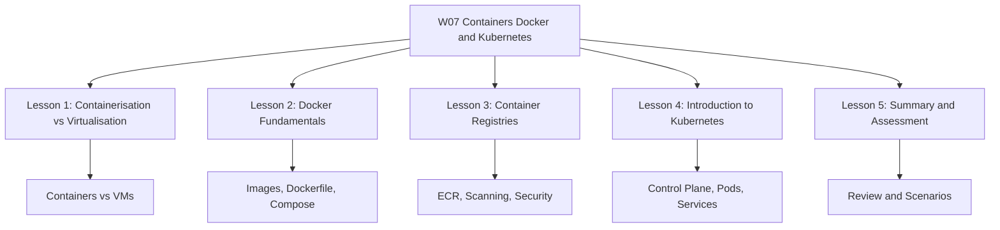

# Migration in progress
# W07: Containers: Docker and Kubernetes - Lesson 5: Summary and Assessment

This module covers containerization, Docker, Kubernetes, and the AWS container services that run them. It explains how containers differ from virtual machines, how Docker packages applications, how Kubernetes orchestrates containers at scale, how registries secure the supply chain, and how to choose between Amazon ECS, Amazon EKS, and AWS Fargate. The goal is to build the knowledge needed to deploy and manage containerized workloads on AWS.

## Containerisation vs Virtualisation Summary

*Definition*: Virtualisation abstracts hardware through a hypervisor. Each VM runs its own guest OS and kernel. Containerisation abstracts the operating system. Containers share the host kernel and package only the application and its user-space dependencies.

| Dimension | Virtual Machines | Containers |
|---|---|---|
| Virtualisation Level | Hardware | Operating system |
| Kernel | Dedicated per VM | Shared with host |
| Startup Time | Minutes | Seconds |
| Image Size | Gigabytes | Megabytes |
| Isolation | Strong (hardware) | Process-level |
| Resource Overhead | High | Low |
| Density per Host | Lower | Higher |
| Portability | Hypervisor-dependent | Runtime-dependent |
| Security Boundary | Strong | Requires hardening |
| Best For | Legacy, strong isolation, specific OS | Microservices, stateless apps, portability |

- VMs are strongly isolated and suitable for multi-tenant or untrusted workloads.
- Containers are lightweight, fast to start, and highly portable.
- Containers are not a security boundary by default. Harden them with non-root users, seccomp, AppArmor or SELinux, capability dropping, and network policies.
- Running containers inside VMs is a common production pattern that combines density with strong isolation.

> [!Important]
> **The kernel is the key difference**: VMs have their own kernel. Containers share the host kernel. This single design choice explains almost every other difference, including startup time, resource usage, isolation strength, and portability.

## Docker Fundamentals Summary

*Definition*: Docker is a containerization platform that packages an application with its dependencies into a standardized unit called a container. It provides a consistent runtime across development, testing, CI/CD, and production.

### Docker Architecture

| Component | Description |
|---|---|
| Docker Client | CLI that talks to the Docker daemon via REST API |
| Docker Daemon | Server process (dockerd) managing images, containers, networks, volumes |
| Docker Images | Read-only templates built from Dockerfiles |
| Docker Containers | Running instances of images |
| Docker Registry | Central repository for storing and distributing images |

### Images, Layers, and Dockerfiles

- Images are built in layers. Each Dockerfile instruction creates a layer.
- Layers are cached and reused. Place frequently changing instructions near the end.
- Multi-stage builds reduce image size from hundreds of MB to tens of MB.
- Common instructions: FROM, WORKDIR, COPY, RUN, EXPOSE, CMD, ENV, USER.

### Networking and Volumes

| Network Driver | Use Case |
|---|---|
| bridge | Default, single-host container communication |
| host | Share host network stack |
| overlay | Multi-host networking |
| macvlan | Container on physical LAN |
| none | No networking |

- Volumes provide persistent storage outside the container's writable layer.
- Bind mounts map host directories into containers for development.
- Never store important data in the container writable layer.

### Docker Compose

- Defines multi-container applications in a single YAML file.
- Manages services, networks, volumes, and environment variables.
- Used for local development and testing.
- For production, use Kubernetes or Amazon ECS/EKS.

### Docker Security Best Practices

- Use minimal base images.
- Run containers as non-root.
- Scan images for vulnerabilities in CI/CD.
- Keep secrets out of image layers.
- Use read-only filesystems, drop capabilities, apply seccomp profiles.

> [!Tip]
> **Multi-stage builds are the single most effective way to reduce image size**: They eliminate build tools, package managers, and intermediate artifacts from the final image. This reduces both storage costs and attack surface.

## Container Registries Summary

*Definition*: A container registry is a centralized storage and distribution system for container images. It is a supply chain control point.

### Registry Types

| Registry | Type | Key Feature |
|---|---|---|
| Docker Hub | Public | Largest public image library |
| Amazon ECR | Private | Deep AWS integration |
| Azure ACR | Private | Geo-replication, ACR Tasks |
| Google GAR | Private | Multi-format artifact support |
| Harbor | Self-hosted | Enterprise features, air-gapped |

### Amazon ECR Features

- Lifecycle policies for automated cleanup.
- Image scanning (basic and enhanced).
- Cross-Region and cross-account replication.
- Pull-through cache for upstream registries.
- Managed signing for images.
- Tag immutability to prevent overwrites.
- Encryption at rest with KMS.

### Security Hardening

- Use OIDC federation instead of long-lived tokens.
- Sign images with Cosign or ECR managed signing.
- Enforce pull-side verification with Kyverno or OPA Gatekeeper.
- Enable tag immutability for production repositories.
- Scan continuously, not just on push.
- Use least privilege IAM for pull and push.

> [!Important]
> **Sign and verify is the control. Sign and hope is theater**: A signed image with optional verification provides no protection. Enforce verification at the pull side with admission control policies in Kubernetes.

## Kubernetes Summary

*Definition*: Kubernetes is an open-source container orchestration platform that automates the deployment, scaling, and management of containerized applications.

### Cluster Architecture

| Component | Description |
|---|---|
| kube-apiserver | Exposes the Kubernetes HTTP API |
| etcd | Key-value store for all cluster data |
| kube-scheduler | Assigns Pods to nodes |
| kube-controller-manager | Runs controllers |
| cloud-controller-manager | Integrates with cloud provider |
| kubelet | Ensures containers are running on each node |
| kube-proxy | Maintains network rules for Services |
| Container Runtime | Runs containers (containerd, CRI-O) |

### Core Workload Objects

| Object | Use Case | State |
|---|---|---|
| Pod | Single instance, lowest level | Ephemeral |
| Deployment | Stateless apps, rolling updates | Stateless |
| StatefulSet | Databases, message queues | Stateful |
| DaemonSet | Per-node agents | Stateless |
| Job | Batch processing | Run-to-completion |
| CronJob | Scheduled tasks | Run-to-completion |

### Services and Networking

| Service Type | Description | Use Case |
|---|---|---|
| ClusterIP | Internal-only IP | Internal microservice communication |
| NodePort | Exposes on each node's IP | Development, simple external access |
| LoadBalancer | Provisions external load balancer | Production external access |
| ExternalName | Maps to DNS name | External dependencies |

- Ingress provides Layer 7 HTTP/HTTPS routing.
- NetworkPolicy provides pod-level firewall rules. Default is allow-all unless you create a default-deny policy.
- The Kubernetes network model gives every Pod a unique cluster-wide IP address.

### Configuration and Security

- ConfigMaps store non-sensitive configuration.
- Secrets store sensitive data. Enable encryption at rest.
- RBAC controls access with Roles, ClusterRoles, RoleBindings, and ClusterRoleBindings.
- Pod Security Admission replaced PodSecurityPolicy in v1.25. Levels: privileged, baseline, restricted.
- Kubernetes security requires layered controls: RBAC, PSA, image signing, network policies, secrets management, audit logging.

> [!Important]
> **Pods are ephemeral, Services are stable**: Pod IPs change when Pods are recreated. Applications should always connect to Services, not Pod IPs directly. This is the fundamental networking pattern in Kubernetes.

## AWS Container Services Summary

| Service | Type | Control Plane Fee | Best For |
|---|---|---|---|
| Amazon ECS | AWS-proprietary orchestrator | None | Simplicity and deep AWS integration |
| Amazon EKS | Managed Kubernetes | $0.10 per cluster-hour | Kubernetes portability and ecosystem |
| AWS Fargate | Serverless compute for containers | None (pay for resources) | Eliminating node management |
| Amazon ECR | Container registry | None (pay for storage) | Storing and scanning container images |

- ECS is simpler and deeply integrated with AWS services. No control plane fee.
- EKS is managed Kubernetes with portability and access to the CNCF ecosystem. Control plane fee applies.
- Fargate works with both ECS and EKS to eliminate node management.
- ECR integrates nativ