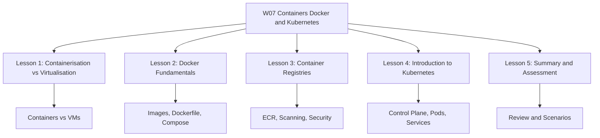
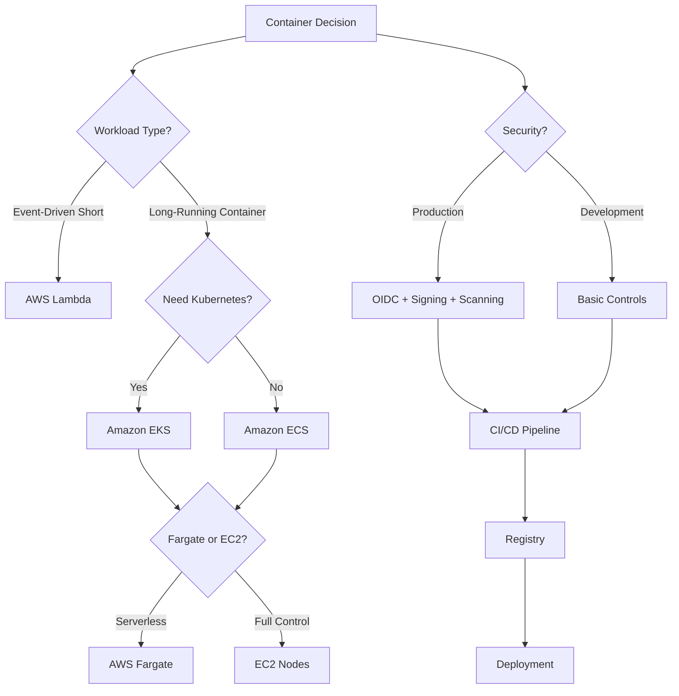

# W07: Containers: Docker and Kubernetes - Lesson 5: Summary and Assessment

This module covers containerization, Docker, Kubernetes, and the AWS container services that run them. It explains how containers differ from virtual machines, how Docker packages applications, how Kubernetes orchestrates containers at scale, how registries secure the supply chain, and how to choose between Amazon ECS, Amazon EKS, and AWS Fargate. The goal is to build the knowledge needed to deploy and manage containerized workloads on AWS.

## Containerisation vs Virtualisation Summary

*Definition*: Virtualisation abstracts hardware through a hypervisor. Each VM runs its own guest OS and kernel. Containerisation abstracts the operating system. Containers share the host kernel and package only the application and its user-space dependencies.

| Dimension | Virtual Machines | Containers |
|---|---|---|
| Virtualisation Level | Hardware | Operating system |
| Kernel | Dedicated per VM | Shared with host |
| Startup Time | Minutes | Seconds |
| Image Size | Gigabytes | Megabytes |
| Isolation | Strong (hardware) | Process-level |
| Resource Overhead | High | Low |
| Density per Host | Lower | Higher |
| Portability | Hypervisor-dependent | Runtime-dependent |
| Security Boundary | Strong | Requires hardening |
| Best For | Legacy, strong isolation, specific OS | Microservices, stateless apps, portability |

- VMs are strongly isolated and suitable for multi-tenant or untrusted workloads.
- Containers are lightweight, fast to start, and highly portable.
- Containers are not a security boundary by default. Harden them with non-root users, seccomp, AppArmor or SELinux, capability dropping, and network policies.
- Running containers inside VMs is a common production pattern that combines density with strong isolation.

> [!Important]
> **The kernel is the key difference**: VMs have their own kernel. Containers share the host kernel. This single design choice explains almost every other difference, including startup time, resource usage, isolation strength, and portability.

## Docker Fundamentals Summary

*Definition*: Docker is a containerization platform that packages an application with its dependencies into a standardized unit called a container. It provides a consistent runtime across development, testing, CI/CD, and production.

### Docker Architecture

| Component | Description |
|---|---|
| Docker Client | CLI that talks to the Docker daemon via REST API |
| Docker Daemon | Server process (dockerd) managing images, containers, networks, volumes |
| Docker Images | Read-only templates built from Dockerfiles |
| Docker Containers | Running instances of images |
| Docker Registry | Central repository for storing and distributing images |

### Images, Layers, and Dockerfiles

- Images are built in layers. Each Dockerfile instruction creates a layer.
- Layers are cached and reused. Place frequently changing instructions near the end.
- Multi-stage builds reduce image size from hundreds of MB to tens of MB.
- Common instructions: FROM, WORKDIR, COPY, RUN, EXPOSE, CMD, ENV, USER.

### Networking and Volumes

| Network Driver | Use Case |
|---|---|
| bridge | Default, single-host container communication |
| host | Share host network stack |
| overlay | Multi-host networking |
| macvlan | Container on physical LAN |
| none | No networking |

- Volumes provide persistent storage outside the container's writable layer.
- Bind mounts map host directories into containers for development.
- Never store important data in the container writable layer.

### Docker Compose

- Defines multi-container applications in a single YAML file.
- Manages services, networks, volumes, and environment variables.
- Used for local development and testing.
- For production, use Kubernetes or Amazon ECS/EKS.

### Docker Security Best Practices

- Use minimal base images.
- Run containers as non-root.
- Scan images for vulnerabilities in CI/CD.
- Keep secrets out of image layers.
- Use read-only filesystems, drop capabilities, apply seccomp profiles.

> [!Tip]
> **Multi-stage builds are the single most effective way to reduce image size**: They eliminate build tools, package managers, and intermediate artifacts from the final image. This reduces both storage costs and attack surface.

## Container Registries Summary

*Definition*: A container registry is a centralized storage and distribution system for container images. It is a supply chain control point.

### Registry Types

| Registry | Type | Key Feature |
|---|---|---|
| Docker Hub | Public | Largest public image library |
| Amazon ECR | Private | Deep AWS integration |
| Azure ACR | Private | Geo-replication, ACR Tasks |
| Google GAR | Private | Multi-format artifact support |
| Harbor | Self-hosted | Enterprise features, air-gapped |

### Amazon ECR Features

- Lifecycle policies for automated cleanup.
- Image scanning (basic and enhanced).
- Cross-Region and cross-account replication.
- Pull-through cache for upstream registries.
- Managed signing for images.
- Tag immutability to prevent overwrites.
- Encryption at rest with KMS.

### Security Hardening

- Use OIDC federation instead of long-lived tokens.
- Sign images with Cosign or ECR managed signing.
- Enforce pull-side verification with Kyverno or OPA Gatekeeper.
- Enable tag immutability for production repositories.
- Scan continuously, not just on push.
- Use least privilege IAM for pull and push.

> [!Important]
> **Sign and verify is the control. Sign and hope is theater**: A signed image with optional verification provides no protection. Enforce verification at the pull side with admission control policies in Kubernetes.

## Kubernetes Summary

*Definition*: Kubernetes is an open-source container orchestration platform that automates the deployment, scaling, and management of containerized applications.

### Cluster Architecture

| Component | Description |
|---|---|
| kube-apiserver | Exposes the Kubernetes HTTP API |
| etcd | Key-value store for all cluster data |
| kube-scheduler | Assigns Pods to nodes |
| kube-controller-manager | Runs controllers |
| cloud-controller-manager | Integrates with cloud provider |
| kubelet | Ensures containers are running on each node |
| kube-proxy | Maintains network rules for Services |
| Container Runtime | Runs containers (containerd, CRI-O) |

### Core Workload Objects

| Object | Use Case | State |
|---|---|---|
| Pod | Single instance, lowest level | Ephemeral |
| Deployment | Stateless apps, rolling updates | Stateless |
| StatefulSet | Databases, message queues | Stateful |
| DaemonSet | Per-node agents | Stateless |
| Job | Batch processing | Run-to-completion |
| CronJob | Scheduled tasks | Run-to-completion |

### Services and Networking

| Service Type | Description | Use Case |
|---|---|---|
| ClusterIP | Internal-only IP | Internal microservice communication |
| NodePort | Exposes on each node's IP | Development, simple external access |
| LoadBalancer | Provisions external load balancer | Production external access |
| ExternalName | Maps to DNS name | External dependencies |

- Ingress provides Layer 7 HTTP/HTTPS routing.
- NetworkPolicy provides pod-level firewall rules. Default is allow-all unless you create a default-deny policy.
- The Kubernetes network model gives every Pod a unique cluster-wide IP address.

### Configuration and Security

- ConfigMaps store non-sensitive configuration.
- Secrets store sensitive data. Enable encryption at rest.
- RBAC controls access with Roles, ClusterRoles, RoleBindings, and ClusterRoleBindings.
- Pod Security Admission replaced PodSecurityPolicy in v1.25. Levels: privileged, baseline, restricted.
- Kubernetes security requires layered controls: RBAC, PSA, image signing, network policies, secrets management, audit logging.

> [!Important]
> **Pods are ephemeral, Services are stable**: Pod IPs change when Pods are recreated. Applications should always connect to Services, not Pod IPs directly. This is the fundamental networking pattern in Kubernetes.

## AWS Container Services Summary

| Service | Type | Control Plane Fee | Best For |
|---|---|---|---|
| Amazon ECS | AWS-proprietary orchestrator | None | Simplicity and deep AWS integration |
| Amazon EKS | Managed Kubernetes | $0.10 per cluster-hour | Kubernetes portability and ecosystem |
| AWS Fargate | Serverless compute for containers | None (pay for resources) | Eliminating node management |
| Amazon ECR | Container registry | None (pay for storage) | Storing and scanning container images |

- ECS is simpler and deeply integrated with AWS services. No control plane fee.
- EKS is managed Kubernetes with portability and access to the CNCF ecosystem. Control plane fee applies.
- Fargate works with both ECS and EKS to eliminate node management.
- ECR integrates natively with ECS, EKS, and Fargate.

### ECS vs EKS Comparison

| Dimension | Amazon ECS | Amazon EKS |
|---|---|---|
| Orchestration Engine | AWS-proprietary | Kubernetes (open source) |
| Learning Curve | Lower | Higher |
| AWS Integration | Deep native integration | Good integration |
| Portability | AWS-only | Multi-cloud and on-premises |
| Ecosystem | Smaller, AWS-specific | Large Kubernetes ecosystem |
| Control Plane Fee | None | $0.10 per cluster-hour |
| Best For | Teams wanting simplicity | Teams needing Kubernetes portability |

> [!Tip]
> **Start with ECS Fargate for simplicity**: It eliminates both control plane and node management. Move to EKS when you need the Kubernetes ecosystem, and move to EC2-backed nodes when you need full control.

## Assessment Preparation

### Practice Questions

1. Define containerization and explain how it differs from virtualization.
2. Describe the components of Docker's client-server architecture.
3. Explain how Docker images and layers work.
4. Describe the purpose of a Dockerfile and list common instructions.
5. Explain how multi-stage builds reduce image size.
6. Compare Docker bridge, host, and overlay networks.
7. Explain the role of Docker volumes and how they differ from bind mounts.
8. Describe the purpose of Docker Compose.
9. Compare Docker Hub and Amazon ECR.
10. List five Docker security best practices.
11. Define a container registry and explain its role in the container supply chain.
12. Compare public and private registries and their use cases.
13. Describe the features of Amazon ECR.
14. Explain the difference between basic and enhanced image scanning.
15. Describe how lifecycle policies work and why they matter.
16. Explain how cross-Region and cross-account replication works in ECR.
17. Compare the authentication methods for ECR.
18. Explain why OIDC federation is preferred over long-lived tokens.
19. Describe the role of image signing and pull-side verification.
20. Explain tag immutability and why it matters for supply chain security.
21. Define Kubernetes and explain how it works declaratively.
22. Describe the components of the Kubernetes control plane.
23. Describe the components of a Kubernetes worker node.
24. Explain the difference between a Pod, a Deployment, and a Service.
25. Compare StatefulSets, DaemonSets, and Jobs.
26. Explain the Kubernetes network model.
27. Compare ClusterIP, NodePort, and LoadBalancer Services.
28. Describe the purpose of Ingress and NetworkPolicy.
29. Compare ConfigMaps and Secrets.
30. Explain the role of RBAC and how Roles and ClusterRoles differ.
31. Describe Pod Security Admission and its three profiles.
32. List five Kubernetes security best practices.
33. Compare Amazon ECS and Amazon EKS across at least five dimensions.
34. Explain the purpose of AWS Fargate and how it differs from Lambda.
35. Describe container best practices for image optimization and security.

### Scenario Questions

**Scenario 1: Simple Microservices Platform**
A team is building a microservices platform and wants to minimize operational overhead. They have no existing Kubernetes expertise. What should they use?

- Use Amazon ECS with AWS Fargate.
- ECS provides deep AWS integration and a low learning curve.
- Fargate eliminates node management.
- No control plane fee.
- Use ECR for image storage and scanning.

**Scenario 2: Multi-Cloud Kubernetes Platform**
A company needs to run Kubernetes across AWS, GCP, and on-premises. What should they use?

- Use Amazon EKS for Kubernetes compatibility and portability.
- Use Fargate or EC2-backed nodes depending on control requirements.
- Leverage the CNCF ecosystem: ArgoCD, Prometheus, Istio.
- Accept the control plane fee and higher operational overhead.

**Scenario 3: Event-Driven Image Processing**
An application needs to process images uploaded to S3 and generate thumbnails. Which compute service should they use?

- Use AWS Lambda triggered by S3 upload events.
- Lambda is ideal for short-lived, event-driven tasks.
- No container management required.
- Pay only for compute time used.

**Scenario 4: Long-Running Batch Processing**
A company needs to run batch processing jobs that take 2-4 hours each. Which service should they use?

- Use AWS Fargate or ECS on EC2.
- Fargate supports long-running containerized workloads with fine-grained resource control.
- Use Spot capacity for cost savings where possible.
- Lambda is not suitable due to the 15-minute timeout.

**Scenario 5: Secure CI/CD Pipeline**
A security team requires that no long-lived credentials exist in CI and that only signed images reach production. How should they configure this?

- Use OIDC federation between GitHub Actions (or GitLab CI) and AWS IAM.
- No long-lived registry tokens are stored in CI secrets.
- Sign images with Cosign or ECR managed signing.
- Enforce pull-side verification with Kyverno or OPA Gatekeeper.
- Use a separate production registry that only contains images that passed the policy bar.

**Scenario 6: Stateful Database on Kubernetes**
A company needs to run a PostgreSQL database on Kubernetes with persistent storage and stable network identity. What should they use?

- Use a StatefulSet.
- Each Pod gets a stable hostname and its own PersistentVolume.
- Use a headless Service for stable network identity.
- Consider using a managed database service (Amazon RDS) instead.

**Scenario 7: Zero-Trust Network Security**
A security team requires that only the API gateway can talk to the payment service, and only the payment service can talk to the database. How should this be enforced?

- Create a default-deny NetworkPolicy for the namespace.
- Add explicit allow rules for API gateway to payment service and payment service to database.
- Use labels to select Pods.
- Ensure the CNI supports NetworkPolicy enforcement.

## Key Takeaways

- Containers share the host OS kernel and are lightweight, fast to start, and highly portable. VMs have their own kernel and provide stronger isolation.
- Docker is the leading containerization platform. It uses a client-server architecture with images, containers, and registries.
- Docker images are built in layers. Multi-stage builds and minimal base images reduce size and attack surface.
- Docker volumes provide persistent storage outside the container's writable layer.
- Docker Compose defines and manages multi-container applications for local development.
- A container registry is a supply chain control point. Use private registries for proprietary images.
- Amazon ECR is a managed private registry with lifecycle policies, image scanning, replication, and managed signing.
- Image scanning identifies CVEs. Continuous rescanning is needed to catch newly disclosed vulnerabilities.
- OIDC federation eliminates long-lived tokens in CI/CD. Sign images and verify signatures at the pull side.
- Tag immutability prevents tag overwrites and protects against supply chain attacks.
- Kubernetes is an open-source orchestration platform with a control plane and worker nodes.
- Pods are the smallest deployable unit. Deployments manage stateless apps. StatefulSets manage stateful apps. DaemonSets run per-node agents. Jobs and CronJobs handle batch tasks.
- Services provide stable networking for dynamic Pod sets. Ingress provides Layer 7 routing. NetworkPolicy provides pod-level firewall rules.
- ConfigMaps store non-sensitive configuration. Secrets store sensitive data. Enable encryption at rest for Secrets.
- RBAC controls access. Pod Security Admission enforces pod security. Kubernetes security requires layered controls.
- Amazon ECS is simpler and deeply integrated with AWS. Amazon EKS is managed Kubernetes with portability. AWS Fargate eliminates node management.
- Choose ECS for simplicity, EKS for Kubernetes portability, and Fargate to eliminate node management.
- Container best practices include minimal images, non-root execution, health checks, resource limits, and image scanning.
- Containers are not a security boundary. Use additional controls to harden workloads.
- This module builds on W02 architecture, W03 provider comparison, W04 AWS foundations, W05 compute services, and W06 VPC networking.
- Assessment focuses on practical container platform selection, security, and scenario-based decision making.

> [!Important]
> **Choose the simplest container platform that meets your needs**: ECS with Fargate handles most containerized workloads with minimal operational overhead. Choose EKS only when you need the Kubernetes ecosystem or multi-cloud portability. Choose EC2-backed nodes only when you need full control over the underlying instances. Secure the supply chain with OIDC, image signing, continuous scanning, and tag immutability. The right choice depends on team skills, portability requirements, and operational maturity.
