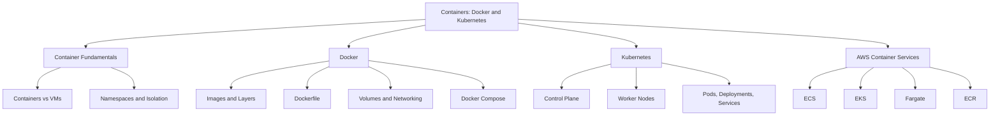
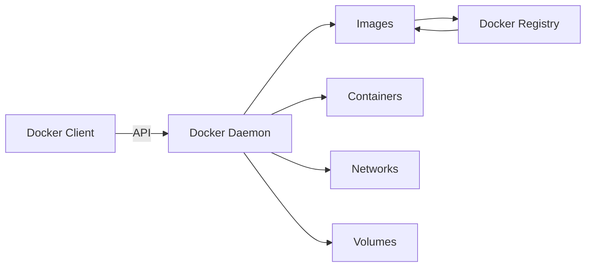
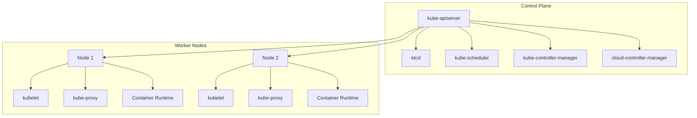
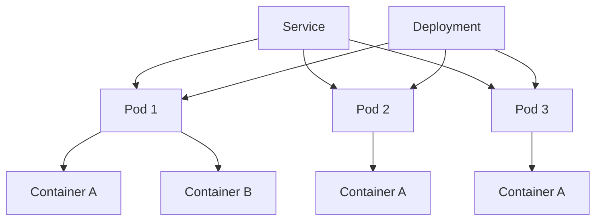

# Migration in progress
# W07: Containers: Docker and Kubernetes

This module covers containerization fundamentals, Docker, Kubernetes, and the AWS container services that run them: ECS, EKS, and Fargate. It explains how containers differ from virtual machines, how Docker packages applications, how Kubernetes orchestrates them at scale, and how to choose between AWS container platforms.

## Container Fundamentals

*Definition*: Containerization is the process of packaging an application and its required dependencies into an isolated runtime environment. A container shares the host operating system kernel but maintains process, filesystem, network, and resource isolation.

### Containers vs Virtual Machines

| Dimension | Virtual Machines | Containers |
|---|---|---|
| Virtualization Level | Hardware-level | OS-level |
| Guest OS | Each VM has its own OS kernel | Containers share the host OS kernel |
| Startup Time | Minutes | Seconds |
| Resource Usage | Higher (each VM runs a full OS) | Lower (lightweight) |
| Isolation | Strong (hardware-level) | Process-level |
| Portability | Limited by OS dependencies | Highly portable across environments |
| Size | Gigabytes | Megabytes |

- Containers are lightweight because they do not boot a full operating system. They emulate only what is necessary for a single piece of software to run.
- Containers provide lighter isolation than VMs. They are not a strong security boundary by themselves.
- Containers are ideal for running and packaging applications. Full VMs are better when the task depends on a complete operating system.

> [!Important]
> **Containers share the kernel, VMs do not**: The shared kernel is what makes containers fast and lightweight. It is also why containers are less isolated than VMs. Do not treat a container as a security boundary without additional controls.

## Docker

*Definition*: Docker is a containerization platform that packages an application together with its dependencies into a standardized unit called a container. It provides a consistent application runtime across development, testing, CI/CD, and production environments.

### Docker Architecture

Docker follows a client-server architecture. The main components are the Docker Client, Docker Daemon, Docker Images, Docker Containers, and Docker Registry.

- The Docker Client communicates with the Docker daemon using the Docker API.
- The Docker daemon manages Docker objects: images, containers, networks, and volumes.
- A Docker Registry stores and distributes container images. Docker Hub is a commonly used public registry.

### Docker Images and Layers

*Definition*: A Docker image is an immutable package containing the application code, runtime, libraries, dependencies, and configuration required to create a container. A container is a running instance of an image.

- Images are built in layers. Each instruction in a Dockerfile creates a layer.
- Layers are cached and reused. If a layer has not changed, Docker reuses the cached version, making builds faster.
- The union filesystem and copy-on-write mechanism enable layer reuse and efficient storage.

> [!Tip]
> **Use multi-stage builds to reduce image size**: Multi-stage builds can reduce Docker images from 800 MB to 15-30 MB. Use minimal base images like Alpine or distroless for smaller, more secure containers.

### Dockerfile

*Definition*: A Dockerfile defines how a Docker image is built. It describes the base image, application dependencies, environment configuration, files to include, and the application startup command.

- Dockerfiles are stored with application source code so images can be built consistently through CI/CD pipelines.
- Common instructions include FROM, RUN, COPY, WORKDIR, ENV, EXPOSE, and CMD.

### Docker Networking

Docker provides networking capabilities that allow containers to communicate with each other and with external systems.

| Network Type | Description | Use Case |
|---|---|---|
| Bridge | Default network for containers on the same host | Container-to-container communication |
| Host | Container shares the host network namespace | High-performance networking |
| Overlay | Multi-host networking across Docker hosts | Swarm clusters, distributed apps |
| None | No networking | Isolated workloads |

- Port publishing maps container ports to host ports for external access.
- Containers in the same bridge network can communicate by container name.

### Docker Volumes

*Definition*: Docker volumes provide persistent storage outside the container's writable layer. They are used when containers need to retain data across container recreation.

- Containers are designed to be replaceable. Their writable filesystem should not be treated as permanent storage.
- Volumes are stored on the host filesystem and managed by Docker.
- Bind mounts map a host directory directly into a container.

> [!Important]
> **Containers are ephemeral by design**: Never store important data inside a container's writable layer. Use volumes, bind mounts, or external storage services like S3 or EBS for persistent data.

### Docker Compose

*Definition*: Docker Compose is used to define and manage multi-container applications. A Compose configuration describes services such as the application, database, Redis, message broker, and reverse proxy.

- Compose allows the architecture and configuration of a multi-container application to be defined declaratively in a YAML file.
- It is primarily used for local development and testing environments.
- For production orchestration at scale, Kubernetes or AWS ECS/EKS is used instead.

### Docker in CI/CD

Docker is widely used in CI/CD pipelines. A typical workflow is: source code, build, test, Docker image, security scan, container registry, deployment.

> [!Tip]
> **Scan images for vulnerabilities before deployment**: Integrate image scanning into the CI/CD pipeline. Tools like Trivy, Clair, or Amazon ECR image scanning identify vulnerabilities before images reach production.

## Kubernetes

*Definition*: Kubernetes is an open-source container orchestration platform that automates the deployment, scaling, and management of containerized applications. A Kubernetes cluster consists of a control plane and a set of worker nodes that run containerized applications.

### Cluster Architecture

A Kubernetes cluster consists of a control plane and one or more worker nodes. The control plane manages the nodes and pods in the cluster. In production environments, the control plane typically runs on multiple computers for fault tolerance and high availability.

### Control Plane Components

| Component | Description |
|---|---|
| kube-apiserver | Front-end for the control plane. Exposes the Kubernetes API. |
| etcd | Consistent and highly available key-value store for cluster data. |
| kube-scheduler | Watches for newly created pods and assigns them to nodes. |
| kube-controller-manager | Runs controller processes that regulate the cluster state. |
| cloud-controller-manager | Integrates with the underlying cloud provider. |

### Worker Node Components

| Component | Description |
|---|---|
| kubelet | Agent that runs on each node. Ensures containers are running in a pod. |
| kube-proxy | Network proxy that maintains network rules on nodes. |
| Container Runtime | Software responsible for running containers (containerd, CRI-O). |

### Pods, Deployments, and Services

*Definition*: A Pod is the smallest deployable unit in Kubernetes. It represents a single instance of a running process in the cluster and can contain one or more containers that share a network namespace, IP address, and storage.

*Definition*: A Deployment manages a set of replicas of a Pod. It provides declarative updates, self-healing, and zero-downtime rollouts.

*Definition*: A Service exposes a set of Pods as a network service with a stable DNS name and IP address. It provides load balancing across Pods.

- Kubernetes assigns each Pod a unique cluster-private IP address. Pods can communicate without NAT.
- Services provide stable network endpoints. They distribute incoming traffic among multiple Pods.
- Deployments add capabilities like self-healing and zero-downtime upgrades on top of Pods.

> [!Important]
> **Pods are ephemeral, Services are stable**: Pod IPs change when Pods are recreated. Applications should always connect to Services, not Pod IPs directly. This is the fundamental networking pattern in Kubernetes.

### Kubernetes Networking

- Kubernetes provides each Pod with its own cluster-private IP address.
- Containers within a Pod share the network namespace and can communicate via localhost.
- Services provide stable IP addresse