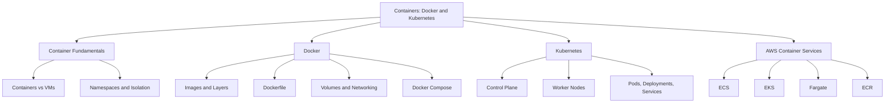
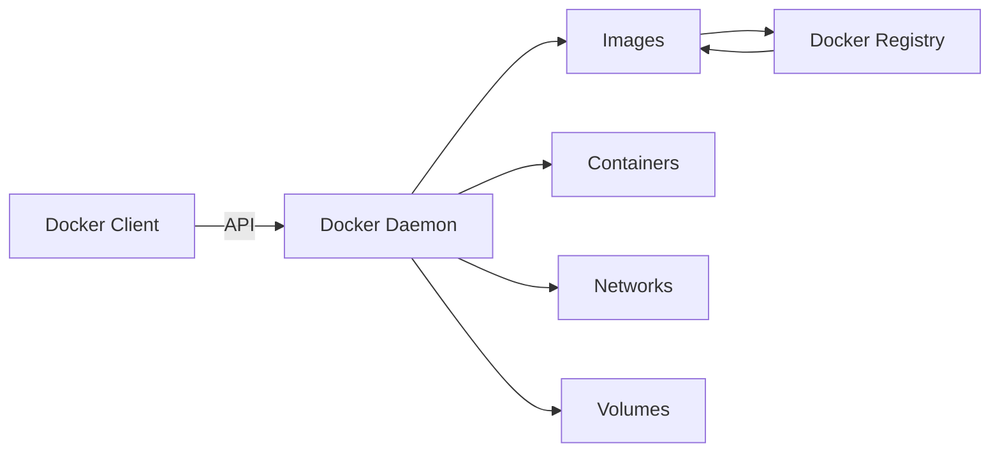
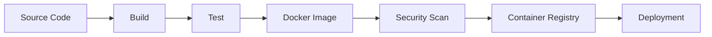
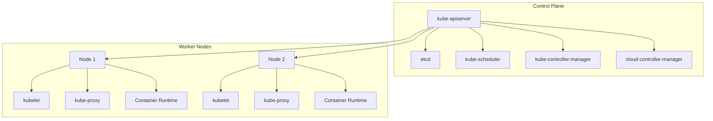
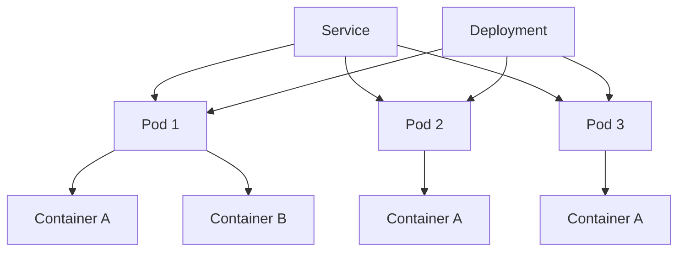
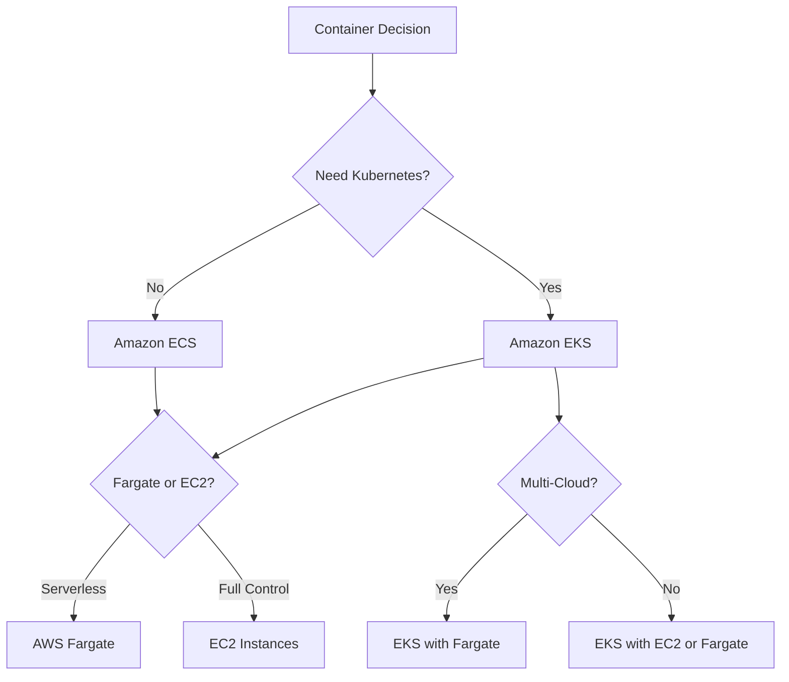

# W07: Containers: Docker and Kubernetes

This module covers containerization fundamentals, Docker, Kubernetes, and the AWS container services that run them: ECS, EKS, and Fargate. It explains how containers differ from virtual machines, how Docker packages applications, how Kubernetes orchestrates them at scale, and how to choose between AWS container platforms.

## Container Fundamentals

*Definition*: Containerization is the process of packaging an application and its required dependencies into an isolated runtime environment. A container shares the host operating system kernel but maintains process, filesystem, network, and resource isolation.

### Containers vs Virtual Machines

| Dimension | Virtual Machines | Containers |
|---|---|---|
| Virtualization Level | Hardware-level | OS-level |
| Guest OS | Each VM has its own OS kernel | Containers share the host OS kernel |
| Startup Time | Minutes | Seconds |
| Resource Usage | Higher (each VM runs a full OS) | Lower (lightweight) |
| Isolation | Strong (hardware-level) | Process-level |
| Portability | Limited by OS dependencies | Highly portable across environments |
| Size | Gigabytes | Megabytes |

- Containers are lightweight because they do not boot a full operating system. They emulate only what is necessary for a single piece of software to run.
- Containers provide lighter isolation than VMs. They are not a strong security boundary by themselves.
- Containers are ideal for running and packaging applications. Full VMs are better when the task depends on a complete operating system.

> [!Important]
> **Containers share the kernel, VMs do not**: The shared kernel is what makes containers fast and lightweight. It is also why containers are less isolated than VMs. Do not treat a container as a security boundary without additional controls.

## Docker

*Definition*: Docker is a containerization platform that packages an application together with its dependencies into a standardized unit called a container. It provides a consistent application runtime across development, testing, CI/CD, and production environments.

### Docker Architecture

Docker follows a client-server architecture. The main components are the Docker Client, Docker Daemon, Docker Images, Docker Containers, and Docker Registry.

- The Docker Client communicates with the Docker daemon using the Docker API.
- The Docker daemon manages Docker objects: images, containers, networks, and volumes.
- A Docker Registry stores and distributes container images. Docker Hub is a commonly used public registry.

### Docker Images and Layers

*Definition*: A Docker image is an immutable package containing the application code, runtime, libraries, dependencies, and configuration required to create a container. A container is a running instance of an image.

- Images are built in layers. Each instruction in a Dockerfile creates a layer.
- Layers are cached and reused. If a layer has not changed, Docker reuses the cached version, making builds faster.
- The union filesystem and copy-on-write mechanism enable layer reuse and efficient storage.

> [!Tip]
> **Use multi-stage builds to reduce image size**: Multi-stage builds can reduce Docker images from 800 MB to 15-30 MB. Use minimal base images like Alpine or distroless for smaller, more secure containers.

### Dockerfile

*Definition*: A Dockerfile defines how a Docker image is built. It describes the base image, application dependencies, environment configuration, files to include, and the application startup command.

- Dockerfiles are stored with application source code so images can be built consistently through CI/CD pipelines.
- Common instructions include FROM, RUN, COPY, WORKDIR, ENV, EXPOSE, and CMD.

### Docker Networking

Docker provides networking capabilities that allow containers to communicate with each other and with external systems.

| Network Type | Description | Use Case |
|---|---|---|
| Bridge | Default network for containers on the same host | Container-to-container communication |
| Host | Container shares the host network namespace | High-performance networking |
| Overlay | Multi-host networking across Docker hosts | Swarm clusters, distributed apps |
| None | No networking | Isolated workloads |

- Port publishing maps container ports to host ports for external access.
- Containers in the same bridge network can communicate by container name.

### Docker Volumes

*Definition*: Docker volumes provide persistent storage outside the container's writable layer. They are used when containers need to retain data across container recreation.

- Containers are designed to be replaceable. Their writable filesystem should not be treated as permanent storage.
- Volumes are stored on the host filesystem and managed by Docker.
- Bind mounts map a host directory directly into a container.

> [!Important]
> **Containers are ephemeral by design**: Never store important data inside a container's writable layer. Use volumes, bind mounts, or external storage services like S3 or EBS for persistent data.

### Docker Compose

*Definition*: Docker Compose is used to define and manage multi-container applications. A Compose configuration describes services such as the application, database, Redis, message broker, and reverse proxy.

- Compose allows the architecture and configuration of a multi-container application to be defined declaratively in a YAML file.
- It is primarily used for local development and testing environments.
- For production orchestration at scale, Kubernetes or AWS ECS/EKS is used instead.

### Docker in CI/CD

Docker is widely used in CI/CD pipelines. A typical workflow is: source code, build, test, Docker image, security scan, container registry, deployment.

> [!Tip]
> **Scan images for vulnerabilities before deployment**: Integrate image scanning into the CI/CD pipeline. Tools like Trivy, Clair, or Amazon ECR image scanning identify vulnerabilities before images reach production.

## Kubernetes

*Definition*: Kubernetes is an open-source container orchestration platform that automates the deployment, scaling, and management of containerized applications. A Kubernetes cluster consists of a control plane and a set of worker nodes that run containerized applications.

### Cluster Architecture

A Kubernetes cluster consists of a control plane and one or more worker nodes. The control plane manages the nodes and pods in the cluster. In production environments, the control plane typically runs on multiple computers for fault tolerance and high availability.

### Control Plane Components

| Component | Description |
|---|---|
| kube-apiserver | Front-end for the control plane. Exposes the Kubernetes API. |
| etcd | Consistent and highly available key-value store for cluster data. |
| kube-scheduler | Watches for newly created pods and assigns them to nodes. |
| kube-controller-manager | Runs controller processes that regulate the cluster state. |
| cloud-controller-manager | Integrates with the underlying cloud provider. |

### Worker Node Components

| Component | Description |
|---|---|
| kubelet | Agent that runs on each node. Ensures containers are running in a pod. |
| kube-proxy | Network proxy that maintains network rules on nodes. |
| Container Runtime | Software responsible for running containers (containerd, CRI-O). |

### Pods, Deployments, and Services

*Definition*: A Pod is the smallest deployable unit in Kubernetes. It represents a single instance of a running process in the cluster and can contain one or more containers that share a network namespace, IP address, and storage.

*Definition*: A Deployment manages a set of replicas of a Pod. It provides declarative updates, self-healing, and zero-downtime rollouts.

*Definition*: A Service exposes a set of Pods as a network service with a stable DNS name and IP address. It provides load balancing across Pods.

- Kubernetes assigns each Pod a unique cluster-private IP address. Pods can communicate without NAT.
- Services provide stable network endpoints. They distribute incoming traffic among multiple Pods.
- Deployments add capabilities like self-healing and zero-downtime upgrades on top of Pods.

> [!Important]
> **Pods are ephemeral, Services are stable**: Pod IPs change when Pods are recreated. Applications should always connect to Services, not Pod IPs directly. This is the fundamental networking pattern in Kubernetes.

### Kubernetes Networking

- Kubernetes provides each Pod with its own cluster-private IP address.
- Containers within a Pod share the network namespace and can communicate via localhost.
- Services provide stable IP addresses and DNS names for sets of Pods.
- Ingress exposes HTTP and HTTPS routes from outside the cluster to Services within the cluster.

| Service Type | Description | Use Case |
|---|---|---|
| ClusterIP | Internal-only IP within the cluster | Internal microservice communication |
| NodePort | Exposes service on each node's IP at a static port | Development, simple external access |
| LoadBalancer | Provisions an external load balancer | Production external access |
| ExternalName | Maps service to a DNS name | External dependencies |

## AWS Container Services

AWS provides multiple container orchestration options. The choice depends on team skills, portability requirements, and operational overhead tolerance.

### Amazon ECS

*Definition*: Amazon Elastic Container Service (ECS) is a fully managed container orchestration service that simplifies the deployment, management, and scaling of containerized applications.

- ECS is an AWS-proprietary orchestrator designed for simplicity and deep AWS integration.
- It uses simple concepts: task definitions and services.
- No control plane fee. You pay only for the compute resources consumed.
- Deep integration with Application Load Balancers, Secrets Manager, and CloudWatch Logs.
- Lower learning curve compared to Kubernetes.

### Amazon EKS

*Definition*: Amazon Elastic Kubernetes Service (EKS) is a managed Kubernetes service that makes it easy to run Kubernetes on AWS without operating the control plane.

- EKS runs standard Kubernetes, giving access to the open-source CNCF ecosystem: Prometheus, Istio, ArgoCD, Karpenter, KEDA.
- Cloud portability: workloads can move to GCP, Azure, or on-premises with less lock-in than ECS.
- Fine-grained scaling with Horizontal Pod Autoscalers and advanced VPC CNI techniques.
- Control plane fee: $0.10 per cluster-hour (roughly $73 per month).
- Higher operational overhead than ECS.

### AWS Fargate

*Definition*: AWS Fargate is a serverless compute engine for containers that works with both Amazon ECS and Amazon EKS. It automatically manages the underlying infrastructure so you focus on deploying and scaling containerized applications.

- No EC2 instances to provision, patch, or manage.
- Serverless, pay-as-you-go compute engine.
- Ideal for long-running applications, microservices, and batch processing.
- Works with both ECS and EKS.

### Amazon ECR

*Definition*: Amazon Elastic Container Registry (ECR) is a fully managed container registry for storing, managing, and deploying container images.

- Integrated with ECS, EKS, and Fargate.
- Supports image scanning for vulnerabilities.
- Supports cross-Region replication and lifecycle policies.

### ECS vs EKS Comparison

| Dimension | Amazon ECS | Amazon EKS |
|---|---|---|
| Orchestration Engine | AWS-proprietary | Kubernetes (open source) |
| Learning Curve | Lower | Higher |
| AWS Integration | Deep native integration | Good integration |
| Portability | AWS-only | Multi-cloud and on-premises |
| Ecosystem | Smaller, AWS-specific | Large Kubernetes ecosystem |
| Control Plane Fee | None | $0.10 per cluster-hour |
| Best For | Teams wanting simplicity and AWS-native tooling | Teams needing Kubernetes portability and ecosystem |

> [!Important]
> **EKS pays back its complexity only when you need the Kubernetes ecosystem**: If your team does not already use Kubernetes or need multi-cloud portability, ECS is simpler and more cost-effective.

### Fargate vs Lambda

| Dimension | AWS Fargate | AWS Lambda |
|---|---|---|
| Compute Model | Serverless containers | Serverless functions |
| Runtime | Any language or framework in a container | Supported runtimes only |
| Max Runtime | Unlimited | 15 minutes |
| Resource Control | Fine-grained CPU and memory | Memory only |
| Use Case | Long-running apps, microservices, batch | Event-driven, short-lived tasks |

- Fargate is ideal for containerized applications that need specific resource allocation or persistent processes.
- Lambda is ideal for event-driven, short-duration tasks and unpredictable workloads.

## Container Decision Framework

- Start with ECS unless you have a specific need for Kubernetes.
- Use Fargate to eliminate node management for both ECS and EKS.
- Use EC2-backed nodes when you need full control over the underlying instances.
- Choose EKS when portability or the Kubernetes ecosystem is a genuine requirement.

> [!Tip]
> **Start with ECS Fargate for simplicity**: It eliminates both control plane and node management. Move to EKS when you need the Kubernetes ecosystem, and move to EC2-backed nodes when you need full control.

## Container Best Practices

### Image Optimization

- Use multi-stage builds to reduce image size.
- Use minimal base images: Alpine, distroless, or scratch.
- Tag images with semantic versions and git commit SHAs.
- Scan images for vulnerabilities in CI/CD.
- Do not run containers as root.

### Application Design

- Design for statelessness. Store state in external services.
- Externalize configuration using environment variables or ConfigMaps.
- Implement health checks and readiness probes.
- Use graceful shutdown to handle termination signals.
- Handle SIGTERM to allow in-flight requests to complete.

### Security

- Use least-privilege IAM roles for tasks and pods.
- Scan images for vulnerabilities before deployment.
- Use private registries instead of public ones for production.
- Enable encryption for data at rest and in transit.
- Use network policies to restrict pod-to-pod communication.

### Operations

- Implement centralized logging and monitoring.
- Use horizontal pod autoscaling based on CPU, memory, or custom metrics.
- Set resource requests and limits for CPU and memory.
- Use namespaces and quotas for multi-tenancy.
- Automate deployments with CI/CD pipelines.

> [!Important]
> **Containers are not a security boundary**: Containers share the host kernel. Do not rely on container isolation alone for security. Use additional controls such as seccomp, AppArmor, SELinux, and network policies to harden container workloads.

## Assessment Preparation

### Practice Questions

1. Explain the difference between containers and virtual machines.
2. Describe the components of Docker's client-server architecture.
3. Explain how Docker images and layers work.
4. Describe the purpose of a Dockerfile and list common instructions.
5. Compare Docker bridge, host, and overlay networks.
6. Explain the role of Docker volumes.
7. Describe the components of a Kubernetes cluster.
8. Explain the relationship between Pods, Deployments, and Services.
9. Compare Amazon ECS and Amazon EKS across at least five dimensions.
10. Explain the purpose of AWS Fargate and how it differs from Lambda.
11. Describe container best practices for image optimization and security.

### Scenario Questions

**Scenario 1: Simple Microservices Platform**
A team is building a microservices platform and wants to minimize operational overhead. They have no existing Kubernetes expertise. What should they use?

- Use Amazon ECS with AWS Fargate.
- ECS provides deep AWS integration and a low learning curve.
- Fargate eliminates node management.
- No control plane fee.
- Use ECR for image storage and scanning.

**Scenario 2: Multi-Cloud Kubernetes Platform**
A company needs to run Kubernetes across AWS, GCP, and on-premises. What should they use?

- Use Amazon EKS for Kubernetes compatibility and portability.
- Use Fargate or EC2-backed nodes depending on control requirements.
- Leverage the CNCF ecosystem: ArgoCD, Prometheus, Istio.
- Accept the control plane fee and higher operational overhead.

**Scenario 3: Event-Driven Image Processing**
An application needs to process images uploaded to S3 and generate thumbnails. Which compute service should they use?

- Use AWS Lambda triggered by S3 upload events.
- Lambda is ideal for short-lived, event-driven tasks.
- No container management required.
- Pay only for compute time used.

**Scenario 4: Long-Running Batch Processing**
A company needs to run batch processing jobs that take 2-4 hours each. Which service should they use?

- Use AWS Fargate or ECS on EC2.
- Fargate supports long-running containerized workloads with fine-grained resource control.
- Use Spot capacity for cost savings where possible.
- Lambda is not suitable due to the 15-minute timeout.

## Key Takeaways

- Containers package an application with its dependencies into a portable, isolated unit. They share the host OS kernel and are lightweight compared to VMs.
- Docker is the leading containerization platform. It uses a client-server architecture with images, containers, and registries.
- Docker images are built in layers. Multi-stage builds and minimal base images reduce size and attack surface.
- Docker volumes provide persistent storage outside the container's writable layer.
- Kubernetes is an open-source orchestration platform with a control plane and worker nodes.
- Pods are the smallest deployable unit. Deployments manage replicas. Services provide stable networking.
- Amazon ECS is a fully managed container orchestrator with deep AWS integration and no control plane fee.
- Amazon EKS is managed Kubernetes with portability and access to the CNCF ecosystem. It has a control plane fee.
- AWS Fargate is a serverless compute engine for containers that works with both ECS and EKS.
- Choose ECS for simplicity, EKS for Kubernetes portability, and Fargate to eliminate node management.
- Container best practices include minimal images, non-root execution, health checks, resource limits, and image scanning.
- Containers are not a security boundary. Use additional controls to harden workloads.

> [!Important]
> **Choose the simplest container platform that meets your needs**: ECS with Fargate handles most containerized workloads with minimal operational overhead. Choose EKS only when you need the Kubernetes ecosystem or multi-cloud portability. Choose EC2-backed nodes only when you need full control over the underlying instances. The right choice depends on team skills, portability requirements, and operational maturity.
