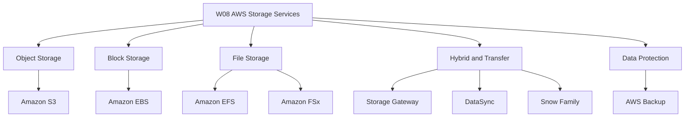
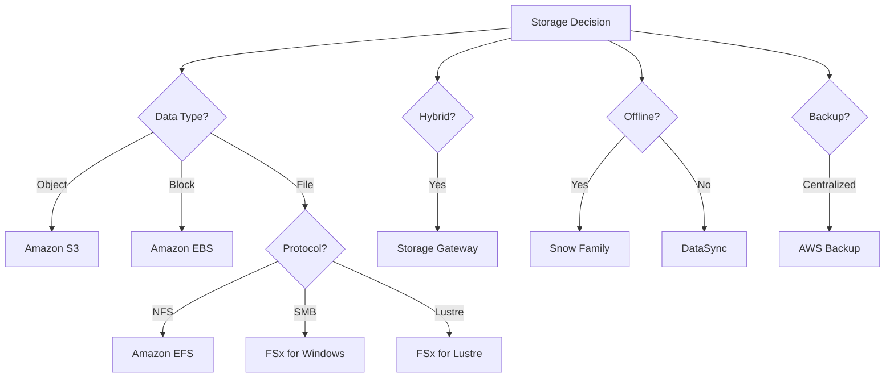

# Migration in progress
The lesson content was not supplied, so these notes synthesize the expected topics for this module introduction.

# W08: AWS Storage Services - Lesson 0: Module Introduction

This module introduces the AWS storage portfolio: object, block, file, hybrid, and data transfer services. It covers when to use each service, how they differ, and how to design storage for durability, performance, and cost. The goal is to build the knowledge needed to select and configure the right storage service for any workload.

## Module Purpose

- Explain the AWS storage portfolio and the problem each service solves.
- Compare object, block, file, and hybrid storage across access patterns, durability, and cost.
- Describe S3 storage classes, lifecycle policies, and bucket types.
- Describe EBS volume types, snapshots, and encryption.
- Describe EFS and FSx file system options.
- Explain hybrid storage with Storage Gateway and data transfer with DataSync and Snow Family.
- Introduce centralized backup with AWS Backup.
- Prepare for hands-on labs and scenario-based assessment.

## Learning Objectives

- Define object, block, and file storage and identify when to use each.
- Compare S3 storage classes and design lifecycle policies.
- Select the appropriate EBS volume type for a workload.
- Explain how EBS snapshots and encryption work.
- Compare EFS and the four FSx file system types.
- Describe the four Storage Gateway types and their use cases.
- Explain the purpose of AWS Backup, DataSync, and the Snow Family.
- Design a storage architecture that meets durability, performance, and cost requirements.

> [!Tip]
> **Start with the data type**: The first question in any storage decision is whether the data is an object, a block, or a file. That single question eliminates most of the options and narrows the choice to two or three services.

## Module Structure

| Lesson | Topic | Focus |
|---|---|---|
| Lesson 0 | Module Introduction | Scope and objectives |
| Lesson 1 | Amazon S3 | Bucket types, storage classes, lifecycle, security |
| Lesson 2 | Amazon EBS | Volume types, snapshots, encryption |
| Lesson 3 | Amazon EFS and FSx | File storage options |
| Lesson 4 | Hybrid and Transfer | Storage Gateway, DataSync, Snow Family |
| Lesson 5 | AWS Backup and Summary | Centralized protection, review, scenarios |

## Core Concepts Preview

### Object Storage: Amazon S3

*Definition*: S3 is an object storage service that stores data as objects within buckets. It provides 11 nines of durability and virtually unlimited scalability.

- Four bucket types: general purpose, directory (Express One Zone), table (S3 Tables), and vector (S3 Vectors).
- Storage classes range from Standard to Glacier Deep Archive.
- Lifecycle policies automate transitions and expiration.
- Versioning and Object Lock protect against deletion and overwrites.
- Block Public Access prevents accidental exposure.

| Storage Class | Use Case | Retrieval Time |
|---|---|---|
| S3 Standard | Frequently accessed data | Milliseconds |
| S3 Intelligent-Tiering | Unknown access patterns | Milliseconds |
| S3 Standard-IA | Infrequent access | Milliseconds |
| S3 Glacier Instant Retrieval | Archive with instant access | Milliseconds |
| S3 Glacier Flexible Retrieval | Archive, minutes to hours | 1-12 hours |
| S3 Glacier Deep Archive | Long-term archive | 12-48 hours |

### Block Storage: Amazon EBS

*Definition*: EBS provides persistent block-level storage volumes for EC2 instances. Volumes are network-attached and replicated within an Availability Zone.

- gp3 is the default general purpose SSD.
- io2 Block Express is for mission-critical, high-IOPS databases.
- st1 and sc1 are HDD-backed for throughput and cold data.
- Snapshots are incremental and stored in S3.
- Encryption protects data at rest, in transit, and in snapshots.

### File Storage: Amazon EFS and FSx

*Definition*: EFS is a serverless, elastic NFS file system for Linux. FSx provides managed file systems for specific workloads.

| Service | Protocol | Best For |
|---|---|---|
| Amazon EFS | NFS | Shared Linux file storage, containers |
| FSx for Windows | SMB | Windows workloads, Active Directory |
| FSx for Lustre | Lustre | HPC, ML training |
| FSx for NetApp ONTAP | NFS, SMB, iSCSI | Multi-protocol, NAS migration |
| FSx for OpenZFS | NFS | ZFS migration, Linux workloads |

### Hybrid Storage: Storage Gateway

- S3 File Gateway: NFS/SMB file shares backed by S3.
- FSx File Gateway: low-latency access to FSx for Windows.
- Volume Gateway: iSCSI block storage backed by S3 and EBS snapshots.
- Tape Gateway: virtual tape library for backup to S3 and Glacier.

### Data Protection and Transfer

- AWS Backup centralizes backup across AWS services with policy-based schedules and retention.
- DataSync moves data between on-premises and AWS, or between AWS storage services.
- Snow Family provides physical devices for offline data transfer and edge computing.

> [!Important]
> **Match the storage service to the data type and acc