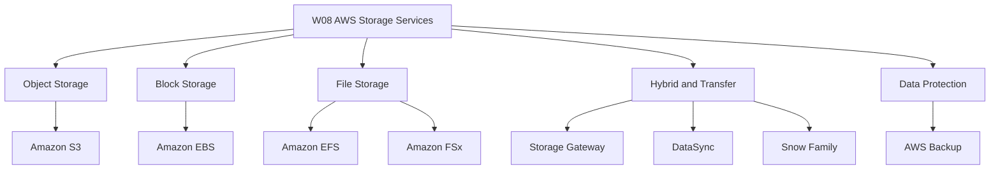
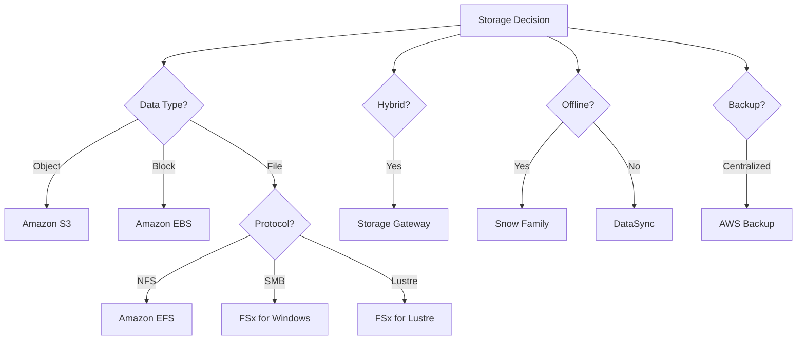
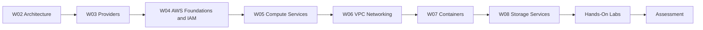

The lesson content was not supplied, so these notes synthesize the expected topics for this module introduction.

# W08: AWS Storage Services - Lesson 0: Module Introduction

This module introduces the AWS storage portfolio: object, block, file, hybrid, and data transfer services. It covers when to use each service, how they differ, and how to design storage for durability, performance, and cost. The goal is to build the knowledge needed to select and configure the right storage service for any workload.

## Module Purpose

- Explain the AWS storage portfolio and the problem each service solves.
- Compare object, block, file, and hybrid storage across access patterns, durability, and cost.
- Describe S3 storage classes, lifecycle policies, and bucket types.
- Describe EBS volume types, snapshots, and encryption.
- Describe EFS and FSx file system options.
- Explain hybrid storage with Storage Gateway and data transfer with DataSync and Snow Family.
- Introduce centralized backup with AWS Backup.
- Prepare for hands-on labs and scenario-based assessment.

## Learning Objectives

- Define object, block, and file storage and identify when to use each.
- Compare S3 storage classes and design lifecycle policies.
- Select the appropriate EBS volume type for a workload.
- Explain how EBS snapshots and encryption work.
- Compare EFS and the four FSx file system types.
- Describe the four Storage Gateway types and their use cases.
- Explain the purpose of AWS Backup, DataSync, and the Snow Family.
- Design a storage architecture that meets durability, performance, and cost requirements.

> [!Tip]
> **Start with the data type**: The first question in any storage decision is whether the data is an object, a block, or a file. That single question eliminates most of the options and narrows the choice to two or three services.

## Module Structure

| Lesson | Topic | Focus |
|---|---|---|
| Lesson 0 | Module Introduction | Scope and objectives |
| Lesson 1 | Amazon S3 | Bucket types, storage classes, lifecycle, security |
| Lesson 2 | Amazon EBS | Volume types, snapshots, encryption |
| Lesson 3 | Amazon EFS and FSx | File storage options |
| Lesson 4 | Hybrid and Transfer | Storage Gateway, DataSync, Snow Family |
| Lesson 5 | AWS Backup and Summary | Centralized protection, review, scenarios |

## Core Concepts Preview

### Object Storage: Amazon S3

*Definition*: S3 is an object storage service that stores data as objects within buckets. It provides 11 nines of durability and virtually unlimited scalability.

- Four bucket types: general purpose, directory (Express One Zone), table (S3 Tables), and vector (S3 Vectors).
- Storage classes range from Standard to Glacier Deep Archive.
- Lifecycle policies automate transitions and expiration.
- Versioning and Object Lock protect against deletion and overwrites.
- Block Public Access prevents accidental exposure.

| Storage Class | Use Case | Retrieval Time |
|---|---|---|
| S3 Standard | Frequently accessed data | Milliseconds |
| S3 Intelligent-Tiering | Unknown access patterns | Milliseconds |
| S3 Standard-IA | Infrequent access | Milliseconds |
| S3 Glacier Instant Retrieval | Archive with instant access | Milliseconds |
| S3 Glacier Flexible Retrieval | Archive, minutes to hours | 1-12 hours |
| S3 Glacier Deep Archive | Long-term archive | 12-48 hours |

### Block Storage: Amazon EBS

*Definition*: EBS provides persistent block-level storage volumes for EC2 instances. Volumes are network-attached and replicated within an Availability Zone.

- gp3 is the default general purpose SSD.
- io2 Block Express is for mission-critical, high-IOPS databases.
- st1 and sc1 are HDD-backed for throughput and cold data.
- Snapshots are incremental and stored in S3.
- Encryption protects data at rest, in transit, and in snapshots.

### File Storage: Amazon EFS and FSx

*Definition*: EFS is a serverless, elastic NFS file system for Linux. FSx provides managed file systems for specific workloads.

| Service | Protocol | Best For |
|---|---|---|
| Amazon EFS | NFS | Shared Linux file storage, containers |
| FSx for Windows | SMB | Windows workloads, Active Directory |
| FSx for Lustre | Lustre | HPC, ML training |
| FSx for NetApp ONTAP | NFS, SMB, iSCSI | Multi-protocol, NAS migration |
| FSx for OpenZFS | NFS | ZFS migration, Linux workloads |

### Hybrid Storage: Storage Gateway

- S3 File Gateway: NFS/SMB file shares backed by S3.
- FSx File Gateway: low-latency access to FSx for Windows.
- Volume Gateway: iSCSI block storage backed by S3 and EBS snapshots.
- Tape Gateway: virtual tape library for backup to S3 and Glacier.

### Data Protection and Transfer

- AWS Backup centralizes backup across AWS services with policy-based schedules and retention.
- DataSync moves data between on-premises and AWS, or between AWS storage services.
- Snow Family provides physical devices for offline data transfer and edge computing.

> [!Important]
> **Match the storage service to the data type and access pattern**: Objects belong in S3. Block data belongs in EBS. Shared files belong in EFS or FSx. Hybrid belongs in Storage Gateway. Forcing data into the wrong service leads to poor performance, unnecessary cost, or both.

## How This Module Connects to Previous Modules

- W02 covered reliability, performance, and the AWS Well-Architected Framework.
- W03 compared AWS, Azure, and GCP across services and selection factors.
- W04 covered AWS global infrastructure, IAM, and account security.
- W05 covered compute services and virtualisation, including EC2 and EBS basics.
- W06 covered VPC networking fundamentals.
- W07 covered containers, Docker, and Kubernetes.
- W08 adds the storage layer: where data lives and how it is protected, moved, and archived.
- Storage choices directly affect reliability, cost, performance, and security.

## Assessment Preparation

### Practice Questions

1. Define object, block, and file storage and give an AWS service for each.
2. Compare the four S3 bucket types.
3. List the S3 storage classes and describe the access pattern each is designed for.
4. Explain how S3 lifecycle policies work and describe a common transition pattern.
5. Compare EBS volume types and their performance characteristics.
6. Explain how EBS snapshots work and why they are incremental.
7. Describe the EFS storage classes and performance modes.
8. Compare the four FSx file system types.
9. Describe the four Storage Gateway types and their use cases.
10. Explain the purpose of AWS Backup and its key features.
11. Describe how DataSync differs from Storage Gateway and Snow Family.
12. Compare S3, EBS, EFS, and FSx across access protocol, scope, and use case.

### Scenario Questions

**Scenario 1: Data Lake and Analytics**
A company needs to store petabytes of structured and unstructured data for analytics and machine learning. What should they use?

- Use Amazon S3 with Table buckets for Iceberg-based data lakes.
- Use lifecycle policies to transition older data to lower-cost storage classes.
- Use S3 Intelligent-Tiering for unknown access patterns.
- Enable versioning and Object Lock for compliance.
- Use S3 Vectors for RAG and semantic search workloads.

**Scenario 2: High-Performance Computing**
A research team needs a file system with sub-millisecond latency and hundreds of GB/s throughput for ML training. What should they use?

- Use FSx for Lustre.
- FSx for Lustre provides sub-millisecond latency and massive throughput.
- Integrate with S3 for data repository tasks.
- Use FSx for Lustre for compute burst to the cloud.

**Scenario 3: Hybrid Cloud Storage**
A company wants to extend its on-premises storage to AWS without rewriting applications. What should they use?

- Use AWS Storage Gateway.
- Use S3 File Gateway for NFS/SMB file shares backed by S3.
- Use Volume Gateway for block storage with iSCSI.
- Use Tape Gateway for backup to virtual tape library.
- Cache frequently accessed data on premises for low latency.

**Scenario 4: Centralised Backup**
A company runs workloads across EC2, RDS, EFS, and DynamoDB. They need a single backup policy across all services. What should they use?

- Use AWS Backup.
- Define backup policies once and apply them across all supported services.
- Use tag-based policies for automatic resource assignment.
- Configure cross-Region and cross-account backup for disaster recovery.
- Use logically air-gapped vaults for ransomware protection.

**Scenario 5: Large-Scale Data Migration**
A company needs to migrate 500 TB of data from its data center to AWS. Network transfer would take months. What should they use?

- Use AWS Snowball Edge Storage Optimized devices.
- Order multiple devices and transfer data locally.
- Ship the devices back to AWS for upload to S3.
- Data is encrypted end-to-end with KMS.
- For ongoing transfers after migration, use DataSync.

## Key Takeaways

- AWS storage services split into object (S3), block (EBS), file (EFS and FSx), and hybrid (Storage Gateway).
- S3 is the default storage service for most workloads. It offers four bucket types and a range of storage classes.
- S3 lifecycle policies automate cost optimization by transitioning objects between storage classes.
- EBS provides persistent block storage for EC2 instances. gp3 is the default. io2 Block Express is for mission-critical databases.
- EBS snapshots are incremental, point-in-time backups stored in S3.
- EFS is serverless, elastic NFS file storage for Linux workloads.
- FSx provides four file system types: Windows File Server, Lustre, NetApp ONTAP, and OpenZFS.
- Storage Gateway provides hybrid cloud storage with four gateway types.
- AWS Backup centralizes data protection across AWS services.
- DataSync moves data between on-premises and AWS, or between AWS storage services.
- The Snow Family provides physical devices for offline data transfer and edge computing.
- Choose storage based on data type, access pattern, protocol, and hybrid requirements.
- This module builds on W02 architecture, W03 provider comparison, W04 AWS foundations, W05 compute services, W06 VPC networking, and W07 containers.
- Assessment focuses on practical storage selection and scenario-based decision making.

> [!Important]
> **Storage decisions are long-lived and hard to reverse**: Data accumulates. Migrating petabytes between storage services is expensive and slow. Choose the right service from the start. Use lifecycle policies to manage cost over time. Enable encryption and backup from day one. The storage layer is the foundation of every data-driven workload.
