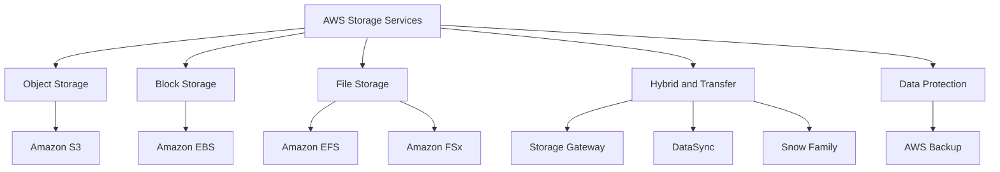

# Migration in progress
# Lesson 1: Introduction to AWS Storage Services

AWS storage services are organised around three fundamental data types: object, block, and file. Each type maps to a different service, and each service is optimised for different access patterns, durability requirements, and cost profiles. Storage is typically 20-30% of an AWS bill, making storage selection one of the most consequential architectural decisions you will make.

## The Three Storage Types

*Definition*: AWS provides storage in three forms: object, block, and file. Object storage stores data as objects with metadata and unique keys. Block storage presents raw, unformatted volumes that behave like physical disks. File storage presents a hierarchical filesystem accessible over network protocols.

| Type | AWS Service | Access Method | Use Case |
|---|---|---|---|
| Object | Amazon S3 | HTTP/HTTPS API | Data lakes, backups, static assets |
| Block | Amazon EBS | Attached to EC2 instance | Boot volumes, databases, transactional workloads |
| File | Amazon EFS, Amazon FSx | NFS, SMB, Lustre | Shared file storage, content management, HPC |

- Block storage (EBS) is the biggest single line for most AWS accounts, followed by object storage (S3) and database storage.
- Object storage is the default choice for most new workloads because it scales infinitely and requires no capacity planning.
- File storage is required when multiple compute instances need concurrent access to the same files.

> [!Important]
> **Start with the data type, not the service**: The first question in any storage decision is whether the data is an object, a block, or a file. That single question eliminates most of the options and narrows the choice to two or three services.

## Amazon S3 (Object Storage)

*Definition*: Amazon Simple Storage Service (S3) is an object storage service that offers industry-leading scalability, data availability, security, and performance. Data is stored as objects within buckets, each object identified by a key.

- S3 provides 99.999999999% (11 nines) durability and 99.99% availability for the Standard storage class.
- S3 stores data as objects, not files or blocks. An object consists of data, metadata, and a unique key.
- Buckets are the top-level containers for objects. Bucket names are globally unique.
- S3 has no minimum storage duration and no retrieval fees for Standard storage.

### S3 Bucket Types

AWS offers four bucket types for different workload requirements.

| Bucket Type | Optimised For | Key Feature |
|---|---|---|
| General Purpose | Most workloads | Full storage class selection, lifecycle, versioning, Object Lock |
| Directory (Express One Zone) | Ultra-low latency, AI/ML | Single-digit millisecond latency, 10x faster than S3 Standard, 50% lower request cost |
| Table (S3 Tables) | Data lake analytics | Managed Apache Iceberg tables, automatic compaction |
| Vector (S3 Vectors) | RAG, semantic search | Native vector storage and search, scales to 2 billion vectors per index |

> [!Tip]
> **General purpose buckets handle almost all workloads**: Choose Directory buckets only when you need single-digit millisecond latency for AI/ML or real-time processing. Choose Table buckets for Iceberg-based data lakes. Choose Vector buckets for AI-native applications that need semantic search.

### S3 Storage Classes

S3 offers a range of storage classes designed for different access patterns and cost requirements. Each class has a designed durability, availability, minimum storage duration, and minimum billable object size.

| Storage Class | Designed For | Durability | Availability | Min Duration | Retrieval Time |
|---|---|---|---|---|---|
| S3 Standard | Frequently accessed data | 11 nines | 99.99% | None | Milliseconds |
| S3 Intelligent-Tiering | Unknown or changing access | 11 nines | 99.9% | 30 days | Milliseconds |
| S3 Standard-IA | Infrequent access, rapid retrieval | 11 nines | 99.9% | 30 days | Milliseconds |
| S3 One Zone-IA | Infrequent, non-critical, single AZ | 11 nines | 99.5% | 30 days | Milliseconds |
| S3 Glacier Instant Retrieval | Archive needing millisecond access | 11 nines | 99.9% | 90 days | Milliseconds |
| S3 Glacier Flexible Retrieval | Archive, minutes to hours | 11 nines | 99.9% | 90 days | 1-12 hours |
| S3 Glacier Deep Archive | Long-term archive, lowest cost | 11 nines | 99.9% | 180 days | 12-48 hours |

- S3 Intelligent-Tiering automatically moves objects between access tiers based on changing access patterns. No retrieval fees.
- S3 Standard-IA and One Zone-IA offer lower storage costs than Standard but charge retrieval fees.
- One Zone-IA stores data in a single Availability Zone. Use it for non-critical, reproducible data.
- Glacier Flexible Retrieval requires 40 KB of additional metadata per object archived.

> [!Important]
> **Violating minimum size or duration requirements causes lifecycle rules to skip transitions**: Objects must be at least 128 KB to transition from Standard or Standard-IA to Intelligent-Tiering or Glacier Instant Retrieval. Standard to Standard-IA requires 30 days in the source class.

### S3 Lifecycle Policies

- Lifecycle rules transition objects between storage classes based on age, prefix, or tag.
- Rules can expire objects after a specified period and manage incomplete multipart uploads.
- Lifecycle rules only move objects "downhill" from higher-cost to lower-cost classes.
- Common pattern: Day 0 Standard, Day 30 Standard-IA, Day 90 Glacier Deep Archive, Day 365 delete.

### S3 Security

- S3 Block Public Access prevents accidental public exposure of buckets and objects.
- Bucket policies define who can access the bucket. IAM policies define what users and roles can do.
- S3 encryption supports SSE-S3 (AWS-managed keys), SSE-KMS (KMS keys), and SSE-C (customer-provided keys).
- Versioning and Object Lock protect against deletion and overwrites.

> [!Tip]
> **Enable S3 Block Public Access at the account level**: This is the single most effective control for preventing accidental data exposure. Even if a bucket policy allows public access, account-level Block Public Access overrides it.

## Amazon EBS (Block Storage)

*Definition*: Amazon Elastic Block Store (EBS) provides persistent block-level storage volumes for use with EC2 instances. EBS volumes are network-attached, replicated within an Availability Zone, and independent of the instance lifecycle.

### EBS Volume Types

EBS offers SSD-backed volumes for transactional workloads and HDD-backed volumes for throughput-intensive workloads. The following comparison reflects indicative US-East-1 list pricing.

| Volume Type | Storage Media | Storage $/GB-mo | Max IOPS | Max Throughput | Use Case |
|---|---|---|---|---|---|
| gp3 | SSD | $0.08 | 16,000 | 1,000 MiB/s | Default for ~95% of workloads |
| gp2 | SSD | $0.10 | 16,000 | 250 MiB/s | Legacy, migrate to gp3 |
| io2 Block Express | SSD | $0.125 | 256,000 | 4,000 MiB/s | Mission-critical databases |
| io1 | SSD | $0.125 | 64,000 | 1,000 MiB/s | Legacy high IOPS |
| st1 | HDD | $0.045 | — | 500 MiB/s | Big data, data warehouses |
| sc1 | HDD | $0.015 | — | 250 MiB/s | Cold data, infrequent access |

- gp3 is cheaper than gp2 and decouples IOPS from volume size.
- io2 Block Express is designed for the most demanding I/O-intensive workloads.
- HDD volumes cannot be used as boot volumes.
- EBS durability is 99.8-99.9% for gp3 and io1, and 99.999% for io2 Block Express.

### EBS Snapshots

- Snapshots are point-in-time backups of EBS volumes stored in Amazon S3.
- Snapshots are incremental. Only changed blocks are saved after the first snapshot.
- Snapshots are region-specific. You can copy them to other Regions for disaster recovery.
- Snapshots of encrypted volumes are encrypted automatically.
- Fast Snapshot Restore pre-warms snapshots for immediate full performance.

### EBS Encryption

- EBS encryption protects data at rest, data in transit between the instance and the volume, and snapshots created from encrypted volumes.
- Encryption uses AWS KMS customer master keys.
- Enable encryption by default for all new EBS volumes.

> [!Tip]
> **Right-size volumes based on IOPS and throughput, not just capacity**: A volume that is large enough for your data may still be too slow for your workload. Match the volume type to the IOPS and throughput requirements of the application.

## Amazon EFS (File Storage)

*Definition*: Amazon Elastic File System (EFS) is a serverless, fully elastic file system for Linux workloads. It provides shared file storage that scales automatically as files are added or removed.

- EFS supports NFSv4.1 and NFSv4.0 protocols.
- EFS scales automatically from 1 MiB/s to 3 GiB/s based on activity.
- EFS provides 11 nines durability and up to 99.99% availability.
- EFS is accessible from EC2 Linux instances, ECS, EKS, and Lambda.
- EFS supports concurrent access from multiple instances.

### EFS Storage Classes and Performance

| Storage Class | Use Case | Cost |
|---|---|---|
| EFS Standard | Frequently accessed files | Higher |
| EFS Infrequent Access (IA) | Files accessed a few times per quarter | Lower, with retrieval fees |
| EFS Archive | Files accessed rarely | Lowest, with retrieval fees |

- Lifecycle management automatically moves files between storage classes based on access patterns.
- Performance modes: General Purpose (lowest latency per operation) and Max I/O (higher aggregate throughput).
- Throughput modes: Bursting, Provisioned, and Elastic.

> [!Tip]
> **Use EFS for shared Linux file storage**: EFS is ideal for container storage (ECS, EKS), content management systems, and machine learning workloads that need shared access to files across multiple instances. For very high IOPS or extremely low latency needs, consider FSx for Lustre instead.

## Amazon FSx (Specialised File Storage)

*Definition*: Amazon FSx provides fully managed third-generation file systems optimised for specific workloads. You choose the file system that matches your existing technology or workload requirements.

| File System | Protocol | Best For | Key Feature |
|---|---|---|---|
| FSx for Windows File Server | SMB | Windows workloads, Active Directory integration | Native Windows file shares, DFS Namespaces |
| FSx for Lustre | Lustre | High-performance computing, ML training | Sub-millisecond latency, hundreds of GB/s throughput, S3 integration |
| FSx for NetApp ONTAP | NFS, SMB, iSCSI | Multi-protocol workloads, NAS migration | Virtually unlimited scale, SnapMirror, FlexCache |
| FSx for OpenZFS | NFS | Linux workloads, ZFS migration | Snapshots, clones, compression |

- FSx for Windows integrates with Active Directory and supports SMB 2.0 through 3.1.1.
- FSx for Lustre provides sub-millisecond latency and integrates with S3 for data repository tasks.
- FSx for NetApp ONTAP supports multi-protocol access and enterprise data management features.
- FSx for OpenZFS provides ZFS-based file storage with snapshots and clones.

> [!Important]
> **Choose FSx when you need a specific file system, not just file storage**: EFS is general-purpose shared file storage for Linux. FSx is for when you need Windows compatibility, high-performance Lustre, NetApp ONTAP features, or ZFS capabilities.

## AWS Stor