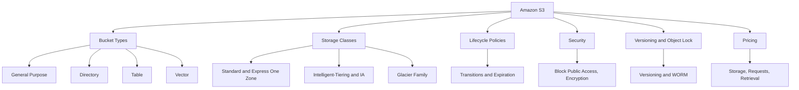
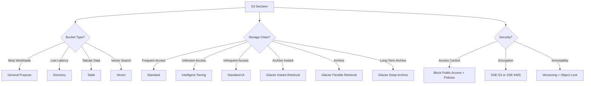

# Lesson 2: Amazon S3 Fundamentals

Amazon Simple Storage Service (S3) is an object storage service that offers industry-leading scalability, data availability, security, and performance. It is the default storage service for most AWS workloads and the foundation of data lakes, backup systems, static websites, and AI/ML pipelines. S3 stores data as objects within buckets and is designed for 99.999999999% (11 nines) durability, storing data redundantly across a minimum of three Availability Zones by default.

## What Is Amazon S3

*Definition*: Amazon S3 is an object storage service that stores data as objects within buckets. An object consists of data, a key (name), and metadata. Buckets are the top-level containers for objects, and each bucket has a unique name across all of AWS.

- S3 provides 99.999999999% (11 nines) durability and 99.99% availability for the Standard storage class.
- S3 scales automatically. There is no capacity planning required.
- S3 is accessed via HTTP/HTTPS APIs, the AWS Management Console, CLI, and SDKs.
- S3 has no minimum storage duration and no retrieval fees for Standard storage.

> [!Important]
> **S3 is the default storage service for most workloads**: Objects belong in S3. Block data belongs in EBS. Shared files belong in EFS or FSx. Forcing data into the wrong service leads to poor performance, unnecessary cost, or both.

## S3 Bucket Types

AWS offers four bucket types for different workload requirements. The bucket type determines the API, pricing, and feature set. You cannot change it after creation.

| Bucket Type | Optimised For | Key Feature |
|---|---|---|
| General Purpose | Most workloads | Full storage class selection, lifecycle, versioning, Object Lock |
| Directory (Express One Zone) | Ultra-low latency, AI/ML | Single-digit millisecond latency, 10x faster than S3 Standard, 80% lower request cost |
| Table (S3 Tables) | Data lake analytics | Managed Apache Iceberg tables, automatic compaction |
| Vector (S3 Vectors) | RAG, semantic search | Native vector storage and search, scales to 2 billion vectors per index |

- General purpose buckets are the original S3 bucket type and are recommended for most use cases and access patterns.
- Directory buckets are recommended for low-latency and data-residency use cases. You can create up to 100 directory buckets per account.
- Table buckets are recommended for tabular data storage and analytics.
- Vector buckets are purpose-built for storing and querying vectors for similarity search.

> [!Tip]
> **Start with general purpose buckets**: They handle almost all workloads. Choose Directory buckets only when you need single-digit millisecond latency. Choose Table buckets for Iceberg-based data lakes. Choose Vector buckets for AI-native applications.

## S3 Storage Classes

S3 offers a range of storage classes designed for different access patterns and cost requirements. Each class has a designed durability, availability, minimum storage duration, and minimum billable object size.

| Storage Class | Designed For | Availability | Min Duration | Min Object Size | Retrieval Time |
|---|---|---|---|---|---|
| S3 Standard | Frequently accessed data | 99.99% | None | None | Milliseconds |
| S3 Intelligent-Tiering | Unknown or changing access | 99.9% | 30 days | None | Milliseconds |
| S3 Standard-IA | Infrequent access, rapid retrieval | 99.9% | 30 days | 128 KB | Milliseconds |
| S3 One Zone-IA | Infrequent, non-critical, single AZ | 99.5% | 30 days | 128 KB | Milliseconds |
| S3 Glacier Instant Retrieval | Archive needing millisecond access | 99.9% | 90 days | 128 KB | Milliseconds |
| S3 Glacier Flexible Retrieval | Archive, minutes to hours | 99.9% | 90 days | None | 1-12 hours |
| S3 Glacier Deep Archive | Long-term archive, lowest cost | 99.9% | 180 days | None | 12-48 hours |

- S3 Intelligent-Tiering automatically moves objects between access tiers based on changing access patterns. No retrieval fees.
- S3 Standard-IA and One Zone-IA charge per GB retrieval fees.
- One Zone-IA stores data in a single Availability Zone. Use it for non-critical, reproducible data. It is not resilient to the loss of the Availability Zone.
- S3 Glacier Flexible Retrieval requires 40 KB of additional metadata per archived object.

> [!Important]
> **S3 Glacier Instant Retrieval has a 128 KB minimum object size**: Objects smaller than 128 KB cannot transition to Glacier Instant Retrieval by default. This is a common gotcha. If you need to transition smaller objects, you must add an explicit ObjectSizeGreaterThan filter in your lifecycle rule.

## S3 Lifecycle Policies

*Definition*: S3 lifecycle policies automate storage class transitions and object expiration to optimise storage costs without manual intervention.

- Lifecycle rules transition objects between storage classes based on age, prefix, or tag.
- Rules can expire objects after a specified period and manage incomplete multipart uploads.
- Lifecycle rules only move objects "downhill" from higher-cost to lower-cost classes.
- Rules can be applied to current versions, noncurrent versions, or both.

### Transition Constraints

| Source Class | Allowed Transitions |
|---|---|
| S3 Standard | Standard-IA, Intelligent-Tiering, One Zone-IA, Glacier Instant Retrieval, Glacier Flexible Retrieval, Glacier Deep Archive |
| S3 Intelligent-Tiering | Glacier Instant Retrieval, Glacier Flexible Retrieval, Glacier Deep Archive |
| S3 One Zone-IA | Glacier Flexible Retrieval, Glacier Deep Archive |

- Objects must be at least 128 KB to transition from Standard or Standard-IA to Intelligent-Tiering or Glacier Instant Retrieval.
- Standard to Standard-IA requires 30 days in the source class.
- After moving to Standard-IA, wait another 30 days before transitioning to any Glacier class.
- Violating minimum size or duration requirements will cause your lifecycle rule to skip transitions.

### Common Lifecycle Pattern

| Stage | Action | Rationale |
|---|---|---|
| Day 0 | Store in S3 Standard | Active use |
| Day 30 | Transition to S3 Standard-IA | Access frequency drops |
| Day 90 | Archive to S3 Glacier Deep Archive | Compliance retention |
| Day 365 | Delete object | Retention period ends |

> [!Tip]
> **Test lifecycle rules before applying them**: S3 lifecycle rules can silently skip transitions if constraints are not met. Use the S3 Lifecycle policy testing feature in the console to verify that rules behave as expected before enabling them on production buckets.

## S3 Versioning and Object Lock

### Versioning

- Versioning keeps multiple versions of an object in the same bucket.
- Once enabled, versioning cannot be disabled, only suspended.
- Versioning protects against accidental deletion and overwrites.
- When you delete an object in a versioned bucket, a delete marker is added instead of permanently deleting the object.
- You can restore previous versions by removing the delete marker.

### Object Lock

- Object Lock prevents objects from being deleted or overwritten for a fixed period or indefinitely.
- Object Lock uses a write-once-read-many (WORM) model.
- Object Lock requires versioning to be enabled.
- Object Lock retention modes:
    - **Governance mode**: Users with special permissions can override retention settings.
    - **Compliance mode**: No one can override retention settings, including the root user.
- Object Lock can be used to enforce retention policies for regulatory compliance or as an added layer of data protection.

> [!Important]
> **Versioning is not backup**: Versioning protects against accidental deletion and overwrites, but it does not protect against bucket deletion or account compromise. Use AWS Backup and cross-Region replication for a complete data protection strategy.

## S3 Security

S3 security is built on three pillars: access control, encryption, and monitoring.

### Access Control

- **Block Public Access**: Prevents accidental public exposure of buckets and objects. All new buckets have Block Public Access enabled by default. Account-level Block Public Access overrides bucket-level settings.
- **Bucket policies**: Define who can access the bucket and what actions they can perform.
- **IAM policies**: Define what users and roles can do with S3 resources.
- **Access Control Lists (ACLs)**: Legacy access control mechanism. ACLs are now disabled by default for new buckets. Use bucket policies or IAM policies instead.
- **Access points**: Simplify access management for shared data sets.
- **S3 Access Analyzer**: Identifies buckets shared with external entities.

### Encryption

- S3 encrypts all object uploads to all buckets by default.
- S3 encryption supports:
    - **SSE-S3**: Server-side encryption with S3-managed keys.
    - **SSE-KMS**: Server-side encryption with AWS KMS keys.
    - **SSE-C**: Server-side encryption with customer-provided keys.
    - **Client-side encryption**: Encrypt before uploading.
- Encryption in transit is enforced with HTTPS.

### Monitoring

- **S3 Server Access Logging**: Records requests to buckets.
- **AWS CloudTrail**: Records API calls for S3 management operations.
- **S3 Storage Lens**: Provides organisation-wide visibility into storage usage and activity.
- **S3 Inventory**: Provides scheduled reports on objects and their metadata.

> [!Important]
> **Enable S3 Block Public Access at the account level**: This is the single most effective control for preventing accidental data exposure. Even if a bucket policy or ACL allows public access, account-level Block Public Access overrides it.

## S3 Pricing Model

S3 pricing has three main components: storage, requests, and data transfer.

### Storage Pricing

| Storage Class | Price per GB-Month (US-East-1) |
|---|---|
| S3 Standard | $0.023 (first 50 TB) |
| S3 Intelligent-Tiering | $0.023 |
| S3 Standard-IA | $0.0125 |
| S3 One Zone-IA | $0.01 |
| S3 Glacier Instant Retrieval | $0.004 |
| S3 Glacier Flexible Retrieval | $0.0036 |
| S3 Glacier Deep Archive | $0.00099 |

- S3 Standard starts at $0.023 per GB-month for the first 50 TB, with volume discounts at higher tiers.
- S3 Glacier Deep Archive offers archival storage at $0.00099 per GB-month.
- There are no minimum fees and no upfront commitments.

### Request and Retrieval Pricing

- PUT, COPY, POST, LIST requests are charged per 1,000 requests.
- GET, SELECT, and all other requests are charged per 1,000 requests.
- S3 Standard-IA and Glacier classes charge per GB retrieval fees.
- S3 Intelligent-Tiering has no retrieval fees.
- Data transfer out to the internet is charged per GB.

> [!Tip]
> **Use S3 Intelligent-Tiering for unknown access patterns**: It automatically moves objects between access tiers based on usage patterns, saving up to 95% on storage costs with no performance impact and no retrieval fees.

## S3 Best Practices

### Security

- Enable Block Public Access at the account level.
- Enable versioning on all buckets.
- Enable default encryption with SSE-S3 or SSE-KMS.
- Use bucket policies and IAM policies instead of ACLs.
- Enable CloudTrail logging for S3 API calls.
- Use S3 Access Analyzer to identify external sharing.
- Use Object Lock for compliance and ransomware protection.

### Cost Optimization

- Use lifecycle policies to transition objects to lower-cost storage classes.
- Use S3 Intelligent-Tiering for unknown access patterns.
- Use S3 Storage Lens to identify cost optimization opportunities.
- Delete incomplete multipart uploads.
- Use S3 Inventory to audit objects and storage classes.

### Operations

- Use S3 Transfer Acceleration for faster uploads over long distances.
- Use S3 Cross-Region Replication for disaster recovery and compliance.
- Use S3 Batch Operations for large-scale object management.
- Use S3 Event Notifications to trigger workflows on object changes.
- Use S3 Access Points for shared data sets with different access requirements.

> [!Important]
> **Lifecycle policies are cost control and hygiene**: Every object in S3 costs storage. Without lifecycle policies, buckets grow indefinitely. Use them to manage storage costs and keep buckets clean. Test rules before applying them to avoid accidentally deleting or failing to transition objects.

## Assessment Preparation

### Practice Questions

1. Define Amazon S3 and explain how it stores data.
2. Compare the four S3 bucket types and their use cases.
3. List the S3 storage classes and describe the access pattern each is designed for.
4. Explain how S3 lifecycle policies work and describe a common transition pattern.
5. Describe the constraints on S3 lifecycle transitions.
6. Explain how S3 versioning and Object Lock protect data.
7. Describe the three pillars of S3 security.
8. Explain the S3 pricing model and its three components.
9. List five S3 security best practices.
10. Explain why S3 Block Public Access should be enabled at the account level.
11. Describe the difference between Governance and Compliance Object Lock modes.
12. Explain why S3 Glacier Instant Retrieval has a minimum object size constraint.

### Scenario Questions

**Scenario 1: Data Lake and Analytics**
A company needs to store petabytes of structured and unstructured data for analytics and machine learning. What should they use?

- Use Amazon S3 with Table buckets for Iceberg-based data lakes.
- Use lifecycle policies to transition older data to lower-cost storage classes.
- Use S3 Intelligent-Tiering for unknown access patterns.
- Enable versioning and Object Lock for compliance.
- Use S3 Vectors for RAG and semantic search workloads.

**Scenario 2: Compliance and Retention**
A financial services firm needs to store regulatory records for seven years with immutable retention. How should they configure S3?

- Enable versioning on the bucket.
- Enable Object Lock in Compliance mode.
- Set a retention period of seven years.
- Use S3 Glacier Deep Archive for long-term storage.
- Enable CloudTrail logging for audit purposes.

**Scenario 3: Cost Optimisation**
A company has 500 TB of data in S3 Standard, but 80% of it has not been accessed in over 90 days. How can they reduce costs?

- Create a lifecycle policy to transition objects older than 30 days to S3 Standard-IA.
- Transition objects older than 90 days to S3 Glacier Flexible Retrieval.
- Use S3 Storage Lens to analyse access patterns.
- Consider S3 Intelligent-Tiering if access patterns are unpredictable.
- Delete incomplete multipart uploads.

**Scenario 4: Static Website Hosting**
A company wants to host a static website on S3 with low latency for global users. What should they use?

- Use S3 general purpose buckets for storage.
- Enable static website hosting on the bucket.
- Use Amazon CloudFront for global content delivery.
- Use S3 Transfer Acceleration for faster uploads.
- Enable Block Public Access except for the website bucket, or use CloudFront with Origin Access Control.

## Key Takeaways

- Amazon S3 is an object storage service that stores data as objects within buckets. It provides 11 nines of durability and 99.99% availability for Standard.
- S3 offers four bucket types: general purpose, directory, table, and vector. General purpose is the default for most workloads.
- S3 storage classes range from Standard for frequently accessed data to Glacier Deep Archive for long-term retention.
- S3 Intelligent-Tiering automatically optimises storage costs for data with unknown or changing access patterns.
- S3 lifecycle policies automate transitions between storage classes and object expiration. They only move objects downhill.
- Objects must be at least 128 KB to transition to Intelligent-Tiering or Glacier Instant Retrieval.
- S3 versioning protects against accidental deletion and overwrites. Object Lock provides WORM protection for compliance.
- S3 security is built on access control, encryption, and monitoring. Block Public Access is the single most effective control.
- S3 encrypts all objects by default. SSE-S3, SSE-KMS, and SSE-C are the server-side encryption options.
- S3 pricing has three components: storage per GB-month, requests per 1,000, and data transfer.
- S3 Standard starts at $0.023 per GB-month. Glacier Deep Archive starts at $0.00099 per GB-month.
- Use lifecycle policies, Intelligent-Tiering, and Storage Lens to optimise costs.
- Enable Block Public Access, versioning, encryption, and CloudTrail logging for every bucket.
- Test lifecycle rules before applying them to avoid unexpected transitions or skips.

> [!Important]
> **S3 is the foundation, but it is not the only storage service**: S3 is the default choice for objects. Use EBS for block storage attached to EC2. Use EFS or FSx for shared file systems. Use Storage Gateway for hybrid cloud. Use AWS Backup for centralised data protection. The most common architectural mistake is forcing data into the wrong storage service. Choose based on data type, access pattern, and protocol. Start with S3 unless you have a specific requirement for block or file storage.
