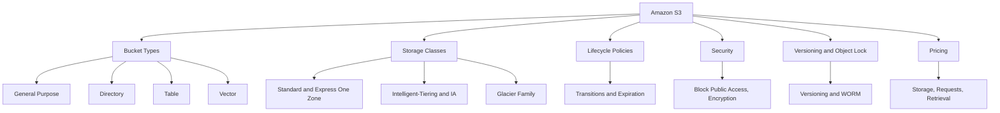

# Migration in progress
# Lesson 2: Amazon S3 Fundamentals

Amazon Simple Storage Service (S3) is an object storage service that offers industry-leading scalability, data availability, security, and performance. It is the default storage service for most AWS workloads and the foundation of data lakes, backup systems, static websites, and AI/ML pipelines. S3 stores data as objects within buckets and is designed for 99.999999999% (11 nines) durability, storing data redundantly across a minimum of three Availability Zones by default.

## What Is Amazon S3

*Definition*: Amazon S3 is an object storage service that stores data as objects within buckets. An object consists of data, a key (name), and metadata. Buckets are the top-level containers for objects, and each bucket has a unique name across all of AWS.

- S3 provides 99.999999999% (11 nines) durability and 99.99% availability for the Standard storage class.
- S3 scales automatically. There is no capacity planning required.
- S3 is accessed via HTTP/HTTPS APIs, the AWS Management Console, CLI, and SDKs.
- S3 has no minimum storage duration and no retrieval fees for Standard storage.

> [!Important]
> **S3 is the default storage service for most workloads**: Objects belong in S3. Block data belongs in EBS. Shared files belong in EFS or FSx. Forcing data into the wrong service leads to poor performance, unnecessary cost, or both.

## S3 Bucket Types

AWS offers four bucket types for different workload requirements. The bucket type determines the API, pricing, and feature set. You cannot change it after creation.

| Bucket Type | Optimised For | Key Feature |
|---|---|---|
| General Purpose | Most workloads | Full storage class selection, lifecycle, versioning, Object Lock |
| Directory (Express One Zone) | Ultra-low latency, AI/ML | Single-digit millisecond latency, 10x faster than S3 Standard, 80% lower request cost |
| Table (S3 Tables) | Data lake analytics | Managed Apache Iceberg tables, automatic compaction |
| Vector (S3 Vectors) | RAG, semantic search | Native vector storage and search, scales to 2 billion vectors per index |

- General purpose buckets are the original S3 bucket type and are recommended for most use cases and access patterns.
- Directory buckets are recommended for low-latency and data-residency use cases. You can create up to 100 directory buckets per account.
- Table buckets are recommended for tabular data storage and analytics.
- Vector buckets are purpose-built for storing and querying vectors for similarity search.

> [!Tip]
> **Start with general purpose buckets**: They handle almost all workloads. Choose Directory buckets only when you need single-digit millisecond latency. Choose Table buckets for Iceberg-based data lakes. Choose Vector buckets for AI-native applications.

## S3 Storage Classes

S3 offers a range of storage classes designed for different access patterns and cost requirements. Each class has a designed durability, availability, minimum storage duration, and minimum billable object size.

| Storage Class | Designed For | Availability | Min Duration | Min Object Size | Retrieval Time |
|---|---|---|---|---|---|
| S3 Standard | Frequently accessed data | 99.99% | None | None | Milliseconds |
| S3 Intelligent-Tiering | Unknown or changing access | 99.9% | 30 days | None | Milliseconds |
| S3 Standard-IA | Infrequent access, rapid retrieval | 99.9% | 30 days | 128 KB | Milliseconds |
| S3 One Zone-IA | Infrequent, non-critical, single AZ | 99.5% | 30 days | 128 KB | Milliseconds |
| S3 Glacier Instant Retrieval | Archive needing millisecond access | 99.9% | 90 days | 128 KB | Milliseconds |
| S3 Glacier Flexible Retrieval | Archive, minutes to hours | 99.9% | 90 days | None | 1-12 hours |
| S3 Glacier Deep Archive | Long-term archive, lowest cost | 99.9% | 180 days | None | 12-48 hours |

- S3 Intelligent-Tiering automatically moves objects between access tiers based on changing access patterns. No retrieval fees.
- S3 Standard-IA and One Zone-IA charge per GB retrieval fees.
- One Zone-IA stores data in a single Availability Zone. Use it for non-critical, reproducible data. It is not resilient to the loss of the Availability Zone.
- S3 Glacier Flexible Retrieval requires 40 KB of additional metadata per archived object.

> [!Important]
> **S3 Glacier Instant Retrieval has a 128 KB minimum object size**: Objects smaller than 128 KB cannot transition to Glacier Instant Retrieval by default. This is a common gotcha. If you need to transition smaller objects, you must add an explicit ObjectSizeGreaterThan filter in your lifecycle rule.

## S3 Lifecycle Policies

*Definition*: S3 lifecycle policies automate storage class transitions and object expiration to optimise storage costs without manual intervention.

- Lifecycle rules transition objects between storage classes based on age, prefix, or tag.
- Rules can expire objects after a specified period and manage incomplete multipart uploads.
- Lifecycle rules only move objects "downhill" from higher-cost to lower-cost classes.
- Rules can be applied to current versions, noncurrent versions, or both.

### Transition Constraints

| Source Class | Allowed Transitions |
|---|---|
| S3 Standard | Standard-IA, Intelligent-Tiering, One Zone-IA, Glacier Instant Retrieval, Glacier Flexible Retrieval, Glacier Deep Archive |
| S3 Intelligent-Tiering | Glacier Instant Retrieval, Glacier Flexible Retrieval, Glacier Deep Archive |
| S3 One Zone-IA | Glacier Flexible Retrieval, Glacier Deep Archive |

- Objects must be at least 128 KB to transition from Standard or Standard-IA to Intelligent-Tiering or Glacier Instant Retrieval.
- Standard to Standard-IA requires 30 days in the source class.
- After moving to Standard-IA, wait another 30 days before transitioning to any Glacier class.
- Violating minimum size or duration requirements will cause your lifecycle rule to skip transitions.

### Common Lifecycle Pattern

| Stage | Action | Rationale |
|---|---|---|
| Day 0 | Store in S3 Standard | Active use |
| Day 30 | Transition to S3 Standard-IA | Access frequency drops |
| Day 90 | Archive to S3 Glacier Deep Archive | Compliance retention |
| Day 365 | Delete object | Retention period ends |

> [!Tip]
> **Test lifecycle rules before applying them**: S3 lifecycle rules can silently skip transitions if constraints are not met. Use the S3 Lifecycle policy testing feature in the console to verify that rules behave as expected before enabling them on production buckets.

## S3 Versioning and Object Lock

### Versioning

- Versioning keeps multiple versions of an object in the same bucket.
- Once enabled, versioning cannot be disabled, only suspended.
- Versioning protects against accidental deletion and overwrites.
- When you delete an object in a versioned bucket, a delete marker is added instead of permanently deleting the object.
- You can restore previous versions by removing the delete marker.

### Object Lock

- Object Lock prevents objects from being deleted or overwritten for a fixed period or indefinitely.
- Object Lock uses a write-once-read-many (WORM) model.
- Object Lock requires versioning to be enabled.
- Object Lock retention modes:
    - **Governance mode**: Users with special permissions can override retention settings.
    - **Compliance mode**: No one can override retention settings, including the root user.
- Object Lock can be used to enforce retention policies for regulatory compliance or as an added layer of data protection.

> [!Important]
> **Versioning is not backup**: Versioning protects against accidental deletion and overwrites, but it does not protect against bucket deletion or account compromise. Use AWS Backup and cross-Region replication for a complete data protection strategy.

## S3 Security

S3 security is built on three pillars: access control, encryption, and monitoring.

### Access Control

- **Block Public Access**: Prevents accidental public exposure of buckets and objects. All new buckets have Block Public Access enabled by default. Account-level Block Public Access overrides bucket-level settings.
- **Bucket policies**: Define who can access the bucket and what actions they can perform.
- **IAM policies**: Define what users and roles can do with S3 resources.
- **Access Control Lists (ACLs)**: Legacy access control mechanism. ACLs are now disabled by default for new buckets. Use bucket policies or IAM policies instead.
- **Access points**: Simplify access management for shared data sets.
- **S3 Access Analyzer**: Identifies buckets shared wi