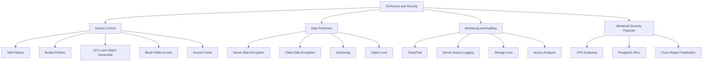

# Migration in progress
# Lesson 3: Access & Security in S3

Amazon S3 security is built on three pillars: access control, encryption, and monitoring. Every S3 deployment must answer who can access the data, how it is protected at rest and in transit, and how access is audited. S3 is the only object storage service that allows you to block public access to all objects at the bucket or account level.



## Access Control in S3

Access to S3 is controlled through multiple mechanisms that work together. IAM policies define what identities can do. Bucket policies define who can access a specific bucket. Access Control Lists (ACLs) are a legacy mechanism that AWS now disables by default.

### IAM Policies

*Definition*: IAM policies are identity-based policies attached to IAM users, groups, or roles. They define what actions an identity can perform on S3 resources.

- IAM policies are the primary mechanism for controlling access to S3 for identities within your AWS account.
- They are evaluated alongside bucket policies, VPC endpoint policies, and organization-level policies.
- The principle of least privilege applies: grant only the permissions required to perform a task.
- For cross-account access, IAM policies alone are not sufficient. The resource owner must also grant access through a bucket policy.

### Bucket Policies

*Definition*: A bucket policy is a resource-based policy attached to an S3 bucket. It grants access permissions to the bucket and the objects within it. Bucket policies use the JSON-based IAM policy language.

- Bucket policies are the primary mechanism for granting access to identities outside your account.
- They can grant access to specific AWS accounts, IAM users, IAM roles, or federated identities.
- They support conditions such as source IP, VPC endpoint, MFA requirement, and encryption requirement.
- Bucket policies are evaluated alongside IAM policies.

**Example bucket policy allowing read access to a specific IAM role:**

```json
{
  "Version": "2012-10-17",
  "Statement": [
    {
      "Effect": "Allow",
      "Principal": { "AWS": "arn:aws:iam::123456789012:role/AppRole" },
      "Action": "s3:GetObject",
      "Resource": "arn:aws:s3:::my-bucket/*",
      "Condition": {
        "StringEquals": { "aws:SourceVpce": "vpce-0abc123" }
      }
    }
  ]
}
```

This policy grants the `AppRole` read access to all objects in `my-bucket`, but only when the request originates from a specific VPC endpoint.

> [!Important]
> **Bucket policies are evaluated alongside IAM policies**: For access to succeed, both the IAM policy and the bucket policy must allow the action (unless the bucket policy grants access to an anonymous or cross-account principal). An explicit deny in either policy overrides any allow.

### ACLs and Object Ownership

*Definition*: Access Control Lists (ACLs) are a legacy access control mechanism that grants permissions at the object or bucket level. ACLs only grant permissions to AWS accounts, not to IAM users or roles. They cannot use conditions like IP restrictions or VPC endpoints.

- ACLs predate IAM policies and bucket policies. AWS has discouraged their use for years.
- Since April 2023, all new S3 buckets have ACLs disabled by default.
- S3 Object Ownership is a bucket-level setting that controls ownership of uploaded objects and whether ACLs are enabled.
- The default setting is **Bucket owner enforced**, which disables ACLs entirely.
- When ACLs are disabled, the bucket owner owns all objects in the bucket and manages access exclusively through policies.

**Important update from the search results:** In April 2026, Amazon S3 deployed an update so all new general purpose buckets have SSE-C encryption disabled for all new write requests. For existing buckets in AWS accounts with no SSE-C encrypted objects, S3 also disabled SSE-C for all new write requests. Applications that need SSE-C encryption must deliberately enable it using the `PutBucketEncryption` API operation after creating a new bucket.

> [!Important]
> **Disable ACLs unless you need per-object access control**: A majority of modern use cases in S3 no longer require ACLs. Disabling ACLs simplifies permissions management and auditing. Access control is based on policies: IAM user policies, bucket policies, VPC endpoint policies, and Organizations SCPs and RCPs.

### Block Public Access

*Definition*: S3 Block Public Access is a feature that provides settings for access points, buckets, accounts, and AWS Organizations to manage public access to S3 resources. Block Public Access settings override bucket policies and permissions that allow public access.

- All new buckets have Block Public Access enabled by default.
- Block Public Access can be applied at four levels: organization (via AWS Organizations), account, bucket, and access point.
- Block Public Access provides four independent settings that can be used in any combination:
    1. Block public ACLs
    2. Ignore public ACLs
    3. Block public bucket policies
    4. Restrict public bucket policies
- When settings differ across levels, S3 applies the most restrictive combination.
- Account-level settings automatically inherit organization-level policies when present.
- S3 Block Public Access settings override S3 permissions that allow public access, making it easy for administrators to set up centralized controls regardless of how objects are added or buckets are created.

| Level | Scope | Managed By |
|---|---|---|
| Organization | All accounts in the organization | AWS Organizations policies |
| Account | All buckets in the account | Account administrator |
| Bucket | A single bucket | Bucket owner |
| Access Point | A single access point | Access point owner |

> [!Important]
> **Enable Block Public Access at the account level everywhere except where public access is genuinely required**: For organizations managing multiple accounts, use organization-level Block Public Access policies for centralized control. Keep public buckets in a dedicated AWS account so you can enable Block Public Access at the account level everywhere else.

### Access Points

*Definition*: S3 Access Points are named network endpoints with dedicated access policies that describe how data can be accessed for a specific use case or application. Access Points simplify managing data access at scale for shared data sets on S3.

- Access points are attached to a bucket and have their own access policies.
- Each access point can have a distinct policy that grants access to a specific application or team.
- Access points can be restricted to a specific VPC (VPC-only access points).
- Multi-Region Access Points provide a global endpoint for routing S3 request traffic across multiple AWS Regions.
- Multi-Region Access Points support failover controls to initiate failover across any two Regions at one time.
- There is a maximum of 100 Multi-Region Access Points per account and a limit of 17 Regions per Multi-Region Access Point.

> [!Tip]
> **Use Access Points to simplify access management for shared data sets**: Instead of writing complex bucket policies with many conditions, create one access point per application or team. Each access point has its own policy, making it easy to audit and modify access for a specific consumer without affecting others.

## Data Protection: Encryption

S3 encrypts all object uploads to all buckets by default. Since January 5, 2023, all new object uploads to Amazon S3 are automatically encrypted at no additional cost and with no impact on performance. The default encryption is SSE-S3 (server-side encryption with Amazon S3 managed keys).

### Server-Side Encryption Options

| Encryption Type | Key Management | Key Location | Use Case |
|---|---|---|---|
| SSE-S3 | S3-managed keys | AWS | Default for all buckets. No additional cost. |
| SSE-KMS | AWS KMS keys | AWS KMS | Audit trail of key usage, granular access control, compliance requirements |
| DSSE-KMS | AWS KMS keys (dual-layer) | AWS KMS | Regulated workloads requiring dual-layer encryption |
| SSE-C | Customer-provided keys | Customer manages keys | **Disabled by default for new buckets as of April 2026** |

**Important update:** As of April 2026, SSE-C is disabled by default for all new general purpose buckets and existing buckets in accounts with no SSE-C encrypted objects. Applications that need SSE-C must deliberately enable it via the `PutBucketEncryption` API operation.

- **SSE-S3** is the base level of encryption for every bucket. It uses AES-256 and requires no configuration.
- **SSE-KMS** lets you use AWS KMS keys for encryption. You get an audit trail of key usage in CloudTrail and granular access control through KMS key policies. KMS request charges apply.
- **DSSE-KMS** applies two layers of encryption with AWS KMS keys. Use it for workloads that require dual-layer encryption for compliance.
- **SSE-C** uses customer-provided keys. The customer manages the keys and provides them with every request. This option is now disabled by default.

> [!Important]
> **When you change the default encryption to SSE-KMS, existing objects are not automatically re-encrypted**: To change the encryption type of pre-existing objects, use S3 Batch Operations with a Copy action to write them back to the same bucket as SSE-KMS encrypted objects.

### Client-Side Encryption

- Client-side encryption means you encrypt data before uploading it to S3.
- You manage the encryption keys and the encryption process entirely.
- S3 stores the encrypted data but cannot decrypt it without your keys.
- Use client-side encryption when your compliance requirements mandate that keys never leave your control.

### Encryption in Transit

- S3 encrypts data in transit using SSL/TLS.
- AWS supports hybrid post-quantum key exchange for additional protection against future quantum computing threats.
- All S3 API endpoints support HTTPS. Require HTTPS for all requests.

> [!Tip]
> **Use SSE-KMS when you need an audit trail or granular key-level access control**: SSE-S3 encrypts data but does not provide per-key audit trails. SSE-KMS integrates with CloudTrail so every use of the KMS key is logged. Use SSE-KMS when compliance requires proof of who accessed encryption keys and when.

## Versioning and Object Lock

### Versioning

- Versioning keeps multiple versions of an object in the same bucket.
- Once enabled, versioning cannot be disabled, only suspended.
- Versioning protects against accidental deletion and overwrites.
- When you delete an object in a versioned bucket, a delete marker is added instead of permanently deleting the object.
- You can restore previous versions by removing the delete marker.

### Object Lock

*Definition*: S3 Object Lock prevents objects from being deleted or overwritten for a fixed amount of time or indefinitely. Object Lock uses a write-once-read-many (WORM) model to store objects.

- Object Lock works only in buckets that have versioning enabled.
- S3 Object Lock has been assessed by Cohasset Associates for use in environments subject to SEC 17a-4, CFTC, and FINRA regulations.
- Object Lock provides two ways to manage retention:
    - **Retention period**: A fixed period during which an object version remains locked. You can set a unique retention period for individual objects or a default retention period on a bucket.
    - **Legal hold**: Provides the same protection as a retention period but has no expiration date. A legal hold remains in place until explicitly removed. Legal holds are independent from retention periods.
- Object Lock has two retention modes:
    - **Governance mode**: Users with the `s3:BypassGovernanceRetention` permission can override retention settings. Use this mode when you want protection against accidental deletion but need the ability to bypass when necessary.
    - **Compliance mode**: No one can override retention settings, including the root user. Use this mode for regulatory compliance where immutable retention is required.

**Important limitation:** Objects protected by Object Lock (both GOVERNANCE and COMPLIANCE modes) do not allow annotation modifications 