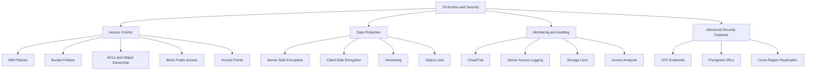
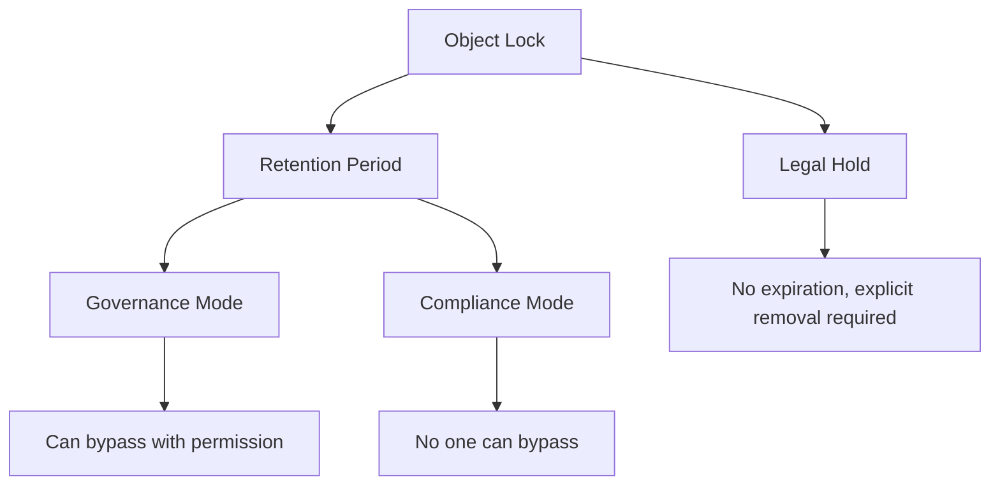
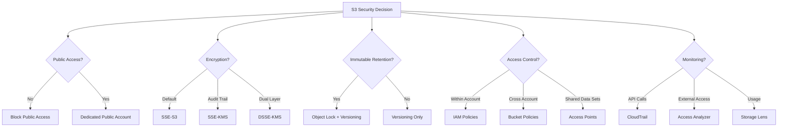

# Lesson 3: Access & Security in S3

Amazon S3 security is built on three pillars: access control, encryption, and monitoring. Every S3 deployment must answer who can access the data, how it is protected at rest and in transit, and how access is audited. S3 is the only object storage service that allows you to block public access to all objects at the bucket or account level.



## Access Control in S3

Access to S3 is controlled through multiple mechanisms that work together. IAM policies define what identities can do. Bucket policies define who can access a specific bucket. Access Control Lists (ACLs) are a legacy mechanism that AWS now disables by default.

### IAM Policies

*Definition*: IAM policies are identity-based policies attached to IAM users, groups, or roles. They define what actions an identity can perform on S3 resources.

- IAM policies are the primary mechanism for controlling access to S3 for identities within your AWS account.
- They are evaluated alongside bucket policies, VPC endpoint policies, and organization-level policies.
- The principle of least privilege applies: grant only the permissions required to perform a task.
- For cross-account access, IAM policies alone are not sufficient. The resource owner must also grant access through a bucket policy.

### Bucket Policies

*Definition*: A bucket policy is a resource-based policy attached to an S3 bucket. It grants access permissions to the bucket and the objects within it. Bucket policies use the JSON-based IAM policy language.

- Bucket policies are the primary mechanism for granting access to identities outside your account.
- They can grant access to specific AWS accounts, IAM users, IAM roles, or federated identities.
- They support conditions such as source IP, VPC endpoint, MFA requirement, and encryption requirement.
- Bucket policies are evaluated alongside IAM policies.

**Example bucket policy allowing read access to a specific IAM role:**

```json
{
  "Version": "2012-10-17",
  "Statement": [
    {
      "Effect": "Allow",
      "Principal": { "AWS": "arn:aws:iam::123456789012:role/AppRole" },
      "Action": "s3:GetObject",
      "Resource": "arn:aws:s3:::my-bucket/*",
      "Condition": {
        "StringEquals": { "aws:SourceVpce": "vpce-0abc123" }
      }
    }
  ]
}
```

This policy grants the `AppRole` read access to all objects in `my-bucket`, but only when the request originates from a specific VPC endpoint.

> [!Important]
> **Bucket policies are evaluated alongside IAM policies**: For access to succeed, both the IAM policy and the bucket policy must allow the action (unless the bucket policy grants access to an anonymous or cross-account principal). An explicit deny in either policy overrides any allow.

### ACLs and Object Ownership

*Definition*: Access Control Lists (ACLs) are a legacy access control mechanism that grants permissions at the object or bucket level. ACLs only grant permissions to AWS accounts, not to IAM users or roles. They cannot use conditions like IP restrictions or VPC endpoints.

- ACLs predate IAM policies and bucket policies. AWS has discouraged their use for years.
- Since April 2023, all new S3 buckets have ACLs disabled by default.
- S3 Object Ownership is a bucket-level setting that controls ownership of uploaded objects and whether ACLs are enabled.
- The default setting is **Bucket owner enforced**, which disables ACLs entirely.
- When ACLs are disabled, the bucket owner owns all objects in the bucket and manages access exclusively through policies.

**Important update from the search results:** In April 2026, Amazon S3 deployed an update so all new general purpose buckets have SSE-C encryption disabled for all new write requests. For existing buckets in AWS accounts with no SSE-C encrypted objects, S3 also disabled SSE-C for all new write requests. Applications that need SSE-C encryption must deliberately enable it using the `PutBucketEncryption` API operation after creating a new bucket.

> [!Important]
> **Disable ACLs unless you need per-object access control**: A majority of modern use cases in S3 no longer require ACLs. Disabling ACLs simplifies permissions management and auditing. Access control is based on policies: IAM user policies, bucket policies, VPC endpoint policies, and Organizations SCPs and RCPs.

### Block Public Access

*Definition*: S3 Block Public Access is a feature that provides settings for access points, buckets, accounts, and AWS Organizations to manage public access to S3 resources. Block Public Access settings override bucket policies and permissions that allow public access.

- All new buckets have Block Public Access enabled by default.
- Block Public Access can be applied at four levels: organization (via AWS Organizations), account, bucket, and access point.
- Block Public Access provides four independent settings that can be used in any combination:
    1. Block public ACLs
    2. Ignore public ACLs
    3. Block public bucket policies
    4. Restrict public bucket policies
- When settings differ across levels, S3 applies the most restrictive combination.
- Account-level settings automatically inherit organization-level policies when present.
- S3 Block Public Access settings override S3 permissions that allow public access, making it easy for administrators to set up centralized controls regardless of how objects are added or buckets are created.

| Level | Scope | Managed By |
|---|---|---|
| Organization | All accounts in the organization | AWS Organizations policies |
| Account | All buckets in the account | Account administrator |
| Bucket | A single bucket | Bucket owner |
| Access Point | A single access point | Access point owner |

> [!Important]
> **Enable Block Public Access at the account level everywhere except where public access is genuinely required**: For organizations managing multiple accounts, use organization-level Block Public Access policies for centralized control. Keep public buckets in a dedicated AWS account so you can enable Block Public Access at the account level everywhere else.

### Access Points

*Definition*: S3 Access Points are named network endpoints with dedicated access policies that describe how data can be accessed for a specific use case or application. Access Points simplify managing data access at scale for shared data sets on S3.

- Access points are attached to a bucket and have their own access policies.
- Each access point can have a distinct policy that grants access to a specific application or team.
- Access points can be restricted to a specific VPC (VPC-only access points).
- Multi-Region Access Points provide a global endpoint for routing S3 request traffic across multiple AWS Regions.
- Multi-Region Access Points support failover controls to initiate failover across any two Regions at one time.
- There is a maximum of 100 Multi-Region Access Points per account and a limit of 17 Regions per Multi-Region Access Point.

> [!Tip]
> **Use Access Points to simplify access management for shared data sets**: Instead of writing complex bucket policies with many conditions, create one access point per application or team. Each access point has its own policy, making it easy to audit and modify access for a specific consumer without affecting others.

## Data Protection: Encryption

S3 encrypts all object uploads to all buckets by default. Since January 5, 2023, all new object uploads to Amazon S3 are automatically encrypted at no additional cost and with no impact on performance. The default encryption is SSE-S3 (server-side encryption with Amazon S3 managed keys).

### Server-Side Encryption Options

| Encryption Type | Key Management | Key Location | Use Case |
|---|---|---|---|
| SSE-S3 | S3-managed keys | AWS | Default for all buckets. No additional cost. |
| SSE-KMS | AWS KMS keys | AWS KMS | Audit trail of key usage, granular access control, compliance requirements |
| DSSE-KMS | AWS KMS keys (dual-layer) | AWS KMS | Regulated workloads requiring dual-layer encryption |
| SSE-C | Customer-provided keys | Customer manages keys | **Disabled by default for new buckets as of April 2026** |

**Important update:** As of April 2026, SSE-C is disabled by default for all new general purpose buckets and existing buckets in accounts with no SSE-C encrypted objects. Applications that need SSE-C must deliberately enable it via the `PutBucketEncryption` API operation.

- **SSE-S3** is the base level of encryption for every bucket. It uses AES-256 and requires no configuration.
- **SSE-KMS** lets you use AWS KMS keys for encryption. You get an audit trail of key usage in CloudTrail and granular access control through KMS key policies. KMS request charges apply.
- **DSSE-KMS** applies two layers of encryption with AWS KMS keys. Use it for workloads that require dual-layer encryption for compliance.
- **SSE-C** uses customer-provided keys. The customer manages the keys and provides them with every request. This option is now disabled by default.

> [!Important]
> **When you change the default encryption to SSE-KMS, existing objects are not automatically re-encrypted**: To change the encryption type of pre-existing objects, use S3 Batch Operations with a Copy action to write them back to the same bucket as SSE-KMS encrypted objects.

### Client-Side Encryption

- Client-side encryption means you encrypt data before uploading it to S3.
- You manage the encryption keys and the encryption process entirely.
- S3 stores the encrypted data but cannot decrypt it without your keys.
- Use client-side encryption when your compliance requirements mandate that keys never leave your control.

### Encryption in Transit

- S3 encrypts data in transit using SSL/TLS.
- AWS supports hybrid post-quantum key exchange for additional protection against future quantum computing threats.
- All S3 API endpoints support HTTPS. Require HTTPS for all requests.

> [!Tip]
> **Use SSE-KMS when you need an audit trail or granular key-level access control**: SSE-S3 encrypts data but does not provide per-key audit trails. SSE-KMS integrates with CloudTrail so every use of the KMS key is logged. Use SSE-KMS when compliance requires proof of who accessed encryption keys and when.

## Versioning and Object Lock

### Versioning

- Versioning keeps multiple versions of an object in the same bucket.
- Once enabled, versioning cannot be disabled, only suspended.
- Versioning protects against accidental deletion and overwrites.
- When you delete an object in a versioned bucket, a delete marker is added instead of permanently deleting the object.
- You can restore previous versions by removing the delete marker.

### Object Lock

*Definition*: S3 Object Lock prevents objects from being deleted or overwritten for a fixed amount of time or indefinitely. Object Lock uses a write-once-read-many (WORM) model to store objects.

- Object Lock works only in buckets that have versioning enabled.
- S3 Object Lock has been assessed by Cohasset Associates for use in environments subject to SEC 17a-4, CFTC, and FINRA regulations.
- Object Lock provides two ways to manage retention:
    - **Retention period**: A fixed period during which an object version remains locked. You can set a unique retention period for individual objects or a default retention period on a bucket.
    - **Legal hold**: Provides the same protection as a retention period but has no expiration date. A legal hold remains in place until explicitly removed. Legal holds are independent from retention periods.
- Object Lock has two retention modes:
    - **Governance mode**: Users with the `s3:BypassGovernanceRetention` permission can override retention settings. Use this mode when you want protection against accidental deletion but need the ability to bypass when necessary.
    - **Compliance mode**: No one can override retention settings, including the root user. Use this mode for regulatory compliance where immutable retention is required.

**Important limitation:** Objects protected by Object Lock (both GOVERNANCE and COMPLIANCE modes) do not allow annotation modifications (create, update, or delete). The `BypassGovernanceRetention` permission does not apply to annotation operations. To add annotations to a locked object, create a new object version.



> [!Important]
> **Object Lock requires versioning to be enabled**: You cannot enable Object Lock on a bucket that does not have versioning enabled. Plan your bucket configuration before enabling Object Lock.

## Monitoring and Auditing

### AWS CloudTrail

- CloudTrail records API calls made to S3, including who made the call, when, and from where.
- CloudTrail records management events (bucket creation, policy changes) and data events (object-level operations).
- Data events are not logged by default. They must be enabled separately.
- CloudTrail logs are delivered to an S3 bucket and can be integrated with CloudWatch Logs for real-time monitoring.

### S3 Server Access Logging

- Server access logging records detailed requests to a bucket, including the requester, bucket name, request time, and operation.
- Server access logs are delivered to a target bucket.
- Server access logs capture data-plane operations that CloudTrail data events also capture, but with different fields and at different cost.
- Server access logging has no additional cost beyond storage of the log files.

### S3 Storage Lens

- Storage Lens provides organisation-wide visibility into storage usage and activity.
- It aggregates metrics across accounts, Regions, and buckets.
- It provides dashboards, metrics, and recommendations.
- Use it to identify cost optimisation opportunities and security posture gaps.

### IAM Access Analyzer for S3

*Definition*: IAM Access Analyzer for S3 provides external access findings for S3 general purpose buckets configured to allow access to anyone on the internet or other AWS accounts, including accounts outside your organization.

- It shows the source and level of shared access for each bucket, including read or write access provided through a bucket ACL, bucket policy, Multi-Region Access Point policy, or access point policy.
- Findings are automatically updated once every 24 hours.
- You can block all public access to a bucket with a single click from the IAM Access Analyzer for S3 page.
- IAM Access Analyzer for S3 is available at no extra cost on the Amazon S3 console.
- You must create an external access analyzer on a per-Region basis in the IAM console.

> [!Important]
> **IAM Access Analyzer for S3 does not analyse access point policies attached to cross-account access points**: This is because the access point and its policy are outside the zone of trust. Use IAM Access Analyzer for the account-level analysis of S3 buckets, and review cross-account access point policies separately.

## Advanced Security Features

### VPC Endpoints for S3

- Gateway endpoints provide private access to S3 from a VPC without requiring an internet gateway or NAT device.
- Gateway endpoints are free and are added as a route table target.
- Interface endpoints use PrivateLink to create an ENI with a private IP address.
- Bucket policies can require that requests come through a VPC endpoint using the `aws:SourceVpce` condition key.
- Use VPC endpoints to keep S3 traffic off the public internet and reduce NAT gateway data processing costs.

### Presigned URLs

*Definition*: A presigned URL is a URL that grants temporary access to a specific S3 object. The URL is generated by an IAM principal with valid credentials and is evaluated with the permissions of the principal that created it.

- Presigned URLs allow you to grant time-limited access to objects without requiring the recipient to have AWS credentials.
- The URL expires after a specified duration.
- The permissions of the presigned URL are limited to the permissions of the IAM principal that created it.
- Anyone with the URL can use it until it expires. Treat presigned URLs as secrets.

**Best practices for presigned URLs:**

- Enforce the principle of least privilege when generating presigned URLs.
- Set short expiration times for presigned URLs.
- Use the `aws:SourceIp` condition for public endpoints and `aws:SourceVpc` or `aws:SourceVpce` for VPC endpoints.
- Monitor presigned URL usage and revoke access if needed.

> [!Important]
> **Anyone with a presigned URL can use it until it expires**: Presigned URLs are bearer tokens. If a presigned URL is shared publicly, anyone can use it to access the object. Use short expiration times and monitor usage.

### Cross-Region Replication

- Cross-Region Replication (CRR) replicates objects from a source bucket to a destination bucket in a different Region.
- CRR is used for disaster recovery, latency reduction, and compliance.
- Replication is asynchronous. The source bucket and destination bucket can be in different accounts.
- Replication requires versioning to be enabled on both buckets.
- Replication is configured at the bucket level and can be filtered by prefix or tag.

## S3 Security Best Practices Summary

| Control | Description | Priority |
|---|---|---|
| Block Public Access | Enable at account level for all buckets | Critical |
| Disable ACLs | Use Object Ownership with bucket owner enforced | High |
| Enable versioning | Protects against accidental deletion and overwrites | High |
| Enable encryption | SSE-S3 (default) or SSE-KMS for audit trail | High |
| Use bucket policies | Grant access to identities outside your account | High |
| Use IAM policies | Grant least privilege to identities within your account | High |
| Use VPC endpoints | Keep S3 traffic off the public internet | Medium |
| Enable CloudTrail | Audit all API calls to S3 | High |
| Use Access Analyzer | Identify external access to buckets | High |
| Enable Object Lock | For compliance and ransomware protection | Medium |
| Use Access Points | Simplify access management for shared data sets | Medium |
| Monitor with Storage Lens | Organisation-wide visibility into storage usage | Medium |
| Require HTTPS | Enforce encryption in transit | High |
| Use presigned URLs carefully | Grant temporary access with short expiration | Medium |

> [!Important]
> **S3 security is layered**: No single control is sufficient. Block Public Access, IAM policies, bucket policies, encryption, versioning, Object Lock, VPC endpoints, and monitoring work together to protect your data. Start with the critical controls: enable Block Public Access at the account level, disable ACLs, enable versioning, enable encryption, and enable CloudTrail logging.

## Assessment Preparation

### Practice Questions

1. Compare IAM policies and bucket policies for S3 access control.
2. Explain why ACLs are disabled by default for new S3 buckets.
3. Describe the four levels of S3 Block Public Access and how S3 applies the most restrictive combination.
4. Compare SSE-S3, SSE-KMS, DSSE-KMS, and SSE-C encryption options.
5. Explain the April 2026 change to SSE-C encryption on new buckets.
6. Describe how S3 versioning and Object Lock protect data.
7. Compare Governance mode and Compliance mode for Object Lock retention.
8. Explain the purpose of IAM Access Analyzer for S3 and how it identifies external access.
9. Describe how VPC endpoints provide private access to S3.
10. Explain the security considerations for presigned URLs.
11. Describe how Cross-Region Replication works and when to use it.
12. List five S3 security best practices and explain why each matters.

### Scenario Questions

**Scenario 1: Compliance and Immutable Retention**
A financial services firm needs to store regulatory records for seven years with immutable retention. How should they configure S3?

- Enable versioning on the bucket.
- Enable Object Lock in Compliance mode.
- Set a default retention period of seven years.
- Use S3 Glacier Deep Archive for long-term storage.
- Enable CloudTrail logging for audit purposes.
- Use Bucket owner enforced for Object Ownership.

**Scenario 2: Private S3 Access from a VPC**
A private subnet needs to access S3 without going through a NAT gateway. How do you configure this?

- Create a gateway endpoint for S3.
- Add the endpoint as a target in the private subnet route table.
- Update the bucket policy to allow access only from the VPC endpoint using the `aws:SourceVpce` condition.
- Gateway endpoints are free and eliminate NAT data processing charges.

**Scenario 3: External Access Audit**
A security team needs to identify which S3 buckets are shared with external AWS accounts. What should they use?

- Use IAM Access Analyzer for S3.
- Create an external access analyzer in each Region where buckets exist.
- Review the External access summary in the S3 console.
- Archive findings for buckets that are intentionally shared.
- Remediate unintended external access.

**Scenario 4: Temporary Access to Objects**
An application needs to grant temporary download access to specific users without requiring AWS credentials. What should they use?

- Use presigned URLs.
- Generate the URL with a short expiration time.
- Apply least privilege to the IAM principal that generates the URL.
- Monitor presigned URL usage.
- Treat presigned URLs as secrets.

**Scenario 5: Cross-Region Disaster Recovery**
A company needs to replicate S3 data to another Region for disaster recovery. What should they configure?

- Enable versioning on both source and destination buckets.
- Configure Cross-Region Replication at the bucket level.
- Use a destination bucket in a different Region.
- Enable replication metrics and notifications.
- Consider Multi-Region Access Points for global request routing.



## Key Takeaways

- S3 security is built on three pillars: access control, encryption, and monitoring.
- IAM policies define what identities within your account can do. Bucket policies grant access to identities outside your account.
- ACLs are disabled by default for new buckets. Use Object Ownership with bucket owner enforced.
- S3 Block Public Access is the single most effective control for preventing accidental data exposure. Enable it at the account level.
- Block Public Access can be applied at organization, account, bucket, and access point levels. S3 applies the most restrictive combination.
- All S3 objects are encrypted by default with SSE-S3. SSE-KMS provides an audit trail and granular key-level access control.
- As of April 2026, SSE-C is disabled by default for all new general purpose buckets.
- Versioning protects against accidental deletion and overwrites. Object Lock provides WORM protection for compliance and ransomware protection.
- Object Lock has two retention modes: Governance (bypassable with permission) and Compliance (no override, including root).
- IAM Access Analyzer for S3 identifies buckets shared publicly or with other AWS accounts. It is available at no extra cost.
- CloudTrail records API calls. Server access logging records detailed requests. Storage Lens provides organisation-wide visibility.
- VPC endpoints provide private access to S3 without internet exposure. Use `aws:SourceVpce` conditions in bucket policies.
- Presigned URLs grant temporary access to specific objects. Treat them as secrets and use short expiration times.
- Cross-Region Replication replicates objects to another Region for disaster recovery and compliance.
- S3 security is layered. No single control is sufficient. Start with Block Public Access, ACL disablement, versioning, encryption, and CloudTrail logging.

> [!Important]
> **Secure S3 before you put data in it**: The most common cause of S3 data breaches is misconfiguration, not a vulnerability in S3 itself. Enable Block Public Access at the account level. Disable ACLs. Enable versioning and encryption. Turn on CloudTrail logging. Use IAM Access Analyzer to find external sharing. These controls take minutes to enable and prevent the vast majority of S3 security incidents.
