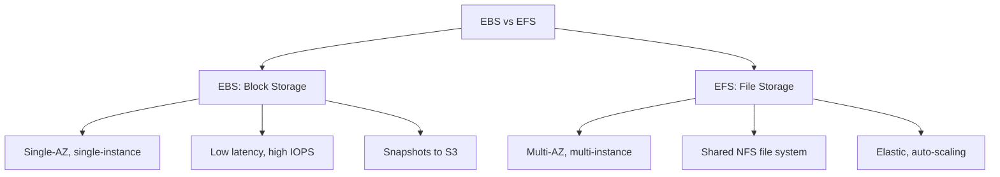

# Migration in progress
# Lesson 4: EBS vs EFS

Amazon EBS and Amazon EFS are both storage services, but they solve fundamentally different problems. The clearest difference is that an EFS file system can be mounted on thousands of ECS tasks or EC2 instances simultaneously, while an EBS volume does not support concurrent access. This single difference explains almost every other distinction between them, including scope, durability, performance, and cost. EBS is block storage attached to a single instance. EFS is a shared file system for many instances.

## Core Conceptual Difference

*Definition*: EBS provides persistent block-level storage volumes for use with EC2 instances. Think of an EBS volume as a network-attached hard drive that you create, attach to an instance, and use as a block device.

*Definition*: EFS provides a simple, scalable, fully managed elastic NFS file system for use with AWS Cloud services and on-premises resources. It is designed to provide shared access to a file system for multiple EC2 instances simultaneously.

| Dimension | EBS | EFS |
|---|---|---|
| Storage Type | Block | File |
| Access Method | Attached to one EC2 instance | Mounted over NFS by many clients |
| Concurrent Access | No | Yes |
| Protocol | Block device (NVMe) | NFSv4.1 / NFSv4.0 |
| Scope | Single Availability Zone | Regional (multi-AZ) |
| OS Support | Linux and Windows | Linux only |

> [!Important]
> **The concurrent access distinction is the first question**: If multiple instances or containers need to read and write the same data at the same time, you need EFS. If a single instance needs a high-performance block device for a database or boot volume, you need EBS. There is no overlap for this primary decision.

## Scope and Durability

### EBS Scope

- An EBS volume is tied to a specific Availability Zone and can only be attached to instances in that same AZ.
- To move a volume to a different AZ, you must create a snapshot and then create a new volume from the snapshot in the desired AZ.
- Data is replicated within the AZ for durability, but not across AZs.
- EBS durability is 99.8-99.9% for most volume types and 99.999% for io2 Block Express.

### EFS Scope

- EFS stores data redundantly across multiple Availability Zones, ensuring high availability and durability.
- EFS provides 99.999999999% (11 nines) durability and up to 99.99% availability for Regional file systems.
- One Zone EFS stores data in a single AZ and is designed for 99.9% availability.
- EFS is accessible from multiple AZs and multiple instances concurrently.

| Dimension | EBS | EFS |
|---|---|---|
| AZ Scope | Single AZ | Multi-AZ (Regional) or single AZ (One Zone) |
| Durability | 99.8-99.999% | 11 nines |
| Availability SLA | 99.99% (io2 Block Express) | 99.99% (Regional), 99.9% (One Zone) |
| Cross-AZ Access | No | Yes |
| Data Replication | Within AZ | Across AZs (Regional) |

> [!Important]
> **EBS is AZ-bound, EFS is regional**: If your architecture spans multiple Availability Zones, EBS volumes cannot be shared across them. You need to replicate data at the application level, use snapshots, or choose a different storage service. EFS is designed for multi-AZ access from the start.

## Performance and Throughput

### EBS Performance

- EBS performance depends on volume type, provisioned IOPS, and instance-level EBS bandwidth limits.
- gp3 provides a baseline of 3,000 IOPS and 125 MiB/s, with the ability to provision up to 16,000 IOPS and 1,000 MiB/s independently of volume size.
- io2 Block Express provides up to 256,000 IOPS and 4,000 MiB/s for mission-critical databases.
- st1 and sc1 are HDD-backed volumes for throughput-intensive and cold data workloads.
- EBS provides lower latency and higher single-client IOPS than EFS.

### EFS Performance

- EFS offers two performance modes: General Purpose (lowest per-operation latency) and Max I/O (higher aggregate throughput and IOPS for parallel workloads).
- EFS offers three throughput modes: Bursting (scales with file system size), Provisioned (fixed throughput independent of size), and Elastic (automatically scales with demand).
- Elastic throughput is the default for new file systems and generates up to 90,000 IOPS.
- EFS scales automatically from 1 MiB/s to 3 GiB/s based on activity.

| Performance Characteristic | EBS | EFS |
|---|---|---|
| Latency | Sub-millisecond | Low millisecond |
| Max IOPS | 256,000 (io2 Block Express) | 90,000 (Elastic throughput) |
| Max Throughput | 4,000 MiB/s | 3 GiB/s |
| Scaling Model | Manual volume resize or provision | Automatic |
| Single-Client Performance | Higher | Lower |
| Multi-Client Performance | Not supported | Designed for |

> [!Tip]
> **EBS wins on single-client performance, EFS wins on shared access**: For a database that needs sustained high IOPS from one instance, EBS is the clear choice. For a container fleet or web server cluster that needs a shared filesystem, EFS is the only option.

## Storage Classes and Cost Optimisation

### EBS Volume Types and Pricing

| Volume Type | Storage Media | Storage $/GB-mo | Max IOPS | Use Case |
|---|---|---|---|---|
| gp3 | SSD | $0.08 | 16,000 | Default for ~95% of workloads |
| gp2 | SSD | $0.10 | 16,000 | Legacy, migrate to gp3 |
| io2 Block Express | SSD | $0.125 | 256,000 | Mission-critical databases |
| io1 | SSD | $0.125 | 64,000 | Legacy high IOPS |
| st1 | HDD | $0.045 | — | Big data, data warehouses |
| sc1 | HDD | $0.015 | — | Cold data, infrequent access |

### EFS Storage Classes and Pricing

| Storage Class | Designed For | Latency | Min File Size | Min Duration |
|---|---|---|---|---|
| EFS Standard | Frequently accessed data | Sub-millisecond | None | None |
| EFS Infrequent Access (IA) | Data accessed a few times per quarter | Tens of milliseconds | 128 KiB | None |
| EFS Archive | Data accessed a few times per year or less | Tens of milliseconds | 128 KiB | 90 days |

- EFS Lifecycle Management automatically moves files between storage classes based on access patterns.
- EFS IA and Archive have a minimum billable file size of 128 KiB.
- EFS Archive has a minimum storage duration of 90 days.

> [!Important]
> **EFS Archive is not available for all throughput modes**: The EFS Archive storage class is only supported for file systems with Elastic throughput. You cannot upgrade the throughput of a file system to Bursting or Provisioned once it contains Archive data.

## Use Cases and Decision Framework

### When to Use EBS

- Boot volumes for EC2 instances.
- Databases (MySQL, PostgreSQL, Oracle, SAP HANA) that need high IOPS and low latency from a single instance.
- Transactional workloads with strict performance requirements.
- Applications that do not need shared file access.
- Windows workloads (EFS is Linux-only).

### When to Use EFS

- Containerised applications that scale horizontally and need shared storage