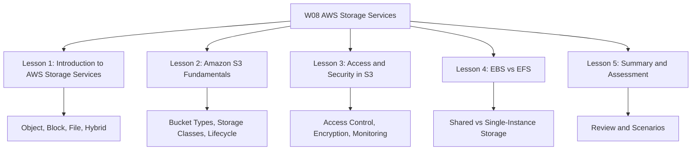
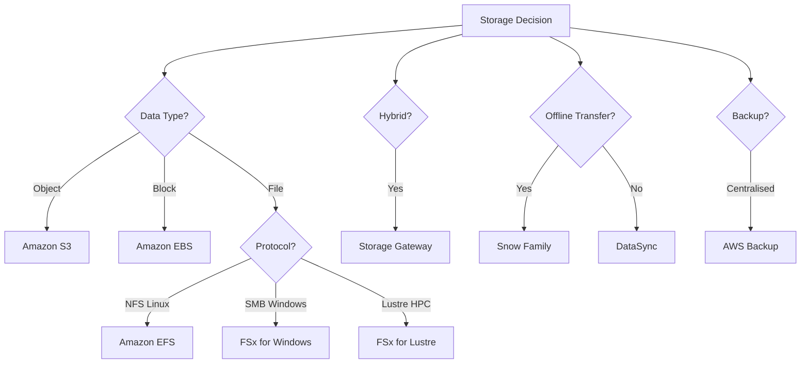

# Migration in progress
# W08: AWS Storage Services - Lesson 5: Summary and Assessment

This module covers the AWS storage portfolio: object storage with Amazon S3, block storage with Amazon EBS, file storage with Amazon EFS and Amazon FSx, hybrid storage with AWS Storage Gateway, data transfer with AWS DataSync and the Snow Family, and centralised data protection with AWS Backup. The goal is to select and configure the right storage service for any workload based on data type, access pattern, durability, performance, and cost.

## Lesson 1: Introduction to AWS Storage Services Summary

AWS storage services split into object, block, file, and hybrid categories. Each category maps to a different service, and each service is optimised for different access patterns, durability requirements, and cost profiles. Storage is typically 20-30% of an AWS bill.

### The Three Storage Types

| Type | AWS Service | Access Method | Use Case |
|---|---|---|---|
| Object | Amazon S3 | HTTP/HTTPS API | Data lakes, backups, static assets |
| Block | Amazon EBS | Attached to EC2 instance | Boot volumes, databases, transactional workloads |
| File | Amazon EFS, Amazon FSx | NFS, SMB, Lustre | Shared file storage, content management, HPC |
| Hybrid | AWS Storage Gateway | iSCSI, SMB, NFS | On-premises applications accessing cloud storage |

### Service Portfolio

- Amazon S3 is object storage. It offers four bucket types and seven storage classes.
- Amazon EBS is block storage attached to EC2 instances. gp3 is the default general purpose SSD.
- Amazon EFS is serverless, elastic NFS file storage for Linux workloads.
- Amazon FSx provides four file system types: Windows File Server, Lustre, NetApp ONTAP, and OpenZFS.
- AWS Storage Gateway extends on-premises storage to AWS using file, volume, and tape gateways.
- AWS Backup centralises data protection across AWS services.
- AWS DataSync moves data between on-premises and AWS, or between AWS storage services.
- The Snow Family provides physical devices for offline data transfer and edge computing.

### Storage Decision Framework

> [!Important]
> **Match the storage service to the data type and access pattern**: Objects belong in S3. Block data belongs in EBS. Shared files belong in EFS or FSx. Hybrid belongs in Storage Gateway. Forcing data into the wrong service leads to poor performance, unnecessary cost, or both.

## Lesson 2: Amazon S3 Fundamentals Summary

Amazon S3 is an object storage service that stores data as objects within buckets. It provides 11 nines of durability and 99.99% availability for the Standard storage class.

### S3 Bucket Types

| Bucket Type | Optimised For | Key Feature |
|---|---|---|
| General Purpose | Most workloads | Full storage class selection, lifecycle, versioning, Object Lock |
| Directory (Express One Zone) | Ultra-low latency, AI/ML | Single-digit millisecond latency, 10x faster, 80% lower request cost |
| Table (S3 Tables) | Data lake analytics | Managed Apache Iceberg tables, automatic compaction |
| Vector (S3 Vectors) | RAG, semantic search | Native vector storage, scales to 2 billion vectors per index |

### S3 Storage Classes

| Storage Class | Designed For | Availability | Min Duration | Min Object Size | Retrieval Time |
|---|---|---|---|---|---|
| S3 Standard | Frequently accessed data | 99.99% | None | None | Milliseconds |
| S3 Intelligent-Tiering | Unknown or changing access | 99.9% | 30 days | None | Milliseconds |
| S3 Standard-IA | Infrequent access | 99.9% | 30 days | 128 KB | Milliseconds |
| S3 One Zone-IA | Infrequent, non-critical | 99.5% | 30 days | 128 KB | Milliseconds |
| S3 Glacier Instant Retrieval | Archive with instant access | 99.9% | 90 days | 128 KB | Milliseconds |
| S3 Glacier Flexible Retrieval | Archive, minutes to hours | 99.9% | 90 days | None | 1-12 hours |
| S3 Glacier Deep Archive | Long-term archive | 99.9% | 180 days | None | 12-48 hours |

### Lifecycle Policies

- Lifecycle rules transition objects between storage classes based on age, prefix, or tag.
- Rules only move objects downhill from higher-cost to lower-cost classes.
- Objects must be at least 128 KB to transition to Intelligent-Tiering or Glacier Instant Retrieval.
- Standard to Standard-IA requires 30 days in the source class. After that, wait another 30 days before transitioning to any Glacier class.
- Common pattern: Day 0 Standard, Day 30 Standard-IA, Day 90 Glacier Deep Archive, Day 365 delete.

### Versioning and Object Lock

- Versioning keeps multiple versions of an object. Once enabled, it cannot be disabled, only suspended.
- Object Lock provides WORM protection. It requires versioning to be enabled.
- Governance mode can be bypassed with `s3:BypassGovernanceRetention` permission.
- Compliance mode cannot be overridden, including by the root user.

### S3 Pricing

| Component | Price (US-East-1) |
|---|---|
| S3 Standard storage | $0.023 per GB-month (first 50 TB) |
| S3 Standard-IA storage | $0.0125 per GB-month |
| S3 One Zone-IA storage | $0.01 per GB-month |
| S3 Glacier Instant Retrieval | $0.004 per GB-month |
| S3 Glacier Flexible Retrieval | $0.0036 per GB-month |
| S3 Glacier Deep Archive | $0.00099 per GB-month |
| Requests | Per 1,000 requests |
| Data transfer out | Per GB |

> [!Tip]
> **Use S3 Intelligent-Tiering for unknown access patterns**: It automatically moves objects between access tiers based on usage patterns, saving up to 95% on storage costs with no performance impact and no retrieval fees.

## Lesson 3: Access and Security in S3 Summary

S3 security is built on three pillars: access control, encryption, and monitoring.

### Access Control

| Mechanism | Scope | Use Case |
|---|---|---|
| IAM Policies | Identity-based | Access for identities within your account |
| Bucket Policies | Resource-based | Access for identities outside your account |
| ACLs | Legacy | Disabled by default. Use Object Ownership instead. |
| Block Public Access | Account, bucket, access point, organisation | Prevent accidental public exposure |
| Access Points | Per-application | Simplify access management for shared data sets |

- All new buckets have Block Public Access enabled by default.
- Block Public Access can be applied at four levels. S3 applies the most restrictive combination.
- Since April 2023, all new S3 buckets have ACLs disabled by default. S3 Object Ownership defaults to bucket owner enforced.

### Encryption

| Encryption Type | Key Management | Use Case |
|---|---|---|
| SSE-S3 | S3-managed keys | Default for all buckets. No additional cost. |
| SSE-KMS | AWS KMS keys | Audit trail, granular access control, compliance |
| DSSE-KMS | AWS KMS keys (dual-layer) | Regulated workloads requiring dual-layer encryption |
| SSE-C | Customer-provided keys | Disabled by default for new buckets as of April 2026 |

- All S3 objects are encrypted by default with SSE-S3.
- When you change default encryption to SSE-KMS, existing objects are not automatically re-encrypted. Use S3 Batch Operations with a Copy action.
- Encryption in transit uses SSL/TLS. AWS supports hybrid post-quantum key exchange.

### Monitoring and Auditing

| Tool | Purpose |
|---|---|
| AWS CloudTrail | Records API calls made to S3 |
| S3 Server Access Logging | Records detailed requests to a bucket |
| S3 Storage Lens | Organisation-wide visibility into storage usage |
| IAM Access Analyzer for S3 | Identifies buckets shared externally |

- IAM Access Analyzer for S3 provides external access findings at no extra cost.
- Findings are automatically updated once every 24 hours.
- Access Analyzer does not analyse access point policies attached to cross-account access points.

### Advanced Features

- VPC endpoints provide private access to S3 without internet exposure. Use `aws:SourceVpce` conditions in bucket policies.
- Presigned URLs grant temporary access to specific objects. Treat them as secrets.
- Cross-Region Replication replicates objects to another Region for disaster recovery and compliance.

> [!Important]
> **Secure S3 before you put data in it**: Enable Block Public Access at the account level. Disable ACLs. Enable versioning and encryption. Turn on CloudTrail logging. Use IAM Access Analyzer to find external sharing. These controls take minutes to enable and prevent the vast majority of S3 security incidents.

## Lesson 4: EBS vs EFS Summary

EBS and EFS are both storage services, but they solve fundamentally different problems. The clearest difference is that an EFS file system can be mounted on thousands of clients simultaneously, while an EBS volume does not support concurrent access.

### Core Comparison

| Dimension | EBS | EFS |
|---|---|---|
| Storage Type | Block | File |
| Access Method | Attached to one EC2 instance | Mounted over NFS by many clients |
| Concurrent Access | No | Yes |
| Protocol | Block device (NVMe) | NFSv4.1 / NFSv4.0 |
| Scope | Single AZ | Regional (multi-AZ) or One Zone |
| OS Support | Linux and Windows | Linux only |
| Durability | 99.8-99.999% | 11 nines |
| Availability SLA | 99.99% (io2 Block Express) | 99.99% (Regional) |
| Max IOPS | 256,000 | 90,000 |
| Max Throughput | 4,000 MiB/s | 3 GiB/s |
| Scaling | Manual resize or provision | Automatic |
| Best For | Boot volumes, databases, single-instance workloads | Shared file storage, containers, web clusters |

### EBS Volume Types

| Volume Type | Storage Media | Storage $/GB-mo | Max IOPS | Use Case |
|---|---|---|---|---|
| gp3 | SSD | $0.08 | 16,000 | Default for ~95% of workloads |
| gp2 | SSD | $0.10 | 16,000 | Legacy, migrate to gp3 |
| io2 Block Express | SSD | $0.125 | 256,000 | Mission-critical databases |
| io1 | SSD | $0.125 | 64,000 | Legacy high IOPS |
| st1 | HDD | $0.045 | — | Big data, data warehouses |
| sc1 | HDD | $0.015 | — | Cold data, infrequent access |

### EFS Storage Classes

| Storage Class | Designed For | Latency | Min File Size |
|-