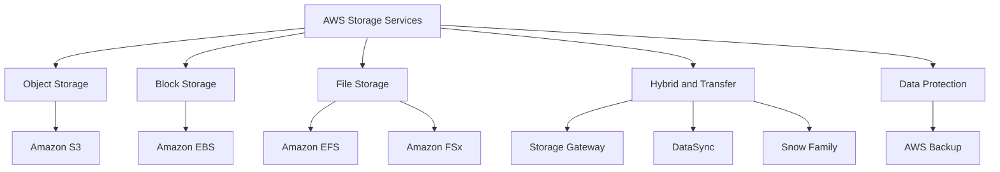
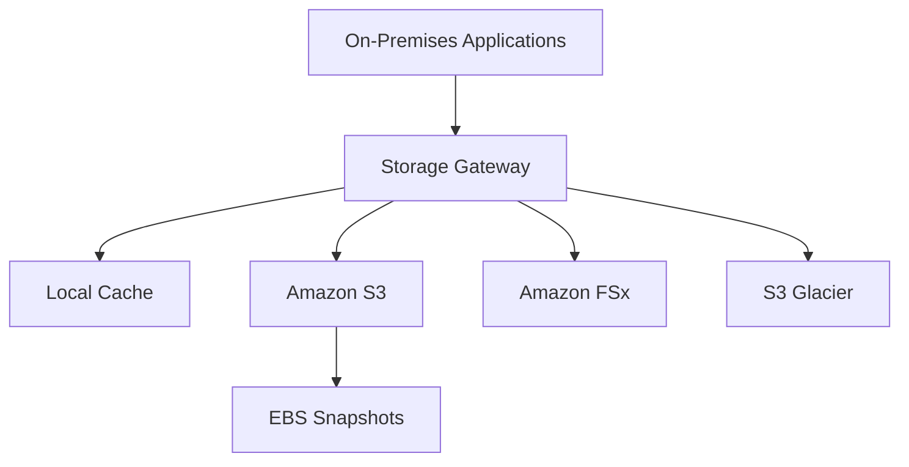
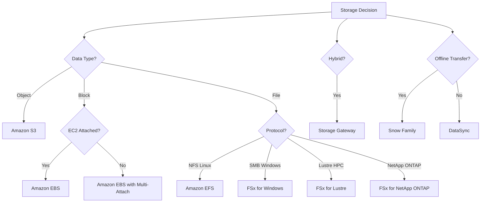
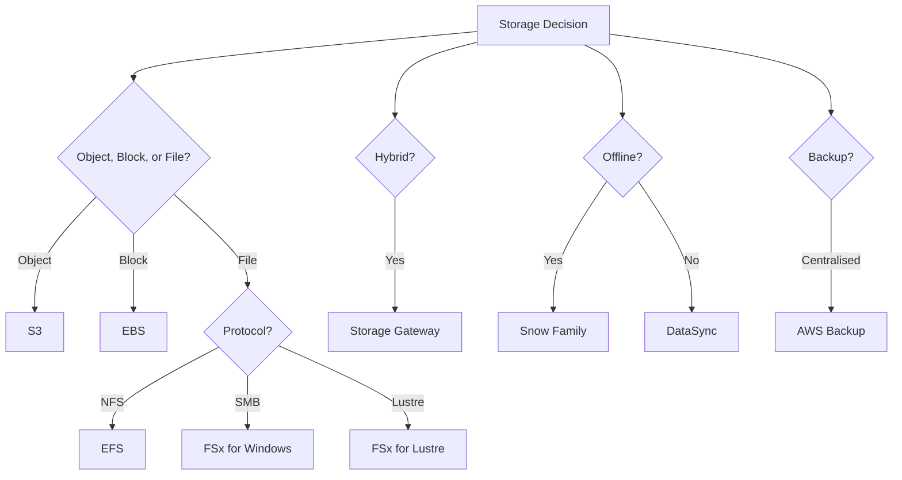

# W08: AWS Storage Services

AWS offers a broad portfolio of storage services designed for different data types, access patterns, performance requirements, and durability needs. The core services are Amazon S3 for object storage, Amazon EBS for block storage, Amazon EFS for file storage, and Amazon FSx for specialised file systems. Supporting services include AWS Storage Gateway for hybrid cloud, AWS Backup for centralised data protection, AWS DataSync for data transfer, and the Snow Family for offline migration. Choosing the right storage service is one of the most consequential architectural decisions because it directly affects performance, durability, cost, and operational complexity.

## Amazon S3

*Definition*: Amazon Simple Storage Service (S3) is an object storage service that offers industry-leading scalability, data availability, security, and performance. Data is stored as objects within buckets, each object identified by a key.

- S3 stores data as objects, not files or blocks. An object consists of data, metadata, and a unique key.
- Buckets are the top-level containers for objects. Bucket names are globally unique.
- S3 provides 99.999999999% (11 nines) durability and 99.99% availability for the Standard storage class.
- S3 is accessed via HTTP/HTTPS APIs, the AWS Management Console, CLI, and SDKs.
- S3 has no minimum storage duration and no retrieval fees for Standard storage.

### S3 Bucket Types

AWS offers four bucket types for different workload requirements.

| Bucket Type | Optimised For | Key Feature |
|---|---|---|
| General Purpose | Most workloads | Full storage class selection, lifecycle, versioning, Object Lock |
| Directory (Express One Zone) | Ultra-low latency, AI/ML, real-time processing | Single-digit millisecond latency, 10x faster than S3 Standard, 50% lower request cost |
| Table (S3 Tables) | Data lake analytics | Managed Apache Iceberg tables, automatic compaction, up to 3x query performance |
| Vector (S3 Vectors) | RAG, semantic search, recommendations | Native vector storage and search, scales to 2 billion vectors per index |

> [!Important]
> **Choose the right bucket type before you build**: General purpose buckets handle almost all workloads. Directory buckets for ultra-low latency. Table buckets for Iceberg-based data lakes. Vector buckets for AI-native applications. The bucket type determines the API, pricing, and feature set. You cannot change it after creation.

### S3 Storage Classes

S3 offers a range of storage classes designed for different access patterns and cost requirements.

| Storage Class | Use Case | Retrieval Time | Min Storage Duration |
|---|---|---|---|
| S3 Standard | Frequently accessed data | Milliseconds | None |
| S3 Intelligent-Tiering | Unknown or changing access patterns | Milliseconds | None |
| S3 Standard-IA | Infrequent access, rapid retrieval | Milliseconds | 30 days |
| S3 One Zone-IA | Infrequent access, non-critical, single AZ | Milliseconds | 30 days |
| S3 Glacier Instant Retrieval | Archive data needing millisecond access | Milliseconds | 90 days |
| S3 Glacier Flexible Retrieval | Archive data, minutes to hours retrieval | 1-5 minutes (expedited), 3-5 hours (standard), 5-12 hours (bulk) | 90 days |
| S3 Glacier Deep Archive | Long-term archive, lowest cost | 12 hours (standard), 48 hours (bulk) | 180 days |

- S3 Intelligent-Tiering automatically moves objects between access tiers based on changing access patterns. No retrieval fees.
- S3 Standard-IA and One Zone-IA offer lower storage costs than Standard but charge retrieval fees.
- One Zone-IA stores data in a single Availability Zone. Use it for non-critical, reproducible data.
- Glacier Instant Retrieval is for archive data that still needs millisecond access.
- Glacier Deep Archive is the lowest-cost storage class for long-term retention. Retrieval takes up to 48 hours.

> [!Tip]
> **Use Intelligent-Tiering for unknown access patterns**: If you do not know how often data will be accessed, Intelligent-Tiering automatically optimises costs without retrieval fees. It monitors access patterns and moves objects between tiers automatically.

### S3 Lifecycle Policies

*Definition*: S3 lifecycle policies automate storage class transitions and object expiration to optimise storage costs without manual intervention.

- Lifecycle rules transition objects between storage classes based on age, prefix, or tag.
- Rules can expire objects after a specified period.
- Rules can also manage incomplete multipart uploads and old object versions.
- Lifecycle rules only move objects "downhill" from higher-cost to lower-cost classes.

#### Common Lifecycle Pattern

| Stage | Action | Rationale |
|---|---|---|
| Day 0 | Store in S3 Standard | Active use |
| Day 30 | Transition to S3 Standard-IA | Access frequency drops |
| Day 90 | Archive to S3 Glacier Deep Archive | Compliance retention |
| Day 365 | Delete object | Retention period ends |

#### Transition Constraints

| Source Class | Allowed Transitions |
|---|---|
| S3 Standard | Standard-IA, Intelligent-Tiering, One Zone-IA, Glacier Instant Retrieval, Glacier Flexible Retrieval, Glacier Deep Archive |
| S3 Intelligent-Tiering | Glacier Instant Retrieval, Glacier Flexible Retrieval, Glacier Deep Archive |
| S3 One Zone-IA | Glacier Flexible Retrieval, Glacier Deep Archive |

- Objects must be at least 128 KB to transition from Standard or Standard-IA to Intelligent-Tiering or Glacier Instant Retrieval.
- Standard to Standard-IA requires 30 days in the source class.
- After moving to Standard-IA, wait another 30 days before transitioning to any Glacier class.

> [!Important]
> **Violating minimum size or duration requirements causes lifecycle rules to skip transitions**: Always verify object metadata and understand the constraints before applying a rule. A rule that looks correct on paper may silently do nothing if the objects do not meet the criteria.

### S3 Versioning and Object Lock

- Versioning keeps multiple versions of an object in the same bucket.
- Once enabled, versioning cannot be disabled, only suspended.
- Versioning protects against accidental deletion and overwrites.
- Object Lock prevents objects from being deleted or overwritten for a fixed period or indefinitely.
- Object Lock uses a write-once-read-many (WORM) model.
- Object Lock requires versioning to be enabled.
- Object Lock retention modes: Governance mode (users with special permissions can override) and Compliance mode (no one can override, including root).

### S3 Security

- S3 Block Public Access prevents accidental public exposure of buckets and objects.
- Bucket policies define who can access the bucket and what actions they can perform.
- IAM policies define what users and roles can do with S3 resources.
- Access points simplify access management for shared data sets.
- S3 Access Analyzer identifies buckets shared with external entities.
- S3 encryption supports SSE-S3 (AWS-managed keys), SSE-KMS (KMS keys), and SSE-C (customer-provided keys).
- Encryption in transit is enforced with HTTPS.

> [!Important]
> **Enable S3 Block Public Access at the account level**: This is the single most effective control for preventing accidental data exposure. Even if a bucket policy or ACL allows public access, account-level Block Public Access overrides it.

## Amazon EBS

*Definition*: Amazon Elastic Block Store (EBS) provides persistent block-level storage volumes for use with EC2 instances. EBS volumes are network-attached, replicated within an Availability Zone, and independent of the instance lifecycle.

### EBS Volume Types

| Volume Type | Storage Media | Max IOPS | Max Throughput | Use Case |
|---|---|---|---|---|
| gp3 | SSD | 16,000 | 1,000 MB/s | General purpose, boot volumes |
| gp2 | SSD | 16,000 | 250 MB/s | Legacy general purpose |
| io2 Block Express | SSD | 256,000 | 4,000 MB/s | Mission-critical databases |
| io2 | SSD | 64,000 | 1,000 MB/s | High IOPS databases |
| io1 | SSD | 64,000 | 1,000 MB/s | Legacy high IOPS |
| st1 | HDD | 500 | 500 MB/s | Big data, log processing |
| sc1 | HDD | 250 | 250 MB/s | Cold data, archives |

- gp3 is the default general purpose SSD. It provides a baseline of 3,000 IOPS and 125 MB/s, with the ability to provision IOPS and throughput independently of volume size.
- io2 Block Express is designed for the most demanding I/O-intensive workloads, including mission-critical databases.
- HDD volumes cannot be used as boot volumes.
- st1 is optimised for sequential throughput workloads such as big data and log processing.
- sc1 is the lowest-cost EBS volume type for cold data.

### EBS Snapshots

- Snapshots are point-in-time backups of EBS volumes stored in Amazon S3.
- Snapshots are incremental. Only changed blocks are saved after the first snapshot.
- Snapshots are region-specific. You can copy them to other Regions for disaster recovery.
- Snapshots can be used to create new EBS volumes in any Availability Zone within the same Region.
- Snapshots of encrypted volumes are encrypted automatically.
- Fast Snapshot Restore pre-warms snapshots for immediate full performance.
- Snapshot Archive provides a low-cost storage tier for long-term retention.
- Recycle Bin retains deleted snapshots for recovery.

### EBS Encryption

- EBS encryption protects data at rest, data in transit between the instance and the volume, and snapshots created from encrypted volumes.
- Encryption uses AWS KMS customer master keys.
- Encryption is transparent to the operating system and applications.
- Enable encryption by default for all new EBS volumes.
- Snapshots of encrypted volumes are encrypted automatically.

> [!Tip]
> **Right-size volumes based on IOPS and throughput, not just capacity**: A volume that is large enough for your data may still be too slow for your workload. Match the volume type to the IOPS and throughput requirements of the application.

## Amazon EFS

*Definition*: Amazon Elastic File System (EFS) is a serverless, fully elastic file system for Linux workloads. It provides shared file storage that scales automatically as files are added or removed.

- EFS supports NFSv4.1 and NFSv4.0 protocols.
- EFS scales automatically from 1 MiB/s to 3 GiB/s based on activity.
- EFS provides 99.999999999% (11 nines) durability and up to 99.99% availability.
- EFS is accessible from EC2 Linux and Mac instances, ECS, EKS, and Lambda.
- EFS supports concurrent access from multiple instances.

### EFS Storage Classes

| Storage Class | Use Case | Cost |
|---|---|---|
| EFS Standard | Frequently accessed files | Higher |
| EFS Infrequent Access (IA) | Files accessed a few times per quarter | Lower, with retrieval fees |
| EFS Archive | Files accessed rarely | Lowest, with retrieval fees |

- EFS lifecycle management automatically moves files between storage classes based on access patterns.
- Lifecycle policies can transition files to IA after 7, 14, 30, 60, or 90 days.
- Archive class is designed for data accessed a few times per year.

### EFS Performance Modes

| Mode | Description | Use Case |
|---|---|---|
| General Purpose | Lowest latency per operation | Latency-sensitive applications, web serving |
| Max I/O | Higher aggregate throughput and IOPS | Big data, media processing, parallel workloads |

### EFS Throughput Modes

| Mode | Description | Use Case |
|---|---|---|
| Bursting | Throughput scales with file system size | Most workloads |
| Provisioned | Fixed throughput independent of size | Workloads needing higher throughput than size allows |
| Elastic | Automatically scales throughput based on demand | Unpredictable workloads |

> [!Tip]
> **Use EFS for shared Linux file storage**: EFS is ideal for container storage (ECS, EKS), content management systems, and machine learning workloads that need shared access to files across multiple instances.

## Amazon FSx

*Definition*: Amazon FSx provides fully managed third-generation file systems optimised for specific workloads. You choose the file system that matches your existing technology or workload requirements.

### FSx File System Types

| File System | Protocol | Best For | Key Feature |
|---|---|---|---|
| FSx for Windows File Server | SMB | Windows workloads, Active Directory integration | Native Windows file shares, DFS Namespaces |
| FSx for Lustre | Lustre | High-performance computing, ML training | Sub-millisecond latency, hundreds of GB/s throughput, S3 integration |
| FSx for NetApp ONTAP | NFS, SMB, iSCSI | Multi-protocol workloads, NAS migration | Virtually unlimited scale, SnapMirror, FlexCache |
| FSx for OpenZFS | NFS | Linux workloads, ZFS migration | Snapshots, clones, compression |

- FSx for Windows File Server supports SMB 2.0 through 3.1.1 and integrates with Active Directory.
- FSx for Lustre provides sub-millisecond latency and up to hundreds of GB/s throughput. It integrates with S3 for data repository tasks.
- FSx for NetApp ONTAP supports multi-protocol access and provides enterprise data management features.
- FSx for OpenZFS provides ZFS-based file storage with snapshots and clones.

> [!Important]
> **Choose FSx when you need a specific file system, not just file storage**: EFS is general-purpose shared file storage for Linux. FSx is for when you need Windows compatibility, high-performance Lustre, NetApp ONTAP features, or ZFS capabilities.

## AWS Storage Gateway

*Definition*: AWS Storage Gateway is a hybrid cloud storage service that gives on-premises applications access to virtually unlimited cloud storage. It provides standard storage protocols (iSCSI, SMB, NFS) so existing applications work without modification.

### Gateway Types

| Gateway Type | Protocol | Cloud Storage | Use Case |
|---|---|---|---|
| S3 File Gateway | NFS, SMB | Amazon S3 | File shares backed by S3 |
| FSx File Gateway | SMB | Amazon FSx for Windows | Low-latency access to Windows file shares |
| Volume Gateway | iSCSI | Amazon S3 (EBS snapshots) | Block storage for on-premises applications |
| Tape Gateway | iSCSI VTL | Amazon S3, Glacier | Backup to virtual tape library |

- Storage Gateway caches frequently accessed data on premises for low-latency access.
- Data is transferred asynchronously to AWS using only changed data and compression.
- Volume Gateway stores data in S3 and takes point-in-time copies as EBS snapshots.
- Tape Gateway provides a virtual tape library interface for existing backup applications.

> [!Tip]
> **Use Storage Gateway for hybrid cloud storage**: It is ideal for extending on-premises storage to the cloud without rewriting applications. It reduces on-premises storage footprint and enables cloud-backed backups and archives.

## AWS Backup

*Definition*: AWS Backup is a fully managed service that centralises and automates data protection across AWS services. You define backup policies once and apply them across your entire AWS environment.

### Key Features

| Feature | Description |
|---|---|
| Centralised Management | Single console for backups across AWS services |
| Policy-Based Backup | Define backup schedules and retention policies |
| Tag-Based Policies | Apply backup policies automatically based on resource tags |
| Lifecycle Management | Automate transition to cold storage and expiration |
| Cross-Region Backup | Copy backups to other AWS Regions |
| Cross-Account Backup | Share backups across AWS accounts |
| Audit Manager | Audit and report on backup compliance |
| Incremental Backups | Only changed data is backed up after the first full backup |
| Backup Vaults | Organise and secure backups with access policies and encryption |
| Logically Air-Gapped Vault | Immutable backup vault with no delete permissions |

### Supported Resources

- Amazon EC2, EBS, EFS, FSx
- Amazon S3, DynamoDB
- Amazon RDS, Aurora, DocumentDB, Neptune, Redshift, Timestream
- AWS Storage Gateway
- VMware virtual machines
- Amazon EKS

> [!Important]
> **Use AWS Backup for centralised data protection**: Instead of managing backups service by service, use AWS Backup to define policies once and apply them across your entire environment. Use logically air-gapped vaults for ransomware protection and compliance.

## AWS DataSync

*Definition*: AWS DataSync is a secure, high-speed data transfer service that simplifies moving data between on-premises storage and AWS, or between AWS storage services.

- DataSync transfers files, objects, and directories.
- It uses agents for on-premises transfers and can transfer between AWS services without an agent.
- DataSync automatically verifies data integrity.
- It preserves metadata and file permissions.
- DataSync handles open and locked files.
- Enhanced mode now supports HDFS, Azure Blob Storage, self-managed object storage, EFS, and FSx for Lustre.

| Source | Destination | Agent Required |
|---|---|---|
| On-premises NFS/SMB | S3, EFS, FSx | Yes |
| S3 | EFS | No |
| EFS | S3 | No |
| On-premises HDFS | S3 | Yes |
| Azure Blob | S3 | Yes |

> [!Tip]
> **Use DataSync for ongoing data movement, not one-time migrations**: DataSync is designed for scheduled, automated transfers. For one-time migrations of very large datasets, consider the Snow Family for offline transfer.

## Snow Family

The AWS Snow Family provides physical devices for offline data transfer and edge computing. These are used when network transfer is impractical due to bandwidth, time, or cost constraints.

| Device | Capacity | Use Case |
|---|---|---|
| AWS Snowcone | 8 TB HDD, 14 TB SSD | Small, portable edge computing and data transfer |
| AWS Snowball Edge Storage Optimized | 80 TB | Large-scale data migration, local storage |
| AWS Snowball Edge Compute Optimized | 42 TB | Edge computing with GPU options |
| AWS Snowmobile | Up to 100 PB | Exabyte-scale data migration |

- Snowball Edge supports both import and export jobs.
- Snowball Edge can run EC2-compatible compute instances and Kubernetes containers at the edge.
- Devices are shipped to your location, you transfer data locally, then ship them back to AWS.
- Data is encrypted end-to-end with KMS.
- Snowball Edge is no longer available to new customers as of November 2025. Existing customers can continue using it.

> [!Important]
> **Snow Family is for offline transfer, not ongoing operations**: Use it when network transfer would take weeks or months. For ongoing hybrid storage, use Storage Gateway. For scheduled data movement, use DataSync.

## Storage Service Comparison

| Dimension | S3 | EBS | EFS | FSx | Storage Gateway |
|---|---|---|---|---|---|
| Storage Type | Object | Block | File | File | Hybrid |
| Access Protocol | HTTP/HTTPS | Block device | NFS | SMB, NFS, Lustre | iSCSI, SMB, NFS |
| Scope | Regional/Global | AZ-specific | Regional | Regional | Hybrid |
| Durability | 11 nines | 99.8-99.9% | 11 nines | Varies | Varies |
| Use Case | Data lakes, backups, static assets | EC2 boot and data volumes | Shared Linux file storage | Windows, HPC, NAS migration | On-premises to cloud |
| Scaling | Virtually unlimited | Manual resize | Automatic | Manual or automatic | On-premises cache |
| Cost Model | Per GB stored + requests | Per GB provisioned | Per GB stored | Per GB provisioned | Per GB stored + gateway |

## Storage Decision Framework

> [!Tip]
> **Start with S3 unless you have a specific requirement**: S3 is the default storage service for most workloads. Choose EBS when you need block storage attached to an EC2 instance. Choose EFS or FSx when you need a shared file system. Choose Storage Gateway for hybrid storage.

## Assessment Preparation

### Practice Questions

1. Compare the four S3 bucket types and their use cases.
2. List the S3 storage classes and describe the access pattern each is designed for.
3. Explain how S3 lifecycle policies work and describe a common transition pattern.
4. Describe the constraints on S3 lifecycle transitions.
5. Compare EBS volume types and their performance characteristics.
6. Explain how EBS snapshots work and why they are incremental.
7. Describe the EFS storage classes and performance modes.
8. Compare the four FSx file system types.
9. Describe the four Storage Gateway types and their use cases.
10. Explain the purpose of AWS Backup and its key features.
11. Describe how DataSync differs from Storage Gateway and Snow Family.
12. Compare S3, EBS, EFS, and FSx across access protocol, scope, and use case.

### Scenario Questions

**Scenario 1: Data Lake and Analytics**
A company needs to store petabytes of structured and unstructured data for analytics and machine learning. What should they use?

- Use Amazon S3 with Table buckets for Iceberg-based data lakes.
- Use lifecycle policies to transition older data to lower-cost storage classes.
- Use S3 Intelligent-Tiering for unknown access patterns.
- Enable versioning and Object Lock for compliance.
- Use S3 Vectors for RAG and semantic search workloads.

**Scenario 2: High-Performance Computing**
A research team needs a file system with sub-millisecond latency and hundreds of GB/s throughput for ML training. What should they use?

- Use FSx for Lustre.
- FSx for Lustre provides sub-millisecond latency and massive throughput.
- Integrate with S3 for data repository tasks.
- Use FSx for Lustre for compute burst to the cloud.

**Scenario 3: Hybrid Cloud Storage**
A company wants to extend its on-premises storage to AWS without rewriting applications. What should they use?

- Use AWS Storage Gateway.
- Use S3 File Gateway for NFS/SMB file shares backed by S3.
- Use Volume Gateway for block storage with iSCSI.
- Use Tape Gateway for backup to virtual tape library.
- Cache frequently accessed data on premises for low latency.

**Scenario 4: Centralised Backup**
A company runs workloads across EC2, RDS, EFS, and DynamoDB. They need a single backup policy across all services. What should they use?

- Use AWS Backup.
- Define backup policies once and apply them across all supported services.
- Use tag-based policies for automatic resource assignment.
- Configure cross-Region and cross-account backup for disaster recovery.
- Use logically air-gapped vaults for ransomware protection.

**Scenario 5: Large-Scale Data Migration**
A company needs to migrate 500 TB of data from its data center to AWS. Network transfer would take months. What should they use?

- Use AWS Snowball Edge Storage Optimized devices.
- Order multiple devices and transfer data locally.
- Ship the devices back to AWS for upload to S3.
- Data is encrypted end-to-end with KMS.
- For ongoing transfers after migration, use DataSync.

## Key Takeaways

- AWS storage services split into object (S3), block (EBS), file (EFS and FSx), and hybrid (Storage Gateway).
- S3 is the default storage service for most workloads. It offers four bucket types: general purpose, directory, table, and vector.
- S3 storage classes range from Standard for frequently accessed data to Glacier Deep Archive for long-term retention.
- S3 lifecycle policies automate transitions between storage classes and object expiration. They only move objects downhill.
- EBS provides persistent block storage for EC2 instances. gp3 is the default general purpose SSD. io2 Block Express is for mission-critical databases.
- EBS snapshots are incremental, point-in-time backups stored in S3.
- EFS is serverless, fully elastic NFS file storage for Linux workloads. It scales automatically.
- FSx provides four file system types: Windows File Server, Lustre, NetApp ONTAP, and OpenZFS.
- Storage Gateway provides hybrid cloud storage with four gateway types: S3 File, FSx File, Volume, and Tape.
- AWS Backup centralises and automates data protection across AWS services with policy-based backup, cross-Region and cross-account capabilities.
- DataSync is a secure, high-speed data transfer service for moving data between on-premises and AWS, or between AWS storage services.
- The Snow Family provides physical devices for offline data transfer and edge computing.
- Choose storage based on data type, access pattern, protocol, and hybrid requirements.
- S3 is the default unless you need block storage attached to an instance (EBS), a shared file system (EFS or FSx), or hybrid connectivity (Storage Gateway).

> [!Important]
> **Match the storage service to the data type and access pattern**: The most common architectural mistake is forcing data into the wrong storage service. Objects belong in S3. Block data belongs in EBS. Shared files belong in EFS or FSx. Hybrid belongs in Storage Gateway. Use lifecycle policies to optimise cost, encryption to protect data, and AWS Backup to centralise protection. Start with S3 unless you have a specific requirement for block or file storage.
