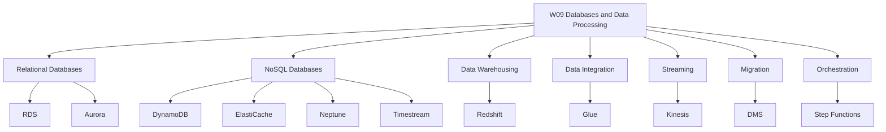

# Migration in progress
# W09: Databases & Data Processing - Lesson 0: Module Introduction

This module covers the AWS database portfolio and data processing services. It spans relational databases, NoSQL databases, data warehousing, ETL, real-time streaming, database migration, and pipeline orchestration. The goal is to select the right database for a workload and build data pipelines that move, transform, and analyse data at scale.



## Module Purpose

- Introduce the AWS purpose-built database portfolio and the problem each service solves.
- Explain when to use relational, key-value, document, in-memory, graph, time-series, and ledger databases.
- Describe the core features of Amazon RDS, Aurora, DynamoDB, and Redshift.
- Introduce data integration with AWS Glue and real-time streaming with Amazon Kinesis.
- Explain database migration with AWS DMS and pipeline orchestration with Step Functions.
- Prepare for hands-on labs and scenario-based assessment.

## Learning Objectives

- Compare the AWS database categories and identify the right service for a given access pattern.
- Describe the difference between Amazon RDS and Amazon Aurora.
- Explain DynamoDB capacity modes, indexes, and features.
- Describe the Redshift architecture and its MPP design.
- Explain the components of AWS Glue and how they support ETL.
- Compare Kinesis Data Streams, Firehose, and Analytics.
- Describe how AWS DMS migrates databases with minimal downtime.
- Explain how Step Functions orchestrates serverless ETL pipelines.
- Select the appropriate database and data processing service for a workload.

> [!Tip]
> **Start with the access pattern, not the service**: The first question in any database decision is how the application will read and write data. Relational for ACID transactions. Key-value for high-throughput lookups. Document for flexible schemas. Graph for relationships. Time-series for timestamped data. The access pattern determines the database category, and the category narrows the service choice.

## Module Structure

| Lesson | Topic | Focus |
|---|---|---|
| Lesson 0 | Module Introduction | Scope and objectives |
| Lesson 1 | Relational Databases | RDS, Aurora, Multi-AZ, read replicas |
| Lesson 2 | NoSQL Databases | DynamoDB, ElastiCache, DocumentDB, Neptune, Timestream |
| Lesson 3 | Data Warehousing | Redshift, Spectrum, concurrency scaling |
| Lesson 4 | Data Integration and Streaming | Glue, Kinesis, DMS, Step Functions |
| Lesson 5 | Summary and Assessment | Review and scenarios |

## Core Concepts Preview

### Database Categories

AWS offers purpose-built databases, each optimised for a specific data model and access pattern.

| Category | AWS Service | Data Model | Use Case |
|---|---|---|---|
| Relational | Amazon RDS | Tables with rows and columns, ACID transactions | ERP, CRM, e-commerce |
| Relational (cloud-native) | Amazon Aurora | MySQL/PostgreSQL compatible, distributed storage | High-traffic web apps, SaaS, gaming |
| Key-Value | Amazon DynamoDB | Key-value and document, single-digit millisecond latency | Session state, shopping carts, leaderboards |
| Document | Amazon DocumentDB | MongoDB-compatible document store | Content management, catalogues |
| In-Memory | Amazon ElastiCache | Key-value with microsecond latency | Caching, session management |
| Graph | Amazon Neptune | Nodes and edges | Fraud detection, social networks |
| Time-Series | Amazon Timestream | Time-stamped data | IoT, DevOps, industrial telemetry |
| Wide Column | Amazon Keyspaces | Apache Cassandra-compatible | Low-latency applications |
| Ledger | Amazon QLDB | Immutable, verifiable transaction log | Systems of record, supply chain |
| Data Warehouse | Amazon Redshift | Columnar, MPP | BI reporting, analytics |

> [!Important]
> **Choose the database by access pattern, not by familiarity**: The most common architectural mistake is forcing data into a relational database when a purpose-built database would serve it better. Use relational for ACID transactions and complex queries. Use key-value for high-throughput, low-latency lookups. Use document for flexible schemas. Use graph for relationship-heavy data. Use time-series for timestamped data.

### Relational Databases

- Amazon RDS is a managed relational database service supporting six engines: PostgreSQL, MySQL, MariaDB, Oracle, SQL Server, and Db2.
- RDS Multi-AZ provides synchronous replication to a standby in another Availability Zone with automatic failover in 60-120 seconds.
- Read replicas provide asynchronous replication for read scaling and disaster recovery.
- Amazon Aurora is a MySQL and PostgreSQL-compatible relational database built for the cloud with distributed storage, up to 15 read replicas, and failover under 30 seconds.
- Aurora Serverless v2 automatically scales capacity in fine-grained increments based on demand.
- Aurora Global Database spans multiple Regions with sub-second replication and promotion under 1 minute.

### NoSQL Databases

- Amazon DynamoDB is a serverless key-value and document database with single-digit millisecond performance at any scale.
- DynamoDB offers on-demand and provisioned capacity modes.
- DynamoDB Streams captures item-level changes for event-driven processing.
- DynamoDB Accelerator (DAX) provides microsecond read latency.
- Global Tables provide multi-Region active-active replication.
- Amazon ElastiCache provides in-memory caching with microsecond latency.
- Amazon Neptune is a graph database for relationship-heavy data.
- Amazon Timestream is a time-series database for IoT and operational telemetry.

### Data Warehousing

- Amazon Redshift is a petabyte-scale data warehouse with MPP architecture.
- Columnar storage reduces I/O for analytical queries.
- Redshift Spectrum queries S3 data directly without loading into Redshift.
- Federated queries access RDS and Aurora data without ETL.
- Concurrency Scaling automatically adds clusters for concurrent queries.
- RA3 instances separate compute and storage for independent scaling.

### Data Integration and Streaming

- AWS Glue is a serverless data integration service for ETL, schema discovery, and data cataloguing.
- Glue crawlers discover schemas and populate the Data Catalog.
- Glue ETL jobs transform, compress, and partition data.
- Amazon Kinesis provides real-time streaming with Data Streams, Firehose, Analytics, and Video Streams.
- Kinesis Data Streams captures gigabytes per second with configurable retention.
- Kinesis Data Firehose loads streaming data into S3, Redshift, and OpenSearch.
- AWS DMS migrates databases to AWS with minimal downtime.
- AWS Schema Conversion Tool converts schema and code for heterogeneous migrations.
- AWS Step Functions orchestrates serverless ETL pipelines with error handling and retry logic.

```mermaid
flowchart TD
    A[Database Decision] --> B{Data Model?}
    B -->|Relational, ACID| C{Engine?}
    C -->|MySQL/PostgreSQL| D[Aurora or RDS]
    C -->|Oracle/SQL Server| E[RDS]
    B -->|Key-Value| F[DynamoDB]
    B -->|Document| G[DocumentDB]
    B -->|In-Memory| H[ElastiCache]
    B -->|Graph| I[Neptune]
    B -->|Time-Series| J[Timestream]
    A --> K{Analytics?}
    K -->|Yes