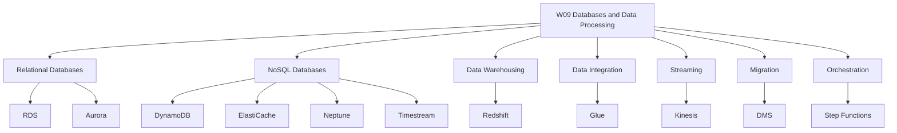
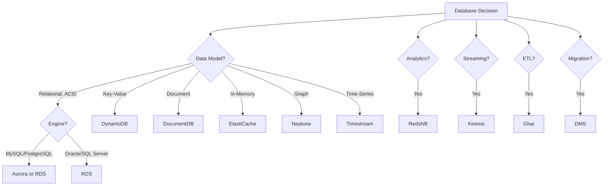
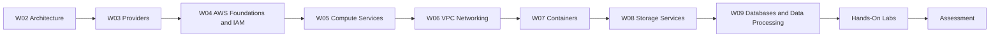
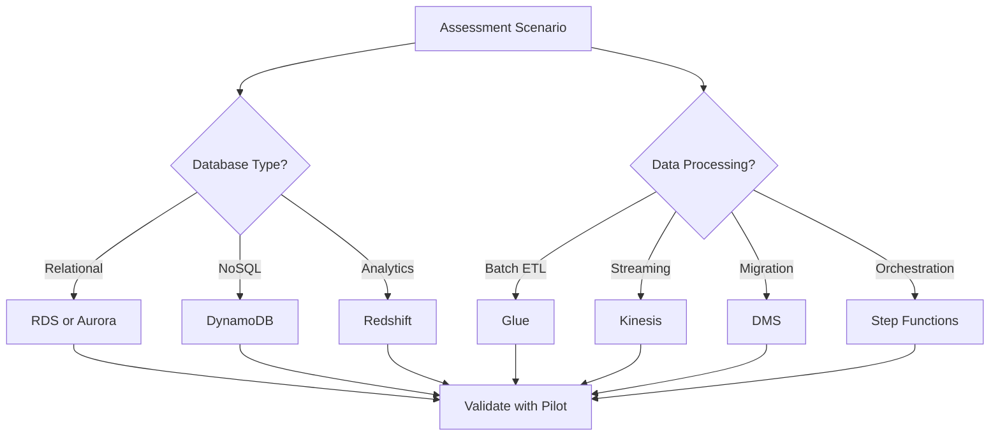

# W09: Databases & Data Processing - Lesson 0: Module Introduction

This module covers the AWS database portfolio and data processing services. It spans relational databases, NoSQL databases, data warehousing, ETL, real-time streaming, database migration, and pipeline orchestration. The goal is to select the right database for a workload and build data pipelines that move, transform, and analyse data at scale.

## Module Purpose

- Introduce the AWS purpose-built database portfolio and the problem each service solves.
- Explain when to use relational, key-value, document, in-memory, graph, time-series, and ledger databases.
- Describe the core features of Amazon RDS, Aurora, DynamoDB, and Redshift.
- Introduce data integration with AWS Glue and real-time streaming with Amazon Kinesis.
- Explain database migration with AWS DMS and pipeline orchestration with Step Functions.
- Prepare for hands-on labs and scenario-based assessment.

## Learning Objectives

- Compare the AWS database categories and identify the right service for a given access pattern.
- Describe the difference between Amazon RDS and Amazon Aurora.
- Explain DynamoDB capacity modes, indexes, and features.
- Describe the Redshift architecture and its MPP design.
- Explain the components of AWS Glue and how they support ETL.
- Compare Kinesis Data Streams, Firehose, and Analytics.
- Describe how AWS DMS migrates databases with minimal downtime.
- Explain how Step Functions orchestrates serverless ETL pipelines.
- Select the appropriate database and data processing service for a workload.

> [!Tip]
> **Start with the access pattern, not the service**: The first question in any database decision is how the application will read and write data. Relational for ACID transactions. Key-value for high-throughput lookups. Document for flexible schemas. Graph for relationships. Time-series for timestamped data. The access pattern determines the database category, and the category narrows the service choice.

## Module Structure

| Lesson | Topic | Focus |
|---|---|---|
| Lesson 0 | Module Introduction | Scope and objectives |
| Lesson 1 | Relational Databases | RDS, Aurora, Multi-AZ, read replicas |
| Lesson 2 | NoSQL Databases | DynamoDB, ElastiCache, DocumentDB, Neptune, Timestream |
| Lesson 3 | Data Warehousing | Redshift, Spectrum, concurrency scaling |
| Lesson 4 | Data Integration and Streaming | Glue, Kinesis, DMS, Step Functions |
| Lesson 5 | Summary and Assessment | Review and scenarios |

## Core Concepts Preview

### Database Categories

AWS offers purpose-built databases, each optimised for a specific data model and access pattern.

| Category | AWS Service | Data Model | Use Case |
|---|---|---|---|
| Relational | Amazon RDS | Tables with rows and columns, ACID transactions | ERP, CRM, e-commerce |
| Relational (cloud-native) | Amazon Aurora | MySQL/PostgreSQL compatible, distributed storage | High-traffic web apps, SaaS, gaming |
| Key-Value | Amazon DynamoDB | Key-value and document, single-digit millisecond latency | Session state, shopping carts, leaderboards |
| Document | Amazon DocumentDB | MongoDB-compatible document store | Content management, catalogues |
| In-Memory | Amazon ElastiCache | Key-value with microsecond latency | Caching, session management |
| Graph | Amazon Neptune | Nodes and edges | Fraud detection, social networks |
| Time-Series | Amazon Timestream | Time-stamped data | IoT, DevOps, industrial telemetry |
| Wide Column | Amazon Keyspaces | Apache Cassandra-compatible | Low-latency applications |
| Ledger | Amazon QLDB | Immutable, verifiable transaction log | Systems of record, supply chain |
| Data Warehouse | Amazon Redshift | Columnar, MPP | BI reporting, analytics |

> [!Important]
> **Choose the database by access pattern, not by familiarity**: The most common architectural mistake is forcing data into a relational database when a purpose-built database would serve it better. Use relational for ACID transactions and complex queries. Use key-value for high-throughput, low-latency lookups. Use document for flexible schemas. Use graph for relationship-heavy data. Use time-series for timestamped data.

### Relational Databases

- Amazon RDS is a managed relational database service supporting six engines: PostgreSQL, MySQL, MariaDB, Oracle, SQL Server, and Db2.
- RDS Multi-AZ provides synchronous replication to a standby in another Availability Zone with automatic failover in 60-120 seconds.
- Read replicas provide asynchronous replication for read scaling and disaster recovery.
- Amazon Aurora is a MySQL and PostgreSQL-compatible relational database built for the cloud with distributed storage, up to 15 read replicas, and failover under 30 seconds.
- Aurora Serverless v2 automatically scales capacity in fine-grained increments based on demand.
- Aurora Global Database spans multiple Regions with sub-second replication and promotion under 1 minute.

### NoSQL Databases

- Amazon DynamoDB is a serverless key-value and document database with single-digit millisecond performance at any scale.
- DynamoDB offers on-demand and provisioned capacity modes.
- DynamoDB Streams captures item-level changes for event-driven processing.
- DynamoDB Accelerator (DAX) provides microsecond read latency.
- Global Tables provide multi-Region active-active replication.
- Amazon ElastiCache provides in-memory caching with microsecond latency.
- Amazon Neptune is a graph database for relationship-heavy data.
- Amazon Timestream is a time-series database for IoT and operational telemetry.

### Data Warehousing

- Amazon Redshift is a petabyte-scale data warehouse with MPP architecture.
- Columnar storage reduces I/O for analytical queries.
- Redshift Spectrum queries S3 data directly without loading into Redshift.
- Federated queries access RDS and Aurora data without ETL.
- Concurrency Scaling automatically adds clusters for concurrent queries.
- RA3 instances separate compute and storage for independent scaling.

### Data Integration and Streaming

- AWS Glue is a serverless data integration service for ETL, schema discovery, and data cataloguing.
- Glue crawlers discover schemas and populate the Data Catalog.
- Glue ETL jobs transform, compress, and partition data.
- Amazon Kinesis provides real-time streaming with Data Streams, Firehose, Analytics, and Video Streams.
- Kinesis Data Streams captures gigabytes per second with configurable retention.
- Kinesis Data Firehose loads streaming data into S3, Redshift, and OpenSearch.
- AWS DMS migrates databases to AWS with minimal downtime.
- AWS Schema Conversion Tool converts schema and code for heterogeneous migrations.
- AWS Step Functions orchestrates serverless ETL pipelines with error handling and retry logic.

> [!Tip]
> **Use the decision tree as a starting point**: The right database choice depends on the access pattern, consistency requirements, scale, and operational maturity. The decision tree narrows the field but does not replace judgment. Validate with a pilot before committing at scale.

## How This Module Connects to Previous Modules

- W02 covered reliability, performance, and the AWS Well-Architected Framework.
- W03 compared AWS, Azure, and GCP across services and selection factors.
- W04 covered AWS global infrastructure, IAM, and account security.
- W05 covered compute services and virtualisation, including EC2 and EBS.
- W06 covered VPC networking fundamentals.
- W07 covered containers, Docker, and Kubernetes.
- W08 covered AWS storage services, including S3, EBS, EFS, and FSx.
- W09 adds the data layer: how data is stored, queried, transformed, and moved.
- The database and data processing choices you make affect reliability, cost, performance, and security.

## Assessment Preparation

### Practice Questions

1. Compare the AWS database categories and give a service for each.
2. Explain the difference between Amazon RDS and Amazon Aurora.
3. Describe the features of RDS Multi-AZ and read replicas.
4. Explain how Aurora's distributed storage works.
5. Describe Aurora Serverless v2 and Aurora Global Database.
6. Compare DynamoDB on-demand and provisioned capacity modes.
7. Explain the difference between Local Secondary Indexes and Global Secondary Indexes.
8. Describe the Redshift architecture and its MPP design.
9. Explain the purpose of Redshift Spectrum and federated queries.
10. Describe the components of AWS Glue.
11. Compare Kinesis Data Streams, Firehose, and Analytics.
12. Explain the purpose of AWS DMS and its migration types.
13. Describe how Step Functions orchestrates ETL pipelines.
14. Explain why DynamoDB is not a replacement for relational databases.
15. Describe when to use ElastiCache, Neptune, and Timestream.

### Scenario Questions

**Scenario 1: High-Traffic Web Application**
A SaaS platform needs a relational database that can handle high traffic with auto-scaling storage and fast failover. What should they use?

- Use Amazon Aurora MySQL or PostgreSQL.
- Aurora provides auto-scaling storage, up to 15 read replicas, and failover under 30 seconds.
- Use Aurora Global Database for multi-Region disaster recovery.
- Use Aurora Serverless v2 for variable workloads.

**Scenario 2: Gaming Leaderboard**
A gaming company needs a database that can handle millions of reads and writes per second with single-digit millisecond latency. What should they use?

- Use Amazon DynamoDB.
- Use on-demand capacity mode for unpredictable traffic.
- Use DAX for microsecond read latency.
- Use Global Tables for multi-Region active-active replication.

**Scenario 3: Business Intelligence Reporting**
A company needs to analyse petabytes of data from multiple sources for BI reporting. What should they use?

- Use Amazon Redshift.
- Use Redshift Spectrum to query S3 data directly.
- Use federated queries to access RDS and Aurora data.
- Use concurrency scaling for high-concurrency workloads.
- Use RA3 instances to separate compute and storage.

**Scenario 4: Real-Time Clickstream Analytics**
A company needs to process website clickstream data in real time and load it into S3 for analysis. What should they use?

- Use Kinesis Data Streams to capture the stream.
- Use Kinesis Data Firehose to load data into S3.
- Use Kinesis Data Analytics for real-time SQL processing.
- Use Glue to transform the data into Parquet format.
- Use Redshift or Athena to query the data.

**Scenario 5: Database Migration**
A company wants to migrate an on-premises Oracle database to Aurora PostgreSQL with minimal downtime. What should they use?

- Use AWS Schema Conversion Tool (SCT) to convert schema and code.
- Use AWS DMS for continuous replication.
- Keep the source database operational during migration.
- Cut over during a maintenance window.

**Scenario 6: Serverless ETL Pipeline**
A company needs to build an ETL pipeline that validates, transforms, and partitions CSV files uploaded to S3. What should they use?

- Use S3 event notifications to trigger Lambda.
- Use Step Functions to orchestrate the workflow.
- Use Lambda to validate schema and data type.
- Use Glue crawlers to discover schema.
- Use Glue jobs to transform CSV to Parquet.
- Use SNS for error notifications.

## Key Takeaways

- AWS offers purpose-built databases for different data models and access patterns.
- Relational databases (RDS, Aurora) are for ACID transactions and complex queries.
- NoSQL databases (DynamoDB, ElastiCache, DocumentDB, Neptune, Timestream) are for high-throughput, low-latency, flexible-schema, graph, and time-series workloads.
- Amazon Redshift is a petabyte-scale data warehouse for analytics and BI reporting.
- AWS Glue is a serverless data integration service for ETL and data cataloguing.
- Amazon Kinesis provides real-time streaming with Data Streams, Firehose, and Analytics.
- AWS DMS migrates databases to AWS with minimal downtime.
- AWS Step Functions orchestrates serverless ETL pipelines.
- Choose the database by access pattern, not by familiarity.
- RDS Multi-AZ is for high availability. Read replicas are for read scaling.
- Aurora is the default choice for new relational workloads on AWS.
- DynamoDB is for key-based access patterns, not relational queries.
- Redshift is for analytics, not transactions.
- Glue is serverless but not free. Use job bookmarks and right-size workers.
- Kinesis Firehose is the easiest way to load streaming data into AWS data stores.
- DMS is for migration. SCT converts schema for heterogeneous migrations.
- Step Functions provides error handling and orchestration for ETL pipelines.
- This module builds on W02 architecture, W03 provider comparison, W04 AWS foundations, W05 compute services, W06 VPC networking, W07 containers, and W08 storage services.
- Assessment focuses on practical database selection and scenario-based data processing decisions.

> [!Important]
> **Match the database to the access pattern, and the processing service to the data velocity**: The most common architectural mistake is forcing data into the wrong database. Use relational for ACID transactions. Use key-value for high-throughput lookups. Use document for flexible schemas. Use graph for relationships. Use time-series for timestamped data. For data processing, use Glue for batch ETL, Kinesis for real-time streaming, DMS for migration, and Step Functions for orchestration. A modern application typically uses several database types together. Design for the access pattern, not for a single database to do everything.
