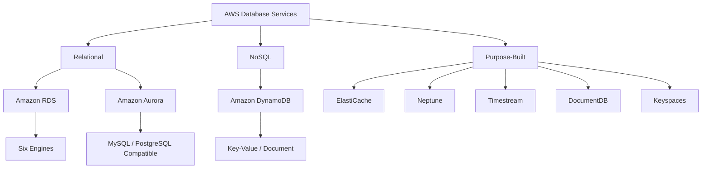
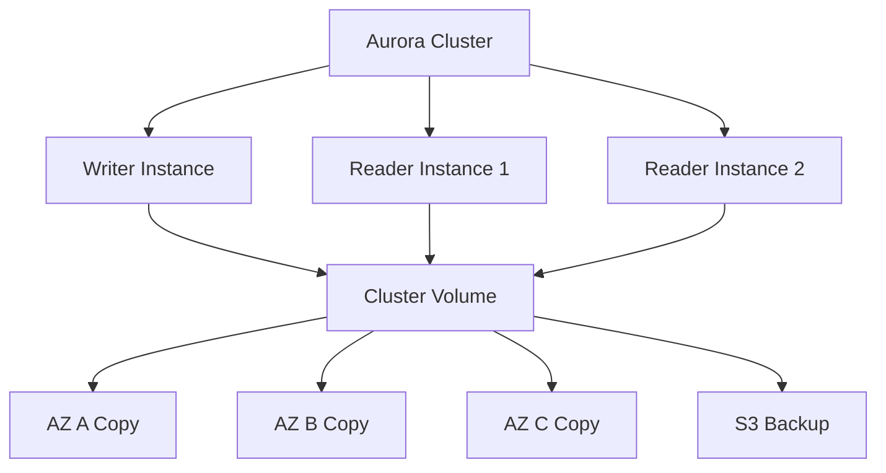

# Migration in progress
# Lesson 1: Introduction to Cloud Databases

AWS offers a portfolio of purpose-built database services, each optimised for a specific data model and access pattern. Instead of forcing every workload into a single relational engine, you choose the database that fits the access pattern: relational for ACID transactions, key-value for high-throughput lookups, document for flexible schemas, graph for relationships, and time-series for timestamped data. The core services covered here are Amazon RDS, Amazon Aurora, and Amazon DynamoDB.

## The Purpose-Built Database Philosophy

*Definition*: AWS offers over 15 database options across relational, key-value, document, in-memory, graph, time-series, vector, and wide-column data models. The right choice depends on the workload's access pattern, consistency requirements, scale, and operational maturity.

- Relational databases (RDS, Aurora) are for applications that need ACID transactions, complex joins, and referential integrity. Use them for ERP, CRM, e-commerce, and traditional applications.
- Key-value databases (DynamoDB) are for high-throughput, low-latency lookups. Use them for session state, shopping carts, gaming leaderboards, and product catalogues.
- Document databases (DocumentDB) are for flexible, semi-structured data. Use them for content management, catalogues, and user profiles.
- In-memory databases (ElastiCache, MemoryDB) provide microsecond latency for caching, session stores, and real-time analytics.
- Graph databases (Neptune) are for relationship-heavy data such as fraud detection, social networks, and recommendation engines.
- Time-series databases (Timestream) are for IoT, DevOps, and industrial telemetry workloads.

> [!Important]
> **Choose the database by access pattern, not by familiarity**: The most common architectural mistake is forcing data into a relational database when a purpose-built database would serve it better. Ask how the application will read and write data. The access pattern determines the category. The category narrows the service choice.

## Amazon RDS

*Definition*: Amazon Relational Database Service (RDS) is a managed relational database service that makes it easy to set up, operate, and scale a relational database in the cloud. It automates time-consuming administration tasks such as provisioning, patching, backup, recovery, failure detection, and repair.

### Supported Engines

RDS supports six database engines: PostgreSQL, MySQL, MariaDB, Oracle, SQL Server, and Db2. Each engine has different version support, feature availability, and licensing costs. PostgreSQL and MySQL are the most widely used for new workloads. Oracle and SQL Server are common in enterprise migrations.

### RDS Multi-AZ Deployments

RDS offers two high-availability deployment modes.

| Deployment Mode | Description | Failover Time | Read Capacity |
|---|---|---|---|
| Multi-AZ DB Instance | One writer, one standby in a second AZ. Synchronous replication. | 60-120 seconds | Standby does not serve reads |
| Multi-AZ DB Cluster | One writer, two readers across three AZs. Semisynchronous replication. | Typically under 35 seconds | Readers serve read traffic |

- Multi-AZ DB instance deployments provide a standby replica in a second Availability Zone for failover. The standby does not serve read traffic.
- Multi-AZ DB cluster deployments have a writer and two readable replicas across three Availability Zones. Replication requires acknowledgment from at least one reader before a change is committed.
- Multi-AZ DB clusters provide high availability, increased read capacity, and lower write latency compared to Multi-AZ DB instance deployments.
- Multi-AZ DB clusters are not the same as Aurora DB clusters. They are a distinct RDS deployment mode.

> [!Important]
> **Multi-AZ is for high availability, not read scaling**: The standby instance in a Multi-AZ DB instance deployment does not serve read traffic. It exists solely for failover. Use read replicas for read scaling. Use Multi-AZ for automatic failover and disaster recovery.

### RDS Read Replicas

- Read replicas use asynchronous replication from the primary instance.
- Each DB instance can have up to 15 read replicas, except for Db2, which supports up to three.
- Read replicas can be created in the same Region, a different Region, or as a Multi-AZ deployment.
- Read replicas are used for read scaling, analytics, and disaster recovery.
- A read replica can be promoted to a standalone primary if the source fails.

### RDS Features

- **Automated backups**: Daily full snapshots and transaction logs. Point-in-time recovery to any second within the retention period (up to 35 days).
- **RDS Proxy**: Connection pooling for serverless and containerised applications. Reduces database CPU load and improves scalability.
- **Performance Insights**: Visualises database load and identifies bottlenecks.
- **Storage autoscaling**: Automatically increases storage when free space runs low.
- **Encryption**: Encryption at rest using AWS KMS and encryption in transit using SSL/TLS.

## Amazon Aurora

*Definition*: Amazon Aurora is a MySQL and PostgreSQL-compatible relational database built for the cloud. It features a distributed, fault-tolerant, self-healing storage system that auto-scales up to 128 TB per database instance.

### Aurora Architecture

Aurora decouples compute from storage. Data is stored in a cluster volume, which is a single virtual volume that uses SSDs and spans three Availability Zones within a Region. The cluster volume contains all user data, schema objects, and internal metadata. Data is automatically replicated across the Availability Zones, reducing the likelihood of data loss and providing high durability.

- The cluster volume is separate from the DB instances. Adding a DB instance does not create a new copy of the data. The new instance simply connects to the shared volume.
- Aurora supports up to 15 low-latency read replicas.
- Aurora delivers high performance with point-in-time recovery and continuous backup to Amazon S3.

### Aurora vs RDS

| Dimension | Aurora | RDS |
|---|---|---|
| Storage | Distributed, auto-scaling, 128 TB | Provisioned EBS, manual resize |
| Read Replicas | Up to 15, sub-10ms lag | Up to 15, lag of minutes |
| Failover | Typically under 30 seconds | 60-120 seconds (Multi-AZ instance) |
| Durability | 6 copies across 3 AZs | Multi-AZ standby |
| Backups | Continuous to S3 | Daily snapshots + transaction logs |
| Cost | Higher per hour, lower at scale | Lower per hour, higher at scale |

> [!Tip]
> **Aurora is the default choice for new relational workloads on AWS**: Aurora offers better price-performance than RDS for most production workloads, with auto-scaling storage, faster failover, and more read replicas. Choose RDS when you need a specific engine (Oracle, SQL Server, Db2) or want to minimise cost for small workloads.

### Aurora Serverless v2

- Aurora Serverless v2 automatically scales database capacity in fine-grained increments based on demand.
- You define a minimum and maximum ACU (Aurora Capacity Unit) range.
- Scaling happens in milliseconds, with no downtime.
- Ideal for variable or unpredictable workloads, development environments, and multi-tenant SaaS applications.
- You pay only for the capacity you use.

### Aurora Global Database

- Aurora Global Database spans multiple Regions. A primary Region serves writes. Secondary Regions serve read-only traffic.
- An Aurora global database has one primary DB cluster in one Region and up to five read-only secondary DB clusters in different Regions.
- Replication uses storage block-based replication and is asynchronous.
- Replication lag is typically under 1 second.
- Promotes a secondary Region to primary in under 1 minute during a regional failure.

## Amazon DynamoDB

*Definition*: Amazon DynamoDB is a fully managed, serverless, NoSQL key-value and document database that delivers single-digit millisecond performance at any scale. It is designed for applications that need high throughput and low latency.

### Core Components

In DynamoDB, tables, items, and attributes are the core components.

- **Tables**: A table is a collection of items. There is no limit to the number of items you can store in a table.
- **Items**: An item is a group of attribut