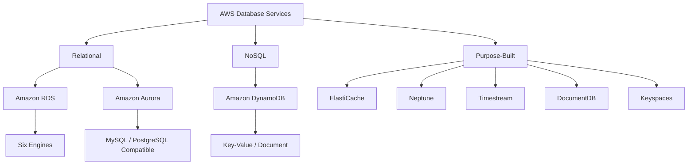
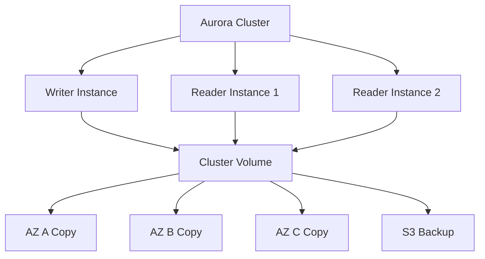
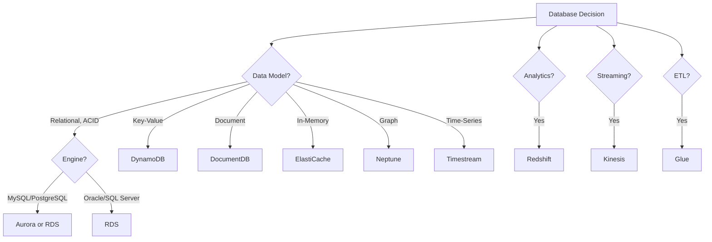

# Lesson 1: Introduction to Cloud Databases

AWS offers a portfolio of purpose-built database services, each optimised for a specific data model and access pattern. Instead of forcing every workload into a single relational engine, you choose the database that fits the access pattern: relational for ACID transactions, key-value for high-throughput lookups, document for flexible schemas, graph for relationships, and time-series for timestamped data. The core services covered here are Amazon RDS, Amazon Aurora, and Amazon DynamoDB.

## The Purpose-Built Database Philosophy

*Definition*: AWS offers over 15 database options across relational, key-value, document, in-memory, graph, time-series, vector, and wide-column data models. The right choice depends on the workload's access pattern, consistency requirements, scale, and operational maturity.

- Relational databases (RDS, Aurora) are for applications that need ACID transactions, complex joins, and referential integrity. Use them for ERP, CRM, e-commerce, and traditional applications.
- Key-value databases (DynamoDB) are for high-throughput, low-latency lookups. Use them for session state, shopping carts, gaming leaderboards, and product catalogues.
- Document databases (DocumentDB) are for flexible, semi-structured data. Use them for content management, catalogues, and user profiles.
- In-memory databases (ElastiCache, MemoryDB) provide microsecond latency for caching, session stores, and real-time analytics.
- Graph databases (Neptune) are for relationship-heavy data such as fraud detection, social networks, and recommendation engines.
- Time-series databases (Timestream) are for IoT, DevOps, and industrial telemetry workloads.

> [!Important]
> **Choose the database by access pattern, not by familiarity**: The most common architectural mistake is forcing data into a relational database when a purpose-built database would serve it better. Ask how the application will read and write data. The access pattern determines the category. The category narrows the service choice.

## Amazon RDS

*Definition*: Amazon Relational Database Service (RDS) is a managed relational database service that makes it easy to set up, operate, and scale a relational database in the cloud. It automates time-consuming administration tasks such as provisioning, patching, backup, recovery, failure detection, and repair.

### Supported Engines

RDS supports six database engines: PostgreSQL, MySQL, MariaDB, Oracle, SQL Server, and Db2. Each engine has different version support, feature availability, and licensing costs. PostgreSQL and MySQL are the most widely used for new workloads. Oracle and SQL Server are common in enterprise migrations.

### RDS Multi-AZ Deployments

RDS offers two high-availability deployment modes.

| Deployment Mode | Description | Failover Time | Read Capacity |
|---|---|---|---|
| Multi-AZ DB Instance | One writer, one standby in a second AZ. Synchronous replication. | 60-120 seconds | Standby does not serve reads |
| Multi-AZ DB Cluster | One writer, two readers across three AZs. Semisynchronous replication. | Typically under 35 seconds | Readers serve read traffic |

- Multi-AZ DB instance deployments provide a standby replica in a second Availability Zone for failover. The standby does not serve read traffic.
- Multi-AZ DB cluster deployments have a writer and two readable replicas across three Availability Zones. Replication requires acknowledgment from at least one reader before a change is committed.
- Multi-AZ DB clusters provide high availability, increased read capacity, and lower write latency compared to Multi-AZ DB instance deployments.
- Multi-AZ DB clusters are not the same as Aurora DB clusters. They are a distinct RDS deployment mode.

> [!Important]
> **Multi-AZ is for high availability, not read scaling**: The standby instance in a Multi-AZ DB instance deployment does not serve read traffic. It exists solely for failover. Use read replicas for read scaling. Use Multi-AZ for automatic failover and disaster recovery.

### RDS Read Replicas

- Read replicas use asynchronous replication from the primary instance.
- Each DB instance can have up to 15 read replicas, except for Db2, which supports up to three.
- Read replicas can be created in the same Region, a different Region, or as a Multi-AZ deployment.
- Read replicas are used for read scaling, analytics, and disaster recovery.
- A read replica can be promoted to a standalone primary if the source fails.

### RDS Features

- **Automated backups**: Daily full snapshots and transaction logs. Point-in-time recovery to any second within the retention period (up to 35 days).
- **RDS Proxy**: Connection pooling for serverless and containerised applications. Reduces database CPU load and improves scalability.
- **Performance Insights**: Visualises database load and identifies bottlenecks.
- **Storage autoscaling**: Automatically increases storage when free space runs low.
- **Encryption**: Encryption at rest using AWS KMS and encryption in transit using SSL/TLS.

## Amazon Aurora

*Definition*: Amazon Aurora is a MySQL and PostgreSQL-compatible relational database built for the cloud. It features a distributed, fault-tolerant, self-healing storage system that auto-scales up to 128 TB per database instance.

### Aurora Architecture

Aurora decouples compute from storage. Data is stored in a cluster volume, which is a single virtual volume that uses SSDs and spans three Availability Zones within a Region. The cluster volume contains all user data, schema objects, and internal metadata. Data is automatically replicated across the Availability Zones, reducing the likelihood of data loss and providing high durability.

- The cluster volume is separate from the DB instances. Adding a DB instance does not create a new copy of the data. The new instance simply connects to the shared volume.
- Aurora supports up to 15 low-latency read replicas.
- Aurora delivers high performance with point-in-time recovery and continuous backup to Amazon S3.

### Aurora vs RDS

| Dimension | Aurora | RDS |
|---|---|---|
| Storage | Distributed, auto-scaling, 128 TB | Provisioned EBS, manual resize |
| Read Replicas | Up to 15, sub-10ms lag | Up to 15, lag of minutes |
| Failover | Typically under 30 seconds | 60-120 seconds (Multi-AZ instance) |
| Durability | 6 copies across 3 AZs | Multi-AZ standby |
| Backups | Continuous to S3 | Daily snapshots + transaction logs |
| Cost | Higher per hour, lower at scale | Lower per hour, higher at scale |

> [!Tip]
> **Aurora is the default choice for new relational workloads on AWS**: Aurora offers better price-performance than RDS for most production workloads, with auto-scaling storage, faster failover, and more read replicas. Choose RDS when you need a specific engine (Oracle, SQL Server, Db2) or want to minimise cost for small workloads.

### Aurora Serverless v2

- Aurora Serverless v2 automatically scales database capacity in fine-grained increments based on demand.
- You define a minimum and maximum ACU (Aurora Capacity Unit) range.
- Scaling happens in milliseconds, with no downtime.
- Ideal for variable or unpredictable workloads, development environments, and multi-tenant SaaS applications.
- You pay only for the capacity you use.

### Aurora Global Database

- Aurora Global Database spans multiple Regions. A primary Region serves writes. Secondary Regions serve read-only traffic.
- An Aurora global database has one primary DB cluster in one Region and up to five read-only secondary DB clusters in different Regions.
- Replication uses storage block-based replication and is asynchronous.
- Replication lag is typically under 1 second.
- Promotes a secondary Region to primary in under 1 minute during a regional failure.

## Amazon DynamoDB

*Definition*: Amazon DynamoDB is a fully managed, serverless, NoSQL key-value and document database that delivers single-digit millisecond performance at any scale. It is designed for applications that need high throughput and low latency.

### Core Components

In DynamoDB, tables, items, and attributes are the core components.

- **Tables**: A table is a collection of items. There is no limit to the number of items you can store in a table.
- **Items**: An item is a group of attributes that is uniquely identifiable among all other items. Items are similar to rows in a relational database.
- **Attributes**: Each item is composed of one or more attributes. Attributes are similar to fields or columns in a relational database.
- **Primary Key**: Each item has a unique primary key that distinguishes it from all other items. A primary key can be a partition key (simple) or a partition key and sort key (composite).
- **Schemaless**: Other than the primary key, the table is schemaless. Each item can have different attributes and data types. Attributes do not need to be defined beforehand.

### DynamoDB Capacity Modes

| Mode | Description | Use Case |
|---|---|---|
| On-Demand | Pay per request. Automatically scales to workload. | Unpredictable traffic, new applications |
| Provisioned | Specify read and write capacity units. Auto scaling available. | Predictable traffic, cost optimisation |

- On-demand mode is recommended for most DynamoDB workloads.
- Provisioned mode is cheaper for steady-state workloads where capacity requirements can be reliably forecasted.

### DynamoDB Indexes

| Index Type | Description | Use Case |
|---|---|---|
| Local Secondary Index (LSI) | Same partition key, different sort key. Created at table creation. | Alternative sort keys for a partition |
| Global Secondary Index (GSI) | Different partition key and sort key. Can be created anytime. | Query patterns on non-key attributes |

- You can create up to 20 global secondary indexes per table.

### DynamoDB Features

- **DynamoDB Streams**: Captures item-level changes for event-driven processing. You can use DynamoDB Streams to capture data modification events in DynamoDB tables.
- **DynamoDB Accelerator (DAX)**: In-memory cache for DynamoDB. Microsecond latency for read-heavy workloads.
- **Global Tables**: Multi-Region, active-active replication. Sub-second replication. Global tables always use multi-Region eventual consistency (MREC) for multi-account setups.
- **Point-in-Time Recovery**: Restore to any point in the last 35 days.
- **Time to Live (TTL)**: Automatically delete expired items.
- **Transactions**: ACID transactions across multiple items.

> [!Important]
> **DynamoDB is not a replacement for relational databases**: DynamoDB is optimised for key-based access patterns. It does not support joins, complex queries, or ad-hoc analytics. If you need relational queries, use RDS or Aurora. If you need flexible schema and single-digit millisecond performance at scale, use DynamoDB.

## Database Decision Framework

> [!Tip]
> **Use the decision tree as a starting point**: The right database choice depends on the access pattern, consistency requirements, scale, and operational maturity. The decision tree narrows the field but does not replace judgment. Validate with a pilot before committing at scale.

## Assessment Preparation

### Practice Questions

1. Compare the AWS database categories and give a service for each.
2. Explain the difference between Amazon RDS and Amazon Aurora.
3. Describe the two RDS Multi-AZ deployment modes and their failover characteristics.
4. Explain how RDS read replicas work and what they are used for.
5. Describe Aurora's distributed storage architecture.
6. Explain how Aurora Serverless v2 and Aurora Global Database work.
7. Compare DynamoDB on-demand and provisioned capacity modes.
8. Explain the difference between Local Secondary Indexes and Global Secondary Indexes.
9. Describe the core components of DynamoDB: tables, items, and attributes.
10. Explain why DynamoDB is not a replacement for relational databases.
11. Describe the use cases for ElastiCache, Neptune, and Timestream.
12. Explain why choosing the database by access pattern matters.

### Scenario Questions

**Scenario 1: High-Traffic Web Application**
A SaaS platform needs a relational database that can handle high traffic with auto-scaling storage and fast failover. What should they use?

- Use Amazon Aurora MySQL or PostgreSQL.
- Aurora provides auto-scaling storage, up to 15 read replicas, and failover under 30 seconds.
- Use Aurora Global Database for multi-Region disaster recovery.
- Use Aurora Serverless v2 for variable workloads.

**Scenario 2: Gaming Leaderboard**
A gaming company needs a database that can handle millions of reads and writes per second with single-digit millisecond latency. What should they use?

- Use Amazon DynamoDB.
- Use on-demand capacity mode for unpredictable traffic.
- Use DAX for microsecond read latency.
- Use Global Tables for multi-Region active-active replication.

**Scenario 3: Traditional Enterprise Application**
A company is migrating an on-premises Oracle ERP system to AWS. They need a managed relational database with Oracle compatibility. What should they use?

- Use Amazon RDS for Oracle.
- Use Multi-AZ DB instance deployment for high availability.
- Use read replicas for read scaling and reporting.
- Use RDS automated backups for point-in-time recovery.

**Scenario 4: Session State Store**
A web application needs to store user session state with microsecond latency and high throughput. What should they use?

- Use Amazon ElastiCache for Redis or Memcached.
- ElastiCache provides microsecond latency for caching and session stores.
- Use DynamoDB with DAX as an alternative if persistence is required.
- Use ElastiCache for the hottest data and DynamoDB for durable storage.

**Scenario 5: Fraud Detection Graph**
A financial services firm needs to detect fraudulent transactions by analysing relationships between accounts, devices, and transactions. What should they use?

- Use Amazon Neptune.
- Neptune is a graph database optimised for relationship-heavy data.
- Use it for fraud detection, social networks, and recommendation engines.
- Combine with DynamoDB for transactional data and Redshift for analytics.

## Key Takeaways

- AWS offers purpose-built databases for different data models and access patterns. Relational for ACID transactions. Key-value for high-throughput lookups. Document for flexible schemas. Graph for relationships. Time-series for timestamped data.
- Amazon RDS is a managed relational database service supporting six engines: PostgreSQL, MySQL, MariaDB, Oracle, SQL Server, and Db2.
- RDS Multi-AZ DB instance deployments provide a standby for failover. Multi-AZ DB cluster deployments provide two readable replicas and lower write latency.
- RDS read replicas use asynchronous replication for read scaling, analytics, and disaster recovery. Each DB instance can have up to 15 read replicas.
- Amazon Aurora is a MySQL and PostgreSQL-compatible relational database with distributed storage that auto-scales up to 128 TB and replicates across three Availability Zones.
- Aurora supports up to 15 low-latency read replicas and failover under 30 seconds.
- Aurora Serverless v2 automatically scales capacity in fine-grained increments.
- Aurora Global Database spans multiple Regions with sub-second replication and promotion under 1 minute.
- Amazon DynamoDB is a serverless NoSQL key-value and document database with single-digit millisecond performance at any scale.
- DynamoDB stores data in tables, items, and attributes. It is schemaless except for the primary key.
- DynamoDB offers on-demand and provisioned capacity modes. On-demand is recommended for most workloads.
- DynamoDB Streams capture item-level changes for event-driven processing. DAX provides microsecond read latency. Global Tables provide multi-Region active-active replication.
- Choose the database by access pattern, not by familiarity. The most common mistake is forcing data into a relational database when a purpose-built database would serve it better.
- RDS Multi-AZ is for high availability. Read replicas are for read scaling. Aurora is the default choice for new relational workloads. DynamoDB is for key-based access patterns.

> [!Important]
> **Match the database to the access pattern, not to a single engine for everything**: A modern application typically uses several database types together. A relational database for transactions. A key-value store for session state. An in-memory cache for hot paths. A graph database for relationships. A time-series database for telemetry. Design for the access pattern, not for a single database to do everything. Start with Aurora for relational workloads. Start with DynamoDB for key-value and high-throughput workloads. Use RDS when you need a specific engine. Use purpose-built databases for specialised access patterns.
