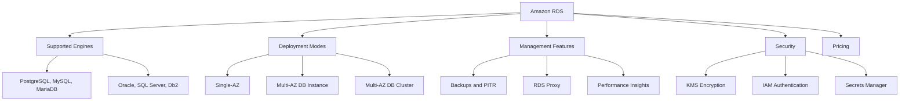
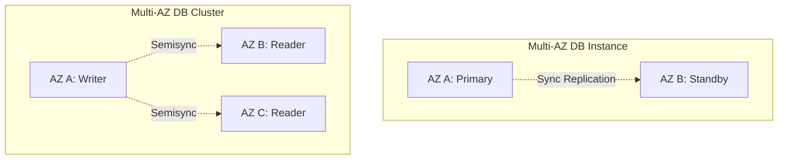
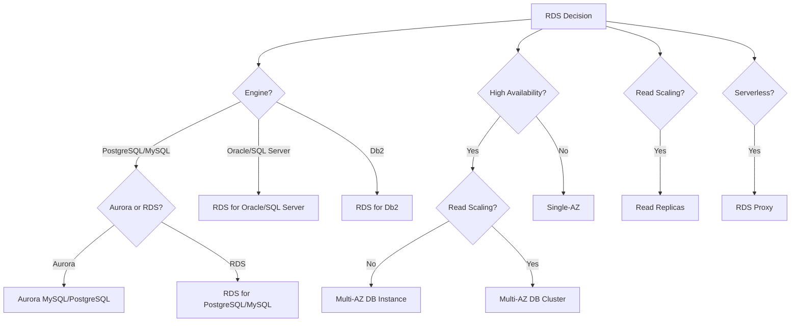
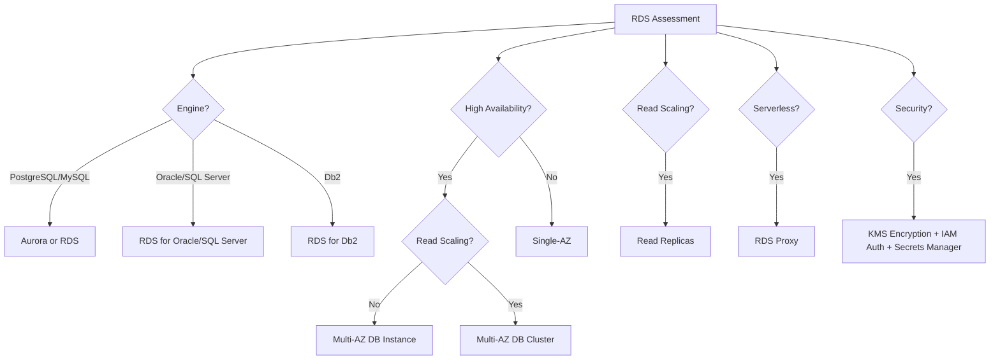

# Lesson 2: Amazon RDS Fundamentals

Amazon Relational Database Service (RDS) is a managed relational database service that makes it easy to set up, operate, and scale a relational database in the cloud. It automates time-consuming administration tasks such as provisioning, patching, backup, recovery, failure detection, and repair. RDS supports eight database engines, offers two Multi-AZ deployment modes, and provides read replicas, automated backups, and encryption at rest and in transit.

## What Is Amazon RDS

*Definition*: Amazon RDS is a managed relational database service that provides cost-efficient and resizable capacity while automating administration tasks. It offers three distinct deployment environments: cloud deployment with Amazon Aurora or Amazon RDS, hybrid workloads with Amazon RDS on AWS Outposts, and privileged access with Amazon RDS Custom.

- RDS automates time-consuming administration tasks: provisioning, patching, backup, recovery, failure detection, and repair.
- RDS supports eight database engines: PostgreSQL, MySQL, MariaDB, Oracle, SQL Server, and Db2.
- RDS is optimised for total cost of ownership. You pay only for what you use with no minimum fees.
- RDS offers two pricing models: On-Demand and Reserved Instances. Reserved Instances offer up to 69% savings compared to On-Demand.

> [!Important]
> **RDS is a managed service, not a self-managed database**: AWS manages the underlying infrastructure, operating system, and database software patching. You manage the database configuration, schema, and application-level tuning. The shared responsibility model defines the boundary.

## Supported Database Engines

RDS supports six database engines, each with different version support, feature availability, and licensing costs.

| Engine | Version Examples | Use Case |
|---|---|---|
| PostgreSQL | 16, 15, 14 | General-purpose relational workloads, PostGIS |
| MySQL | 8.4, 8.0 | Web applications, e-commerce |
| MariaDB | 11.8, 11.4, 10.11 | MySQL-compatible workloads |
| Oracle | 19c, 21c | Enterprise applications, ERP |
| SQL Server | 2019, 2022 | Windows workloads, .NET applications |
| Db2 | 11.5 | Enterprise workloads, mainframe migration |

- RDS for MySQL supports versions 8.4.7 and 8.0.44.
- RDS for MariaDB supports versions 11.4.9, 10.11.15, and 10.6.24.
- RDS Extended Support is available for open-source engine major versions after standard support ends.
- Cross-Region read replicas are not available for all engines. RDS for Db2 does not support cross-Region read replicas.

> [!Tip]
> **PostgreSQL and MySQL are the most common choices for new workloads**: They offer the broadest feature set, the largest community, and the lowest licensing costs. Choose Oracle or SQL Server when you need specific enterprise features or are migrating existing workloads.

## RDS Deployment Modes

RDS offers three deployment modes: Single-AZ, Multi-AZ DB instance, and Multi-AZ DB cluster.

### Single-AZ Deployment

- A single database instance in one Availability Zone.
- No automatic failover. If the AZ fails, the database is unavailable until it is restored.
- Suitable for development, testing, and non-critical workloads.
- Lower cost than Multi-AZ deployments.

### Multi-AZ DB Instance Deployment

*Definition*: A Multi-AZ DB instance deployment has one standby DB instance in a different Availability Zone that provides failover support but does not serve read traffic.

- Synchronous replication to the standby instance.
- Automatic failover in 60-120 seconds.
- The standby does not serve read traffic. It exists solely for failover.
- Suitable for production workloads that need high availability without read scaling.

### Multi-AZ DB Cluster Deployment

*Definition*: A Multi-AZ DB cluster deployment has two standby DB instances across three Availability Zones that provide failover support and can also serve read traffic.

- One writer instance and two reader instances across three AZs.
- Semisynchronous replication. Replication requires acknowledgment from at least one reader before a change is committed.
- Failover typically under 35 seconds.
- Multi-AZ DB clusters provide high availability, increased read capacity, and lower write latency compared to Multi-AZ DB instance deployments.
- Multi-AZ DB clusters are not the same as Aurora DB clusters. They are a distinct RDS deployment mode.

> [!Important]
> **Multi-AZ DB instance is for high availability, not read scaling**: The standby instance in a Multi-AZ DB instance deployment does not serve read traffic. Use read replicas for read scaling. Use Multi-AZ for automatic failover and disaster recovery.

## Read Replicas

*Definition*: A read replica is a read-only copy of a DB instance that uses asynchronous replication from the primary instance. Read replicas are used for read scaling, analytics, and disaster recovery.

- Each DB instance can have up to 15 read replicas, except for Db2, which supports up to three.
- Read replicas can be created in the same Region, a different Region, or as a Multi-AZ deployment.
- A read replica can be promoted to a standalone primary if the source fails.
- Cross-Region read replicas have higher lag due to longer network paths between Regions.
- For MariaDB, SQL Server, MySQL, and Oracle, deleting the source DB instance promotes the cross-Region read replica. For PostgreSQL, the replication status is set to terminated and the replica is not promoted automatically.
- Data transferred for cross-Region replication incurs RDS data transfer charges.

> [!Tip]
> **Use read replicas for read-heavy workloads**: Offload reporting, analytics, and read-only queries to read replicas. This reduces load on the primary instance and improves performance for transactional workloads.

## RDS Management Features

### Automated Backups and Point-in-Time Recovery

- Automated backups include daily full snapshots and transaction logs.
- Point-in-time recovery (PITR) restores to any second within the retention period (up to 35 days).
- Replicated backups allow PITR from a backup replicated to another Region. You can restore to the latest restorable time or a custom time.
- Restoring from a replicated backup uses the `restore-db-instance-to-point-in-time` CLI command or the `RestoreDBInstanceToPointInTime` API operation.
- For RDS for SQL Server, option groups are not copied to the target Region. For RDS for Oracle, NATIVE_NETWORK_ENCRYPTION, OEM, OEM_AGENT, and SSL options are not copied.

### RDS Proxy

*Definition*: Amazon RDS Proxy is a fully managed, highly available database proxy that enables applications to pool and share database connections to improve scalability, availability, and security.

- RDS Proxy improves scalability by pooling and reusing database connections.
- RDS Proxy improves availability by reducing database failover times by up to 66% and preserving application connections during failovers.
- RDS Proxy improves security by enforcing IAM authentication and storing credentials in AWS Secrets Manager.
- RDS Proxy is ideal for serverless applications, applications that frequently open and close connections, and applications that keep connections open but idle.
- RDS Proxy is available for Aurora MySQL, Aurora PostgreSQL, RDS for MariaDB, RDS for MySQL, RDS for PostgreSQL, and RDS for SQL Server.

> [!Important]
> **RDS Proxy is essential for serverless applications**: Lambda functions open and close connections rapidly, which can exhaust database connection limits. RDS Proxy pools and reuses connections, allowing serverless applications to scale efficiently.

### Performance Insights

- Performance Insights visualises database load and identifies bottlenecks.
- It shows which SQL statements are consuming the most database resources.
- It helps identify wait events, top SQL, and database load by dimension.
- Performance Insights is available for RDS for PostgreSQL, MySQL, MariaDB, SQL Server, and Oracle.

### Blue/Green Deployments

- Blue/Green Deployments create a staging environment that is a copy of the production environment.
- You make changes to the staging environment and test them.
- When ready, you promote the staging environment to production with minimal downtime.
- Blue/Green Deployments are supported for RDS for MySQL, MariaDB, PostgreSQL, and SQL Server.

## RDS Security

RDS security is built on the AWS shared responsibility model. AWS manages the underlying infrastructure and patching. You manage access control, encryption, and network configuration.

### Encryption

- **Encryption at rest**: RDS encrypts data at rest using AWS KMS keys with AES-256 encryption.
- **Encryption in transit**: RDS enforces TLS for client connections. TLS 1.2 is required, and TLS 1.3 is recommended.
- **Snapshot encryption**: Snapshots of encrypted DB instances are encrypted automatically.
- **Key management**: When using customer-managed CMKs, create strict IAM policies and key policies to limit who can use or manage the keys.

### Authentication

- **IAM database authentication**: Use IAM to authenticate to the database instead of managing database passwords.
- **AWS Secrets Manager**: RDS integrates with Secrets Manager to manage and rotate database credentials automatically.
- **Kerberos authentication**: RDS supports Kerberos for Windows authentication with SQL Server and for Linux with PostgreSQL and MySQL.

### Network Security

- RDS instances run in a VPC. Use security groups to control inbound and outbound traffic.
- RDS instances should not be publicly accessible unless explicitly required. Set `PubliclyAccessible` to false for production workloads.
- Use VPC endpoints to access RDS from private subnets without internet exposure.

> [!Important]
> **Enable encryption at rest and IAM authentication**: Encryption at rest protects data if the underlying storage is compromised. IAM authentication eliminates the need to manage database passwords and integrates with your existing identity provider.

## RDS Pricing

RDS pricing has three main components: instance hours, storage, and I/O.

| Component | Pricing Model | Description |
|---|---|---|
| Instance Hours | On-Demand or Reserved | Per hour of DB instance running |
| Storage | Per GB-month | Provisioned storage (gp2, gp3, io1) |
| I/O | Per million requests | For provisioned IOPS storage |
| Backup Storage | Per GB-month | Beyond the free allocation |
| Data Transfer | Per GB | Out to the internet or other Regions |

- RDS On-Demand instances allow you to pay per second with no long-term commitment.
- RDS Reserved Instances offer three payment options: No Upfront, Partial Upfront, and All Upfront. You can save up to 69% compared to On-Demand.
- Database Savings Plans offer a flexible pricing model with a 1-year commitment to a specific usage amount.
- The AWS Free Tier includes 750 hours per month of Single-AZ db.t3.micro or db.t4g.micro for MySQL, MariaDB, PostgreSQL, and SQL Server Express for 12 months.

> [!Tip]
> **Use Reserved Instances for steady-state workloads**: If a database runs 24/7, Reserved Instances offer significant savings over On-Demand. Use On-Demand for development and testing environments that are not always running.

## RDS vs Aurora

| Dimension | Aurora | RDS |
|---|---|---|
| Storage | Distributed, auto-scaling, 128 TB | Provisioned EBS, manual resize |
| Read Replicas | Up to 15, sub-10ms lag | Up to 15, lag of minutes |
| Failover | Typically under 30 seconds | 60-120 seconds (Multi-AZ instance), under 35 seconds (Multi-AZ cluster) |
| Durability | 6 copies across 3 AZs | Multi-AZ standby |
| Backups | Continuous to S3 | Daily snapshots + transaction logs |
| Cost | Higher per hour, lower at scale | Lower per hour, higher at scale |

> [!Important]
> **Aurora is the default choice for new relational workloads on AWS**: Aurora offers better price-performance than RDS for most production workloads, with auto-scaling storage, faster failover, and more read replicas. Choose RDS when you need a specific engine (Oracle, SQL Server, Db2) or want to minimise cost for small workloads.

## RDS Decision Framework

> [!Tip]
> **Start with Aurora for new PostgreSQL and MySQL workloads**: Aurora offers better price-performance at scale. Choose RDS for PostgreSQL or MySQL when you want to minimise cost for small workloads or need engine-specific features that Aurora does not support.

## Assessment Preparation

### Practice Questions

1. Define Amazon RDS and explain its role in AWS.
2. List the six database engines supported by RDS and give a use case for each.
3. Explain the difference between Multi-AZ DB instance and Multi-AZ DB cluster deployments.
4. Describe how read replicas work and what they are used for.
5. Explain how RDS automated backups and point-in-time recovery work.
6. Describe the purpose of RDS Proxy and when to use it.
7. Explain the encryption options for RDS.
8. Describe the authentication methods available for RDS.
9. Compare RDS On-Demand and Reserved Instance pricing.
10. Explain the difference between RDS and Aurora.
11. Describe the security best practices for RDS.
12. Explain why Multi-AZ is for high availability and read replicas are for read scaling.

### Scenario Questions

**Scenario 1: High-Availability Production Database**
A company needs a relational database with automatic failover and minimal downtime for a production e-commerce application. The application uses PostgreSQL. What should they use?

- Use Amazon Aurora PostgreSQL or RDS for PostgreSQL.
- Use Multi-AZ DB cluster for high availability and read scaling.
- Use RDS Proxy for connection pooling if the application is serverless.
- Enable encryption at rest with KMS and encryption in transit with TLS.
- Configure automated backups with a 35-day retention period.

**Scenario 2: Read-Heavy Reporting Workload**
A company runs a production database that handles many read queries for reporting and analytics. The primary instance is under heavy load. What should they use?

- Create read replicas for the reporting and analytics workload.
- Read replicas use asynchronous replication and can be in the same or different Region.
- Offload reporting queries to read replicas to reduce load on the primary instance.
- Use Multi-AZ DB cluster for increased read capacity if needed.

**Scenario 3: Serverless Application**
A company runs a Lambda-based serverless application that needs to access a relational database. The application opens and closes connections frequently. What should they use?

- Use RDS Proxy to pool and reuse database connections.
- RDS Proxy reduces the number of connections to the database.
- Use IAM authentication to avoid managing database passwords in Lambda code.
- Store credentials in AWS Secrets Manager.

**Scenario 4: Oracle Migration**
A company is migrating an on-premises Oracle database to AWS. They need a managed relational database with Oracle compatibility. What should they use?

- Use Amazon RDS for Oracle.
- Use Multi-AZ DB instance deployment for high availability.
- Use read replicas for read scaling and reporting.
- Use RDS automated backups for point-in-time recovery.
- Use AWS Schema Conversion Tool and DMS for migration.

**Scenario 5: Cost-Optimised Development Environment**
A startup needs a relational database for development and testing. The database does not need to run 24/7. What should they use?

- Use RDS for PostgreSQL or MySQL with Single-AZ deployment.
- Use On-Demand pricing. Stop the instance when not in use.
- Use the AWS Free Tier for db.t3.micro or db.t4g.micro.
- Use automated backups for point-in-time recovery.

## Key Takeaways

- Amazon RDS is a managed relational database service that automates provisioning, patching, backup, recovery, failure detection, and repair.
- RDS supports six database engines: PostgreSQL, MySQL, MariaDB, Oracle, SQL Server, and Db2.
- RDS offers three deployment modes: Single-AZ, Multi-AZ DB instance, and Multi-AZ DB cluster.
- Multi-AZ DB instance deployments have one standby that provides failover but does not serve read traffic.
- Multi-AZ DB cluster deployments have one writer and two readers across three AZs. They provide high availability, increased read capacity, and lower write latency.
- Read replicas use asynchronous replication for read scaling, analytics, and disaster recovery. Each DB instance can have up to 15 read replicas.
- Automated backups include daily snapshots and transaction logs. Point-in-time recovery restores to any second within the retention period (up to 35 days).
- RDS Proxy pools and reuses database connections, improving scalability, availability, and security for serverless and connection-heavy applications.
- RDS encryption at rest uses AWS KMS with AES-256. Encryption in transit enforces TLS 1.2 (TLS 1.3 recommended).
- RDS supports IAM database authentication, Secrets Manager integration, and Kerberos authentication.
- RDS pricing includes instance hours, storage, I/O, and backup storage. On-Demand and Reserved Instances are the two pricing models.
- Reserved Instances offer up to 69% savings compared to On-Demand.
- Aurora is the default choice for new PostgreSQL and MySQL workloads. RDS is for specific engines (Oracle, SQL Server, Db2) and cost-sensitive workloads.
- Multi-AZ is for high availability. Read replicas are for read scaling. RDS Proxy is for connection pooling.
- Use Multi-AZ DB cluster when you need both high availability and read scaling in a single deployment.

> [!Important]
> **Match the deployment mode to the availability and scaling requirements**: Single-AZ for development and testing. Multi-AZ DB instance for production high availability without read scaling. Multi-AZ DB cluster for production high availability with read scaling. Read replicas for offloading read-heavy workloads. RDS Proxy for serverless and connection-heavy applications. Aurora for new PostgreSQL and MySQL workloads at scale. RDS for specific engines and cost-sensitive workloads. Enable encryption at rest and in transit. Use IAM authentication and Secrets Manager to eliminate password management. Configure automated backups with a retention period that meets your recovery point objective. Test failover regularly to validate that your high availability configuration works before a real incident occurs.
