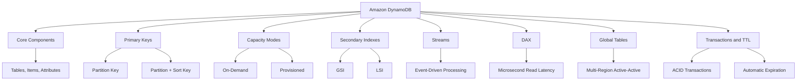
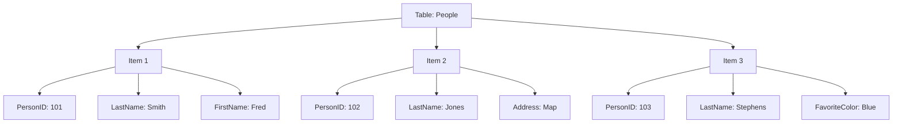
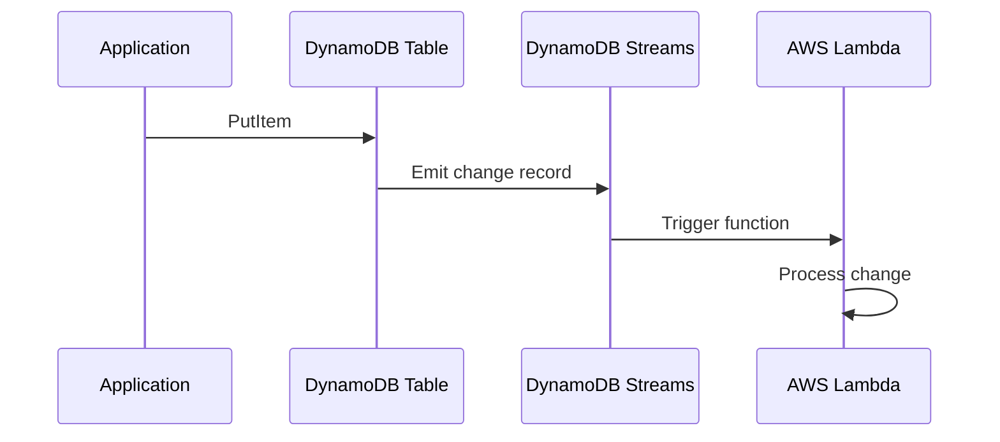
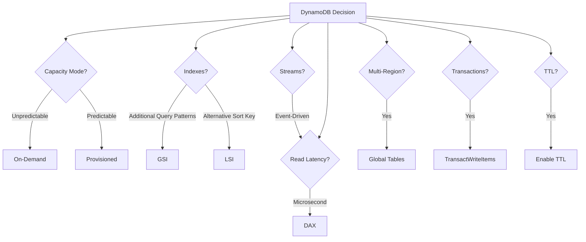

# Lesson 3: DynamoDB Basics

Amazon DynamoDB is a fully managed, serverless, NoSQL key-value and document database that delivers single-digit millisecond performance at any scale. It is designed for applications that need high throughput and low latency, with no servers to manage and no capacity planning required in on-demand mode. DynamoDB stores data in tables, uses primary keys to uniquely identify items, and scales horizontally using partitions.

## What Is DynamoDB

*Definition*: Amazon DynamoDB is a fully managed, serverless, NoSQL key-value and document database that delivers single-digit millisecond performance at any scale. It stores structured data in tables, indexed by primary key, and allows low-latency read and write access to items ranging from 1 byte up to 400 KB.

- DynamoDB is serverless. There are no instances to manage and no servers to provision.
- DynamoDB scales automatically to handle millions of requests per second.
- Data is replicated across three Availability Zones by default.
- DynamoDB supports ACID transactions, encryption at rest, continuous backups, and point-in-time recovery.
- DynamoDB is a schema-less database that only requires a table name and primary key.

> [!Important]
> **DynamoDB is not a replacement for relational databases**: DynamoDB is optimised for key-based access patterns. It does not support joins, complex queries, or ad-hoc analytics. If you need relational queries, use RDS or Aurora. If you need flexible schema and single-digit millisecond performance at scale, use DynamoDB.

## Core Components

In DynamoDB, tables, items, and attributes are the core components.

### Tables

*Definition*: A table is a collection of items. There is no limit to the number of items you can store in a table.

- Tables are the top-level containers for data.
- Each table has a primary key that uniquely identifies each item.
- Tables are schemaless except for the primary key.
- Data in a table is automatically replicated across three Availability Zones.

### Items

*Definition*: An item is a group of attributes that is uniquely identifiable among all other items. Items are similar to rows, records, or tuples in relational databases.

- Each table contains zero or more items.
- Items can have different attributes and data types.
- There is no limit to the number of items in a table.

### Attributes

*Definition*: An attribute is a fundamental data element, something that does not need to be broken down any further. Attributes are similar to fields or columns in relational databases.

- Each item is composed of one or more attributes.
- Attributes can be scalar (string, number, binary), document (list, map), or set types.
- Attributes do not need to be defined beforehand.

> [!Tip]
> **DynamoDB tables are schemaless**: Unlike relational databases, you do not define columns or data types before inserting data. Each item can have different attributes. This flexibility is powerful but requires careful data modelling to avoid inconsistency.

## Primary Keys

*Definition*: A primary key uniquely identifies each item in a table. It can consist of one attribute (partition key) or two attributes (partition key and sort key).

### Simple Primary Key

- A simple primary key uses only a partition key.
- The partition key is also known as the hash key.
- DynamoDB uses the partition key value as input to an internal hash function to determine the partition where the item is stored.
- No two items in a table can have the same partition key value.

### Composite Primary Key

- A composite primary key uses a partition key and a sort key.
- The partition key is also known as the hash key. The sort key is also known as the range key.
- DynamoDB uses the partition key to determine the partition and the sort key to sort items within that partition.
- Two items can have the same partition key value if they have different sort key values.
- The combination of partition key and sort key must be unique.

| Key Type | Components | Uniqueness Rule |
|---|---|---|
| Simple | Partition key only | Partition key must be unique |
| Composite | Partition key + Sort key | Combination must be unique |

### Partition Key Design

- Use a high-cardinality partition key to distribute load evenly across partitions.
- A partition key with few distinct values creates hot partitions and throttling.
- Each partition in a DynamoDB table provides a maximum capacity of 3,000 read units and 1,000 write units per second.
- Avoid using low-cardinality attributes like status or date as partition keys.
- Consider write sharding: add a random suffix to the partition key to distribute writes evenly.

> [!Important]
> **Partition key design determines DynamoDB performance**: A poorly chosen partition key creates hot partitions, which lead to throttling and poor performance. Choose a key with high cardinality that distributes access evenly. Avoid keys with few distinct values or keys that concentrate access on a small number of values.

## Capacity Modes

DynamoDB has two capacity modes: on-demand and provisioned.

### On-Demand Capacity Mode

- Pay per request for the reads and writes you perform.
- No capacity planning required.
- Automatically scales to handle workload.
- Recommended for unpredictable traffic, new applications, and spiky workloads.
- Can be changed to provisioned mode later.

### Provisioned Capacity Mode

- Specify read and write capacity units (RCUs and WCUs).
- Auto scaling is available to adjust capacity based on demand.
- Cheaper than on-demand for steady-state workloads where throughput requirements can be reliably forecasted.
- Recommended for predictable traffic, gradual ramps, and events with known traffic.

### Capacity Unit Calculations

| Operation | Capacity Unit | Calculation |
|---|---|---|
| Strongly consistent read | 1 RCU per 4 KB | Item size ÷ 4 KB, rounded up |
| Eventually consistent read | 0.5 RCU per 4 KB | Item size ÷ 4 KB ÷ 2, rounded up |
| Transactional read | 2 RCU per 4 KB | Item size ÷ 4 KB × 2, rounded up |
| Standard write | 1 WCU per 1 KB | Item size ÷ 1 KB, rounded up |
| Transactional write | 2 WCU per 1 KB | Item size ÷ 1 KB × 2, rounded up |

> [!Tip]
> **Start with on-demand mode**: On-demand is recommended for most DynamoDB workloads. It eliminates capacity planning and automatically scales to your workload. Switch to provisioned mode when you can reliably forecast throughput and want to save on costs.

## Secondary Indexes

DynamoDB supports two types of secondary indexes: Global Secondary Indexes (GSIs) and Local Secondary Indexes (LSIs).

### Global Secondary Index (GSI)

*Definition*: A GSI is an index with a partition key and a sort key that can be different from those on the base table.

- GSIs can be created at any time after table creation.
- A GSI has its own provisioned throughput settings, separate from the base table.
- You can create up to 20 GSIs per table.
- Item keys are copied automatically for uniqueness.
- GSIs are considered "global" because queries on the index can span all partitions.

### Local Secondary Index (LSI)

*Definition*: An LSI is an index that has the same partition key as the base table, but a different sort key.

- LSIs must be created at table creation time.
- LSIs share the provisioned throughput settings of the base table.
- You can create up to 5 LSIs per table.
- The total size of indexed items for any one partition key value cannot exceed 10 GB.
- LSIs are considered "local" because every partition of an LSI is scoped to a base table partition that has the same partition key value.

| Dimension | GSI | LSI |
|---|---|---|
| Partition Key | Can differ from base table | Same as base table |
| Sort Key | Can differ from base table | Different from base table |
| Creation Time | Any time | Table creation only |
| Throughput | Separate from base table | Shared with base table |
| Max per Table | 20 | 5 |
| Size Limit | None | 10 GB per partition key value |

> [!Important]
> **GSIs are more flexible than LSIs**: GSIs can be created at any time and have independent throughput. LSIs must be created at table creation and share the base table's throughput. GSIs are the preferred choice for most use cases.

## DynamoDB Streams

*Definition*: DynamoDB Streams captures a time-ordered sequence of item-level modifications in a DynamoDB table and stores this information in a log for up to 24 hours.

- Streams capture insert, update, and delete events.
- Streams can trigger AWS Lambda functions for event-driven processing.
- Each stream record appears exactly once in the stream.
- Stream records are organised into groups by partition key.
- Use cases include event-driven architectures, cross-Region replication, and materialised views.

> [!Tip]
> **Use DynamoDB Streams for event-driven architectures**: Streams turn table changes into real-time workflows. Combine with Lambda for automatic processing, notifications, and cross-service integration.

## DynamoDB Accelerator (DAX)

*Definition*: DynamoDB Accelerator (DAX) is a fully managed, highly available, in-memory cache for DynamoDB that delivers up to a 10x performance improvement, from milliseconds to microseconds, even at millions of requests per second.

- DAX is a DynamoDB-compatible caching service. It requires no application changes.
- DAX is designed to run within an Amazon VPC.
- DAX caches the results of GetItem and BatchGetItem operations (item cache) and Query and Scan operations (query cache).
- On a cache hit, DAX returns the result without accessing DynamoDB.
- On a cache miss, DAX forwards the request to DynamoDB and caches the result.
- DAX is ideal for read-heavy workloads with eventual consistency requirements.

> [!Important]
> **DAX is for read-heavy workloads**: DAX provides microsecond read latency for frequently accessed data. It is not a replacement for DynamoDB's durability. Use DAX to accelerate reads, not to replace the database.

## Global Tables

*Definition*: DynamoDB global tables replicate your DynamoDB tables automatically across your choice of AWS Regions. Global tables use an active-active replication model, meaning the table in each Region can accept read and write requests.

- Global tables provide a fully managed, multi-Region, multi-active database.
- No application changes are required because global tables use existing DynamoDB APIs.
- Replication is automatic and conflict-free.
- Global tables support multi-Region eventual consistency (MREC) and multi-Region strong consistency (MRSC).
- MRSC global tables must be deployed across exactly three Regions.
- Global tables are ideal for globally distributed applications, disaster recovery, and low-latency reads and writes.

> [!Tip]
> **Use global tables for multi-Region active-active workloads**: Global tables eliminate the need for custom replication logic. Writes in any Region are replicated to all other Regions automatically. This provides low-latency local reads and writes for global users.

## Transactions and TTL

### DynamoDB Transactions

*Definition*: DynamoDB transactions provide atomicity, consistency, isolation, and durability (ACID) across multiple items both within and across tables.

- Transactions simplify the developer experience of making coordinated, all-or-nothing changes.
- You can include up to 10 unique items per transaction.
- Transactional reads consume 2 RCUs per 4 KB. Transactional writes consume 2 WCUs per 1 KB.
- Transactions provide ACID guarantees only within the Region where the API call was invoked.

### Time to Live (TTL)

*Definition*: DynamoDB Time to Live (TTL) is a cost-effective method for deleting items that are no longer relevant. You define a timestamp attribute, and DynamoDB automatically deletes expired items.

- TTL is enabled at the table level.
- You specify an attribute name that contains the expiration timestamp.
- Expired items are typically deleted within 48 hours.
- TTL deletions are replicated to global tables.
- Use TTL for session data, event logs, and temporary records.

> [!Important]
> **TTL is not instantaneous**: Expired items may remain in the table for up to 48 hours after expiration. Do not rely on TTL for strict time-sensitive deletion. Use TTL for cost optimisation and automatic cleanup, not for compliance or regulatory deletion.

## DynamoDB Best Practices

### Partition Key Design

- Use a high-cardinality partition key to distribute load evenly.
- Avoid low-cardinality attributes like status or date.
- Consider write sharding for high-throughput writes.
- Use composite keys for hierarchical data.

### Data Modelling

- Model for access patterns, not for relationships.
- Use adjacency lists for one-to-many and many-to-many relationships.
- Denormalise data to avoid joins.
- Use GSIs to support additional query patterns.

### Capacity and Cost

- Start with on-demand mode.
- Use auto scaling for provisioned mode.
- Monitor with CloudWatch and Contributor Insights.
- Use TTL to automatically delete expired items.

### Security

- Enable encryption at rest with KMS.
- Use IAM policies for least-privilege access.
- Enable point-in-time recovery for backup.
- Use VPC endpoints for private access.

> [!Tip]
> **Model for access patterns, not for relationships**: DynamoDB is not a relational database. Design your tables around how you will query the data, not around how the data is related. Use GSIs to support additional access patterns. Denormalise where necessary.

## Assessment Preparation

### Practice Questions

1. Define Amazon DynamoDB and explain its role in AWS.
2. Describe the core components of DynamoDB: tables, items, and attributes.
3. Explain the difference between a simple primary key and a composite primary key.
4. Describe best practices for partition key design.
5. Compare on-demand and provisioned capacity modes.
6. Explain how RCUs and WCUs are calculated.
7. Compare Global Secondary Indexes and Local Secondary Indexes.
8. Describe the purpose of DynamoDB Streams.
9. Explain the purpose of DynamoDB Accelerator (DAX).
10. Describe how global tables work and when to use them.
11. Explain how DynamoDB transactions provide ACID guarantees.
12. Describe how Time to Live (TTL) works and when to use it.
13. List five DynamoDB best practices.

### Scenario Questions

**Scenario 1: Gaming Leaderboard**
A gaming company needs a database that can handle millions of reads and writes per second with single-digit millisecond latency. What should they use?

- Use Amazon DynamoDB.
- Use on-demand capacity mode for unpredictable traffic.
- Use DAX for microsecond read latency.
- Use Global Tables for multi-Region active-active replication.
- Design the partition key to distribute load evenly across partitions.

**Scenario 2: Session State Store**
A web application needs to store user session state with automatic expiration. What should they use?

- Use Amazon DynamoDB.
- Enable TTL on a timestamp attribute.
- DynamoDB automatically deletes expired items.
- Use on-demand capacity mode for unpredictable traffic.
- Use DAX for microsecond read latency if session reads are frequent.

**Scenario 3: Event-Driven Processing**
A company needs to trigger a Lambda function whenever an item is added or updated in a DynamoDB table. What should they use?

- Enable DynamoDB Streams on the table.
- Create an event source mapping between the stream and a Lambda function.
- Lambda processes the change records.
- Use Streams for real-time data processing and change data capture.

**Scenario 4: Multi-Region Application**
A global SaaS platform needs to serve users in North America, Europe, and Asia with low-latency reads and writes. What should they use?

- Use DynamoDB Global Tables.
- Deploy the table in multiple Regions.
- Writes in any Region are replicated to all other Regions automatically.
- Use MREC or MRSC depending on consistency requirements.
- Use DAX in each Region for microsecond read latency.

**Scenario 5: Financial Transaction Processing**
A financial services firm needs a database that supports ACID transactions across multiple items and tables. What should they use?

- Use Amazon DynamoDB.
- Use TransactWriteItems and TransactGetItems APIs.
- Each transaction can include up to 10 unique items.
- Transactional writes consume 2 WCUs per 1 KB.
- Use DynamoDB transactions for all-or-nothing changes.

## Key Takeaways

- Amazon DynamoDB is a fully managed, serverless, NoSQL key-value and document database with single-digit millisecond performance at any scale.
- DynamoDB stores data in tables, items, and attributes. Tables are schemaless except for the primary key.
- A primary key can be a simple partition key or a composite partition key and sort key.
- Use a high-cardinality partition key to distribute load evenly. Each partition provides 3,000 RCUs and 1,000 WCUs per second.
- DynamoDB offers two capacity modes: on-demand (pay per request) and provisioned (specify RCUs and WCUs).
- On-demand is recommended for most workloads. Provisioned is cheaper for steady-state workloads.
- Global Secondary Indexes (GSIs) can have a different partition key and sort key from the base table. Up to 20 per table.
- Local Secondary Indexes (LSIs) have the same partition key but a different sort key. Up to 5 per table.
- DynamoDB Streams captures item-level changes for event-driven processing with Lambda.
- DynamoDB Accelerator (DAX) provides microsecond read latency for read-heavy workloads.
- Global Tables provide multi-Region active-active replication with automatic conflict resolution.
- DynamoDB transactions provide ACID guarantees across up to 10 items within and across tables.
- Time to Live (TTL) automatically deletes expired items. Deletions may take up to 48 hours.
- Model for access patterns, not for relationships. Denormalise where necessary. Use GSIs to support additional query patterns.
- Enable encryption at rest, IAM policies, point-in-time recovery, and VPC endpoints for security.
- Start with on-demand mode. Monitor with CloudWatch. Use TTL for cost optimisation.

> [!Important]
> **Design for access patterns, not for relational modelling**: DynamoDB is not a relational database. It does not support joins, complex queries, or ad-hoc analytics. Design your tables around how you will query the data. Choose a high-cardinality partition key to distribute load evenly. Use composite keys for hierarchical data. Use GSIs to support additional access patterns. Denormalise where necessary. Model for access patterns, not for relationships. Start with on-demand mode. Use DAX for read-heavy workloads. Use Streams for event-driven architectures. Use Global Tables for multi-Region active-active. Use transactions for ACID guarantees. Use TTL for automatic cleanup. The most common DynamoDB mistake is treating it like a relational database. Design for DynamoDB, and it will scale to millions of requests per second with single-digit millisecond latency.
