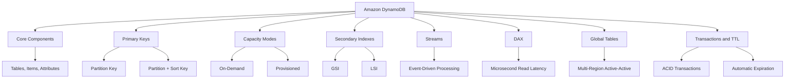
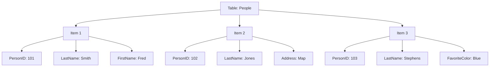
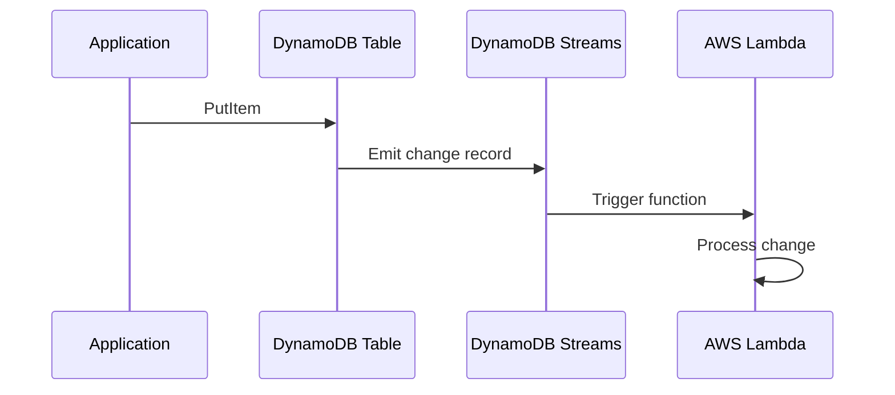

# Migration in progress
# Lesson 3: DynamoDB Basics

Amazon DynamoDB is a fully managed, serverless, NoSQL key-value and document database that delivers single-digit millisecond performance at any scale. It is designed for applications that need high throughput and low latency, with no servers to manage and no capacity planning required in on-demand mode. DynamoDB stores data in tables, uses primary keys to uniquely identify items, and scales horizontally using partitions.

## What Is DynamoDB

*Definition*: Amazon DynamoDB is a fully managed, serverless, NoSQL key-value and document database that delivers single-digit millisecond performance at any scale. It stores structured data in tables, indexed by primary key, and allows low-latency read and write access to items ranging from 1 byte up to 400 KB.

- DynamoDB is serverless. There are no instances to manage and no servers to provision.
- DynamoDB scales automatically to handle millions of requests per second.
- Data is replicated across three Availability Zones by default.
- DynamoDB supports ACID transactions, encryption at rest, continuous backups, and point-in-time recovery.
- DynamoDB is a schema-less database that only requires a table name and primary key.

> [!Important]
> **DynamoDB is not a replacement for relational databases**: DynamoDB is optimised for key-based access patterns. It does not support joins, complex queries, or ad-hoc analytics. If you need relational queries, use RDS or Aurora. If you need flexible schema and single-digit millisecond performance at scale, use DynamoDB.

## Core Components

In DynamoDB, tables, items, and attributes are the core components.

### Tables

*Definition*: A table is a collection of items. There is no limit to the number of items you can store in a table.

- Tables are the top-level containers for data.
- Each table has a primary key that uniquely identifies each item.
- Tables are schemaless except for the primary key.
- Data in a table is automatically replicated across three Availability Zones.

### Items

*Definition*: An item is a group of attributes that is uniquely identifiable among all other items. Items are similar to rows, records, or tuples in relational databases.

- Each table contains zero or more items.
- Items can have different attributes and data types.
- There is no limit to the number of items in a table.

### Attributes

*Definition*: An attribute is a fundamental data element, something that does not need to be broken down any further. Attributes are similar to fields or columns in relational databases.

- Each item is composed of one or more attributes.
- Attributes can be scalar (string, number, binary), document (list, map), or set types.
- Attributes do not need to be defined beforehand.

> [!Tip]
> **DynamoDB tables are schemaless**: Unlike relational databases, you do not define columns or data types before inserting data. Each item can have different attributes. This flexibility is powerful but requires careful data modelling to avoid inconsistency.

## Primary Keys

*Definition*: A primary key uniquely identifies each item in a table. It can consist of one attribute (partition key) or two attributes (partition key and sort key).

### Simple Primary Key

- A simple primary key uses only a partition key.
- The partition key is also known as the hash key.
- DynamoDB uses the partition key value as input to an internal hash function to determine the partition where the item is stored.
- No two items in a table can have the same partition key value.

### Composite Primary Key

- A composite primary key uses a partition key and a sort key.
- The partition key is also known as the hash key. The sort key is also known as the range key.
- DynamoDB uses the partition key to determine the partition and the sort key to sort items within that partition.
- Two items can have the same partition key value if they have different sort key values.
- The combination of partition key and sort key must be unique.

| Key Type | Components | Uniqueness Rule |
|---|---|---|
| Simple | Partition key only | Partition key must be unique |
| Composite | Partition key + Sort key | Combination must be unique |

### Partition Key Design

- Use a high-cardinality partition key to distribute load evenly across partitions.
- A partition key with few distinct values creates hot partitions and throttling.
- Each partition in a DynamoDB table provides a maximum capacity of 3,000 read units and 1,000 write units per second.
- Avoid using low-cardinality attributes like status or date as partition keys.
- Consider write sharding: add a random suffix to the partition key to distribute writes evenly.

> [!Important]
> **Partition key design determines DynamoDB performance**: A poorly chosen partition key creates hot partitions, which lead to throttling and poor performance. Choose a key with high cardinality that distributes access evenly. Avoid keys with few distinct values or keys that concentrate access on a small number of values.

## Capacity Modes

DynamoDB has two capacity modes: on-demand and provisioned.

### On-Demand Capacity Mode

- Pay per request for the reads and writes you perform.
- No capacity planning required.
- Automatically scales to handle workload.
- Recommended for unpredictable traffic, new applications, and spiky workloads.
- Can be changed to provisioned mode later.

### Provisioned Capacity Mode

- Specify read and write capacity units (RCUs and WCUs).
- Auto scaling is available to adjust capacity based on demand.
- Cheaper than on-demand for steady-state workloads where throughput requirements can be reliably forecasted.
- Recommended for predictable traffic, gradual ramps, and events with known traffic.

### Capacity Unit Calculations

| Operation | Capacity Unit | Calculation |
|---|---|---|
| Strongly consistent read | 1 RCU per 4 KB | Item size ÷ 4 KB, rounded up |
| Eventually consistent read | 0.5 RCU per 4 KB | Item size ÷ 4 KB ÷ 2, rounded up |
| Transactional read | 2 RCU per 4 KB | Item size ÷ 4 KB × 2, rounded up |
| Standard write | 1 WCU per 1 KB | Item size ÷ 1 KB, rounded up |
| Transactional write | 2 WCU per 1 KB | Item size ÷ 1 KB × 2, rounded up |

> [!Tip]
> **Start with on-demand mode**: On-demand is recommended for most DynamoDB workloads. It eliminates capacity planning and automatically scales to your workload. Switch to provisioned mode when you can reliably forecast throughput and want to save on costs.

## Secondary Indexes

DynamoDB supports two types of secondary indexes: Global Secondary Indexes (GSIs) and Local Secondary Indexes (LSIs).

### Global Secondary Index (GSI)

*Definition*: A GSI is an index with a partition key and a sort key that can be different from those on the base table.

- GSIs can be created at any time after table creation.
- A GSI has its own provisioned throughput settings, separate from the base table.
- You can create up to 20 GSIs per table.
- Item keys are copied automatically for uniqueness.
- GSIs are considered "global" because queries on the index can span all partitions.

### Local Secondary Index (LSI)

*Definition*: An LSI is an index that has the same partition key as the base table, but a different sort key.

- LSIs must be created at table creation time.
- LSIs share the provisioned throughput settings of the base table.
- You can create up to 5 LSIs per table.
- The total size of indexed items for any one partition key value cannot exceed 10 GB.
- LSIs are considered "local" because every partition of an LSI is scoped to a base table partition that has the same partition key value.

| Dimension | GSI | LSI |
|---|---|---|
| Partition Key | Can differ from base table | Same as base table |
| Sort Key | Can differ from base table | Different from base table |
| Creation Time | Any time | Table creation only |
| Throughput | Separate from base table | Shared with base table |
| Max per Table | 20 | 5 |
| Size Limit | None | 10 GB per partition key value |

> [!Important]
> **GSIs are more flexible than LSIs**: GSIs can be created at any time and have independent throughput. LSIs must be created at table creation and share the base table's throughput. GSIs are the preferred choice for most use cases.

## DynamoDB Streams

*Definition*: DynamoDB Streams captures a time-ordered sequence of item-level modifications in a DynamoDB table and stores this information in a log for up to 24 hours.

- Streams capture insert, update, and delete events.
- Streams can trigger AWS Lambda functions for event-driven processing.
- Each stream record appears exactly once in the stream.
- Stream records are organised into groups by partition key.
- Use cases include event-driven architectures, cross-Region replication, and materialised views.

> [!Tip]
> **Use DynamoDB Streams for event-driven architectures**: Streams turn table changes into real-time workflows. Combine with Lambda for automatic processing, notifications, and cross-service integration.

## DynamoDB Accelerator (DAX)

*Definition*: DynamoDB Accelerator (DAX) is a fully managed, highly available, in-mem