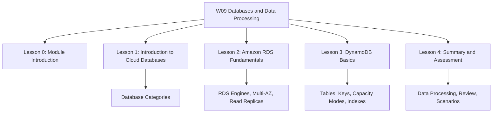
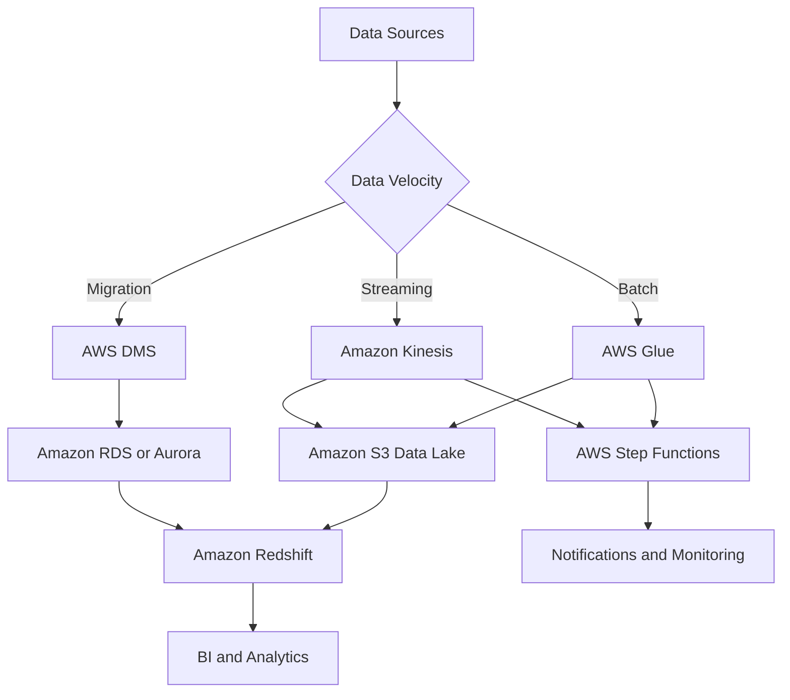
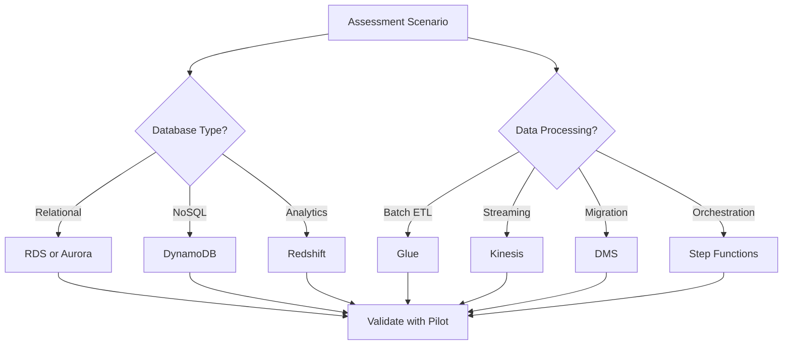

# W09: Databases & Data Processing - Lesson 4: Summary and Assessment

This lesson summarizes the AWS database portfolio and data processing services. It covers relational databases with Amazon RDS and Aurora, NoSQL with Amazon DynamoDB, data warehousing with Amazon Redshift, data integration with AWS Glue, streaming with Amazon Kinesis, migration with AWS DMS, and orchestration with AWS Step Functions. The goal is to select the right database for a workload and build pipelines that move, transform, and analyse data at scale.

## Database Portfolio Summary

AWS offers purpose-built databases for different data models and access patterns. The right choice depends on how the application reads and writes data, not on familiarity with a single engine.

| Category | AWS Service | Data Model | Use Case |
|---|---|---|---|
| Relational | Amazon RDS | Tables with rows and columns, ACID transactions | ERP, CRM, e-commerce, traditional applications |
| Relational cloud-native | Amazon Aurora | MySQL and PostgreSQL compatible, distributed storage | High-traffic web apps, SaaS, gaming |
| Key-value and document | Amazon DynamoDB | Key-value and document, single-digit millisecond latency | Session state, shopping carts, gaming leaderboards |
| Document | Amazon DocumentDB | MongoDB-compatible document store | Content management, catalogues, user profiles |
| In-memory | Amazon ElastiCache | Key-value with microsecond latency | Caching, session management, leaderboards |
| Graph | Amazon Neptune | Nodes and edges | Fraud detection, social networks, recommendations |
| Time-series | Amazon Timestream | Time-stamped data | IoT, DevOps, industrial telemetry |
| Wide column | Amazon Keyspaces | Apache Cassandra compatible | Low-latency applications, Cassandra migration |
| Ledger | Amazon QLDB | Immutable, verifiable transaction log | Systems of record, supply chain, healthcare |
| Data warehouse | Amazon Redshift | Columnar, MPP | BI reporting, analytics, data warehousing |

> [!Important]
> **Choose the database by access pattern, not by familiarity**: Relational for ACID transactions. Key-value for high-throughput lookups. Document for flexible schemas. Graph for relationships. Time-series for timestamped data. The most common architectural mistake is forcing data into the wrong database.

## Amazon RDS Summary

*Definition*: Amazon RDS is a managed relational database service that automates provisioning, patching, backup, recovery, failure detection, and repair.

- RDS supports six engines: PostgreSQL, MySQL, MariaDB, Oracle, SQL Server, and Db2.
- RDS offers three deployment modes: Single-AZ, Multi-AZ DB instance, and Multi-AZ DB cluster.
- Multi-AZ DB instance deployments have one standby for failover. The standby does not serve read traffic.
- Multi-AZ DB cluster deployments have one writer and two readers across three Availability Zones. They provide high availability, increased read capacity, and lower write latency.
- Read replicas use asynchronous replication for read scaling, analytics, and disaster recovery. Each DB instance can have up to 15 read replicas.
- Automated backups include daily snapshots and transaction logs. Point-in-time recovery restores to any second within the retention period, up to 35 days.
- RDS Proxy pools and reuses database connections for serverless and connection-heavy applications.
- Encryption at rest uses AWS KMS with AES-256. Encryption in transit enforces TLS 1.2, with TLS 1.3 recommended.
- RDS supports IAM database authentication, Secrets Manager integration, and Kerberos authentication.
- RDS pricing includes instance hours, storage, I/O, and backup storage. Reserved Instances offer up to 69% savings compared to On-Demand.

> [!Important]
> **RDS Multi-AZ is for high availability, not read scaling**: The standby instance in a Multi-AZ DB instance deployment does not serve read traffic. Use read replicas for read scaling. Use Multi-AZ for automatic failover and disaster recovery.

## Amazon Aurora Summary

*Definition*: Amazon Aurora is a MySQL and PostgreSQL-compatible relational database built for the cloud. It features a distributed, fault-tolerant, self-healing storage system that auto-scales up to 128 TB.

- Aurora decouples compute from storage. Data is stored in a cluster volume that spans three Availability Zones.
- Aurora supports up to 15 low-latency read replicas.
- Failover is typically under 30 seconds.
- Aurora Serverless v2 automatically scales capacity in fine-grained increments based on demand.
- Aurora Global Database spans multiple Regions with sub-second replication and promotion under 1 minute.
- Aurora offers better price-performance than RDS for most production workloads.

> [!Tip]
> **Start with Aurora for new PostgreSQL and MySQL workloads**: Aurora offers auto-scaling storage, faster failover, and more read replicas than RDS. Choose RDS when you need Oracle, SQL Server, or Db2, or when minimising cost for small workloads.

## Amazon DynamoDB Summary

*Definition*: Amazon DynamoDB is a fully managed, serverless, NoSQL key-value and document database that delivers single-digit millisecond performance at any scale.

- DynamoDB stores data in tables, items, and attributes. Tables are schemaless except for the primary key.
- A primary key can be a simple partition key or a composite partition key and sort key.
- Use a high-cardinality partition key to distribute load evenly. Each partition provides 3,000 read units and 1,000 write units per second.
- DynamoDB offers two capacity modes: on-demand and provisioned. On-demand is recommended for most workloads.
- Global Secondary Indexes can have a different partition key and sort key. Up to 20 per table.
- Local Secondary Indexes have the same partition key but a different sort key. Up to 5 per table.
- DynamoDB Streams captures item-level changes for event-driven processing with Lambda.
- DynamoDB Accelerator provides microsecond read latency for read-heavy workloads.
- Global Tables provide multi-Region active-active replication with automatic conflict resolution.
- DynamoDB transactions provide ACID guarantees across up to 10 items within and across tables.
- Time to Live automatically deletes expired items. Deletions may take up to 48 hours.

> [!Tip]
> **Model DynamoDB for access patterns, not relationships**: Design tables around how you will query the data. Choose a high-cardinality partition key. Use composite keys for hierarchical data. Use GSIs to support additional access patterns. Denormalise where necessary.

## Data Processing and Integration Summary

Data processing services match the velocity and shape of the data. Batch ETL, real-time streaming, migration, and orchestration each use different services.

| Service | Purpose | Data Velocity | Use Case |
|---|---|---|---|
| Amazon Redshift | Data warehousing and analytics | Batch | BI reporting, analytics, petabyte-scale queries |
| AWS Glue | Serverless ETL and data cataloguing | Batch and micro-batch | Schema discovery, transformation, Parquet conversion |
| Amazon Kinesis | Real-time streaming | Streaming | Clickstream, IoT telemetry, log processing |
| AWS DMS | Database migration | Batch and continuous | Homogeneous and heterogeneous migrations |
| AWS Step Functions | Workflow orchestration | Event-driven | Serverless ETL pipelines, error handling, retries |

### Amazon Redshift

- Redshift is a petabyte-scale data warehouse with massively parallel processing and columnar storage.
- Redshift Spectrum queries S3 data directly without loading it into Redshift.
- Federated queries access RDS and Aurora data without ETL.
- Concurrency Scaling automatically adds clusters for concurrent queries.
- RA3 instances separate compute and storage for independent scaling.

### AWS Glue

- Glue is a serverless data integration service for ETL, schema discovery, and data cataloguing.
- Glue crawlers discover schemas and populate the Data Catalog.
- Glue ETL jobs transform, compress, and partition data.
- Job bookmarks track processed data to avoid reprocessing.
- Glue supports Apache Spark, Python Shell, Ray, and streaming ETL jobs.

### Amazon Kinesis

- Kinesis Data Streams captures gigabytes per second with configurable retention from 24 hours to 365 days.
- Kinesis Data Firehose loads streaming data into S3, Redshift, OpenSearch, and other destinations.
- Kinesis Data Analytics processes streaming data with SQL or Apache Flink.
- Kinesis Video Streams handles video for analytics and machine learning.

### AWS DMS and Step Functions

- AWS DMS migrates databases to AWS with minimal downtime. The source remains operational during migration.
- AWS Schema Conversion Tool converts schema and code for heterogeneous migrations.
- AWS Step Functions orchestrates serverless ETL pipelines with error handling, retry logic, and notifications.
- A common pattern uses S3 event notifications, Lambda validation, Step Functions orchestration, Glue transformation, and SNS error notifications.

> [!Important]
> **Match the processing service to the data velocity**: Use Glue for batch ETL. Use Kinesis for real-time streaming. Use DMS for migration. Use Step Functions for orchestration. Redshift is for analytics, not transactions. Glue is serverless but not free. Kinesis Firehose is the easiest way to load streaming data into AWS data stores.

## Integrated Data Architecture

- Data sources feed into batch, streaming, or migration paths.
- Glue transforms batch data into Parquet in S3.
- Kinesis streams real-time data into S3 or Redshift.
- DMS migrates databases to RDS or Aurora.
- Redshift queries the data lake and databases for analytics.
- Step Functions orchestrates the workflow and handles errors.

## Assessment Preparation

### Practice Questions

1. Compare the AWS database categories and give a service for each.
2. Explain the difference between Amazon RDS and Amazon Aurora.
3. Describe the two RDS Multi-AZ deployment modes and their failover characteristics.
4. Explain how RDS read replicas work and what they are used for.
5. Describe Aurora's distributed storage architecture.
6. Explain how Aurora Serverless v2 and Aurora Global Database work.
7. Compare DynamoDB on-demand and provisioned capacity modes.
8. Explain the difference between Global Secondary Indexes and Local Secondary Indexes.
9. Describe the core components of DynamoDB: tables, items, and attributes.
10. Explain why DynamoDB is not a replacement for relational databases.
11. Describe the Redshift architecture and its MPP design.
12. Explain the purpose of Redshift Spectrum and federated queries.
13. Describe the components of AWS Glue.
14. Compare Kinesis Data Streams, Firehose, and Analytics.
15. Explain the purpose of AWS DMS and its migration types.
16. Describe how Step Functions orchestrates ETL pipelines.

### Scenario Questions

**Scenario 1: High-Traffic Web Application**
A SaaS platform needs a relational database that can handle high traffic with auto-scaling storage and fast failover. What should they use?

- Use Amazon Aurora MySQL or PostgreSQL.
- Aurora provides auto-scaling storage, up to 15 read replicas, and failover under 30 seconds.
- Use Aurora Global Database for multi-Region disaster recovery.
- Use Aurora Serverless v2 for variable workloads.

**Scenario 2: Gaming Leaderboard**
A gaming company needs a database that can handle millions of reads and writes per second with single-digit millisecond latency. What should they use?

- Use Amazon DynamoDB.
- Use on-demand capacity mode for unpredictable traffic.
- Use DAX for microsecond read latency.
- Use Global Tables for multi-Region active-active replication.

**Scenario 3: Business Intelligence Reporting**
A company needs to analyse petabytes of data from multiple sources for BI reporting. What should they use?

- Use Amazon Redshift.
- Use Redshift Spectrum to query S3 data directly.
- Use federated queries to access RDS and Aurora data.
- Use concurrency scaling for high-concurrency workloads.
- Use RA3 instances to separate compute and storage.

**Scenario 4: Real-Time Clickstream Analytics**
A company needs to process website clickstream data in real time and load it into S3 for analysis. What should they use?

- Use Kinesis Data Streams to capture the stream.
- Use Kinesis Data Firehose to load data into S3.
- Use Kinesis Data Analytics for real-time SQL processing.
- Use Glue to transform the data into Parquet format.
- Use Redshift or Athena to query the data.

**Scenario 5: Database Migration**
A company wants to migrate an on-premises Oracle database to Aurora PostgreSQL with minimal downtime. What should they use?

- Use AWS Schema Conversion Tool to convert schema and code.
- Use AWS DMS for continuous replication.
- Keep the source database operational during migration.
- Cut over during a maintenance window.

**Scenario 6: Serverless ETL Pipeline**
A company needs to build an ETL pipeline that validates, transforms, and partitions CSV files uploaded to S3. What should they use?

- Use S3 event notifications to trigger Lambda.
- Use Step Functions to orchestrate the workflow.
- Use Lambda to validate schema and data type.
- Use Glue crawlers to discover schema.
- Use Glue jobs to transform CSV to Parquet.
- Use SNS for error notifications.

## Key Takeaways

- AWS offers purpose-built databases for different data models and access patterns.
- Relational databases such as RDS and Aurora are for ACID transactions and complex queries.
- NoSQL databases such as DynamoDB are for high-throughput, low-latency, flexible-schema workloads.
- Amazon RDS supports six engines and three deployment modes: Single-AZ, Multi-AZ DB instance, and Multi-AZ DB cluster.
- Multi-AZ is for high availability. Read replicas are for read scaling. RDS Proxy is for connection pooling.
- Amazon Aurora is the default choice for new PostgreSQL and MySQL workloads at scale.
- Amazon DynamoDB is for key-based access patterns, not relational queries.
- DynamoDB capacity modes are on-demand and provisioned. On-demand is recommended for most workloads.
- DynamoDB Streams, DAX, Global Tables, transactions, and TTL provide event-driven processing, caching, multi-Region replication, ACID guarantees, and automatic cleanup.
- Amazon Redshift is a petabyte-scale data warehouse for analytics and BI reporting.
- AWS Glue is a serverless data integration service for ETL and data cataloguing.
- Amazon Kinesis provides real-time streaming with Data Streams, Firehose, and Analytics.
- AWS DMS migrates databases to AWS with minimal downtime.
- AWS Step Functions orchestrates serverless ETL pipelines.
- Choose the database by access pattern, not by familiarity.
- Match the processing service to the data velocity: Glue for batch, Kinesis for streaming, DMS for migration, Step Functions for orchestration.
- A modern application typically uses several database types together.
- Design for the access pattern, not for a single database to do everything.

> [!Important]
> **Match the database to the access pattern, and the processing service to the data velocity**: The most common architectural mistake is forcing data into the wrong database or using the wrong processing service. Use relational for ACID transactions. Use key-value for high-throughput lookups. Use document for flexible schemas. Use graph for relationships. Use time-series for timestamped data. For data processing, use Glue for batch ETL, Kinesis for real-time streaming, DMS for migration, and Step Functions for orchestration. Design for the access pattern, secure by default, and optimise continuously.
