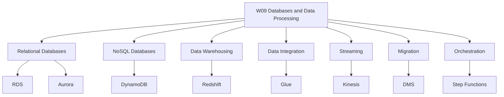
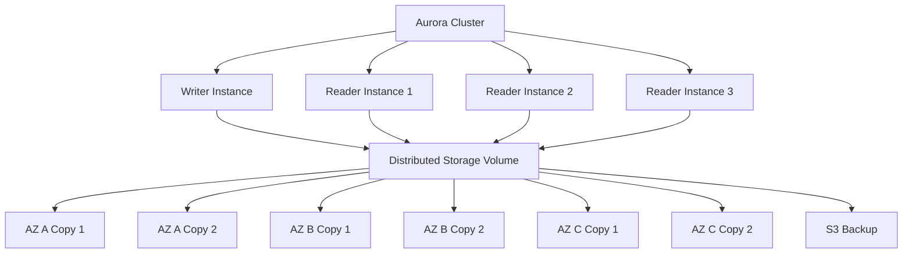
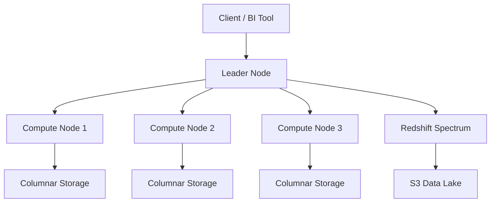

# Migration in progress
# W09: Databases & Data Processing

This module covers the AWS database portfolio and data processing services. It spans relational databases (RDS and Aurora), NoSQL (DynamoDB), data warehousing (Redshift), ETL and data integration (Glue), real-time streaming (Kinesis), database migration (DMS), and pipeline orchestration (Step Functions). The goal is to select the right database for a workload and build data pipelines that move, transform, and analyse data at scale.

## The AWS Database Portfolio

AWS offers purpose-built databases, each optimised for a specific data model and access pattern. The right tool for the right job is the guiding principle. A single application may use several database types: a relational database for transactions, a key-value store for session state, an in-memory cache for hot paths, and a data warehouse for analytics.

### Database Categories

| Category | AWS Service | Data Model | Use Case |
|---|---|---|---|
| Relational | Amazon RDS | Tables with rows and columns, ACID transactions | ERP, CRM, e-commerce, traditional applications |
| Relational (cloud-native) | Amazon Aurora | MySQL/PostgreSQL compatible, distributed storage | High-traffic web apps, SaaS, gaming |
| Key-Value | Amazon DynamoDB | Key-value and document, single-digit millisecond latency | Session state, shopping carts, gaming leaderboards |
| Document | Amazon DocumentDB | MongoDB-compatible document store | Content management, catalogues, user profiles |
| In-Memory | Amazon ElastiCache | Key-value with microsecond latency | Caching, session management, leaderboards |
| Graph | Amazon Neptune | Nodes and edges | Fraud detection, social networks, recommendation engines |
| Time-Series | Amazon Timestream | Time-stamped data | IoT, DevOps, industrial telemetry |
| Wide Column | Amazon Keyspaces | Apache Cassandra-compatible | Low-latency applications, Cassandra migration |
| Ledger | Amazon QLDB | Immutable, verifiable transaction log | Systems of record, supply chain, healthcare |
| Data Warehouse | Amazon Redshift | Columnar, MPP | BI reporting, analytics, data warehousing |

> [!Important]
> **Choose the database by access pattern, not by familiarity**: The most common architectural mistake is forcing data into a relational database when a purpose-built database would serve it better. Use relational for ACID transactions and complex queries. Use key-value for high-throughput, low-latency lookups. Use document for flexible schemas. Use graph for relationship-heavy data. Use time-series for timestamped data.

## Amazon RDS

*Definition*: Amazon Relational Database Service (RDS) is a managed relational database service that makes it easy to set up, operate, and scale a relational database in the cloud. It provides cost-efficient and resizable capacity while automating time-consuming administration tasks.

### Supported Engines

| Engine | Version Examples | Use Case |
|---|---|---|
| PostgreSQL | 16, 15, 14 | General-purpose relational workloads, PostGIS |
| MySQL | 8.0, 8.4 | Web applications, e-commerce |
| MariaDB | 10.11, 11.4 | MySQL-compatible workloads |
| Oracle | 19c, 21c | Enterprise applications, ERP |
| SQL Server | 2019, 2022 | Windows workloads, .NET applications |
| Db2 | 11.5 | Enterprise workloads, mainframe migration |

### RDS Features

- **Multi-AZ deployments**: Synchronous replication to a standby in another Availability Zone. Automatic failover in 60-120 seconds. Enterprise-grade high availability.
- **Read replicas**: Asynchronous replication to up to 5 read replicas (15 for Aurora). Used for read scaling and disaster recovery.
- **Automated backups**: Daily full snapshots and transaction logs. Point-in-time recovery to any second within the retention period (up to 35 days).
- **Automatic patching**: Minor version upgrades and security patches applied during maintenance windows.
- **Storage autoscaling**: Automatically increases storage when free space runs low.
- **Performance Insights**: Visualises database load and identifies bottlenecks.
- **RDS Proxy**: Connection pooling for serverless and containerised applications.

> [!Important]
> **RDS Multi-AZ is for high availability, not read scaling**: The standby instance in a Multi-AZ deployment does not serve read traffic. It exists solely for failover. Use read replicas for read scaling. Use Multi-AZ for automatic failover and disaster recovery.

### RDS Instance Classes

| Class Family | Optimised For | Use Case |
|---|---|---|
| db.t4g, db.t3 | Burstable, general purpose | Development, small applications |
| db.m7g, db.m6i | Balanced compute and memory | Production web applications |
| db.r7g, db.r6i | Memory optimised | In-memory databases, analytics |
| db.x2g, db.x1 | Extreme memory | Large in-memory databases |

## Amazon Aurora

*Definition*: Amazon Aurora is a MySQL and PostgreSQL-compatible relational database built for the cloud. It combines the performance and availability of commercial databases with the simplicity and cost-effectiveness of open-source databases.

### Aurora Architecture

Aurora uses a distributed, fault-tolerant, self-healing storage system that automatically scales up to 128 TiB per database volume. It replicates data six ways across three Availability Zones and continuously backs up data to Amazon S3.

### Aurora vs RDS

| Dimension | Aurora | RDS |
|---|---|---|
| Storage | Distributed, auto-scaling, 128 TiB | Provisioned EBS, manual resize |
| Read Replicas | Up to 15, sub-10ms lag | Up to 5, lag of minutes |
| Failover | Typically under 30 seconds | 60-120 seconds |
| Durability | 6 copies across 3 AZs | Multi-AZ standby |
| Backups | Continuous to S3 | Daily snapshots + transaction logs |
| Performance | Up to 5x MySQL throughput | Depends on instance and storage |
| Cost | Higher per hour, lower at scale | Lower per hour, higher at scale |

> [!Tip]
> **Aurora is the default choice for new relational workloads on AWS**: Aurora offers better price-performance than RDS for most production workloads, with auto-scaling storage, faster failover, and more read replicas. Choose RDS when you need a specific engine (Oracle, SQL Server, Db2) or want to minimise cost for small workloads.

### Aurora Serverless v2

- Aurora Serverless v2 automatically scales database capacity in fine-grained increments based on demand.
- You define a minimum and maximum ACU (Aurora Capacity Unit) range.
- Scaling happens in milliseconds, with no downtime.
- Ideal for variable or unpredictable workloads, development environments, and multi-tenant SaaS applications.
- You pay only for the capacity you use.

### Aurora Global Database

- Aurora Global Database spans multiple AWS Regions.
- A primary Region serves writes. Secondary Regions serve read-only traffic.
- Replication lag is typically under 1 second.
- Promotes a secondary Region to primary in under 1 minute during a regional failure.
- Used for disaster recovery and low-latency global reads.

## Amazon DynamoDB

*Definition*: Amazon DynamoDB is a fully managed, serverless, NoSQL key-value and document database that delivers single-digit millisecond performance at any scale. It is designed for applications that need high throughput and low latency.

### DynamoDB Fundamentals

- DynamoDB stores data in tables. Each table has a primary key that uniquely identifies each item.
- A primary key can be a partition key (simple) or a partition key and sort key (composite).
- DynamoDB is schemaless. Each item can have different attributes.
- DynamoDB scales horizontally using partitions. Data is distributed across partitions based on the partition key.
- DynamoDB is serverless. There are no instances to manage.

### DynamoDB Capacity Modes

| Mode | Description | Use Case |
|---|---|---|
| On-Demand | Pay per request. Automatically scales to workload. | Unpredictable traffic, new applications |
| Provisioned | Specify read and write capacity units. Auto scaling available. | Predictable traffic, cost optimisation |

- On-demand mode is ideal for spiky or unpredictable workloads. You pay per read and write request.
- Provisioned mode is cheaper for steady-state workloads. You specify RCUs and WCUs and can enable auto scaling.

### DynamoDB Indexes

| Index Type | Description | Use Case |
|---|---|---|
| Local Secondary Index (LSI) | Same partition key, different sort key. Created at table creation. | Alternative sort keys for a partition |
| Global Secondary Index (GSI) | Different partition key and sort key. Can be created anytime. | Query patterns on non-key attributes |

### DynamoDB Features

- **DynamoDB Streams**: Captures item-level changes for event-driven processing.
- **DynamoDB Accelerator (DAX)**: In-memory cache for DynamoDB. Microsecond latency for read-heavy workloads.
- **Global Tables**: Multi-Region, active-active replication. Sub-second replication.
- **Point-in-Time Recovery**: Restore to any point in the last 35 days.
- **Time to Live (TTL)**: Automatically delete expired items.
- **Transactions**: ACID transactions across multiple items.

> [!Important]
> **DynamoDB is not a replacement for relational databases**: DynamoDB is optimised for key-based access patterns. It does not support joins, complex queries, or ad-hoc analytics. If you need relational queries, use RDS or Aurora. If you need flexible schema and single-digit millisecond performance at scale, use DynamoDB.

## Amazon Redshift

*Definition*: Amazon Redshift is a fast, fully managed, petabyte-scale data warehouse that makes it simple and cost-effective to analyse all your data using existing business intelligence tools.

### Redshift Architecture

Redshift uses a massively parallel processing (MPP) architecture. A cluster consists of a leader node and multiple compute nodes. The leader node coordinates query execution. Compute nodes store data and execute queries in parallel.

### Key Features

| Feature | Description |
|---|---|
| Columnar Storage | Data stored by column, not row. Reduces I/O for analytical queries. |
| Data Compression | Typically 3x compression, reducing storage costs. |
| MPP Architecture | Queries parallelised across all nodes. |
| Redshift Spectrum | Query S3 data directly without loading into Redshift. |
| AQUA | Advanced Query Accelerator. Hardware-accelerated cache. |
| Concurrency Scaling | Automatically adds clusters for concurrent queries. |
| Data Sharing | Share live data across clusters and accounts. |
| Federated Queries | Query data in RDS and Aurora without ETL. |
| Automated Materialised Views | Automatically refresh materialised views. |
| Machine Learning | CREATE MODEL for in-database ML. |

- Redshift delivers up to 5x better price-performance than other cloud data warehouses and up to 7x better price-performance on high concurrency, low latency workloads.
- Redshift Serverless automatically provisions and scales compute capacity.
- RA3 instances separate compute and storage, allowing independent scaling.

> [!Tip]
> **Use Redshift for analytical workloads, not transactional workloads**: Redshift is optimised for complex analytical queries over large datasets. It is not suitable for high-concurre