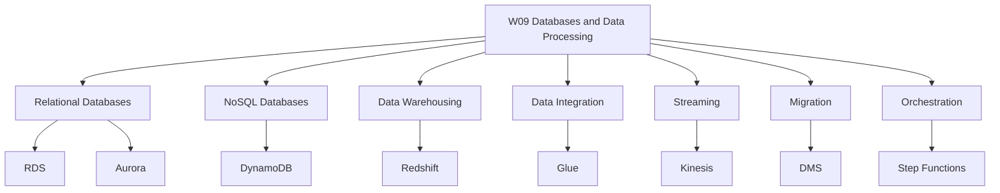
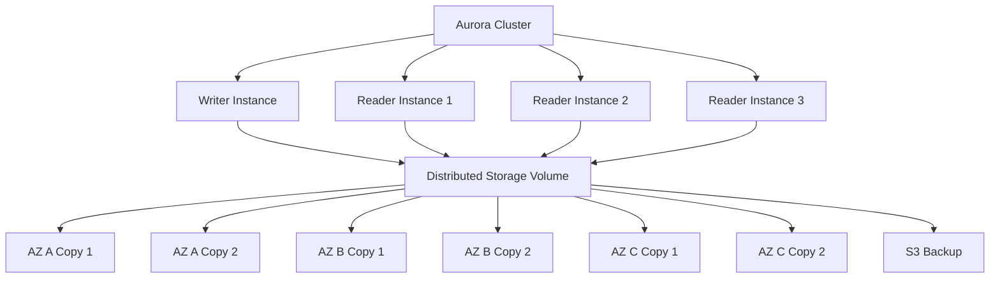
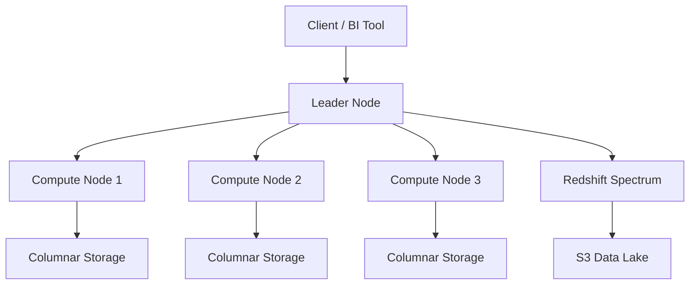
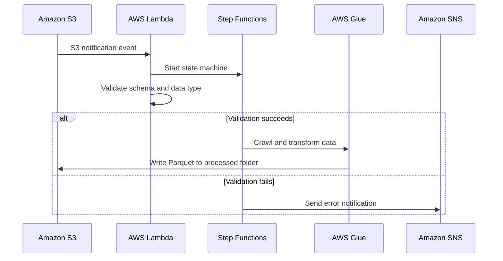
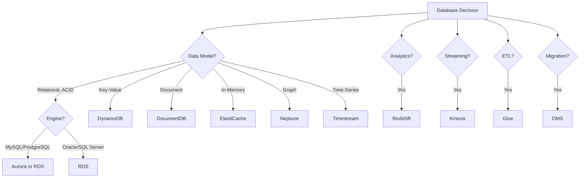

# W09: Databases & Data Processing

This module covers the AWS database portfolio and data processing services. It spans relational databases (RDS and Aurora), NoSQL (DynamoDB), data warehousing (Redshift), ETL and data integration (Glue), real-time streaming (Kinesis), database migration (DMS), and pipeline orchestration (Step Functions). The goal is to select the right database for a workload and build data pipelines that move, transform, and analyse data at scale.

## The AWS Database Portfolio

AWS offers purpose-built databases, each optimised for a specific data model and access pattern. The right tool for the right job is the guiding principle. A single application may use several database types: a relational database for transactions, a key-value store for session state, an in-memory cache for hot paths, and a data warehouse for analytics.

### Database Categories

| Category | AWS Service | Data Model | Use Case |
|---|---|---|---|
| Relational | Amazon RDS | Tables with rows and columns, ACID transactions | ERP, CRM, e-commerce, traditional applications |
| Relational (cloud-native) | Amazon Aurora | MySQL/PostgreSQL compatible, distributed storage | High-traffic web apps, SaaS, gaming |
| Key-Value | Amazon DynamoDB | Key-value and document, single-digit millisecond latency | Session state, shopping carts, gaming leaderboards |
| Document | Amazon DocumentDB | MongoDB-compatible document store | Content management, catalogues, user profiles |
| In-Memory | Amazon ElastiCache | Key-value with microsecond latency | Caching, session management, leaderboards |
| Graph | Amazon Neptune | Nodes and edges | Fraud detection, social networks, recommendation engines |
| Time-Series | Amazon Timestream | Time-stamped data | IoT, DevOps, industrial telemetry |
| Wide Column | Amazon Keyspaces | Apache Cassandra-compatible | Low-latency applications, Cassandra migration |
| Ledger | Amazon QLDB | Immutable, verifiable transaction log | Systems of record, supply chain, healthcare |
| Data Warehouse | Amazon Redshift | Columnar, MPP | BI reporting, analytics, data warehousing |

> [!Important]
> **Choose the database by access pattern, not by familiarity**: The most common architectural mistake is forcing data into a relational database when a purpose-built database would serve it better. Use relational for ACID transactions and complex queries. Use key-value for high-throughput, low-latency lookups. Use document for flexible schemas. Use graph for relationship-heavy data. Use time-series for timestamped data.

## Amazon RDS

*Definition*: Amazon Relational Database Service (RDS) is a managed relational database service that makes it easy to set up, operate, and scale a relational database in the cloud. It provides cost-efficient and resizable capacity while automating time-consuming administration tasks.

### Supported Engines

| Engine | Version Examples | Use Case |
|---|---|---|
| PostgreSQL | 16, 15, 14 | General-purpose relational workloads, PostGIS |
| MySQL | 8.0, 8.4 | Web applications, e-commerce |
| MariaDB | 10.11, 11.4 | MySQL-compatible workloads |
| Oracle | 19c, 21c | Enterprise applications, ERP |
| SQL Server | 2019, 2022 | Windows workloads, .NET applications |
| Db2 | 11.5 | Enterprise workloads, mainframe migration |

### RDS Features

- **Multi-AZ deployments**: Synchronous replication to a standby in another Availability Zone. Automatic failover in 60-120 seconds. Enterprise-grade high availability.
- **Read replicas**: Asynchronous replication to up to 5 read replicas (15 for Aurora). Used for read scaling and disaster recovery.
- **Automated backups**: Daily full snapshots and transaction logs. Point-in-time recovery to any second within the retention period (up to 35 days).
- **Automatic patching**: Minor version upgrades and security patches applied during maintenance windows.
- **Storage autoscaling**: Automatically increases storage when free space runs low.
- **Performance Insights**: Visualises database load and identifies bottlenecks.
- **RDS Proxy**: Connection pooling for serverless and containerised applications.

> [!Important]
> **RDS Multi-AZ is for high availability, not read scaling**: The standby instance in a Multi-AZ deployment does not serve read traffic. It exists solely for failover. Use read replicas for read scaling. Use Multi-AZ for automatic failover and disaster recovery.

### RDS Instance Classes

| Class Family | Optimised For | Use Case |
|---|---|---|
| db.t4g, db.t3 | Burstable, general purpose | Development, small applications |
| db.m7g, db.m6i | Balanced compute and memory | Production web applications |
| db.r7g, db.r6i | Memory optimised | In-memory databases, analytics |
| db.x2g, db.x1 | Extreme memory | Large in-memory databases |

## Amazon Aurora

*Definition*: Amazon Aurora is a MySQL and PostgreSQL-compatible relational database built for the cloud. It combines the performance and availability of commercial databases with the simplicity and cost-effectiveness of open-source databases.

### Aurora Architecture

Aurora uses a distributed, fault-tolerant, self-healing storage system that automatically scales up to 128 TiB per database volume. It replicates data six ways across three Availability Zones and continuously backs up data to Amazon S3.

### Aurora vs RDS

| Dimension | Aurora | RDS |
|---|---|---|
| Storage | Distributed, auto-scaling, 128 TiB | Provisioned EBS, manual resize |
| Read Replicas | Up to 15, sub-10ms lag | Up to 5, lag of minutes |
| Failover | Typically under 30 seconds | 60-120 seconds |
| Durability | 6 copies across 3 AZs | Multi-AZ standby |
| Backups | Continuous to S3 | Daily snapshots + transaction logs |
| Performance | Up to 5x MySQL throughput | Depends on instance and storage |
| Cost | Higher per hour, lower at scale | Lower per hour, higher at scale |

> [!Tip]
> **Aurora is the default choice for new relational workloads on AWS**: Aurora offers better price-performance than RDS for most production workloads, with auto-scaling storage, faster failover, and more read replicas. Choose RDS when you need a specific engine (Oracle, SQL Server, Db2) or want to minimise cost for small workloads.

### Aurora Serverless v2

- Aurora Serverless v2 automatically scales database capacity in fine-grained increments based on demand.
- You define a minimum and maximum ACU (Aurora Capacity Unit) range.
- Scaling happens in milliseconds, with no downtime.
- Ideal for variable or unpredictable workloads, development environments, and multi-tenant SaaS applications.
- You pay only for the capacity you use.

### Aurora Global Database

- Aurora Global Database spans multiple AWS Regions.
- A primary Region serves writes. Secondary Regions serve read-only traffic.
- Replication lag is typically under 1 second.
- Promotes a secondary Region to primary in under 1 minute during a regional failure.
- Used for disaster recovery and low-latency global reads.

## Amazon DynamoDB

*Definition*: Amazon DynamoDB is a fully managed, serverless, NoSQL key-value and document database that delivers single-digit millisecond performance at any scale. It is designed for applications that need high throughput and low latency.

### DynamoDB Fundamentals

- DynamoDB stores data in tables. Each table has a primary key that uniquely identifies each item.
- A primary key can be a partition key (simple) or a partition key and sort key (composite).
- DynamoDB is schemaless. Each item can have different attributes.
- DynamoDB scales horizontally using partitions. Data is distributed across partitions based on the partition key.
- DynamoDB is serverless. There are no instances to manage.

### DynamoDB Capacity Modes

| Mode | Description | Use Case |
|---|---|---|
| On-Demand | Pay per request. Automatically scales to workload. | Unpredictable traffic, new applications |
| Provisioned | Specify read and write capacity units. Auto scaling available. | Predictable traffic, cost optimisation |

- On-demand mode is ideal for spiky or unpredictable workloads. You pay per read and write request.
- Provisioned mode is cheaper for steady-state workloads. You specify RCUs and WCUs and can enable auto scaling.

### DynamoDB Indexes

| Index Type | Description | Use Case |
|---|---|---|
| Local Secondary Index (LSI) | Same partition key, different sort key. Created at table creation. | Alternative sort keys for a partition |
| Global Secondary Index (GSI) | Different partition key and sort key. Can be created anytime. | Query patterns on non-key attributes |

### DynamoDB Features

- **DynamoDB Streams**: Captures item-level changes for event-driven processing.
- **DynamoDB Accelerator (DAX)**: In-memory cache for DynamoDB. Microsecond latency for read-heavy workloads.
- **Global Tables**: Multi-Region, active-active replication. Sub-second replication.
- **Point-in-Time Recovery**: Restore to any point in the last 35 days.
- **Time to Live (TTL)**: Automatically delete expired items.
- **Transactions**: ACID transactions across multiple items.

> [!Important]
> **DynamoDB is not a replacement for relational databases**: DynamoDB is optimised for key-based access patterns. It does not support joins, complex queries, or ad-hoc analytics. If you need relational queries, use RDS or Aurora. If you need flexible schema and single-digit millisecond performance at scale, use DynamoDB.

## Amazon Redshift

*Definition*: Amazon Redshift is a fast, fully managed, petabyte-scale data warehouse that makes it simple and cost-effective to analyse all your data using existing business intelligence tools.

### Redshift Architecture

Redshift uses a massively parallel processing (MPP) architecture. A cluster consists of a leader node and multiple compute nodes. The leader node coordinates query execution. Compute nodes store data and execute queries in parallel.

### Key Features

| Feature | Description |
|---|---|
| Columnar Storage | Data stored by column, not row. Reduces I/O for analytical queries. |
| Data Compression | Typically 3x compression, reducing storage costs. |
| MPP Architecture | Queries parallelised across all nodes. |
| Redshift Spectrum | Query S3 data directly without loading into Redshift. |
| AQUA | Advanced Query Accelerator. Hardware-accelerated cache. |
| Concurrency Scaling | Automatically adds clusters for concurrent queries. |
| Data Sharing | Share live data across clusters and accounts. |
| Federated Queries | Query data in RDS and Aurora without ETL. |
| Automated Materialised Views | Automatically refresh materialised views. |
| Machine Learning | CREATE MODEL for in-database ML. |

- Redshift delivers up to 5x better price-performance than other cloud data warehouses and up to 7x better price-performance on high concurrency, low latency workloads.
- Redshift Serverless automatically provisions and scales compute capacity.
- RA3 instances separate compute and storage, allowing independent scaling.

> [!Tip]
> **Use Redshift for analytical workloads, not transactional workloads**: Redshift is optimised for complex analytical queries over large datasets. It is not suitable for high-concurrency transactional workloads with many small writes. Use RDS or Aurora for transactions. Use Redshift for analytics and reporting.

## AWS Glue

*Definition*: AWS Glue is a serverless data integration service that makes it easy to discover, prepare, and combine data for analytics, machine learning, and application development. It provides ETL, schema discovery, and cross-service integration.

### Glue Components

| Component | Description |
|---|---|
| Data Catalog | Central metadata repository for all data assets. |
| Crawlers | Automatically discover schemas and populate the Data Catalog. |
| ETL Jobs | Extract, transform, and load data. Supports batch and streaming. |
| Visual ETL | Drag-and-drop interface for building ETL pipelines. |
| DataBrew | Visual data preparation for analysts. |
| Schema Registry | Central schema management for streaming data. |
| Job Bookmarks | Track processed data to avoid reprocessing. |

### Glue Job Types

| Job Type | Description | Use Case |
|---|---|---|
| Apache Spark | Distributed processing for large datasets | Batch ETL, data transformation |
| Python Shell | Lightweight Python scripts | Small ETL tasks, API calls |
| Ray | Distributed Python for ML and AI | Machine learning workloads |
| Streaming ETL | Continuous processing from Kinesis or Kafka | Real-time data pipelines |

- Glue ETL supports extracting data from various sources, transforming it, and loading it into a target.
- Glue crawlers create the schema of raw files in S3.
- Glue jobs transform, compress, and partition raw files into Parquet format.
- Glue integrates with S3, RDS, Redshift, DynamoDB, Kinesis, and Kafka.

> [!Important]
> **Glue is serverless, but not free**: You pay per Data Processing Unit (DPU) per hour. Glue jobs can be expensive if not sized correctly. Use job bookmarks to avoid reprocessing data. Use Glue's flexible worker types (G.1X, G.2X, G.4X, G.8X) to match compute to workload.

## Amazon Kinesis

*Definition*: Amazon Kinesis makes it easy to collect, process, and analyse streaming data in real time so you can get timely insights and react quickly to new information. It provides key capabilities to cost-effectively process streaming data at any scale.

### Kinesis Services

| Service | Description | Use Case |
|---|---|---|
| Kinesis Data Streams | Real-time data streaming. Captures gigabytes per second. | Log processing, clickstream, IoT telemetry |
| Kinesis Data Firehose | Loads streaming data into AWS data stores. | Near real-time analytics, S3 delivery |
| Kinesis Data Analytics | Process streaming data with SQL or Apache Flink. | Real-time analytics, anomaly detection |
| Kinesis Video Streams | Stream video for analytics and ML. | IoT cameras, computer vision |

### Kinesis Data Streams Concepts

- A stream is composed of shards. Each shard provides a fixed capacity for ingestion and consumption.
- Producers write records to a stream. Consumers read records from the stream.
- Data retention is configurable from 24 hours to 365 days.
- Records are ordered within a shard.
- Multiple consumers can read from the same stream.

> [!Tip]
> **Use Kinesis Data Firehose when you just need to load data**: Firehose is the easiest way to capture, transform, and load streaming data into S3, Redshift, OpenSearch, and other destinations. Use Kinesis Data Streams when you need custom real-time processing or multiple consumers.

## AWS Database Migration Service

*Definition*: AWS Database Migration Service (DMS) helps you migrate databases to AWS quickly and securely. The source database remains fully operational during the migration, minimising downtime to applications that rely on the database.

### DMS Capabilities

- **Homogeneous migrations**: Oracle to Oracle, MySQL to MySQL, PostgreSQL to PostgreSQL.
- **Heterogeneous migrations**: Oracle to Aurora, SQL Server to MySQL, and more.
- **Continuous replication**: Keep source and target in sync for minimal downtime cutover.
- **Schema conversion**: AWS Schema Conversion Tool (SCT) converts schema and code for heterogeneous migrations.
- **DMS Fleet Advisor**: Discovers and analyses source databases for migration planning.

### Supported Sources and Targets

| Sources | Targets |
|---|---|
| Oracle, SQL Server, MySQL, MariaDB, PostgreSQL, SAP ASE, MongoDB, Db2 | Aurora, RDS, Redshift, DynamoDB, S3, DocumentDB, OpenSearch, Kinesis |

> [!Important]
> **DMS is for migration, not for ongoing replication**: While DMS supports continuous replication, it is designed for migration scenarios. For ongoing data synchronisation between databases, consider native replication features or AWS Glue.

## Pipeline Orchestration with Step Functions

*Definition*: AWS Step Functions is a serverless orchestration service that lets you build workflows by combining AWS Lambda functions and other AWS services into a state machine.

### ETL Pipeline Pattern

A common serverless ETL pipeline pattern:

- An S3 notification event initiates a Lambda function that starts the Step Functions state machine.
- The Lambda function validates the schema and data type of the raw file.
- If validation succeeds, an AWS Glue crawler creates the schema from the staging folder.
- A Glue job transforms, compresses, and partitions the raw file into Parquet format.
- The Glue job moves the file to the transformation folder in S3.

> [!Tip]
> **Use Step Functions to orchestrate complex ETL workflows**: Step Functions provides error handling, retry logic, and notification capabilities. It coordinates Lambda, Glue, and other services into a reliable, observable pipeline.

## Database and Data Processing Decision Framework

## Assessment Preparation

### Practice Questions

1. Compare the AWS database categories and give a service for each.
2. Explain the difference between RDS and Aurora.
3. Describe the features of RDS Multi-AZ and read replicas.
4. Explain how Aurora's distributed storage works.
5. Describe Aurora Serverless v2 and Aurora Global Database.
6. Compare DynamoDB on-demand and provisioned capacity modes.
7. Explain the difference between Local Secondary Indexes and Global Secondary Indexes.
8. Describe the Redshift architecture and its MPP design.
9. Explain the purpose of Redshift Spectrum and federated queries.
10. Describe the components of AWS Glue.
11. Compare Kinesis Data Streams, Firehose, and Analytics.
12. Explain the purpose of AWS DMS and its migration types.
13. Describe how Step Functions orchestrates ETL pipelines.

### Scenario Questions

**Scenario 1: High-Traffic Web Application**
A SaaS platform needs a relational database that can handle high traffic with auto-scaling storage and fast failover. What should they use?

- Use Amazon Aurora MySQL or PostgreSQL.
- Aurora provides auto-scaling storage, up to 15 read replicas, and failover under 30 seconds.
- Use Aurora Global Database for multi-Region disaster recovery.
- Use Aurora Serverless v2 for variable workloads.

**Scenario 2: Gaming Leaderboard**
A gaming company needs a database that can handle millions of reads and writes per second with single-digit millisecond latency. What should they use?

- Use Amazon DynamoDB.
- Use on-demand capacity mode for unpredictable traffic.
- Use DAX for microsecond read latency.
- Use Global Tables for multi-Region active-active replication.

**Scenario 3: Business Intelligence Reporting**
A company needs to analyse petabytes of data from multiple sources for BI reporting. What should they use?

- Use Amazon Redshift.
- Use Redshift Spectrum to query S3 data directly.
- Use federated queries to access RDS and Aurora data.
- Use concurrency scaling for high-concurrency workloads.
- Use RA3 instances to separate compute and storage.

**Scenario 4: Real-Time Clickstream Analytics**
A company needs to process website clickstream data in real time and load it into S3 for analysis. What should they use?

- Use Kinesis Data Streams to capture the stream.
- Use Kinesis Data Firehose to load data into S3.
- Use Kinesis Data Analytics for real-time SQL processing.
- Use Glue to transform the data into Parquet format.
- Use Redshift or Athena to query the data.

**Scenario 5: Database Migration**
A company wants to migrate an on-premises Oracle database to Aurora PostgreSQL with minimal downtime. What should they use?

- Use AWS Schema Conversion Tool (SCT) to convert schema and code.
- Use AWS DMS for continuous replication.
- Keep the source database operational during migration.
- Cut over during a maintenance window.

**Scenario 6: Serverless ETL Pipeline**
A company needs to build an ETL pipeline that validates, transforms, and partitions CSV files uploaded to S3. What should they use?

- Use S3 event notifications to trigger Lambda.
- Use Step Functions to orchestrate the workflow.
- Use Lambda to validate schema and data type.
- Use Glue crawlers to discover schema.
- Use Glue jobs to transform CSV to Parquet.
- Use SNS for error notifications.

## Key Takeaways

- AWS offers purpose-built databases for different data models and access patterns.
- Amazon RDS is a managed relational database service supporting six engines: PostgreSQL, MySQL, MariaDB, Oracle, SQL Server, and Db2.
- Amazon Aurora is a MySQL and PostgreSQL-compatible relational database built for the cloud with distributed storage, up to 15 read replicas, and fast failover.
- Amazon DynamoDB is a serverless NoSQL key-value and document database with single-digit millisecond performance at any scale.
- Amazon Redshift is a petabyte-scale data warehouse with MPP architecture, columnar storage, and Spectrum for querying S3.
- AWS Glue is a serverless data integration service for ETL, schema discovery, and data cataloguing.
- Amazon Kinesis provides real-time streaming with Data Streams, Firehose, Analytics, and Video Streams.
- AWS DMS migrates databases to AWS with minimal downtime.
- AWS Step Functions orchestrates ETL pipelines and complex workflows.
- Choose the database by access pattern, not by familiarity.
- RDS Multi-AZ is for high availability. Read replicas are for read scaling.
- Aurora is the default choice for new relational workloads on AWS.
- DynamoDB is for key-based access patterns, not relational queries.
- Redshift is for analytics, not transactions.
- Glue is serverless but not free. Use job bookmarks and right-size workers.
- Kinesis Firehose is the easiest way to load streaming data into AWS data stores.
- DMS is for migration. SCT converts schema for heterogeneous migrations.
- Step Functions provides error handling and orchestration for ETL pipelines.

> [!Important]
> **Match the database to the access pattern, and the processing service to the data velocity**: The most common architectural mistake is forcing data into the wrong database. Use relational for ACID transactions. Use key-value for high-throughput lookups. Use document for flexible schemas. Use graph for relationships. Use time-series for timestamped data. For data processing, use Glue for batch ETL, Kinesis for real-time streaming, DMS for migration, and Step Functions for orchestration. A modern application typically uses several database types together. Design for the access pattern, not for a single database to do everything.
