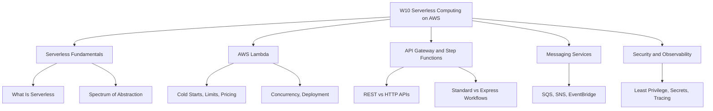
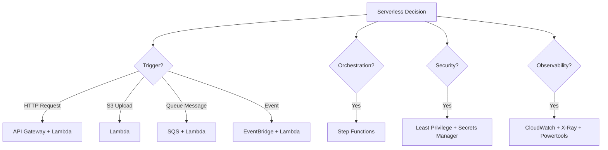
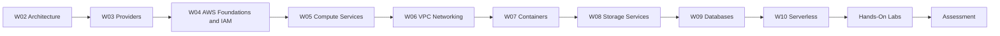
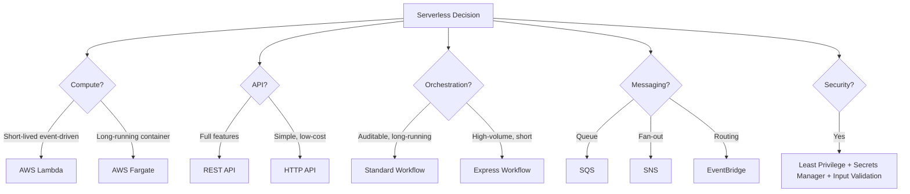

# W10: Serverless Computing on AWS - Lesson 0: Module Introduction

This module introduces serverless computing on AWS. It covers the core serverless services: AWS Lambda for compute, Amazon API Gateway for APIs, AWS Step Functions for orchestration, and Amazon SQS, Amazon SNS, and Amazon EventBridge for messaging. It also covers serverless security, observability, and cost optimisation. The goal is to build applications that scale automatically, cost nothing at idle, and let teams focus on business logic instead of infrastructure.

## Module Purpose

- Define serverless computing and explain how it differs from traditional compute models.
- Introduce AWS Lambda as the core serverless compute service.
- Explain how API Gateway exposes Lambda functions as HTTP APIs.
- Describe how Step Functions orchestrates multi-step workflows.
- Compare SQS, SNS, and EventBridge for asynchronous communication.
- Apply serverless security best practices: least privilege, secrets management, input validation.
- Describe serverless observability with CloudWatch, X-Ray, and Lambda Powertools.
- Prepare for hands-on labs and scenario-based assessment.

## Learning Objectives

- Define serverless computing and explain the spectrum of abstraction.
- Describe how AWS Lambda works, including cold starts and warm starts.
- List the key Lambda limits: timeout, memory, concurrency, and package size.
- Explain Lambda pricing for requests and duration.
- Compare unreserved, reserved, and provisioned concurrency.
- Compare REST APIs and HTTP APIs in API Gateway.
- Compare Standard and Express workflows in Step Functions.
- Compare SQS, SNS, and EventBridge for messaging.
- List five serverless security best practices.
- Describe the three pillars of serverless observability.
- Explain how to reduce Lambda cold starts and optimise cost.
- Select the appropriate serverless service for a given workload.

> [!Tip]
> **Start with the event source, not the service**: Serverless applications are event-driven. The first question is what triggers the compute. An HTTP request triggers API Gateway. An S3 upload triggers Lambda. A queue message triggers SQS. The event source determines the compute and the integration pattern.

## Module Structure

| Lesson | Topic | Focus |
|---|---|---|
| Lesson 0 | Module Introduction | Scope and objectives |
| Lesson 1 | Serverless Fundamentals | What is serverless, spectrum of abstraction |
| Lesson 2 | AWS Lambda | Cold starts, limits, pricing, concurrency |
| Lesson 3 | API Gateway and Step Functions | REST vs HTTP APIs, Standard vs Express workflows |
| Lesson 4 | Messaging Services | SQS, SNS, EventBridge |
| Lesson 5 | Summary and Assessment | Review and scenarios |

## Core Concepts Preview

### Serverless Fundamentals

*Definition*: Serverless computing is a cloud execution model in which the cloud provider dynamically manages the allocation and provisioning of servers. You write code or configure services, and the provider handles scaling, patching, and availability.

- Serverless does not mean there are no servers. It means you do not provision, manage, or scale them.
- You pay only for what you use. There is no cost at idle.
- Serverless scales automatically from zero to millions of requests per second.
- Serverless is a spectrum: Lambda is the most abstract compute service, but Fargate and App Runner also remove server management for containers.

### AWS Lambda

*Definition*: AWS Lambda is a serverless compute service that runs your code in response to events and automatically manages the compute resources for you.

- Lambda limits: 15-minute timeout, 128 MB to 10,240 MB memory, 1,000 default concurrent executions, 250 MB ZIP package, 10 GB container image.
- Lambda pricing is per request ($0.20 per million) and per GB-second ($0.0000166667 for x86, $0.0000133334 for Arm).
- Cold starts occur when Lambda creates a new execution environment. Provisioned concurrency eliminates cold starts.
- Memory and CPU are linked. Increasing memory can reduce duration and total cost.
- Deployment options: ZIP packages, Lambda Layers, and container images.

### API Gateway and Step Functions

*Definition*: Amazon API Gateway is a fully managed service that makes it easy to create, publish, maintain, monitor, and secure APIs at any scale.

- REST APIs offer full features: API keys, per-client throttling, request validation, AWS WAF, private endpoints.
- HTTP APIs offer minimal features at a lower price, up to 71% cheaper than REST APIs.
- AWS Step Functions orchestrates workflows with error handling, retries, and notifications.
- Standard workflows are for auditable, long-running processes. Express workflows are for high-volume, short-duration processes.

### Messaging Services

| Service | Communication Model | Use Case |
|---|---|---|
| Amazon SQS | Pull-based queue | Decoupling, durable queuing |
| Amazon SNS | Push-based pub/sub | Fan-out, notifications |
| Amazon EventBridge | Event bus | Event routing, integration |

- SQS is a queue. Producers send messages. Consumers poll for messages.
- SNS is pub/sub. Publishers send messages to topics. Subscribers receive messages.
- EventBridge is an event bus. Rules match events and route them to targets.
- Use EventBridge for routing, SNS for fan-out, SQS for queuing.

### Security and Observability

- Least privilege IAM: one execution role per function, explicit actions and resources.
- Secrets Manager: never store secrets in environment variables.
- Input validation: validate at API Gateway and in the function.
- Observability: logging with CloudWatch Logs, metrics with CloudWatch Metrics, tracing with AWS X-Ray.
- AWS Lambda Powertools provides structured logging, tracing, and metrics.

> [!Important]
> **Serverless is a design philosophy, not just a compute service**: The real value of serverless is not that you avoid servers. It is that you build applications from managed services that scale automatically, cost nothing at idle, and let you focus on business logic. Use Lambda for compute, API Gateway for APIs, Step Functions for orchestration, SQS and SNS and EventBridge for messaging, and DynamoDB for data.

## How This Module Connects to Previous Modules

- W02 covered reliability, performance, and the AWS Well-Architected Framework.
- W03 compared AWS, Azure, and GCP across services and selection factors.
- W04 covered AWS global infrastructure, IAM, and account security.
- W05 covered compute services and virtualisation, including EC2 and EBS.
- W06 covered VPC networking fundamentals.
- W07 covered containers, Docker, and Kubernetes.
- W08 covered AWS storage services, including S3, EBS, EFS, and FSx.
- W09 covered databases and data processing, including RDS, Aurora, DynamoDB, and Glue.
- W10 adds the serverless layer: how to build event-driven applications without managing servers.
- The serverless choices you make affect reliability, cost, performance, and security.

## Assessment Preparation

### Practice Questions

1. Define serverless computing and explain how it differs from traditional compute.
2. Describe how AWS Lambda works, including cold starts and warm starts.
3. List the key Lambda limits: timeout, memory, concurrency, and package size.
4. Explain how Lambda pricing works for requests and duration.
5. Compare unreserved, reserved, and provisioned concurrency.
6. Compare ZIP packages, Lambda Layers, and container images for deployment.
7. Compare REST APIs and HTTP APIs in API Gateway.
8. Compare Standard and Express workflows in Step Functions.
9. Compare SQS, SNS, and EventBridge for messaging.
10. List five serverless security best practices.
11. Explain the three pillars of serverless observability.
12. Describe how to reduce Lambda cold starts.
13. Explain how to optimise Lambda cost with memory tuning and Graviton.
14. Describe the serverless application model (SAM) and its purpose.

### Scenario Questions

**Scenario 1: Event-Driven Image Processing**
A company needs to process images uploaded to S3 and generate thumbnails. What should they use?

- Use AWS Lambda triggered by S3 upload events.
- Lambda automatically scales to handle spikes in upload volume.
- Pay only for the compute time used, with no cost for idle time.
- Use container images if image processing libraries exceed 250 MB.
- Use SQS or EventBridge for asynchronous processing and error handling.

**Scenario 2: Serverless API**
A team needs to build a REST API backed by Lambda functions with request validation and API keys. What should they use?

- Use API Gateway REST API.
- REST APIs support API keys, per-client throttling, request validation, and AWS WAF integration.
- Use Lambda authorizers or Cognito User Pools for authorization.
- Use CloudWatch for monitoring and X-Ray for tracing.

**Scenario 3: Multi-Step Order Processing**
A company needs to orchestrate a multi-step order processing workflow with retries and error handling. What should they use?

- Use AWS Step Functions Standard workflow.
- Standard workflows provide full execution history and exactly-once processing.
- Use Retry and Catch for error handling.
- Use Lambda functions for individual steps.
- Use Parallel state for steps that can run concurrently.

**Scenario 4: High-Volume Event Processing**
A company needs to process millions of events per hour with minimal cost. What should they use?

- Use AWS Step Functions Express workflow.
- Express workflows are ideal for high-volume, event-processing workloads.
- Use EventBridge for event routing.
- Use SQS for durable queuing and decoupling.
- Use Lambda for event processing.

**Scenario 5: Latency-Sensitive API**
A team needs sub-100ms response times for a Lambda-backed API. Cold starts are causing latency spikes. What should they do?

- Enable provisioned concurrency on the Lambda function.
- Use Application Auto Scaling to schedule provisioned concurrency for known traffic patterns.
- Keep deployment packages small to reduce cold start duration.
- Use Graviton for better price-performance.
- Consider HTTP API for lower latency than REST API.

**Scenario 6: Secure Serverless Application**
A security team requires that no secrets are stored in environment variables and that all functions follow least privilege. What should they do?

- Store secrets in AWS Secrets Manager or Parameter Store.
- Use the AWS Parameters and Secrets Lambda Extension for caching.
- Create one execution role per function with explicit actions and resources.
- Use IAM Access Analyzer to remove unused permissions.
- Use permission boundaries to cap maximum permissions.
- Validate input at API Gateway and in the function.

## Key Takeaways

- Serverless computing removes server management. You pay only for what you use, with no cost at idle.
- AWS Lambda runs code in response to events. It scales automatically from zero to millions of requests.
- Lambda limits: 15-minute timeout, 128 MB to 10,240 MB memory, 1,000 default concurrent executions, 250 MB ZIP package, 10 GB container image.
- Lambda pricing is per request and per GB-second. Arm-based Graviton functions are 20% cheaper.
- Cold starts occur when Lambda creates a new execution environment. Provisioned concurrency eliminates cold starts.
- Memory and CPU are linked. Increasing memory can reduce duration and total cost.
- API Gateway offers REST APIs (full features) and HTTP APIs (lower cost, minimal features).
- Step Functions orchestrates workflows. Standard workflows are for auditable, long-running processes. Express workflows are for high-volume, short-duration processes.
- SQS is a queue. SNS is pub/sub. EventBridge is an event bus. They are complementary.
- Serverless security requires least privilege IAM, one execution role per function, Secrets Manager for secrets, and input validation.
- Observability requires logging, metrics, and tracing. Use CloudWatch, X-Ray, and AWS Lambda Powertools.
- Best practices: use services instead of custom code, implement idempotency, minimise coupling, design for failure, keep functions small, reuse connections, and tune memory.
- Serverless is not always cheaper. For steady-state, high-volume workloads, containers or EC2 may be more cost-effective.
- This module builds on W02 architecture, W03 provider comparison, W04 AWS foundations, W05 compute services, W06 VPC networking, W07 containers, W08 storage services, and W09 databases.
- Assessment focuses on practical serverless selection and scenario-based decision making.

> [!Important]
> **Choose the right tool for the workload**: Serverless is most cost-effective for spiky, unpredictable, or low-volume workloads where you pay only for what you use. For steady-state, high-volume workloads, evaluate containers or EC2. Use Lambda for event-driven compute, API Gateway for APIs, Step Functions for orchestration, and SQS, SNS, and EventBridge for messaging. Design for failure, implement idempotency, and validate input at every layer. Serverless delivers agility, scalability, and cost efficiency when matched to the right workload.
