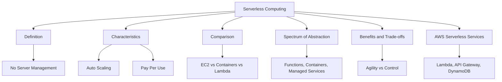

# Migration in progress
# Lesson 1: Introduction to Serverless Computing

Serverless computing is a cloud execution model in which the cloud provider dynamically manages the allocation and provisioning of servers. You write code or configure services, and the provider handles scaling, patching, and availability. You pay only for the resources consumed while your code runs. This lesson defines serverless, contrasts it with traditional compute models, and explains the spectrum of serverless abstraction on AWS.

## What Is Serverless Computing

*Definition*: Serverless computing is a cloud execution model in which the cloud provider dynamically manages the allocation and provisioning of servers. You write code or configure services, and the provider handles scaling, patching, and availability. You pay only for the resources consumed while your code runs.

- Serverless does not mean there are no servers. It means you do not provision, manage, or scale them.
- The provider handles capacity, patching, fault tolerance, and availability.
- You pay only for what you use. There is no cost at idle.
- Serverless scales automatically from zero to millions of requests per second.
- Serverless shifts operational responsibility to the provider, but security, data modelling, and cost optimisation remain the customer's responsibility.

> [!Important]
> **Serverless is about responsibility, not the absence of servers**: The defining characteristic is that the provider manages the infrastructure layer. Your responsibility shifts from operations to code, configuration, and data. This is why serverless is often described as "NoOps" or "LessOps" rather than "NoServers."

## Core Characteristics of Serverless

Serverless computing is defined by five characteristics that distinguish it from traditional compute models.

### No Server Management

- You never provision, patch, or scale servers.
- The provider handles all infrastructure operations.
- You focus on application logic, not operating systems.
- There are no SSH sessions, no patching windows, and no capacity planning.

### Automatic Scaling

- Serverless scales automatically in response to demand.
- It scales from zero to handle millions of requests per second.
- Scaling is transparent. You do not configure auto scaling groups or scaling policies.
- Scale-to-zero means no cost when there is no traffic.

### Pay-Per-Use Pricing

- You pay only for the resources consumed while your code runs.
- There is no cost for idle capacity.
- Billing is measured in milliseconds for compute and per request for invocations.
- This model is cost-effective for spiky, unpredictable, or low-volume workloads.

### Event-Driven Execution

- Serverless functions are invoked in response to events.
- Events include HTTP requests, file uploads, queue messages, database changes, and scheduled timers.
- Functions are stateless. State is stored in external services such as DynamoDB or S3.
- The event source determines the invocation model.

### Built-In Availability and Fault Tolerance

- The provider replicates and distributes execution across multiple Availability Zones.
- There is no single point of failure for the compute layer.
- Failed invocations are retried automatically in some models.
- Availability is part of the service, not something you architect for the compute layer.

| Characteristic | Description | Benefit |
|---|---|---|
| No Server Management | Provider manages infrastructure | Reduced operational overhead |
| Automatic Scaling | Scales from zero to millions | No capacity planning |
| Pay-Per-Use | Pay only for consumption | Cost efficiency for variable workloads |
| Event-Driven | Invoked by events | Natural fit for reactive architectures |
| Built-In Availability | Provider replicates across AZs | High availability without design effort |

> [!Tip]
> **Scale-to-zero is the defining cost advantage**: Unlike EC2 or containers, serverless can scale to zero when there is no traffic. You pay nothing for idle capacity. This makes serverless ideal for workloads with unpredictable or intermittent traffic patterns.

## Serverless vs Traditional Compute

The three main compute models on AWS are virtual machines, containers, and serverless functions. Each represents a different level of abstraction and a different distribution of responsibility between you and AWS.

| Dimension | EC2 (VMs) | Containers (ECS/EKS/Fargate) | Serverless (Lambda) |
|---|---|---|---|
| Abstraction Level | Infrastructure | Application and runtime | Function |
| Provisioning | You provision instances | You provision clusters or use Fargate | None |
| Scaling | Configure auto scaling groups | Configure scaling policies | Automatic |
| Patching | You patch the OS | You patch the container or use managed | Provider patches |
| Idle Cost | Full instance cost | Full container cost | Zero |
| Startup Time | Minutes | Seconds | Milliseconds to seconds |
| Max Runtime | Unlimited | Unlimited | 15 minutes |
| State | Stateful or stateless | Stateless | Stateless |
| Best For | Full control, legacy apps | Microservices, portability | Event-driven, spiky workloads |

- EC2 provides the most control and the most operational responsibility.
- Containers reduce operational overhead but still require cluster management or Fargate configuration.
- Serverless removes server management entirely but imposes runtime and state constraints.

> [!Important]
> **There is no single best compute model**: Use EC2 for full control and legacy workloads. Use containers for portability and microservices. Use serverless for event-driven, spiky, or short-duration tasks. The right choice depends on the workload, not on a universal preference.

## The Serverless Spectrum

Serverless is not a single service. It is a spectrum of abstraction levels. At one end, you manage the entire stack. At the other end, you configure managed services with no code at all.

| Service | Abstraction Level | Management Overhead | Use Case |
|---|---|---|---|
| Amazon EC2 | Infrastructure | Highest | Full control, legacy applications |
| AWS Fargate | Container | Medium | Long-running containers without EC2 management |
| AWS App Runner | Container | Low | Web applications and APIs from containers |
| AWS Lambda | Function | None | Event-driven, short-lived compute |
| Amazon API Gateway | API | None | HTTP and WebSocket APIs |
| AWS Step Functions | Workflow | None | Multi-step orchestration |
| Amazon EventBridge | Event bus | None | Event routing and integration |
| Amazon SQS | Queue | None | Asynchronous message queuing |
| Amazon SNS | Pub/sub | None | Fan-out notifications |
| Amazon DynamoDB | Database | None | Key-value and document storage |
| Amazon S3 | Storage | None | Object storage |
| Amazon Aurora Serverless | Database | None | Relational database with automatic scaling |

```mermaid
flowchart TD
    A[Abstraction Spectrum] --> B[EC2: Full Control]
    B --> C[Fargate: Containers Without Nodes]
    C --> D[App Runner: Managed Containers]
    D --> E[Lambda: Functions]
    E --> F[Managed Services: DynamoDB, S3, SQS]
    F --> G[Zero Code: EventBridge, Step Functions]
```

- As you move up the spectrum, you trade control for reduced operational overhead.
- The highest levels of abstraction require no code at all. You configure services that run on your behalf.
- Most serverless applications combine services from multiple levels of the spectrum.

> [!Tip]
> **The spectrum lets you choose the right level for each component**: Not every part of an application needs to be a Lambda function. Use S3 for storage, DynamoDB for state, SQS for queuing, and Step Functions for orchestration. Use Lambda only where you need custom code. The spectrum is about choosing the right tool for each job.

## Benefits of Serverless

Serverless delivers a distinct set of benefits that make it attractive for modern applications.

### Operational Benefits

- No server management reduces operational overhead.
- Automatic scaling removes capacity planning.
- Built-in availability reduces the need for infrastructure architecture.
- Faster time to market because teams focus on code, not infrastructure.

### Financial Benefits

- Pay-per-use pricing eliminates idle cost.
- Scale-to-zero means no cost when there is no traffic.
- No upfront commitment or reserved capacity required.
- Cost aligns directly with business value delivered.

### Technical Benefits

- Event-driven architecture decouples services naturally.
- Managed integrations reduce custom code for common patterns.
- Automatic scaling handles unpredictable traffic without configuration.
- Fine-grained granularity allows per-function cost attribution.

| Benefit Category | Benefit | Impact |
|---|---|---|
| Operational | No server management | Reduced operational overhead |
| Operational | Automatic scaling | No capacity planning |
| Financial | Pay-per-use | Cost aligns with usage |
| Financial | Scale-to-zero | No idle cost |
| Technical | Event-driven | Natural decoupling |
| Technical | Managed integrations | Less custom code |

> [!Important]
> **The financial benefit depends on the workload**: Serverless is most cost-effective for spiky, unpredictable, or low-volume workloads. For steady-state, high-volume workloads, containers or EC2 may be more cost-effective. Run the numbers before committing.

## Trade-offs and Limitations

Serverless is not without trade-offs. Understanding them is essential for choosing the right compute model.

### Technical Constraints

- Maximum runtime of 15 minutes for Lambda.
- Stateless execution. State must be stored externally.
- Cold start latency for functions that are not invoked frequently.
- Limited control over the runtime environment.
- Package size limits: 250 MB for ZIP, 10 GB for container images.

### Architectural Considerations

- Distributed systems are harder to debug and trace.
- Local testing and development require emulation or