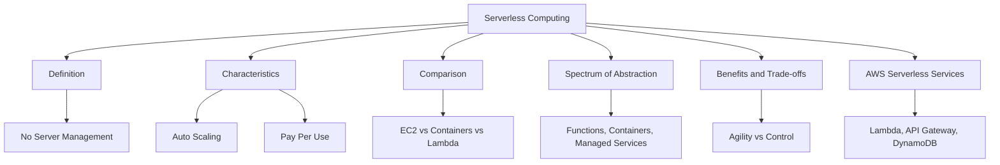
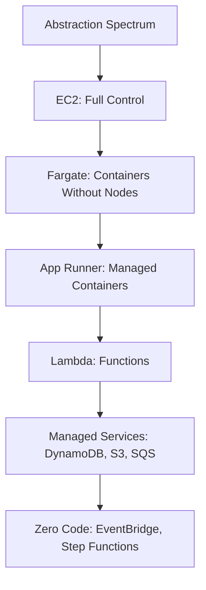
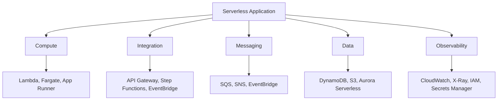
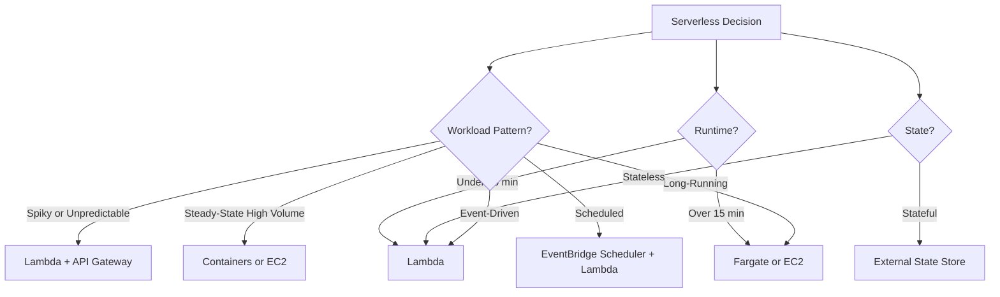

# Lesson 1: Introduction to Serverless Computing

Serverless computing is a cloud execution model in which the cloud provider dynamically manages the allocation and provisioning of servers. You write code or configure services, and the provider handles scaling, patching, and availability. You pay only for the resources consumed while your code runs. This lesson defines serverless, contrasts it with traditional compute models, and explains the spectrum of serverless abstraction on AWS.

## What Is Serverless Computing

*Definition*: Serverless computing is a cloud execution model in which the cloud provider dynamically manages the allocation and provisioning of servers. You write code or configure services, and the provider handles scaling, patching, and availability. You pay only for the resources consumed while your code runs.

- Serverless does not mean there are no servers. It means you do not provision, manage, or scale them.
- The provider handles capacity, patching, fault tolerance, and availability.
- You pay only for what you use. There is no cost at idle.
- Serverless scales automatically from zero to millions of requests per second.
- Serverless shifts operational responsibility to the provider, but security, data modelling, and cost optimisation remain the customer's responsibility.

> [!Important]
> **Serverless is about responsibility, not the absence of servers**: The defining characteristic is that the provider manages the infrastructure layer. Your responsibility shifts from operations to code, configuration, and data. This is why serverless is often described as "NoOps" or "LessOps" rather than "NoServers."

## Core Characteristics of Serverless

Serverless computing is defined by five characteristics that distinguish it from traditional compute models.

### No Server Management

- You never provision, patch, or scale servers.
- The provider handles all infrastructure operations.
- You focus on application logic, not operating systems.
- There are no SSH sessions, no patching windows, and no capacity planning.

### Automatic Scaling

- Serverless scales automatically in response to demand.
- It scales from zero to handle millions of requests per second.
- Scaling is transparent. You do not configure auto scaling groups or scaling policies.
- Scale-to-zero means no cost when there is no traffic.

### Pay-Per-Use Pricing

- You pay only for the resources consumed while your code runs.
- There is no cost for idle capacity.
- Billing is measured in milliseconds for compute and per request for invocations.
- This model is cost-effective for spiky, unpredictable, or low-volume workloads.

### Event-Driven Execution

- Serverless functions are invoked in response to events.
- Events include HTTP requests, file uploads, queue messages, database changes, and scheduled timers.
- Functions are stateless. State is stored in external services such as DynamoDB or S3.
- The event source determines the invocation model.

### Built-In Availability and Fault Tolerance

- The provider replicates and distributes execution across multiple Availability Zones.
- There is no single point of failure for the compute layer.
- Failed invocations are retried automatically in some models.
- Availability is part of the service, not something you architect for the compute layer.

| Characteristic | Description | Benefit |
|---|---|---|
| No Server Management | Provider manages infrastructure | Reduced operational overhead |
| Automatic Scaling | Scales from zero to millions | No capacity planning |
| Pay-Per-Use | Pay only for consumption | Cost efficiency for variable workloads |
| Event-Driven | Invoked by events | Natural fit for reactive architectures |
| Built-In Availability | Provider replicates across AZs | High availability without design effort |

> [!Tip]
> **Scale-to-zero is the defining cost advantage**: Unlike EC2 or containers, serverless can scale to zero when there is no traffic. You pay nothing for idle capacity. This makes serverless ideal for workloads with unpredictable or intermittent traffic patterns.

## Serverless vs Traditional Compute

The three main compute models on AWS are virtual machines, containers, and serverless functions. Each represents a different level of abstraction and a different distribution of responsibility between you and AWS.

| Dimension | EC2 (VMs) | Containers (ECS/EKS/Fargate) | Serverless (Lambda) |
|---|---|---|---|
| Abstraction Level | Infrastructure | Application and runtime | Function |
| Provisioning | You provision instances | You provision clusters or use Fargate | None |
| Scaling | Configure auto scaling groups | Configure scaling policies | Automatic |
| Patching | You patch the OS | You patch the container or use managed | Provider patches |
| Idle Cost | Full instance cost | Full container cost | Zero |
| Startup Time | Minutes | Seconds | Milliseconds to seconds |
| Max Runtime | Unlimited | Unlimited | 15 minutes |
| State | Stateful or stateless | Stateless | Stateless |
| Best For | Full control, legacy apps | Microservices, portability | Event-driven, spiky workloads |

- EC2 provides the most control and the most operational responsibility.
- Containers reduce operational overhead but still require cluster management or Fargate configuration.
- Serverless removes server management entirely but imposes runtime and state constraints.

> [!Important]
> **There is no single best compute model**: Use EC2 for full control and legacy workloads. Use containers for portability and microservices. Use serverless for event-driven, spiky, or short-duration tasks. The right choice depends on the workload, not on a universal preference.

## The Serverless Spectrum

Serverless is not a single service. It is a spectrum of abstraction levels. At one end, you manage the entire stack. At the other end, you configure managed services with no code at all.

| Service | Abstraction Level | Management Overhead | Use Case |
|---|---|---|---|
| Amazon EC2 | Infrastructure | Highest | Full control, legacy applications |
| AWS Fargate | Container | Medium | Long-running containers without EC2 management |
| AWS App Runner | Container | Low | Web applications and APIs from containers |
| AWS Lambda | Function | None | Event-driven, short-lived compute |
| Amazon API Gateway | API | None | HTTP and WebSocket APIs |
| AWS Step Functions | Workflow | None | Multi-step orchestration |
| Amazon EventBridge | Event bus | None | Event routing and integration |
| Amazon SQS | Queue | None | Asynchronous message queuing |
| Amazon SNS | Pub/sub | None | Fan-out notifications |
| Amazon DynamoDB | Database | None | Key-value and document storage |
| Amazon S3 | Storage | None | Object storage |
| Amazon Aurora Serverless | Database | None | Relational database with automatic scaling |

- As you move up the spectrum, you trade control for reduced operational overhead.
- The highest levels of abstraction require no code at all. You configure services that run on your behalf.
- Most serverless applications combine services from multiple levels of the spectrum.

> [!Tip]
> **The spectrum lets you choose the right level for each component**: Not every part of an application needs to be a Lambda function. Use S3 for storage, DynamoDB for state, SQS for queuing, and Step Functions for orchestration. Use Lambda only where you need custom code. The spectrum is about choosing the right tool for each job.

## Benefits of Serverless

Serverless delivers a distinct set of benefits that make it attractive for modern applications.

### Operational Benefits

- No server management reduces operational overhead.
- Automatic scaling removes capacity planning.
- Built-in availability reduces the need for infrastructure architecture.
- Faster time to market because teams focus on code, not infrastructure.

### Financial Benefits

- Pay-per-use pricing eliminates idle cost.
- Scale-to-zero means no cost when there is no traffic.
- No upfront commitment or reserved capacity required.
- Cost aligns directly with business value delivered.

### Technical Benefits

- Event-driven architecture decouples services naturally.
- Managed integrations reduce custom code for common patterns.
- Automatic scaling handles unpredictable traffic without configuration.
- Fine-grained granularity allows per-function cost attribution.

| Benefit Category | Benefit | Impact |
|---|---|---|
| Operational | No server management | Reduced operational overhead |
| Operational | Automatic scaling | No capacity planning |
| Financial | Pay-per-use | Cost aligns with usage |
| Financial | Scale-to-zero | No idle cost |
| Technical | Event-driven | Natural decoupling |
| Technical | Managed integrations | Less custom code |

> [!Important]
> **The financial benefit depends on the workload**: Serverless is most cost-effective for spiky, unpredictable, or low-volume workloads. For steady-state, high-volume workloads, containers or EC2 may be more cost-effective. Run the numbers before committing.

## Trade-offs and Limitations

Serverless is not without trade-offs. Understanding them is essential for choosing the right compute model.

### Technical Constraints

- Maximum runtime of 15 minutes for Lambda.
- Stateless execution. State must be stored externally.
- Cold start latency for functions that are not invoked frequently.
- Limited control over the runtime environment.
- Package size limits: 250 MB for ZIP, 10 GB for container images.

### Architectural Considerations

- Distributed systems are harder to debug and trace.
- Local testing and development require emulation or cloud-based development.
- Vendor lock-in risk is higher because serverless services are provider-specific.
- Cost can be higher than expected if functions are inefficient or over-provisioned.

### Operational Considerations

- Observability requires new tooling and practices.
- Security responsibility shifts to the application team.
- Concurrency limits can cause throttling if not managed.
- Monitoring distributed services requires correlation across invocations.

| Trade-off | Description | Mitigation |
|---|---|---|
| Runtime Limit | 15-minute maximum | Use Step Functions or Fargate for longer workloads |
| Statelessness | No persistent state in the function | Store state in DynamoDB or S3 |
| Cold Starts | Latency on first invocation | Use provisioned concurrency or keep functions warm |
| Limited Control | No OS-level access | Use containers when OS control is required |
| Vendor Lock-In | Provider-specific services | Abstract with ports and adapters where needed |
| Observability Complexity | Distributed tracing is harder | Use X-Ray and Lambda Powertools |

> [!Tip]
> **Cold starts are manageable, not unavoidable**: Provisioned concurrency eliminates cold starts for latency-sensitive functions. For other functions, keep deployment packages small, use Graviton, and initialise connections outside the handler. Cold starts are a trade-off, not a blocker.

## AWS Serverless Services

AWS offers a broad portfolio of serverless services that work together to build complete applications.

### Compute

- AWS Lambda runs code in response to events.
- AWS Fargate runs containers without managing EC2 instances.
- AWS App Runner runs web applications and APIs from containers.

### Integration and Orchestration

- Amazon API Gateway exposes Lambda functions as HTTP APIs.
- AWS Step Functions orchestrates multi-step workflows.
- Amazon EventBridge routes events between services.

### Messaging

- Amazon SQS provides durable message queuing.
- Amazon SNS provides pub/sub fan-out.
- Amazon EventBridge provides event routing and integration.

### Data

- Amazon DynamoDB provides key-value and document storage.
- Amazon S3 provides object storage.
- Amazon Aurora Serverless provides a relational database with automatic scaling.

### Observability and Security

- Amazon CloudWatch provides logging and metrics.
- AWS X-Ray provides distributed tracing.
- AWS IAM provides access control.
- AWS Secrets Manager provides secrets management.

- These services are designed to work together with minimal configuration.
- IAM provides a unified access control model across all services.
- CloudWatch and X-Ray provide observability across the entire application.
- The combination of these services forms a complete serverless platform.

## Serverless Use Cases

Serverless is well-suited to specific workload patterns. Recognizing those patterns is key to choosing serverless effectively.

### Ideal Use Cases

| Use Case | Description | Example Services |
|---|---|---|
| Event-Driven Processing | Respond to events from other services | Lambda, S3, DynamoDB Streams |
| HTTP APIs | Expose APIs without managing servers | API Gateway, Lambda |
| Scheduled Tasks | Run jobs on a schedule | EventBridge Scheduler, Lambda |
| Data Transformation | Transform data as it moves between services | Lambda, S3, Glue |
| Real-Time Stream Processing | Process streams in real time | Kinesis, Lambda |
| Chatbots and Virtual Assistants | Respond to user input with minimal latency | Lambda, API Gateway, DynamoDB |
| IoT Backends | Handle device telemetry at scale | IoT Core, Lambda, DynamoDB |
| Webhook Handlers | Receive and process webhooks | API Gateway, Lambda |

### Less Ideal Use Cases

- Long-running processes that exceed 15 minutes.
- Workloads that require persistent, stateful connections.
- Applications that need OS-level control.
- High-throughput, steady-state workloads where containers or EC2 are cheaper.
- Workloads with strict, predictable latency requirements.

> [!Important]
> **Match the workload to serverless, not the other way around**: Serverless excels at event-driven, spiky, short-duration workloads. If the workload is long-running, stateful, or steady-state, containers or EC2 may be a better fit. Choose serverless because it fits the workload, not because it is fashionable.

## Assessment Preparation

### Practice Questions

1. Define serverless computing and explain how it differs from traditional compute.
2. List the five core characteristics of serverless computing.
3. Compare EC2, containers, and serverless across scaling, patching, idle cost, and runtime limits.
4. Describe the serverless spectrum of abstraction.
5. List the benefits of serverless across operational, financial, and technical categories.
6. Describe the trade-offs and limitations of serverless.
7. List the AWS serverless services for compute, integration, messaging, data, and observability.
8. Describe ideal use cases for serverless.
9. Describe use cases where serverless is not the best fit.
10. Explain why scale-to-zero is the defining cost advantage of serverless.
11. Explain why serverless is a spectrum rather than a single service.
12. Describe how serverless shifts security responsibility to the application team.

### Scenario Questions

**Scenario 1: Event-Driven Image Processing**
A company needs to process images uploaded to S3 and generate thumbnails. What should they use?

- Use AWS Lambda triggered by S3 upload events.
- Lambda automatically scales to handle spikes in upload volume.
- Pay only for the compute time used, with no cost for idle time.
- Use container images if image processing libraries exceed 250 MB.
- Use SQS or EventBridge for asynchronous processing and error handling.

**Scenario 2: Long-Running Batch Job**
A company needs to run a batch job that takes 3 hours to complete. What should they use?

- Lambda is not suitable because of the 15-minute timeout.
- Use AWS Fargate or EC2 for long-running batch jobs.
- Use Step Functions to orchestrate multi-step batch workflows.
- Use Spot Instances for cost savings on fault-tolerant batch jobs.

**Scenario 3: Spiky Web Application**
A startup has a web application with highly unpredictable traffic that spikes during promotions. What should they use?

- Use API Gateway and Lambda for the API layer.
- Use DynamoDB for data storage.
- Use S3 for static assets and CloudFront for delivery.
- Serverless scales automatically and costs nothing at idle.
- This is an ideal use case for serverless because traffic is unpredictable.

**Scenario 4: Steady-State High-Volume API**
A company runs an API with steady, high-volume traffic 24/7. They want to minimise cost. What should they use?

- Evaluate containers or EC2 instead of Lambda.
- For steady-state workloads, containers or EC2 may be more cost-effective.
- Use Reserved Instances or Savings Plans for predictable compute.
- Use Lambda only for the parts of the API that are event-driven or unpredictable.

**Scenario 5: Scheduled Report Generation**
A company needs to generate a report every night at 2 AM. What should they use?

- Use Amazon EventBridge Scheduler to trigger the workflow.
- Use AWS Lambda for the report generation logic.
- Use Step Functions if the workflow has multiple steps.
- Use S3 to store the generated reports.

## Key Takeaways

- Serverless computing is a cloud execution model in which the provider manages servers. You write code or configure services and pay only for what you use.
- The five core characteristics of serverless are no server management, automatic scaling, pay-per-use pricing, event-driven execution, and built-in availability.
- EC2 provides the most control. Containers reduce operational overhead. Serverless removes server management entirely.
- Serverless is a spectrum of abstraction, from EC2 at the bottom to fully managed services at the top.
- Benefits include reduced operational overhead, no capacity planning, no idle cost, faster time to market, and natural decoupling.
- Trade-offs include runtime limits, statelessness, cold starts, limited control, vendor lock-in, and observability complexity.
- AWS offers serverless services across compute, integration, messaging, data, and observability.
- Ideal use cases include event-driven processing, HTTP APIs, scheduled tasks, data transformation, stream processing, chatbots, IoT backends, and webhook handlers.
- Less ideal use cases include long-running processes, stateful workloads, OS-level control, steady-state high-volume workloads, and strict latency requirements.
- Scale-to-zero is the defining cost advantage of serverless.
- Serverless shifts security responsibility to the application team.
- Match the workload to serverless, not the other way around.

> [!Important]
> **Serverless is a design philosophy, not just a compute service**: The real value of serverless is not that you avoid servers. It is that you build applications from managed services that scale automatically, cost nothing at idle, and let you focus on business logic. Use Lambda for compute, API Gateway for APIs, Step Functions for orchestration, SQS and SNS and EventBridge for messaging, and DynamoDB for data. Design for failure, implement idempotency, and validate input at every layer. Serverless is most cost-effective for spiky, unpredictable, or low-volume workloads. For steady-state, high-volume workloads, evaluate containers or EC2. Choose the right tool for the workload, and serverless will deliver agility, scalability, and cost efficiency.
