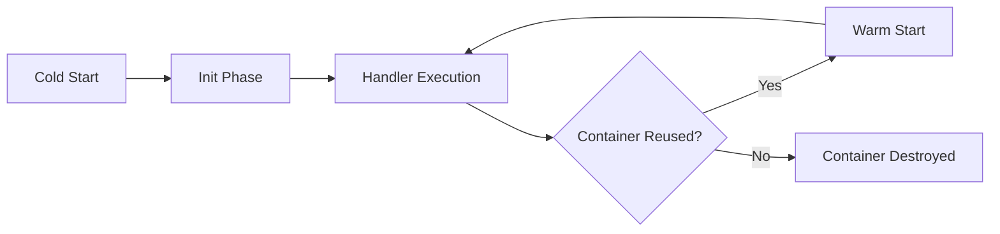
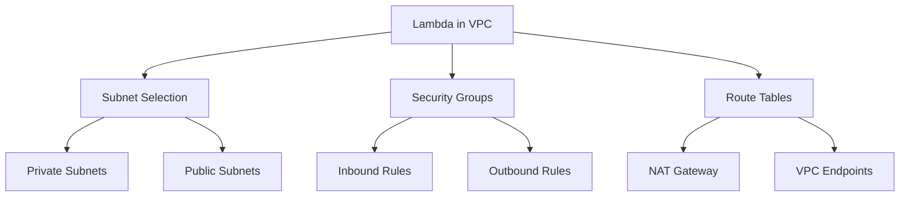
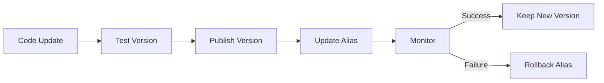

# Lesson 2: Lambda Configuration

Lambda configuration defines how a function executes, scales, and interacts with other AWS services. Proper configuration balances performance, cost, and security. This lesson covers memory and timeout settings, execution environment details, concurrency controls, networking options, permissions, triggers, layers, and deployment strategies. Understanding these settings is essential for building reliable and cost-effective serverless applications.

```mermaid
flowchart TD
    A[Lambda Configuration] --> B[Core Settings]
    A --> C[Execution Environment]
    A --> D[Concurrency and Scaling]
    A --> E[Networking]
    A --> F[Permissions]
    A --> G[Triggers]
    A --> H[Layers]
    A --> I[Monitoring]
    A --> J[Deployment]
    B --> B1[Memory and CPU]
    B --> B2[Timeout]
    B --> B3[Runtime]
    C --> C1[Container Lifecycle]
    C --> C2[/tmp Storage]
    D --> D1[Reserved Concurrency]
    D --> D2[Provisioned Concurrency]
    E --> E1[VPC Attachment]
    F --> F1[Execution Role]
    G --> G1[Synchronous vs Asynchronous]
    H --> H1[Code Sharing]
    J --> J1[Versions and Aliases]
```

## Core Configuration Settings

The basic settings determine the resources available to your function and how long it can run. These are the first decisions you make when creating or updating a function.

### Memory and CPU Allocation

- Memory ranges from 128 MB to 10 GB in 1 MB increments.
- CPU power scales proportionally with memory allocation.
- Network bandwidth also increases with higher memory.
- Higher memory reduces execution time for CPU-intensive tasks but increases cost per millisecond.
- Find the optimal memory setting by testing performance at different levels.

> [!Tip]
> **Right-size memory for cost and performance**: Doubling memory doubles CPU and cost per millisecond, but may halve execution time. Use AWS Lambda Power Tuning tool to find the optimal balance for your workload. Do not default to maximum memory unless needed.

### Timeout Configuration

- Maximum execution time ranges from 1 second to 15 minutes.
- Default timeout is 3 seconds.
- Function terminates immediately if it exceeds the timeout limit.
- Set timeout slightly longer than expected execution time to handle variability.
- Long-running tasks exceeding 15 minutes require alternative approaches like Step Functions or ECS.

| Setting | Range | Default | Notes |
|---|---|---|---|
| Memory | 128 MB - 10 GB | 128 MB | Scales CPU and network |
| Timeout | 1 sec - 15 min | 3 sec | Hard limit, no extension |
| Runtime | Multiple languages | N/A | Choose based on code |
| Handler | Language-specific | N/A | Entry point definition |

### Runtime Selection

- Supported runtimes include Python, Node.js, Java, Go, Ruby, .NET Core, and custom runtimes.
- Each runtime has specific version support and end-of-life dates.
- Custom runtimes allow unsupported languages via the Runtime API.
- Keep runtimes updated to receive security patches and performance improvements.

### Handler Definition

- The handler is the entry point for function code.
- Format varies by language: index.handler for Node.js, app.lambda_handler for Python.
- Must match the actual function name in your code.
- Incorrect handler configuration causes immediate invocation failures.

## Execution Environment

Understanding the Lambda execution environment helps optimize cold starts, manage state, and structure code efficiently.

### Container Lifecycle

- AWS creates a new execution environment (container) for each concurrent invocation.
- Containers may be reused for subsequent invocations to reduce cold start latency.
- Reuse is not guaranteed. Always assume functions are stateless.
- Initialization code outside the handler runs once per container creation.
- Use global scope for one-time setup like database connections or loading large files.



- Cold start includes downloading code, creating container, and running initialization code.
- Warm start skips initialization and goes directly to handler execution.
- Provisioned concurrency eliminates cold starts by keeping containers initialized.

### Temporary Storage

- /tmp directory provides up to 10 GB of ephemeral storage.
- Data persists only within the same container lifecycle.
- Useful for caching files, unpacking archives, or temporary processing space.
- Do not rely on /tmp for persistent state across invocations.
- Monitor /tmp usage to avoid disk space errors.

> [!Important]
> **/tmp is ephemeral, not persistent**: Data in /tmp exists only while the container is alive. If the container is destroyed, data is lost. Use S3, DynamoDB, or EFS for persistent storage. Use /tmp only for temporary files that can be recreated.

### Initialization Best Practices

- Move heavy initialization outside the handler function.
- Initialize database connections, HTTP clients, and SDK clients in global scope.
- Load configuration files or large datasets during initialization.
- This reduces latency for warm invocations by reusing initialized resources.
- Handle initialization errors gracefully to prevent function failures.

## Concurrency and Scaling

Concurrency controls how many instances of your function can run simultaneously. Proper configuration prevents throttling and manages costs.

### Reserved Concurrency

- Guarantees a specific number of concurrent executions for a function.
- Prevents the function from being throttled by account-level limits.
- Isolates critical functions from noisy neighbors in the same account.
- Reduces the available concurrency for other functions in the account.
- Set reserved concurrency to zero to disable a function without deleting it.

### Provisioned Concurrency

- Keeps a specified number of execution environments initialized and ready.
- Eliminates cold start latency for predictable workloads.
- Incurs additional cost even when not invoked.
- Ideal for latency-sensitive applications with steady traffic.
- Can be configured on aliases for gradual rollouts.

| Concurrency Type | Purpose | Cost Impact | Use Case |
|---|---|---|---|
| Unreserved | Default scaling | Pay per invocation | General workloads |
| Reserved | Guarantee capacity | No extra cost, reduces pool | Critical functions |
| Provisioned | Eliminate cold starts | Extra hourly cost | Latency-sensitive APIs |

### Account-Level Limits

- Default account concurrency limit is 1000 concurrent executions per region.
- All functions in the region share this limit unless reserved concurrency is set.
- Request limit increases via AWS Support if needed.
- Monitor concurrency usage in CloudWatch to avoid unexpected throttling.
- Throttled invocations return 429 errors and may be retried depending on trigger type.

> [!Tip]
> **Use reserved concurrency to protect critical functions**: If one function experiences a spike, it can consume all available concurrency and throttle other functions. Set reserved concurrency for critical functions to guarantee they always have capacity. Leave unreserved capacity for non-critical functions.

## Networking

Lambda functions can run in your VPC to access private resources, or use default AWS networking for internet access.

### Default Networking

- Functions run in a VPC managed by AWS.
- Have internet access through AWS infrastructure.
- Cannot access resources in your private VPC.
- Lower cold start latency compared to VPC attachment.
- Suitable for functions that only need public internet access.

### VPC Attachment

- Connect functions to your own VPC to access private resources.
- Required for accessing RDS, ElastiCache, or internal APIs.
- Creates Elastic Network Interfaces (ENIs) in your subnets.
- Adds cold start latency due to ENI provisioning.
- Requires proper security group and subnet configuration.

### VPC Configuration

- Select subnets where ENIs will be created.
- Assign security groups to control inbound and outbound traffic.
- Ensure subnets have route tables for required destinations.
- Use NAT Gateway for internet access from private subnets.
- Consider using VPC endpoints for AWS services to avoid NAT costs.



> [!Important]
> **VPC attachment adds cold start latency**: ENI provisioning can add several seconds to cold starts. Use provisioned concurrency to mitigate this. For functions that do not need VPC resources, keep them in default networking for faster startup.

## Permissions and IAM

Lambda uses IAM roles to access other AWS services. Proper permission configuration follows the principle of least privilege.

### Execution Role

- IAM role that Lambda assumes during execution.
- Grants permissions to access CloudWatch Logs, S3, DynamoDB, and other services.
- Attach managed policies or create custom policies.
- Avoid wildcard permissions. Specify exact resources and actions.
- Rotate credentials automatically handled by AWS.

### Resource-Based Policies

- Attach policies directly to the Lambda function.
- Allow other AWS accounts or services to invoke the function.
- Used by API Gateway, S3, and EventBridge to grant invoke permissions.
- Complements execution role permissions.
- Essential for cross-account access scenarios.

### Least Privilege Principle

- Grant only the permissions the function needs.
- Use specific ARNs instead of wildcards.
- Separate roles for different functions with different requirements.
- Regularly review and remove unused permissions.
- Use IAM Access Analyzer to identify overly permissive policies.

| Permission Type | Scope | Purpose | Example |
|---|---|---|---|
| Execution Role | Outbound | Access AWS services | Read from S3, Write to DynamoDB |
| Resource Policy | Inbound | Allow invocations | API Gateway invoke permission |
| Cross-Account | Both | Multi-account access | Another account invokes function |

## Triggers and Event Sources

Triggers determine how and when Lambda functions are invoked. Understanding trigger types helps design appropriate error handling and retry logic.

### Synchronous Triggers

- Caller waits for the function response.
- Examples: API Gateway, Application Load Balancer, CloudFront.
- Errors are returned directly to the caller.
- No automatic retries by Lambda.
- Suitable for request-response patterns.

### Asynchronous Triggers

- Lambda manages invocation and retry logic.
- Examples: S3, SNS, EventBridge.
- Failed invocations are retried twice by default.
- Configure dead-letter queues for failed events after retries.
- Suitable for event-driven architectures.

### Poll-Based Triggers

- Lambda polls the event source for records.
- Examples: SQS, DynamoDB Streams, Kinesis.
- Batch records for efficient processing.
- Configure batch size and retry behavior.
- Partial batch failure handling available.

| Trigger Type | Examples | Retry Behavior | Error Handling |
|---|---|---|---|
| Synchronous | API Gateway, ALB | No automatic retry | Return error to caller |
| Asynchronous | S3, SNS, EventBridge | 2 retries | DLQ after retries |
| Poll-Based | SQS, Kinesis, DynamoDB | Configurable | Batch item failures |

> [!Tip]
> **Match error handling to trigger type**: Synchronous triggers require immediate error responses. Asynchronous triggers benefit from dead-letter queues. Poll-based triggers support partial batch failures. Design your function error handling based on the trigger type.

## Layers

Layers allow you to share code and dependencies across multiple functions without packaging them in each deployment.

### Layer Benefits

- Share libraries, custom runtimes, or configuration files.
- Reduce deployment package size.
- Update dependencies independently from function code.
- Promote code reuse across teams.
- Up to 5 layers per function.

### Layer Structure

- Layers are extracted to /opt directory.
- Organize content by language-specific paths.
- Version layers independently from functions.
- Reference layers by ARN in function configuration.
- Public layers available from AWS and community.

### Layer Management

- Publish layer versions with compatible runtimes.
- Track which functions use which layer versions.
- Delete unused layer versions to reduce clutter.
- Consider layer size impact on cold start time.
- Use layers for large dependencies that change infrequently.

## Logging and Monitoring

Built-in monitoring provides visibility into function performance and errors.

### CloudWatch Logs

- Automatic logging to log groups named after the function.
- Each function version has its own log stream.
- Log retention configurable from 1 day to never expire.
- Use structured logging for easier parsing and analysis.
- Filter and search logs using CloudWatch Insights.

### X-Ray Tracing

- Enable to track requests through distributed systems.
- Identifies bottlenecks and errors across services.
- Provides service map visualization.
- Minimal performance overhead when enabled.
- Essential for debugging complex serverless architectures.

### CloudWatch Metrics

- Invocation count, duration, errors, and throttles.
- Duration includes initialization time for cold starts.
- Set alarms for unusual patterns or thresholds.
- Use embedded metrics for custom business metrics.
- Dashboard widgets for real-time monitoring.

> [!Important]
> **Enable X-Ray for production workloads**: Distributed tracing is essential for debugging serverless applications. X-Ray shows the full request path across Lambda, API Gateway, DynamoDB, and other services. The cost is minimal compared to the debugging time saved.

## Dead-Letter Queues

Dead-letter queues capture events that fail after all retry attempts, preventing data loss.

### DLQ Configuration

- Configure SQS queue or SNS topic as destination.
- Applies to asynchronous invocations only.
- Events sent to DLQ after 2 retry attempts fail.
- Monitor DLQ for failed events and investigate root causes.
- Process DLQ messages separately to recover or log failures.

### DLQ Best Practices

- Always configure DLQ for asynchronous functions.
- Set up alarms on DLQ queue depth.
- Include sufficient context in failed events for debugging.
- Process DLQ messages regularly to prevent accumulation.
- Use DLQ analytics to identify recurring failure patterns.

## Versioning and Aliases

Versioning and aliases enable safe deployment strategies and rollback capabilities.

### Versions

- Immutable snapshots of function code and configuration.
- Each version has a unique ARN.
- Publish versions after testing and validation.
- Cannot modify published versions.
- Use versions for audit trails and rollback.

### Aliases

- Mutable pointers to specific versions.
- Common aliases: DEV, STAGING, PROD.
- Update alias to point to new version for deployment.
- Configure provisioned concurrency on aliases.
- Enable traffic shifting for canary deployments.

### Deployment Strategies

- Blue-green: switch alias from old to new version instantly.
- Canary: route percentage of traffic to new version gradually.
- Linear: increase traffic to new version in steps.
- Rollback: point alias back to previous version if issues arise.
- Use CodeDeploy for automated deployment pipelines.



> [!Tip]
> **Use aliases for all deployments**: Never invoke functions by version number in production. Use aliases so you can update the underlying version without changing client code. This enables zero-downtime deployments and instant rollbacks.

## Assessment Preparation

### Practice Questions

1. Explain how memory allocation affects CPU and network bandwidth in Lambda.
2. What is the maximum timeout for Lambda functions and what alternatives exist for longer tasks?
3. Describe the difference between cold starts and warm starts.
4. How does reserved concurrency differ from provisioned concurrency?
5. When should you attach a Lambda function to a VPC?
6. Explain the principle of least privilege for Lambda execution roles.
7. Compare synchronous, asynchronous, and poll-based triggers.
8. What are the benefits of using Lambda layers?
9. How do dead-letter queues work and when should they be used?
10. Describe the difference between versions and aliases.
11. What monitoring tools are available for Lambda functions?
12. How can you eliminate cold start latency for latency-sensitive functions?

### Scenario Questions

**Scenario 1: High-Traffic API with Latency Requirements**
An e-commerce API requires sub-100ms response times and handles 1000 requests per second steadily. How should you configure Lambda?

- Use provisioned concurrency to eliminate cold starts.
- Right-size memory based on performance testing.
- Set appropriate timeout slightly above expected duration.
- Use API Gateway with Lambda integration.
- Monitor with X-Ray to identify any bottlenecks.
- Consider reserved concurrency to guarantee capacity.

**Scenario 2: Image Processing with Large Dependencies**
A function processes images and requires 500 MB of image processing libraries. How should you deploy this?

- Use Lambda layers to package the libraries separately.
- Increase memory to 10 GB for more CPU and /tmp space.
- Use container image deployment if ZIP package exceeds limits.
- Store processed images in S3.
- Use S3 event notification as trigger.
- Configure DLQ for failed processing events.

**Scenario 3: Database Access from Lambda**
A function needs to query an RDS database in a private subnet. How should you configure networking?

- Attach Lambda to the VPC containing the RDS instance.
- Select private subnets where RDS is located.
- Configure security groups to allow Lambda to RDS traffic.
- Accept increased cold start latency from ENI provisioning.
- Use provisioned concurrency if latency is critical.
- Cache database connections in global scope for reuse.

**Scenario 4: Cost Optimization for Sporadic Workload**
A function runs 100 times per day with unpredictable timing. How should you optimize cost?

- Use minimum memory that meets performance requirements.
- Do not use provisioned concurrency to avoid idle costs.
- Set appropriate timeout to avoid paying for idle time.
- Use reserved concurrency of zero or low value.
- Monitor actual usage and adjust memory accordingly.
- Consider Step Functions if workflow is complex.

**Scenario 5: Multi-Environment Deployment**
A team needs to deploy the same function to DEV, STAGING, and PROD environments. How should they manage this?

- Use aliases for each environment: DEV, STAGING, PROD.
- Publish versions after testing in each environment.
- Use environment variables for configuration differences.
- Implement CI/CD pipeline with CodeDeploy.
- Use canary deployments for PROD updates.
- Maintain separate IAM roles per environment if needed.

## Key Takeaways

- Memory allocation scales CPU and network bandwidth proportionally. Right-size memory for cost and performance balance.
- Timeout is a hard limit from 1 second to 15 minutes. Use Step Functions or ECS for longer tasks.
- Cold starts occur on first invocation or after idle periods. Warm starts reuse containers for faster execution.
- Reserved concurrency guarantees capacity. Provisioned concurrency eliminates cold starts at additional cost.
- VPC attachment enables access to private resources but adds cold start latency. Use only when necessary.
- Execution roles follow least privilege principle. Grant only required permissions with specific resource ARNs.
- Synchronous triggers return errors to callers. Asynchronous triggers retry and use DLQs. Poll-based triggers batch records.
- Layers share code and dependencies across functions. Reduce package size and promote reuse.
- Enable X-Ray tracing for production workloads to debug distributed systems.
- Dead-letter queues capture failed asynchronous invocations after retries. Monitor and process DLQ messages.
- Versions are immutable snapshots. Aliases are mutable pointers enabling safe deployments and rollbacks.
- Use aliases for all production invocations to enable zero-downtime deployments.
- Match configuration to workload characteristics: latency sensitivity, traffic patterns, and resource requirements.
- Monitor concurrency, errors, and duration metrics to identify optimization opportunities.
- Test functions at different memory levels to find optimal cost-performance balance.

> [!Important]
> **Configuration is iterative, not one-time**: Lambda configuration requires continuous optimization. Monitor performance metrics, analyze costs, and adjust settings based on actual usage patterns. Use tools like Lambda Power Tuning to automate memory optimization. Review permissions regularly to maintain security. Update runtimes to receive security patches. Configuration best practices evolve as your application grows and changes.
