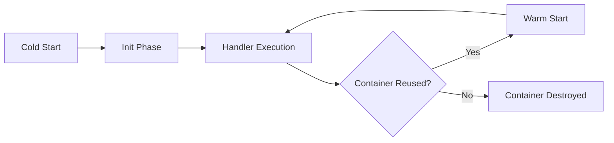
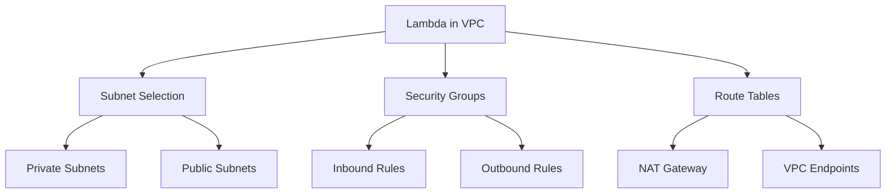

# Migration in progress
# Lesson 2: Lambda Configuration

Lambda configuration defines how a function executes, scales, and interacts with other AWS services. Proper configuration balances performance, cost, and security. This lesson covers memory and timeout settings, execution environment details, concurrency controls, networking options, permissions, triggers, layers, and deployment strategies. Understanding these settings is essential for building reliable and cost-effective serverless applications.

```mermaid
flowchart TD
    A[Lambda Configuration] --> B[Core Settings]
    A --> C[Execution Environment]
    A --> D[Concurrency and Scaling]
    A --> E[Networking]
    A --> F[Permissions]
    A --> G[Triggers]
    A --> H[Layers]
    A --> I[Monitoring]
    A --> J[Deployment]
    B --> B1[Memory and CPU]
    B --> B2[Timeout]
    B --> B3[Runtime]
    C --> C1[Container Lifecycle]
    C --> C2[/tmp Storage]
    D --> D1[Reserved Concurrency]
    D --> D2[Provisioned Concurrency]
    E --> E1[VPC Attachment]
    F --> F1[Execution Role]
    G --> G1[Synchronous vs Asynchronous]
    H --> H1[Code Sharing]
    J --> J1[Versions and Aliases]
```

## Core Configuration Settings

The basic settings determine the resources available to your function and how long it can run. These are the first decisions you make when creating or updating a function.

### Memory and CPU Allocation

- Memory ranges from 128 MB to 10 GB in 1 MB increments.
- CPU power scales proportionally with memory allocation.
- Network bandwidth also increases with higher memory.
- Higher memory reduces execution time for CPU-intensive tasks but increases cost per millisecond.
- Find the optimal memory setting by testing performance at different levels.

> [!Tip]
> **Right-size memory for cost and performance**: Doubling memory doubles CPU and cost per millisecond, but may halve execution time. Use AWS Lambda Power Tuning tool to find the optimal balance for your workload. Do not default to maximum memory unless needed.

### Timeout Configuration

- Maximum execution time ranges from 1 second to 15 minutes.
- Default timeout is 3 seconds.
- Function terminates immediately if it exceeds the timeout limit.
- Set timeout slightly longer than expected execution time to handle variability.
- Long-running tasks exceeding 15 minutes require alternative approaches like Step Functions or ECS.

| Setting | Range | Default | Notes |
|---|---|---|---|
| Memory | 128 MB - 10 GB | 128 MB | Scales CPU and network |
| Timeout | 1 sec - 15 min | 3 sec | Hard limit, no extension |
| Runtime | Multiple languages | N/A | Choose based on code |
| Handler | Language-specific | N/A | Entry point definition |

### Runtime Selection

- Supported runtimes include Python, Node.js, Java, Go, Ruby, .NET Core, and custom runtimes.
- Each runtime has specific version support and end-of-life dates.
- Custom runtimes allow unsupported languages via the Runtime API.
- Keep runtimes updated to receive security patches and performance improvements.

### Handler Definition

- The handler is the entry point for function code.
- Format varies by language: index.handler for Node.js, app.lambda_handler for Python.
- Must match the actual function name in your code.
- Incorrect handler configuration causes immediate invocation failures.

## Execution Environment

Understanding the Lambda execution environment helps optimize cold starts, manage state, and structure code efficiently.

### Container Lifecycle

- AWS creates a new execution environment (container) for each concurrent invocation.
- Containers may be reused for subsequent invocations to reduce cold start latency.
- Reuse is not guaranteed. Always assume functions are stateless.
- Initialization code outside the handler runs once per container creation.
- Use global scope for one-time setup like database connections or loading large files.



- Cold start includes downloading code, creating container, and running initialization code.
- Warm start skips initialization and goes directly to handler execution.
- Provisioned concurrency eliminates cold starts by keeping containers initialized.

### Temporary Storage

- /tmp directory provides up to 10 GB of ephemeral storage.
- Data persists only within the same container lifecycle.
- Useful for caching files, unpacking archives, or temporary processing space.
- Do not rely on /tmp for persistent state across invocations.
- Monitor /tmp usage to avoid disk space errors.

> [!Important]
> **/tmp is ephemeral, not persistent**: Data in /tmp exists only while the container is alive. If the container is destroyed, data is lost. Use S3, DynamoDB, or EFS for persistent storage. Use /tmp only for temporary files that can be recreated.

### Initialization Best Practices

- Move heavy initialization outside the handler function.
- Initialize database connections, HTTP clients, and SDK clients in global scope.
- Load configuration files or large datasets during initialization.
- This reduces latency for warm invocations by reusing initialized resources.
- Handle initialization errors gracefully to prevent function failures.

## Concurrency and Scaling

Concurrency controls how many instances of your function can run simultaneously. Proper configuration prevents throttling and manages costs.

### Reserved Concurrency

- Guarantees a specific number of concurrent executions for a function.
- Prevents the function from being throttled by account-level limits.
- Isolates critical functions from noisy neighbors in the same account.
- Reduces the available concurrency for other functions in the account.
- Set reserved concurrency to zero to disable a function without deleting it.

### Provisioned Concurrency

- Keeps a specified number of execution environments initialized and ready.
- Eliminates cold start latency for predictable workloads.
- Incurs additional cost even when not invoked.
- Ideal for latency-sensitive applications with steady traffic.
- Can be configured on aliases for gradual rollouts.

| Concurrency Type | Purpose | Cost Impact | Use Case |
|---|---|---|---|
| Unreserved | Default scaling | Pay per invocation | General workloads |
| Reserved | Guarantee capacity | No extra cost, reduces pool | Critical functions |
| Provisioned | Eliminate cold starts | Extra hourly cost | Latency-sensitive APIs |

### Account-Level Limits

- Default account concurrency limit is 1000 concurrent executions per region.
- All functions in the region share this limit unless reserved concurrency is set.
- Request limit increases via AWS Support if needed.
- Monitor concurrency usage in CloudWatch to avoid unexpected throttling.
- Throttled invocations return 429 errors and may be retried depending on trigger type.

> [!Tip]
> **Use reserved concurrency to protect critical functions**: If one function experiences a spike, it can consume all available concurrency and throttle other functions. Set reserved concurrency for critical functions to guarantee they always have capacity. Leave unreserved capacity for non-critical functions.

## Networking

Lambda functions can run in your VPC to access private resources, or use default AWS networking for internet access.

### Default Networking

- Functions run in a VPC managed by AWS.
- Have internet access through AWS infrastructure.
- Cannot access resources in your private VPC.
- Lower cold start latency compared to VPC attachment.
- Suitable for functions that only need public internet access.

### VPC Attachment

- Connect functions to your own VPC to access private resources.
- Required for accessing RDS, ElastiCache, or internal APIs.
- Creates Elastic Network Interfaces (ENIs) in your subnets.
- Adds cold start latency due to ENI provisioning.
- Requires proper security group and subnet configuration.

### VPC Configuration

- Select subnets where ENIs will be created.
- Assign security groups to control inbound and outbound traffic.
- Ensure subnets have route tables for required destinations.
- Use NAT Gateway for internet access from private subnets.
- Consider using VPC endpoints for AWS services to avoid NAT costs.



> [!Important]
> **VPC attachment adds cold start latency**: ENI provisioning can add several seconds to cold starts. Use provisioned concurrency to mitigate this. For functions that do not need VPC resources, keep them in default networking for faster startup.

## Permissions and IAM

Lambda uses IAM roles to access other AWS services. Proper permission configuration follows the principle of least privilege.

### Execution Role

- IAM role that Lambda assumes during execution.
- Grants permissions to access CloudWatch Logs, S3, DynamoDB, and other services.
- Attach managed policies or create custom policies.
- Avoid wildcard permissions. Specify exact resources and actions.
- Rotate credentials automatically handled by AWS.

### Resource-Based Policies

- Attach policies directly to the Lambda function.
- Allow other AWS accounts or services to invoke the function.
- Used by API Gateway, S3, and EventBridge to grant invoke permissions.
- Complements execution role permissions.
- Essential for cross-account access scenarios.

### Least Privilege Principle

- Grant only the permissions the function needs.
- Use specific ARNs instead of wildcards.
- Separate roles for different functions with different requirements.
- Regularly review and remove unused permissions.
- Use IAM Access Analyzer to identify overly permissive policies.

| Permission Type | Scope | Purpose | Example |
|---|---|---|---|
| Execution Role | Outbound | Access AWS services | Read from S3, Write to DynamoDB |
| Resource Policy | Inbound | Allow invocations | API Gateway invoke permission |
| Cross-Account | Both | Multi-account access | Another account invokes function |

## Triggers and Event Sources

Triggers determine how and when Lambda functions are invoked. Understanding trigger types helps design appropriate error handling and retry logic.

### Synchronous Triggers

- Caller waits for the function response.
- Examples: API Gateway, Application Load Balancer, CloudFront.
- Errors are returned directly to the caller.
- No automatic retries by Lambda.
- Suita