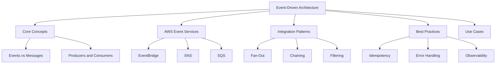
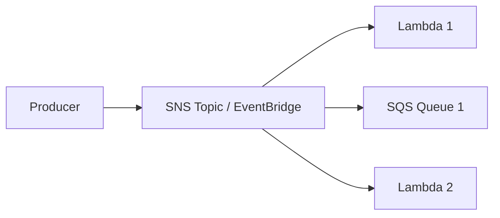

# Lesson 3: Event-Driven Architecture with AWS

Event-driven architecture (EDA) is a design pattern where components communicate through the production and consumption of events. An event is a significant change in state or occurrence. In AWS, EDA decouples services, enabling scalability, resilience, and agility. This lesson explores core EDA concepts, key AWS services for event routing and messaging, integration patterns, and best practices for building robust serverless systems.

## Core Concepts of Event-Driven Architecture

Understanding the fundamental building blocks of EDA is crucial before implementing it on AWS.

### Events vs Messages

- **Event**: A notification that something has happened. It is factual and past-tense. Example: "OrderPlaced". Events are often broadcast to multiple consumers.
- **Message**: A command or request to do something. It is imperative. Example: "ProcessOrder". Messages are typically point-to-point.
- In AWS, EventBridge handles events, while SQS/SNS handle messages, though the lines can blur in practice.

### Producers and Consumers

- **Producer (Publisher)**: The service that generates the event. It does not know who consumes the event. Examples: S3, DynamoDB, custom applications.
- **Consumer (Subscriber)**: The service that reacts to the event. It may be one or many services. Examples: Lambda, SQS, SNS topics.
- **Decoupling**: Producers and consumers are loosely coupled. Changes to one do not require changes to the other, as long as the event schema remains stable.

### Event Schema

- Defines the structure of the event data.
- Includes metadata like source, time, and detail-type.
- Consistency in schema is vital for reliable consumption.
- AWS EventBridge Schema Registry helps manage and version schemas.

> [!Important]
> **Events are immutable facts**: Once an event is emitted, it cannot be changed. Consumers interpret the event based on its schema. This immutability supports auditability and replayability.

## AWS Event Services

AWS provides three primary services for building event-driven architectures, each with distinct characteristics.

### Amazon EventBridge

- Serverless event bus service.
- Connects application data from your apps, SaaS, and AWS services.
- Default event bus receives events from AWS services.
- Custom event buses for your own applications.
- Partner event buses for third-party SaaS applications.
- Supports rule-based filtering and routing.
- Ideal for cross-service integration and SaaS integrations.

### Amazon SNS (Simple Notification Service)

- Pub/sub messaging service.
- Pushes messages to subscribers immediately.
- Subscribers can be Lambda, SQS, HTTP/S, email, SMS.
- Fan-out pattern: one message to many subscribers.
- No built-in message retention or buffering.
- Best for real-time notifications and broadcasting.

### Amazon SQS (Simple Queue Service)

- Message queuing service.
- Stores messages until consumed.
- Two types: Standard (best-effort ordering, high throughput) and FIFO (strict ordering, exactly-once processing).
- Decouples producers and consumers temporally.
- Buffers spikes in traffic.
- Best for asynchronous task processing and workload leveling.

| Feature | EventBridge | SNS | SQS |
|---|---|---|---|
| Pattern | Event Bus | Pub/Sub | Queue |
| Delivery | Push (via Rules) | Push | Pull |
| Retention | Up to 7 days (Archive) | None | Up to 14 days |
| Ordering | No guarantee | No guarantee | FIFO option available |
| Filtering | Rich content-based | Basic attribute | No native filtering |
| Primary Use | Integration, Routing | Broadcasting | Buffering, Task Queue |

> [!Tip]
> **Choose the right service for the job**: Use EventBridge for routing events between services and SaaS. Use SNS for fan-out notifications. Use SQS for decoupling workers and buffering load. Often, you will use them together, such as SNS fan-out to multiple SQS queues.

## Integration Patterns

Common patterns for connecting services in an event-driven architecture.

### Fan-Out Pattern

- One producer sends a message/event to multiple consumers.
- Implemented using SNS topic with multiple subscriptions.
- Or EventBridge rule with multiple targets.
- Ensures all interested parties receive the event.
- Example: An "OrderCreated" event triggers inventory update, email notification, and analytics logging simultaneously.

### Chaining Pattern

- Output of one service becomes input of another.
- Can lead to tight coupling if not careful.
- Prefer event-based chaining over direct invocation.
- Example: S3 upload triggers Lambda, which puts event on EventBridge, which triggers another Lambda.
- Use Step Functions for complex multi-step workflows instead of long chains.

### Filtering Pattern

- Consumers only receive events they care about.
- EventBridge supports sophisticated JSON path filtering.
- Reduces unnecessary invocations and costs.
- Example: Only process orders from "US" region or with value > $100.

### Dead-Letter Queue (DLQ) Pattern

- Captures failed messages/events for later analysis.
- Configure DLQ for SNS subscriptions to SQS.
- Configure DLQ for Lambda asynchronous invocations.
- Essential for reliability and debugging.

## Best Practices

Building robust EDA requires attention to reliability, security, and maintainability.

### Idempotency

- Consumers may receive duplicate events due to retries.
- Design consumers to handle duplicates gracefully.
- Use unique event IDs to track processed events.
- Store processed IDs in DynamoDB with TTL.
- Check ID before processing; skip if already processed.

> [!Important]
> **Always assume at-least-once delivery**: Most AWS event sources provide at-least-once delivery. Your code must be idempotent to prevent side effects from duplicate processing. This is critical for financial transactions or state changes.

### Error Handling

- Implement retry logic with exponential backoff.
- Use DLQs for failed events that exceed retries.
- Monitor DLQ depth and set alarms.
- Log errors with sufficient context for debugging.
- For SQS, use visibility timeout to allow reprocessing if consumer fails.

### Observability

- Enable X-Ray tracing across services.
- Use CloudWatch Logs for detailed execution logs.
- Monitor metrics: invocation count, errors, duration, DLQ depth.
- Use EventBridge Archive to replay events for testing or recovery.
- Trace events from producer to final consumer.

### Security

- Use IAM roles with least privilege for consumers.
- Encrypt messages at rest in SQS and SNS.
- Validate event schemas before processing.
- Restrict access to event buses and topics.
- Use VPC endpoints for private communication if needed.

### Schema Management

- Define and document event schemas.
- Use EventBridge Schema Registry.
- Version schemas when breaking changes occur.
- Validate events against schema before processing.
- Communicate schema changes to consumers.

## Use Cases

Real-world scenarios where EDA shines.

### Microservices Communication

- Decouple microservices using events.
- Each service owns its data and publishes events on changes.
- Other services react to events without direct API calls.
- Improves scalability and independent deployment.

### Data Processing Pipelines

- Ingest data from various sources.
- Route data to appropriate processors via EventBridge.
- Transform and store in data lakes.
- Trigger analytics jobs on new data arrival.

### Real-Time Notifications

- User action triggers event.
- SNS fans out to email, SMS, and push notification services.
- Low latency and high reliability.

### IoT Backends

- Devices send telemetry data.
- IoT Core routes data to EventBridge.
- Lambda processes data and stores in DynamoDB.
- Alerts triggered on threshold breaches.

### SaaS Integrations

- Partner event buses connect to SaaS providers like Salesforce, Slack.
- Receive events from external systems without webhooks management.
- Standardized event format simplifies integration.

## Assessment Preparation

### Practice Questions

1. Differentiate between an event and a message.
2. Explain the role of Amazon EventBridge in EDA.
3. Compare SNS and SQS in terms of delivery mechanism and use cases.
4. Describe the fan-out pattern and how to implement it on AWS.
5. Why is idempotency important in event-driven systems?
6. How do you handle failed events in AWS?
7. What is the benefit of using EventBridge filtering?
8. Explain how SQS FIFO queues differ from Standard queues.
9. Describe a scenario where you would use EventBridge Archive.
10. How does EDA improve scalability compared to synchronous APIs?

### Scenario Questions

**Scenario 1: E-Commerce Order Processing**
An e-commerce platform needs to process orders. When an order is placed, it must update inventory, send a confirmation email, and notify the shipping provider.

- Use EventBridge to capture "OrderPlaced" event from the order service.
- Create rules to route the event to three targets:
  - Lambda function to update inventory.
  - SNS topic to send email confirmation.
  - SQS queue to buffer shipping notifications for the shipping provider.
- Ensure idempotency in inventory update to handle duplicates.
- Configure DLQ for the SQS queue to catch failed shipping notifications.

**Scenario 2: Real-Time Chat Application**
A chat app needs to deliver messages to multiple recipients instantly.

- Use SNS for fan-out delivery to connected clients.
- If clients are offline, store messages in DynamoDB.
- Use WebSocket APIs via API Gateway for real-time connection.
- Lambda processes incoming messages and publishes to SNS topic.
- SNS pushes to all subscribed WebSocket connections.

**Scenario 3: Data Lake Ingestion**
A company ingests logs from multiple servers into a data lake.

- Servers send logs to Kinesis Data Streams.
- Lambda processes batches from Kinesis.
- Processed data is written to S3.
- EventBridge captures "DataLoaded" event from S3.
- Triggers Athena query or Glue crawler for analysis.
- Use EventBridge filtering to process only specific log types.

**Scenario 4: Legacy System Integration**
A legacy system emits XML files to an FTP server. Need to integrate with modern serverless apps.

- Use Lambda to poll FTP server or trigger on file upload to S3 (if synced).
- Transform XML to JSON.
- Put custom event on EventBridge custom bus.
- Modern services subscribe to this event.
- Decouples legacy system from modern architecture.

**Scenario 5: Fraud Detection**
Real-time fraud detection for financial transactions.

- Transaction service publishes "TransactionInitiated" event to EventBridge.
- Rule filters for high-value transactions.
- Triggers Lambda for fraud analysis.
- If fraud detected, publish "FraudDetected" event.
- Another rule catches this and triggers account freeze Lambda and alert SNS.
- Low latency required, so avoid SQS buffering if possible.

## Key Takeaways

- Event-driven architecture decouples services through events, improving scalability and resilience.
- Events are immutable facts about state changes; messages are commands.
- Amazon EventBridge is the central hub for routing events between AWS services and SaaS.
- SNS is for pub/sub fan-out; SQS is for queuing and buffering.
- Fan-out, chaining, and filtering are common integration patterns.
- Idempotency is critical because delivery is often at-least-once.
- Use DLQs to handle failed events and prevent data loss.
- Observability with X-Ray and CloudWatch is essential for debugging distributed systems.
- Manage event schemas to ensure compatibility between producers and consumers.
- Choose the right combination of EventBridge, SNS, and SQS based on delivery requirements, ordering needs, and buffering requirements.
- EDA enables agile development by allowing teams to build and deploy services independently.

> [!Important]
> **Design for failure and duplication**: In distributed event-driven systems, things will fail, and events may be duplicated. Build idempotent consumers, use DLQs, and monitor closely. The power of EDA comes from loose coupling, but this requires discipline in handling edge cases. Start with simple patterns and evolve as complexity grows. Use EventBridge as the backbone for most serverless integrations due to its flexibility and managed nature.
